# Grokking Web Application Security

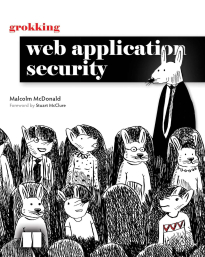

My notes and takeaways from the Grokking Web Application Security book by Malcolm McDonald.

## Table of contents

- [Know your enemy](#know-your-enemy)
- [Browser security](#browser-security)
- [Encryption](#encryption)
  - [Encryption in transit](#encryption-in-transit)
  - [Encryption at rest](#encryption-at-rest)
  - [Integrity checking](#integrity-checking)
- [Web server security](#web-server-security)
  - [Handling resources](#handling-resources)
- [Security as process](#security-as-process)
- [Browser vulnerabilities](#browser-vulnerabilities)
  - [Cross-site scripting](#cross-site-scripting)
  - [Cross-site request forgery](#cross-site-request-forgery)
  - [Clickjacking](#clickjacking)
  - [Cross-site scripting inclusion](#cross-site-scripting-inclusion)
- [Network vulnerabilities](#network-vulnerabilities)
  - [Man in the middle](#man-in-the-middle)
- [Misdirection vulnerabilities](#misdirection-vulnerabilities)
  - [DNS poisoning](#dns-poisoning)

## Know your enemy

Hackers can be divided into 2 groups: _black hat_ hackers, and _white hat_ hackers. Black hat hackers attack our application for financial or political reasons, but white hat hackers attack in order to report security vulnerabilities, before black hat hackers make use of it. White hat hackers leaded to _grey hat_ hackers, who find security vulnerabilities, report, and get paid. Also named bug bounties.

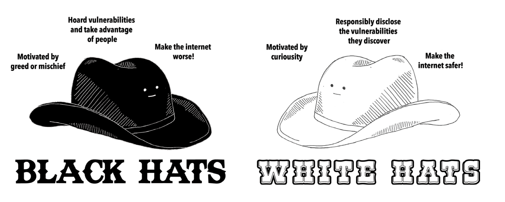

Hackers use automated software and tools. Commonly used is _Linux Kali_, Linux distro including many hacking tools.

White hat hackers also include security researchers. They find the vulnerability, report and demonstrate the exploit to the creators, and when patch version is published, the vulnerability is published in _common vulnerability and exposure (CVE)_ database. Such exploits are encorporated to tools like Metasploit.

Also another way of hacking is _social engineering_. It’s about persuading the user to give original credentials of the system. Sometimes there is even a bad actor in the company, who sells credentials.

_Ransomware_ is a form of malicious software that encrypts the files until money is paid to the attackers. The money is paid via cryptocurrency, so it’s very difficult to trace it.

_Hacktivism_ is type of attack done for political reasons. There are many groups that do that, and security researchers identify them by the signatures they use, and give them fun names.

What does it mean to be hacked? There are many types of hacks.

Attackers can send too many requests, so the web server is down. This is called **Denial of Service (DoS)**. If attackers send too many requests from different servers with different IPs, this is called **distributed denial of service (DDoS**).

Attackers can inject malicious javascript into the page, and this script can do anything. This is called **cross-site scripting (XSS)**. They can steal passwords, and use it across different websites - **password spraying\***.\* Or try millions of passwords to match yours - **credential-stuffing\***.\*

Once hackers have access point to the server, they try to escalate the privileges, and use **_rootkit_** software. When gained root access, they can make your server a node of botnet, or sell the credentials, without you knowing this.

When hackers get access to the database, it’s called **data breach\***.\*

How to protect? There are zero-day vulnerabilities published on websites, or discussed social media. Keep track of. Know the code you are deploying, its dependencies. Log and monitor the activity of the web server. Educate the team about security, and make cross-reviews.

## Browser security

Web applications operate on server-client model. Server sends HTTP response, while client triggers HTTP request. Browser’s job is to take HTML/CSS/JS, and render it on the screen. This is called _rendering pipeline,_ and code that executes it is called _rendering engine_.

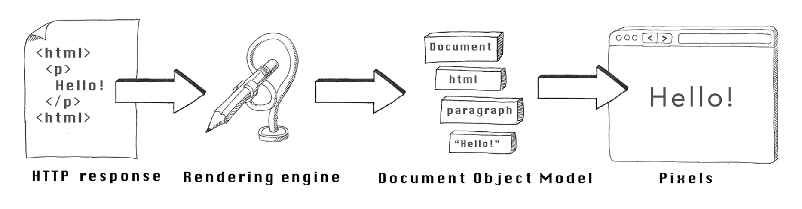

Engine that executes JavaScript is called _JavaScript engine._ When loading these scripts from internet, scripts can do anything, so engine is careful about what the scripts can do.

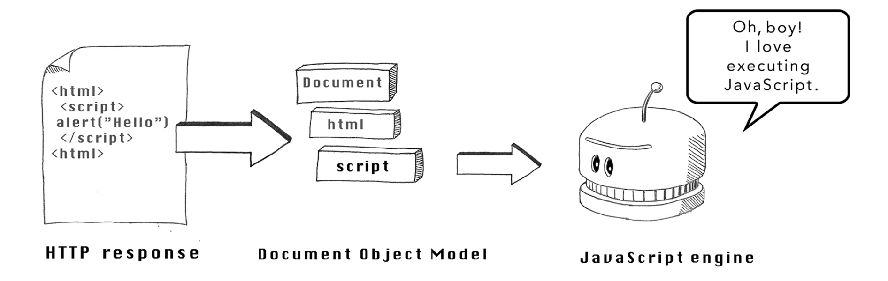

For security concerns, browsers implement _sandboxing,_ where each web page is given a separate process, and limitations exist on it. For example, no interprocess communication, no disk access, no memory reads.

Before executing javascript, browser asks 3 questions: What javascript am i allowed to execute? What tasks should javascript be allowed to perform? How can i be sure that i am executing correct javascript code?

- What javascript am i allowed to execute?
  We can answer this question with Content Security Policies (CSP). These are directives that restrict browser to execute javascript loaded from URLs not specified. It can be set in HTTP response of the HTML document, or hardcoded in meta tag of HTML document.
  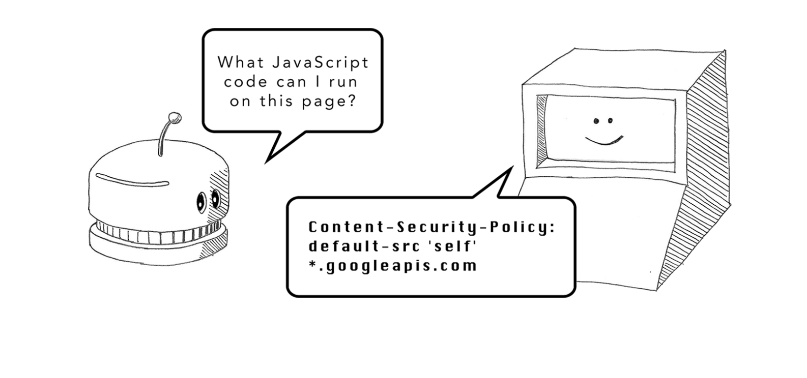

- What tasks should javascript be allowed to perform?
  CSPs enables locking down resources by domain. Browser also uses domain for other security protections. This is about same-origin policy. Origin is a combination of protocol, domain, and port. If origin is the same across windows, browsers let them communicate via JavaScript.
  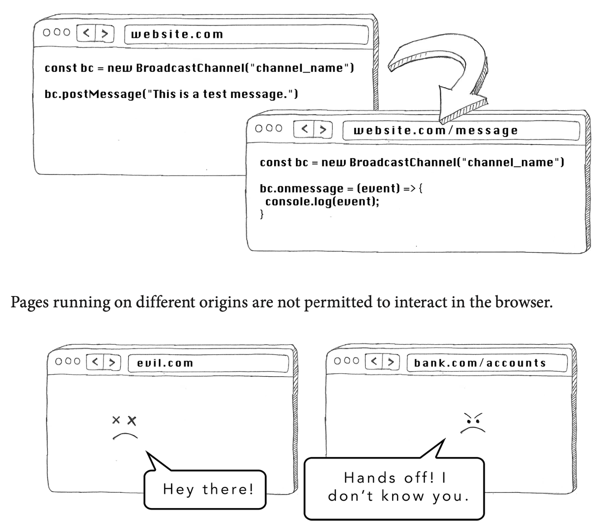
  Origin also dictates how communication with the server is done. Web page communicates with the origin server where it came from to load images, or scripts.
  In browser, cross-origin writes (clicking to a link that leads to another website) is allowed, cross-origin embeds (for example loading images from external origins, as long as CSP allows) is allowed, but cross-origin reads is not allowed.
  In javascript, we can load resources with XMLHttpRequest, or fetch. By default, these are allowed to request data from the same origin. But sometimes we want to load form external sources. The web server from which we are trying to read from, should set up _cross-origin resource sharing (CORS),_ this is setting HTTP headers starting with _Access-Control._ For example, setting \_Access-Control-Allowed-Origin: `https://trusted.com` makes sure only requests from specified origin are allowed.
  Limitation should be minimum. Consider a case where bank server allows requests from all origins. User is logged in, and malicious website sends request to the bank to get the credentials of the user.
  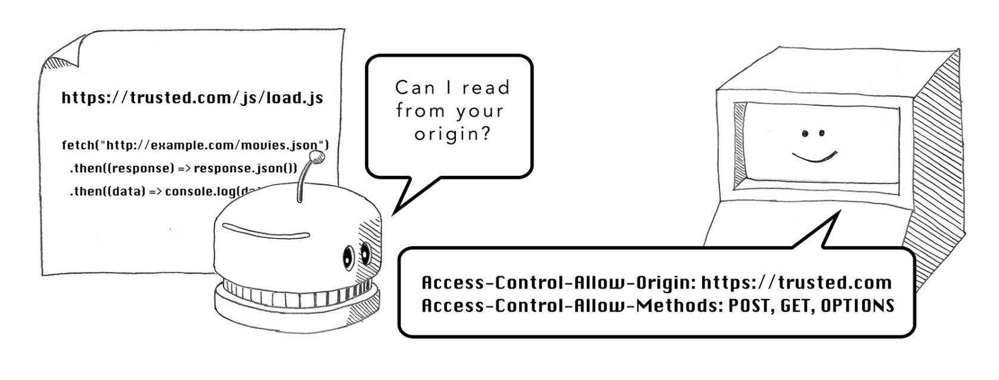
- How can i be sure that i am executing correct javascript code?
  We load javascript files, and these files might not be what author intended. For example, when using CDN, or any server, hackers might replace these files with malicious ones, or use MITM (monster in the middle) attack that intercepts the requests and replace files in response. In this case, there is _subresource integrity check_ that can be done to protect. Script tag has also `integrity` attribute. This contains output produced by SHA-384 hashing algorithm. When provided this value, whenever browser loads this script tag from specified URL, it can recalculate the output and compare. If the script is even slightly different, the code is not executed.
  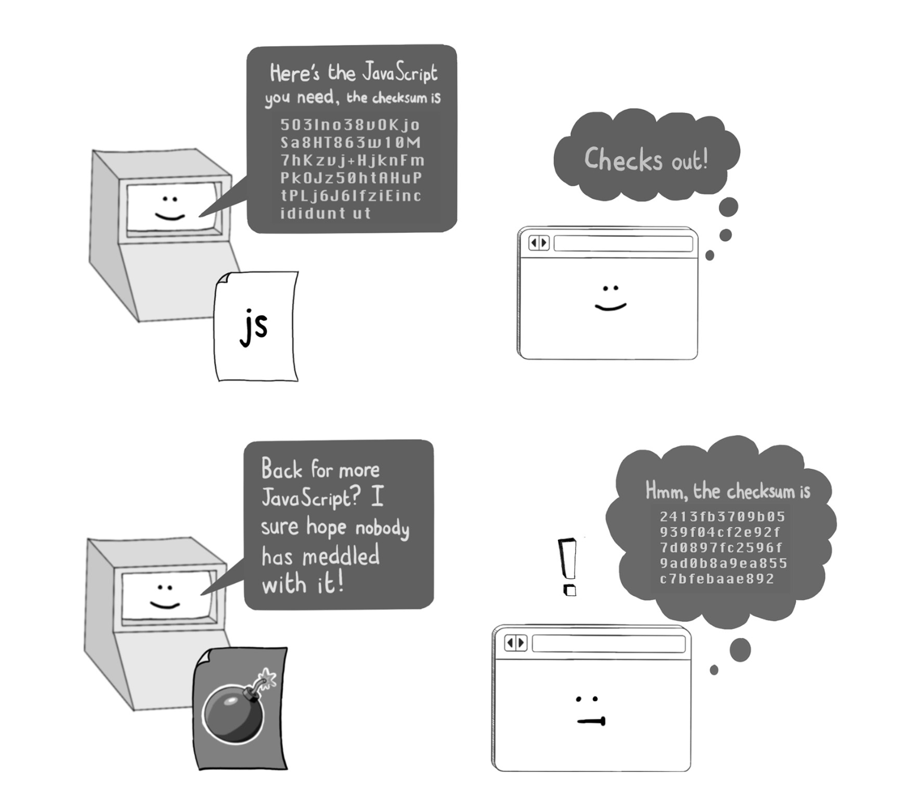

## Encryption

Encryption is the process of disguising the input that is not accessible to unauthorized parties. Cryptography is the study of encryption and decryption. Fortunately we don’t need to understand the principles and cores of it to use it. Encryption includes the keys that are used to encrypt and decrypt the data.

If we use the same key for encryption and decryption, we are using _symmetric encryption algorithm,_ that is, separating the data into fixed size blocks, and encrypting each of them.

Encryption key is numbers, but to make it easier to read, they are represented as strings. If size of key is not enough, it’s possible to decrypt it by trying out many keys.

If we use different keys for encryption and decryption, we are using asymmetric encryption algorithm. In this case, anyone with encryption key (public key) can encrypt the message, but the only party that has decryption key (private key) can decrypt it. This setup is known as _public key cryptography_.

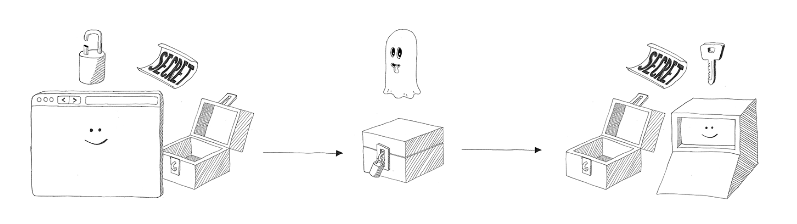

_Hashing algorithm_ is encryption type, whose output cannot be decrypted. Also there is near-zero chance, that two different inputs product the same output (hash collision). Output of such algorithm is called hash, and there is only one way to know which data it used to be - brute force. Useful for knowing the change in the data, without storing the data itself.

### Encryption in transit

Encryption in transit means the usage of encryption algorithms as the data is passed to the network. Protocols such as TLS (Transport Layer Security) and SSL (Secure SL, older and less safer version of TLS) use it.

TLS uses a combination of cryptographic algorithms, called _cipher suit,_ that is exchanged between client and the server at handshake time, and \*\*which contains four algorithms:

1. Key exchange algorithm - used to encrypt the public key, which is required by bulk encryption algorithm.
2. Bulk encryption algorithm - used to encrypt the messages, requires secure key.
3. Authentication algorithm - used to ensure the data goes to the right party.
4. Message authentication code algorithm - used to ensure the received data is the same with the one that was sent.

TLS requires digital certificate, that includes public key, used to establish a connection to the IP address. Certificates are given by certificates authority, but we can sign them ourselves (self-signed certificates). Browser has a list of trusted certificates, and shows warning if our certificate is not trusted.

HTTPS is HTTP traffic passed over TLS connection, so attacker cannot intercept and read the traffic, cannot manipulate the traffic, and cannot spoof the traffic.

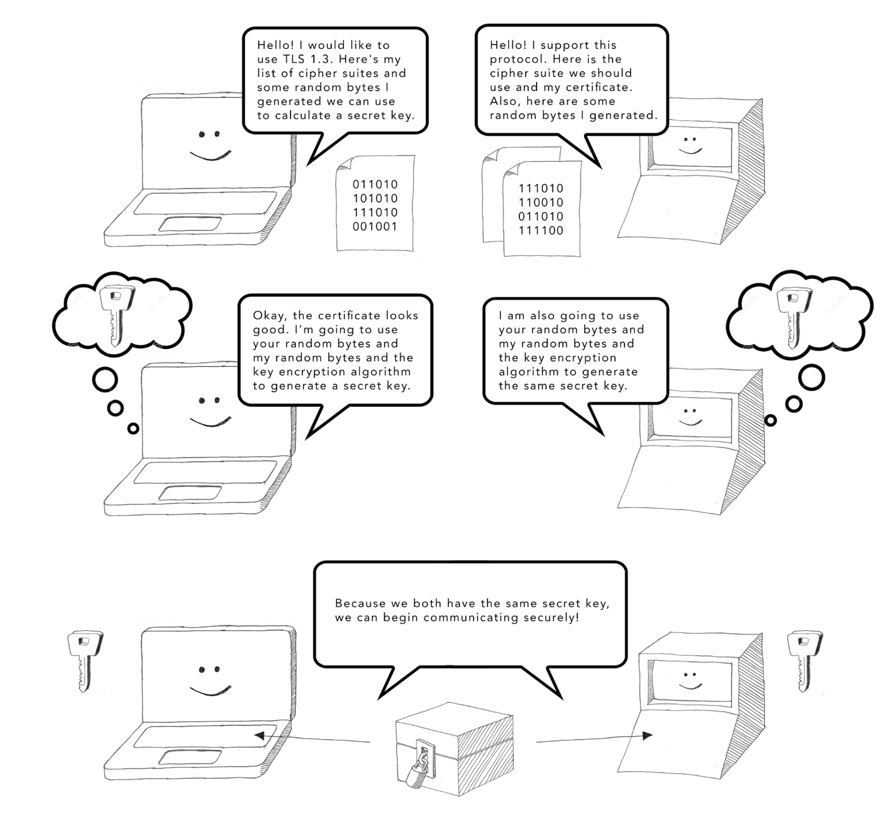

Encryption is encouraged via web servers such as NGINX, by redirecting to HTTPS. It can also be done in application servers, using HTTP Strict Transport Security (HSTS), by specifying `Strict-Transport-Security: max-age=123` in HTTP response.

### Encryption at rest

It means encrypting the data being stored in the disk. It’s helpful when sensitive information is stored in the disk, such as configuration stores, databases, backups, and others.

Passwords inside databases should be hashed. Hashing can be done hashing the input with a secret, that is stored in secure location. It can also be done with _salting,_ random string fed into hashing algorithm, that is the same for all passwords or different for each (and stored alongside the password). Actually we can combine these approaches, and use _peppering,_ using (input + random value (pepper)) for each input, and hashing it with salt:

```jsx
bcrypt.hash(myPlaintextPassword + pepper, salt);
```

### Integrity checking

Integrity checking is about checking the data is not altered, and is the same as was sent. This can be done by hashing the data, and sending it alongside the data itself and hashing algorithm. This way the receiver can recalculate the hash to check integrity. For additional security, in cases where attacker can manipulate the data, and recalculate the hash for it, the hash and data + hashing algorithm are passed in different channels. Or they can be passed in the same channel, but having secure keys exchanged beforehand.

## Web server security

Hackers can attack the websites in the browser only indirectly, they might inject some javascript with XSS. But the web servers are accessible directly to anyone, and they can cause trouble.

The first thing to do is validating the input. Hackers usually use bots to attack a web server, and first layer of protection is having allow list, a list of valid inputs. For example currency can be of 2 types, this can serve as an allow list for this field. Allow lists, however, are not suitable for all cases, and it might be easier to implement block list, rather specifying all valid possible inputs. Block list can includes some harmful inputs. Another way is to use pattern matching, against regex. Example is email or date validation with regex, or last digit of credit card is calculated according to Luhn algorithm. In case the request is invalid, it gets rejected immediately.

Files are another input that can be sent to web server, usually formatted as a binary. Files are stored in the disk, so they might be harmful. Simple protection is checking file type in the headers or the name, but it can be misleading, because they can be easily changed, so it’s better to use file type detection libraries. Another protection is validating in the client, but note that hackers usually use bots. It’s best to store them in CMS, or cloud services like S3, away from the web server.

Same as with input, we should also keep the output strict when sending it to downstream systems like database. We should use escaping, replacing special meaning meta-characters with alternatives, that say like “there was <, but don’t treat it as a start of HTML tag”. Most XSS is done in dynamic content places, where the user input is expected and shown. Hackers can simply use `<script><script>` that redirects the user to evil website with cookies attached. To prevent it, we can use escaping, replacing `<>` characters with `&lt; &gt` alternatives. HTML parses them are needed, but doesn’t treat them as tags.

Escaping is also essential against injection attacks, such as sql or command injections. In SQL, `;` can be used to chain the commands. Following command is vulnerable to SQL injections, because hacker can input `'; DROP TABLE users`

`"SELECT * FROM users WHERE email = '" + email + "'"`

Same can happen with command injections, where user input is expected to build a command, like `nslookup {address}`.

Generally, it’s recommended to use higher level APIs, because they come with built in escaping of special-meaning characters.

### Handling resources

As our application grows, it needs precise structure. HTTP specification includes special methods, that must be included in HTTP request. These includes GET, POST, PUT, DELETE. We are free to use whichever method we want for whichever action we want to perform, but there are some bad practices. For example using GET to delete an account is CSRF vulnerability.

There is a philosophy, though, called _Representational state transfer_ (REST), which makes the architecture more organizable. It includes:

1. Each resource should be represented by a single path, `/books` to retrieve the list, and `/books/123` to retrieve the details.
2. Each location should be free of implementation details. For example some locations look like `login.php`.
3. Actions should be performed by appropriate HTTP method.

When talking about defense, we should make several layers of defense. This ensures that if one layer fails, there are additional layers that still protect the application. This is called _defense-in-depth._ To defend against injections, here are the layers: escape special meaning characters in the input, connect to the database as a limited user, run the process as a limited user, validate the input with allow list, pattern matching, or block list, validate the response, implement logging of database operations.

Everyone in the system should have the minimum privileges to do the task. This principle is called _least privilege principle._ This might look like: connect to the database with limited user privileges, run the process as a limited user, use CSP to limit javascript execution in the browser.

## Security as process

Changes to critical systems might be done by individuals, but there must be reviews, where another pair of eyes see the changes, and accept or decline if it’s secure or not to deploy such changes. This is done for security, as second person might catch what first didn’t. This is called _four-eyes principle,_ and most companies do it. It’s better to let senior engineers or security team do reviews.

Another layer of security is limited privileges. Each role should have the role it needs to accomplish the tasks, to prevent the employee from publishing the secrets (for example), or when hacker gets in the employee’s account, do destructive changes.

Humans make errors, and machines are more reliable about repetitive tasks. If something takes multiple steps to complete, it should be automated. Not only this, but also processes such as build process, automated testing, deploying, adding servers, should be done by a single command.

As engineers, we make our solutions for particular problems, but there are some problems that have already been solved for us, and it’s not worth reinventing the wheels, including databases, web servers. It’s better to focus on the application logic rather than them. Reinventing the wheels also might make our application vulnerable, because the invented technologies come with safety proofs. It includes reinventing encryption algorithm, or session management.

Keeping critical activity logged is also important. When it comes to user activity, log sign ups, sign ins, or content edits, etc, to help support team. When it comes to databases, or such systems, record the migrations, by whom and when it’s done. Use http logs like `access.log` in NGINX, to keep logging the detailed info about the connection to your web server. Same with code changes, they should be stored in source control, to keep the history of changes by whom. Same with administrative log ins and others.

There are 2 approaches when the changes are deployed to production. First is creating separate branch for the feature, and merge it when it passes review. Second (Trunk-based development - TBD) is merging the feature that is backed by feature flags, which should be approved. This approach is mostly done for blue/green deployments, where two versions of app is on prod, and traffic moves from blue (old) to green (new) version.

We can use automated tools to detect the vulnerabilities in our application:

1. Static analysis - tools like Veracode, and Checkmarx perform static analysis of the codebase, and report vulnerabilities, where, for example, the input from request is not treated as it should be.
2. Dependency analysis - some versions of dependencies come with vulnerabilities. To check against them, tools like Dependabot can help, and require to upgrade the dependency. Package managers can also detect vulnerable packages, by checking them against the database of detected vulnerabilities.
3. Penetration testing - services like Invicti and Detectify, as a white hackers, try to find vulnerabilities before malicious hacker can. They request the web pages, edit request headers, modify HTTP params, and others.
4. Firewalls - firewall is a piece of software that can stop malicious network traffic. They can block the traffic before it reaches the service, and can be deployed as a separate node in the network. Web Application Firewalls can parse HTTP traffic, and block depending on some factors.
5. Intrusion detection system - software which checks for unexpected changes in sensible files, unusual network activity, or processes.
6. Antivirus software - software that checks the file system, to find vulnerabilities. Often done when user is able to upload the files.

## Browser vulnerabilities

There are several attack vectors in browsers, and the most popular are XSS, CSRF, clickjacking.

### Cross-site scripting

There are several attack vectors in browsers, and the most popular is XSS (cross-site scripting). It has several types:

1. Stored XSS - the value entered by user is stored in database, and retrieved later. If it’s being written in HTML, it’s a vector of attack. Hacker can write malicious script. For example a comments section in blog post. Everyone who opens the web page executes the malicious javascript as a comment.
2. Reflected XSS - instead of the malicious script being stored in database, it’s retrieved from the URI. Let’s say the blog page inserts the blog post id, retrieved from URI, in the web page. Attacker can use a script instead of the value, and trick the user into visiting the website. Also, instead of script, attacker can provide src for loading the script.
3. DOM-based XSS - instead of the using path in URI for attack, hacker could also use URI fragments. In fact URI fragments are browser only, and are not sent to the server in the request. If the fragment is being written in HTML, it’s another vector of attack.

Protection against such attacks includes escaping (replacing HTML sensitive strings with safe alternatives), CSP (limiting javascript execution). Modern frameworks, such as React, escapes these by default, and you need to use special attributes to disable it.

### Cross-site request forgery

CSRF is also common attack done by attackers. Suppose you have a blog post, where commenting form exists. This form makes get request to some endpoint with query param of comment:

```jsx
<form action="/comments/new" method="get">
  <textarea name="comment" placeholder="Your comment..." />
</form>
```

Cross-site request forgery tricks the user to perform the action they don’t expect. In this case, attacker can make URL shortener (or without it), and redirect the user to this GET endpoint URL. This type of self-replicating comment is called worm. It’s not most dangerous, though. Suppose actions like money transfer, user flow, or other actions are vulnerable. They way to go is make POST endpoint, instead of GET, as state in REST principles.


Attackers, though, can still make CSRF attack, for example by crafting malicious website and tricking the user to submit a form, which, in turn, makes cross-origin request. CORS can’t help here, because preflight request is sent only for fetching in javascript, not forms.

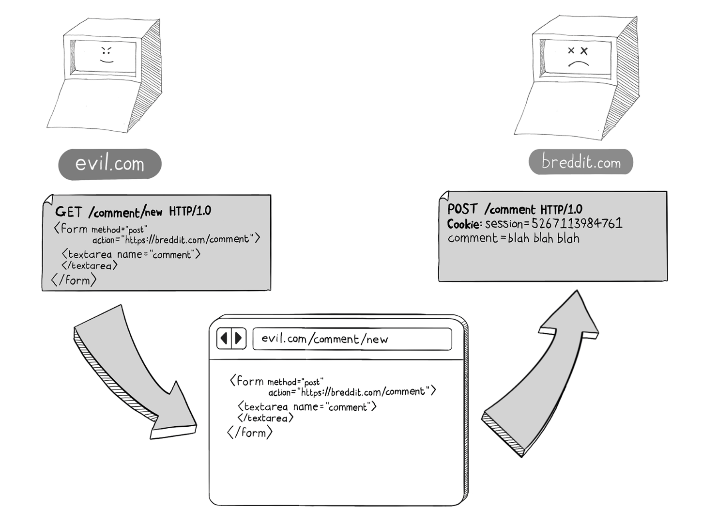

The solution is to use CSRF tokens. Each form has a hidden field with CSRF token. The CSRF token is also stored in cookies, when the request for the page is done, with Set-Cookie HTTP header. When request for creating comment is done, the value inside the header and body of the request are checked, if not equal, request is rejected. The attacker cannot know the token, and cannot submit it in body of the request.

Same can be applied for other requests with fetch. Any request missing CSRF token in body is rejected.

Also ensure that the cookies have proper SameSite attribute. When Lax, cookies for cross-site GET requests are not stripped out. Theoretically, choosing proper SameSite eliminates the need for CSRF tokens, but it would serve as an additional level of protection.

### Clickjacking

Browsers have feature called “features gated by user activation”. These are some APIs that can be executed only when user triggers it by some action, for example a click. You can’t simply execute them, for example you can’t simply open pages with `window.open()`.

Clickjacking means stealing some actions by the user, and perform other actions user doesn’t exist. For example a website has some button. User clicks it, but it turns out he liked some post in Facebook. Behind the button there is iframe with hidden with opacity and managed z-index div. User thinks he clicks a button to receive something, but in fact he does another action.

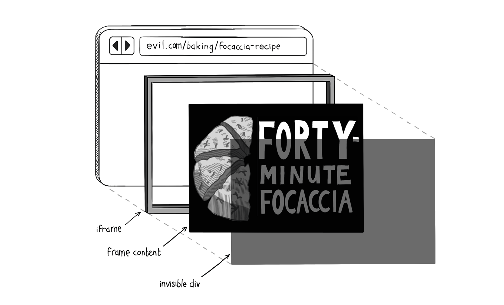

What we want is prevent the websites to embed our website as an iframe. We can use `frame-ancestors <websites>` CSP directive for this. In older browsers protection can be achieved with `X-Frame-Options` response header.

### Cross-site scripting inclusion

Scripts, unlike HTML or JSON, are not protected by same-origin policy. They can be loaded with `script` tag, and executed. Suppose the server responds with javascript with some data file based on user cookies. Hacker can use `script` tag and load the javascript whenever someone enters the evil website, and steal sensitive data.

I also observed that if javascript file response includes CORS policy, when loaded with plain `script` tag, the code loads executes, but with `type=module` it doesn’t, and fails because of CORS.

One way of protection is using fetch call inside javascript file, to receive sensitive data in json. When script is run on the loading side, the origin is the loading side, evil website in this case. JSON is protected by cross-origin policy, so javascript is not able to read the response. Or include it in HTML response, as a value of meta tag, and retrieve with javascript.

Also it’s possible to protect against such attack with `Cross-Origin-Resource-Policy` HTTP header, telling browsers not to leak the body of the response, so the body is stripped, and so response is not executed.

## Network vulnerabilities

There is a client, and there is a server. Between those 2 there is network, through which all the data goes. This creates channels for attacks.

### Man in the middle

When devices communicate in local network, they do so by using ARP (Address Resolution Protocol). It’s simple protocol that translates the IP addresses into MAC addresses, because MAC addresses are needed to deliver the messages across LAN. Each device has MAC address. If A wants to communicate to B, it broadcasts ARP request, asking who this IP address belongs to. Device B responds, and sender caches the relationship of IP and MAC in its ARP table.

Devices tend to believe whatever they receive, so what if someone responded to all requests “Yes, it’s me”? They could act as gateway, and route the traffic where needed, but also read all unencrypted data. This is called _ARP spoofing attack_. The solution is to use encrypted connections, with HTTPS. This way, hackers cannot read the traffic unless they have private key.

Hackers found a way to prevent secured connections in the first place. Back in days websites didn’t fully use HTTPS, and they would upgrade only when necessary, for example in login actions, when providing credentials. What if, when user enters login form over HTTP, and the traffic is intercepted by hacker, and hacker replaces the incoming page with his own, for example changing the URLs in login form to use HTTP. In subsequent requests, the man in the middle could see the traffic, and forward the data over HTTPS to original server.

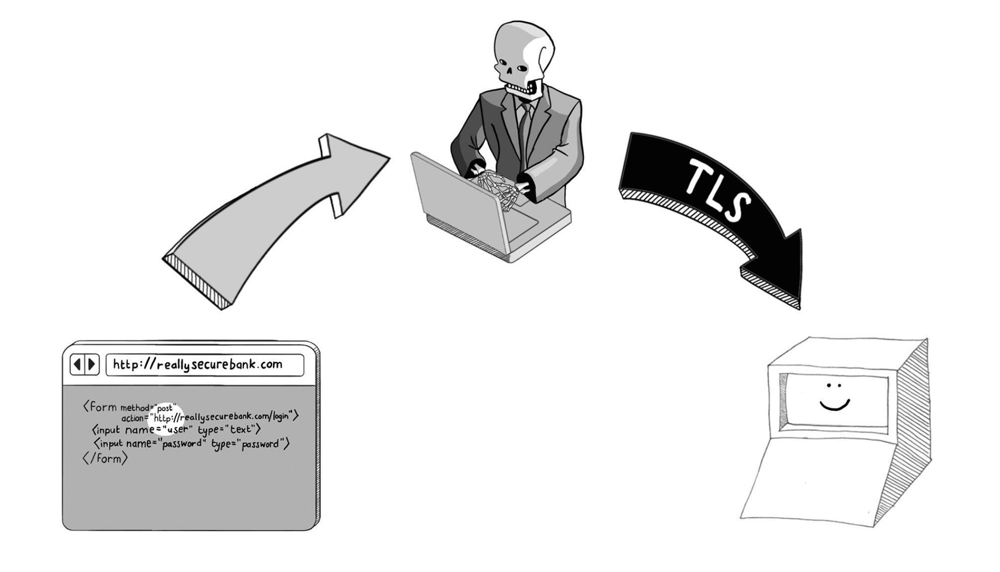

To prevent such attacks, we should upgrade to HTTPS to all connections, and use HTTP Strict Transport Security (HSTS) header to allow browsers to connect only with secure connections.

Also MITM attacks happens not only on local networks, but also in global.

TLS is ongoing technology, and it upgrades every year. In TLS handshake, both parties agree on algorithms to use for encryption and keys exchange. Old such algorithms tend to be less secure, as computing power increases every year, and there are exploits to decode encrypted data faster. Knowing this, attacker can place himself in the middle of TLS handshake, and persuade both parties to fallback to less secure encryption algorithms. This is called _downgrade attack_.

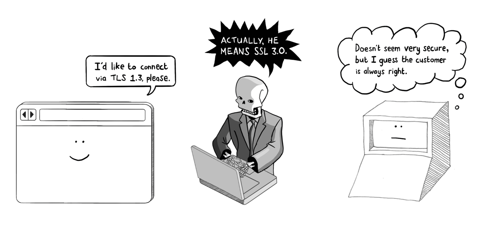

This can be prevented by using minimum TLS algorithm in web server, in NGINX this can be done with `ssl_protocols TLSvX.X;`. Modern browsers often support latest encryption algorithms, but if web servers is targeted for embedded systems, these updates are rare, and there is a need to support older encryption standards.

## Misdirection vulnerabilities

It’s also possible for hackers to make fake websites that look like yours. For example, they might use similar domain, like [ammazon.com](http://ammazon.com) (this domain is called _doppelganger domain_), or using non-ascii characters in domain name, as opposed against international domain name standard (_homograph attack_). For example using latin characters with their cyrillic counterparts. Actually browsers like chrome protect against such attacks, but using Punycode, unicode rendered with ASCII characters where it is similar with ASCII (like ‘a’ character), and converted to special ASCII sequence for the rest.

### DNS poisoning

DNS resolution happens as follows: the client requests the IP of [example.com](http://example.com) domain from public DNS resolvers, such as 8.8.8.8. Public resolver asks for root DNS resolvers (13 in the world) for .com DNS resolvers. From .com DNS resolvers it finds the IP for example.com resolver. Each layer has a cache, for example browser, or OS has its own cache. ISP can also have its own DNS resolver, so it doesn’t take it from root resolvers.

DNS resolvers are naive, they believe in whatever response they get from DNS servers, though the response is checked with some ID, which is only 2 bytes ⇒ 64K strings are enough to find the correct ID, this can be done in barely 10 seconds. What if attacker poisons the response, and makes so DNS server responds with IP of malicious website? This is called DNS poisoning.
