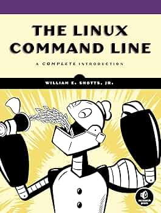

# Linux Command Line

My notes and takeaways from the Linux Command Line book.



These days companies decide on what users can or can't do with their computers. It's taking freedom out of the users. Linux is going the opposite way, it is giving the freedom. And freedom means knowing and deciding what is exactly happening in your computer.

While GUI makes easy tasks easy, CLI makes difficult tasks possible. Because Linux is modeled after Unix, it has same CLI utilities. And because Unix was first developed long before GUI, it has very extensible list of CLI utilities.

GNU has big impact on Linux, as Linux is the name of kernel, and it cannot be the whole system on its own. GNU provided essential operating system components such as core utilities, built tools, editors, etc. That's why some refer to Linux as GNU/Linux.

## Part 1, learning the shell

Shell is a program that takes the commands we enter and give to operating system to carry out. Most Linux distributions supply `bash` shell program, which is enhanced version of `sh`, original shell program for Unix.

When using GUI, we need another interface to write commands, it's called terminal emulator. Once we start it, prompt is shown, usually prepended by username, machine name, and current directory. If it ends with `$` sign, it means we are regular user, if with `#`, it means we are root user.

Command history is remembered, usually up to 500 commands.

Basic commands like `date`, `cal`, `free`, `df`

Linux has one filesystem, while Windows uses separate file systems for each device mounted to it. Filesystem is structured as tree-like structure. Basic commands include `ls`, `pwd`, 'cd'.

Most top-level folder is root folder, and can be accessed with `cd /`. Each user has own directory, called home directory, can be accessed with `cd`.

- Linux has no concept of file extension, and content type is determined other way. It uses magic numbers (special bytes patterns at the start of the file, there is `file` command for this too). Though some applications might use its extension to determine the contents.
- In Linux the files are case-sensitive.
- Although many characters are allowed, use dash, dot, or \_ to make a space in filenames, instead of using spaces or other characters. Using spaces makes navigation commands much more harder.

Commands in Linux come in form of `command -options arguments`. Options control the behavior of the program. There are short options (like `-a` for `ls`), and long options (like `--all` for `ls`). Many short options have corresponding long option.

Here is example output from `ls -la` command:

```bash
ls -la
total 56
drwxr-x--- 5 maruf maruf  4096 Feb 16 13:27 .
drwxr-xr-x 3 root  root   4096 Jan 24 13:18 ..
-rw------- 1 maruf maruf  1761 Feb 16 06:36 .bash_history
-rw-r--r-- 1 maruf maruf   220 Mar 31  2024 .bash_logout
-rw-r--r-- 1 maruf maruf  3771 Mar 31  2024 .bashrc
drwx------ 2 maruf maruf  4096 Jan 24 13:19 .cache
drwx------ 2 maruf maruf  4096 Feb 16 06:10 .docker
-rw-rw-r-- 1 maruf maruf   171 Feb 16 06:22 .env
-rw-r--r-- 1 maruf maruf 12288 Feb 16 06:28 .env.swp
-rw-r--r-- 1 maruf maruf   807 Mar 31  2024 .profile
drwx------ 2 maruf maruf  4096 Feb  5 06:05 .ssh
-rw------- 1 maruf maruf  1336 Feb 16 13:27 .viminfo
```

1. First row has string. First character determines file type, `d` means directory, `-` means file. Next 3 chars determine permissions of the file owner. Next 3 determine permissions for the members of the group of the file, and final 3 is for everyone else.
2. Number of hard links.
3. User name of file owner.
4. Name of group that owns the file
5. Size in bytes
6. Date and time of last modification of file
7. Name of file

Text files can be viewed with `less` command. There is saying `less is more`, which means less does the same job as more (more is old command), but also adds ability to go to viewed lines. Many config files, scripts are written in text format, so this command is useful.

In Unix-like systems it's possible to have same file with different names. Symbolic link (or symlink) is reference to some original file. We can create multiple symlinks that point to some file, and when original file is changed, all programs referencing symbolic links have the file contents changed too. Symbolic link is indicated with `l` as first char when listing with `ls -la`.

---

Most used commands in linux are: `mkdir`, `mv`, `cp`, `rm`, `ln`. While most actions done with these commands can be done with GUI, these commands make it easy to perform tasks that are complex on GUI, for example copy all .html files.

Because filenames are used so much in shell, shell has a feature of listing filenames in convenient way, glob patterns (wildcards).

1. `*` - any character
2. `?` - any single character
3. `[characters]` - any character in set of _characters_
4. `![characters]` - any character not in set of _characters_
5. `[[:class:]]` - any character that is member of specified class. These classes include `[[:lower:]]`, `[[:upper:]]`, `[[:alpha:]]`, `[[:alnum:]]`, `[[:digit:]]`.

`[a-z]` and `[A-Z]` used to work in older version of Linux, they do now too, but they don't produce expected results unless configured properly.

`ln` command creates hard link or soft link (with `-s` param).

_Hard link_. If we consider the filename as a reference to the INode (basically struct that stores file's information), creating hard link means creating another filename for the same INode. This means both files refer to same data. Each file has number of hard links attached (second column of `ls -la` command), and if this number becomes 0, file is deleted.
Hard links can't point to directories or point to files inside other disk partitions (meaning it can point to files only in same fileysystem).
Hard links are created with `ln original_file link_file` command.
Hard link is original way of creating links between files in Unix systems.
In order to understand if two files are same file (meaning one of them is hard link), we can use `ls -li`, which prints out INode numbers as first column. If INode numbers match, these are same file.

_Soft link_. Soft link don't have limitations as in hard link. When we create soft link, we create separate INode, which points to the original file's INode.
It accumulates a little space because of the pointer, and the size is pathname size.
When creating symlink, the path is specified relative to symlink location, not current working directory.
Once original file is deleted, soft links becomes broken (usually indicated in terminal emulators as red). Soft link is created with `ln -s original_file link_file` command. Soft link is modern practice.
Almost all file operations operate on end file itself, but `rm` command operates on the link itself.

---

Commands can be separated into 4 categories:

1. Executable programs - either compiled binaries or scripts written in some languages, located in `/usr/bin`.
2. Command line builtins - shell (for example bash) provides some builtin commands, also known as shell builtins.
3. Shell functions - functions written in shell script and encorporated into environment.
4. Alises - commands defined with alises.

Here are commands that are helpful when working with commands. Also most commands so far (and followings) come from GNU's `coreutils` package.

_type_ - this command determines which type of command listed above input command is. For example it says `ls` command is alias for `ls --color=auto` (in Ubuntu), or that `mkdir` is executable program located in `/usr/bin/mkdir`.

_which_ - sometimes multiple versions of same command is installed in the system. This command determines where executable program is located. Only works for executable programs, and not for aliases or shell builtins.

_help_ - get documentation for command. This works only for shell builtins (for example `cd` command), and documentation is not very readable. Many executable program commands display how the command's options, usage etc, with `--help` option.

_man_ - display manual page of executable program command. Manual page is not tutorial, but just reference, describing what the command is, its options, usage. It has 8 sections, describing different aspects of command. We can go straightly to some section by providing it with `man number search_term`

_apropos_ - display commands by making a search from available manual pages. Displays command and a match in its manual page. Same effect can be done with `man -k search_term`x

_whatis_ - display brief description of executable program command.

_info_ - alternative to `man`, by GNU project. It reads info files, which are organized in tree-structure, and has hyperlinks.

Docs for commands can also be found in `/usr/share/docs/`, in plain text or even html format.

One more things about commands is that these can be concatinated with `;`. For example `ls; ls; ls` runs `ls` 3 times.

_alias_ - it's possible to create aliases with `alias name='string'` command, where string is command(s) to execute, and name is alias name. For example `alias foo='ls -la'` makes alias for `foo`, so writing `foo` does `ls -la` under the hood. To remove alias `unalias name` command is used. To see all alises use `alias`. Aliases created this way are erased once current session ends.

---

Almost all commands we have dealt so far includes producing outputs or errors. When program executes, it produces some results, or some errors. Knowing that in Unix philosophy everything is a file, output of a program is put in file named _standard output_, named _stdout_. And error is put inside _standard error_, also named _stderr_. Both _stdout_ and _stderr_ are linked to the screen. There is also _stdin_, which is linked to the keyboard by default. With I/O redirection, it's possible to change this behavior.

We can redirect _stdout_ of program to some file. It's done with **>** operator. If file doesn't exist, it's created. Note that file contents are overwritten once **>** is used. To append output to the file, **>>** is used.

Redirecting stderr is a bit harder. Program produces output to file streams. First three are _stdin_, _stdout_, _stderr_. Shell them internally by file descriptiors 0, 1, 2 respectively. Shell provides notation to redirect files using file descriptor numbers. To redirect _stderr_ to some file, **2>** syntax is used. For example `ls -la nonefile 2> errors.txt`.

Sometimes it's useful to redirect both output and errors to same file. For this `ls -la somefile files.txt 2>&1` is used. In this case output of command is redirected to the file, and _stderr_ is redirected to _stdout_. Swapping the order of these redirects doesn't work, redirecting _stderr_ should be after _stdout_ redirection.

Modern bash provides another way to redirect both _stdout_ and _stderr_ to same file, for example `ls -la somefile &> files.txt`, with **&>** operator.

To ignore the output and not print on the screen, we can redirect it to `/dev/null`. It's special file in Unix systems that simply does nothing with the input. This file is called bit bucket.

The command to concatenate the files is `cat`. We can specify file names and it outputs the contents for us. But if we don't, it hangs. It waits input from _stdin_, and because it's attached to keyboard, it's waiting for us to type. We can also redirect the _stdin_ from keyboard to some file with following syntax: `cat < files.txt`, so with **<** operator.

Redirection is taken from shell feature called _pipeline_. It's about redirecting stdout to stdin with `|` character. For example `ls -la | less` redirects output to `less` command. So yes, `less` also accepts input from stdin.

We can make pipelines more complex, by adding some layers. These layers might serve as filtering layers. It can be done with `sort`, `uniq`, `grep`, and other commands. These commands are also discussed: `wc` (lines, words, bytes count), `head/tail` (tail has feature of viewing the changes in realtime with `-f` option), `tee` (read from stdin and output to stdout and files).

---

When we type a command and press enter, there are some steps shell performs before carrying out our command to the program.

**Expansion**

Expansion is when transforms special characters into the strings, for example `*` char. If we do `echo *` it prints all filenames in current directory (`*` means match all characters in filename). `echo` program doesn't see `*`, but only the results of its expansion.

There are different types of expansions. One of them is pathname expansion. For example `ls -la [[:upper:]]` expands `[[:upper:]]` into filenames matching this pattern.

Another one is tilde expansion. When `~` is used in the beginning of word, it expands to the home directory pathname of current user, or of specified user if specified as `echo ~username`.

It's possible to make arithmetics with arithmetic expansion with `$(( arithmetic ))` syntax. Only integers are supported, so the results are integers too. Adding, substracting, multiplication, division, remainder (%), and exponentation (\*\*) are supported. Expressions can be nested as `$(( $(( arithmetic )) + arithmetic ))` or like `$(( (arithmetic) + arithmetic ))`.

Another type of expansion is brace expansion. It's a pattern surrounded by braces. Pattern can be either some sequence of characters or numbers seperated by comma, or ranges of number or characters. No whitespace in pattern. For example `echo Hello-{World,Man,Book}`, `echo Hello-{1..9}`, `echo Hello-{A..Z}`, `mkdir {2009..2011}-0{1..9} {2009..2011}-{10..12}`.

Another one is parameter expansion. Shell has some variables which we can access with their names. For example `echo $USER` displays current user name. We can see these variables with `printenv | less`. This one is more used in shell scripts.

Another type of expansion is command substituion. We can use output of some command as an argument for commands. For example `echo $(ls | grep data)` prints files matching data in current directory. Or `file $(ls /usr/bin/* | grep zip)`. In older shell programs ``is used instead of `$()`.

**Quoting**

Now we know how expansion works, it's time to understand how to control it. `echo hello      world` prints `hello world`, as these words are treated as separate arguments. This is done by word splitting algorithm. It sees spaces, tabs, newlines as delimeters, and removes unnecessary delimeters. This results to have 2 arguments in this example instead of 1.

To suppress word splitting, we need double quotes. `echo "hello     world"`. When double quotes are used, shell expansions (except parameter expansion, command substituion, arithmetic expansion) lose their meanings.

The fact that word splitting considers newlines as delimeters causes interesting effect. For example output of command `echo $(cal)` is one line string, instead of columns and raws. To fix it `echo "$(cal)"` is used.

To suppress all expansions, single quotes are used. For example `echo '$(cal)'`.

It's also possible to escape special characters with backslash. For example to prevent some single expansion, we would use `echo "Hello $USER, balance is \$123"`. It's also possible to escape special meaning characters (`$`, `&`, ` ` space, `!`) in filenames. When used inside single quotes, backslash behaves as a regular character.

Besides escaping purpose, backslash also serves as control codes. In ASCII, first 32 characters are used to transmit commands to teletype devices, These includes special characers like `\n` (newline, in Unix it's linefeed), `\b` (backspace), `/a` (bell). Idea of backslash originated in C and was adopted by shell. Fun fact is that `\a` can make beep. In program `sleep 10; echo "Done\a"`, beep is done after 10 seconds.

---

**Command line editing**

Bash uses Readline library (collection of shared routines that other programs can use) to implement command line editing. Some include using arrow keys to move the cursor. There are other key bindings for different types of actions. What i found most interesting are:

1. `CTRL-A` - move to the start of the line
2. `CTRL-E` - move to the end of the line.
3. `ALT-F` - move cursor forward by one word
4. `ALT-B` - move cursor backward by one word
5. `CTRL-L` - clear console and move cursor to top left.

In Readline docs there is keyword _meta_. It modern keyboards it maps to `ALT` key. However in older keyboards it might be different.

Bash also has feature of completion. When typing a command, and pressing Tab, bash can make completion, or list possible completions on double Tab press. Completions are supported for commands, pathnames, hostnames (starting with `@` and listed in `/etc/hosts`), variables (starting with `$`), usernames (starting with `~`). There are also programmable completions to enable some programs to have completion flags, or match specific file types application supports. Distributions usually come with a set of completions, can be seen with `set | less`.

**Using history**

History is a file stored in `~/.bash_history`, by default stores last 500 commands. There are some useful tricks i found useful.

1. When typed `history` command, it displays commands alongside number. When `!number` is entered, history item at number is copied into command line. This is called history expansion.
2. It's possible to perform incremental (search as you type) search in history with `CTRL-R` command. To go to next match, press `CTRL-R` again. Pressing `Enter` causes command to execute.
3. It's possible to record the shell session in some file with `script file` command.

And of course searching in history can be done with regular command `history | grep pattern`.

## Permissions

Linux is not only multitasking system, but also multiuser system. Multiple users can operate on a computer at the same time. Usually computers have only one keyboard and screen, but other users can connect to it with secure shell (ssh), and even have their own GUI remotely.

Some files are not accessible to regular users, for example `/etc/passwd`. This is bound to security model in Unix. User can own a file or directory, and has control over its access. It can grant some access to specified group, and for everybode else (also referred as world). To see the user id, groups user belongs to and their ids, `id` command is used.

Groups, users, etc are taken, as everything in Linux, from files:

1. `/etc/passwd` - defines user accounts.
2. `/etc/group` - defines groups.
3. `/etc/shadow` - information about users passwords.

We can see permissions on files and directories with `ls -la` command, in first column. First char defines file type, next 3 permission bits for owner, next 3 permission bits for group, and rest 3 is for the everyone else.

Symbolic links have all permissions, with `l` file type, and original permissions are specified in target file.

It's possible to change the permissions with `chmod` command. It accepts 2 forms:

1. Octal. Octal digit represents 3 binary digits. This is convenient because we have owner, group, and the world. Each number is translated into binary representation, for example `7 -> 111`, which means access to read/write/execute.
2. Symbolic. It has its syntax i don't like, but it has advantage over octal to add or remove specific permissions, without resetting them.

When file is created, it has default permissions (usually 666). `umask` command lets us specify which permissions to unset by default. In Ubuntu it's `0002`, meaning we do `666 - 002 (ignore first number for now) = 664` to get final permissions. We can set default unsetting permissions with `umask number`.

Although it's common to see 3 octal numbers to represent the permission bits, it's more accurate to represent it with 4 numbers. Because there are some not usually used permissions bits:

1. setuid - when set on executable, it sets _essential user id_ to the one of file's owner, rather than the one who is running the program. It's set with `4000` bit, for example `4644`. Useful when other users need to run a program under root priveleges. Must be kept at minimum because of security concerns. Example permission bits when setuit is set: `-rwSrw-r--`
2. setgid - it sets _essential group id_ to the one of directory. When set on file, when executing some program, group id of file is accounted, not the one who is executing it. When set on directory, files or directories created inside this directory inherits parent directory group. Useful for shared directories. Set with `2000`, for example `2644`. Example permission bits: `-rw-r-Sr--`.
3. sticky bits - comes from ancient Unix, and makes file "unswappable". Ignored by Linux, but if set on directory, it makes so directory entries cannot be deleted or renamed unless it's directory owner, file owner, superuser is doing it. Set with `1000`, for example `1644`. Example permission bits: `drw-r--r-T`. Often used to control access to shared directory like `/tmp`.

---

Changing identities. There are 2 ways to change identities in shell:

`su` - run some command or start a new shell with substitute user id and group id. It has usage of `su [-l] user`, which is similar to `su - user`. It can be switched to root also, with `su -`.
When this method is used, environment of target user is loaded and shell starts at home directory of target user.
It's also possible to execute specific command with `su -c 'command'`. command is in single quotes in order to prevent expansion in current session.

`sudo` - execute command as another user. It's primarily same as `su`, but with important additions. Administrator can configure which users can run commands in behalf of other users (usually superuser), and which commands exactly. It doesn't require target password, but user's password.
We can see which permissions are given to current user with `sudo -l`.
This command doesn't load environment of target user nor starts a new shell.
Special file `/etc/sudoers` is configured by administrators to restrict which commands can be executed under and for assumed identity.

In Windows users are granted administrative privileges to do some tasks if administrative privileges are required. This is usually what we want, but it also allows malicious programs to run as administrator if misused.

Linux uses broader gap between root user and regular users. Users can switch inbetween with `su` or `sudo` commands (giving administrative privileges only when necessary). This caused a problem. Many users started to use root user as default in order to avoid permission denied errors. This means problem arose in Windows is same in Linux.

To prevent it, Ubuntu decided to lock root user and reject connecting as root. Instead it grants all superuser privileges to initial user. Initial user can do same for other users.
