# NodeJS design patterns


My notes and takeaways from the NodeJS Design Patterns book by Mario Casciaro and Luciano Mammino. See the [book](https://www.nodejsdesignpatterns.com/) for more details.

## Table of contents

- [The Node.js platform](#the-nodejs-platform)
  - [I/O (Input / Output)](#io-input--output)
  - [Event demultiplexing](#event-demultiplexing)
  - [The reactor pattern](#the-reactor-pattern)
  - [Libuv](#libuv)
  - [Recipe of Node.js](#recipe-of-nodejs)
  - [Native code](#native-code)
- [Module system](#module-system)
  - [CommonJS](#commonjs)
    - [Homemade module system](#homemade-module-system)
    - [Monkey patching](#monkey-patching)
  - [ESModules](#esmodules)
    - [default export notes](#default-export-notes)
    - [async imports](#async-imports)
    - [Modules loading](#modules-loading)
    - [Read-only live binding and live binding](#read-only-live-binding-and-live-binding)
  - [differences](#differences)
- [Callbacks and Events](#callbacks-and-events)
  - [CPS and direct style](#cps-and-direct-style)
  - [guaranteeing asynchronicity with deferred execution](#guaranteeing-asynchronicity-with-deferred-execution)
  - [Propagating errors](#propagating-errors)
  - [Observer pattern](#observer-pattern)
    - [EventEmitter](#eventemitter)
    - [Memory leaks](#memory-leaks)
    - [Antipatterns](#antipatterns)
    - [Combining](#combining)
    - [Exercises for Callbacks and Events](#exercises-for-callbacks-and-events)
- [Asynchronous Control Flow Patterns with Callbacks](#asynchronous-control-flow-patterns-with-callbacks)
  - [The Sequential Iterator pattern](#the-sequential-iterator-pattern)
  - [Parallel execution with callbacks](#parallel-execution-with-callbacks)
  - [Fix race conditions with concurrent tasks](#fix-race-conditions-with-concurrent-tasks)
  - [Limited parallel execution](#limited-parallel-execution)
  - [Exercises](#async-control-flow-patterns-with-callbacks-exercises)
- [Asynchronous Control Flow Patterns with Promises and Async/Await](#asynchronous-control-flow-patterns-with-promises-and-asyncawait)
  - [Promises/A+ and thennables](#promisesa-and-thennables)
  - [The Promise API](#the-promise-api)
  - [Sequential iteration with promises](#pattern-sequential-iteration-with-promises)
  - [Limited parallel execution with promises](#limited-parallel-execution-with-promises)
  - [Async/await](#asyncawait)
  - [Error handling](#error-handling)
  - [Trap when returning](#trap-when-returning)
  - [Sequential execution and iteration](#sequential-execution-and-iteration)
  - [The problem with infinite recursive promise resolution chains](#the-problem-with-infinite-recursive-promise-resolution-chains)
  - [Exercises](#exercises)
- [Coding with streams](#coding-with-streams)
  - [Getting started with streams](#getting-started-with-streams)
  - [Readable](#readable)
  - [Implementing Readable streams](#implementing-readable-streams)
  - [Writable](#writable)

## The Node.js platform

The Node.js core (or runtime) is built on top of few principles, one of them is having small core. It keeps all functionalities at a bare minimum leaving all others to the userland.

Another principle in Node.js is designing small modules, which take its roots from Unix philosophy:

1. Small is beautiful.
2. Make each program do one thing well.

Another principle is having small surface area, where a common pattern is to export certain class or function, which is entry point, and not exposing the internals to the outside world.

### I/O (Input / Output)

I/O is slow, accessing the RAM takes nanoseconds, whereas accessing hard disks or network may take milliseconds. There are 2 types of I/O.

1. Blocking. Traditional one used in programming, where function call correspond to some I/O, which blocks the execution of the thread until request is completed. This means a webserver with blocking i/o cannot handle multiple connections in the same thread, it now has to open new threads to process new connections concurrently (note that idle times could be big in each thread, which is wasteful). Unfortunately, threads are expensive, it consumes memory, has context switches (that’s why each thread has idle times) ⇒ having long running thread for each connection is expensive.
2. Non-blocking. Many Operating Systems support it, it returns immediately without waiting for the request to complete. You could make a polling to access the data when it’s available, if it’s not available yet it returns some constant. We can use loop, which checks for the result until it’s available, but this is not efficient, because the loop itself wastes a lot of CPU cycles and time.

### Event demultiplexing

Most Operating Systems provide a native mechanism for handling concurrent non-blocking resources in better way, called **_synchronous event demultiplexer (event notification interface)._**

It watches multiple resources and returns event (or events) when an operations on those resources complete. It goes idle until there are new events to process. When each event is processed by event demultiplexer, the resource associated with each event is guaranteed to be ready to be read. When all events are processed, the flow will block again (thead goes idle) until new events are again available to process. This is called **event loop.**

Now we can handle multiple connections in the same thread, with idle time of the thread reduced. Demultiplexing in this technique refers to using one thread to handle multiple connections. This strategy not only has resources benefits, but also it simplifies concurrency strategies (for example in multi-threads environment we would have to use semaphores).

See difference between blocking i/o and non-blocking i/o (with event demultiplexing) below:

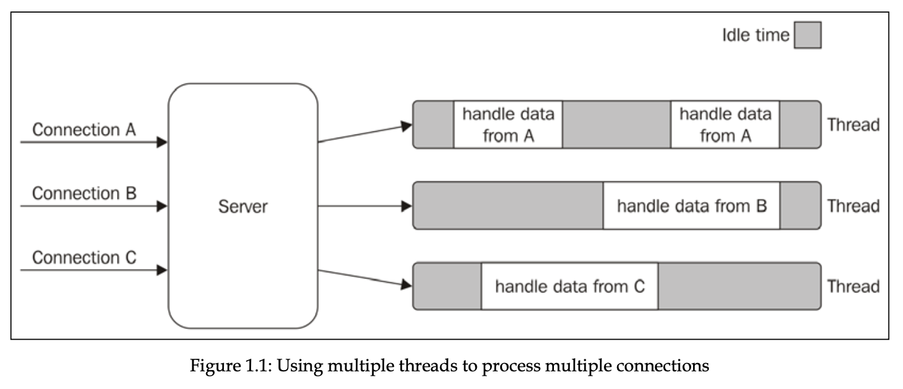
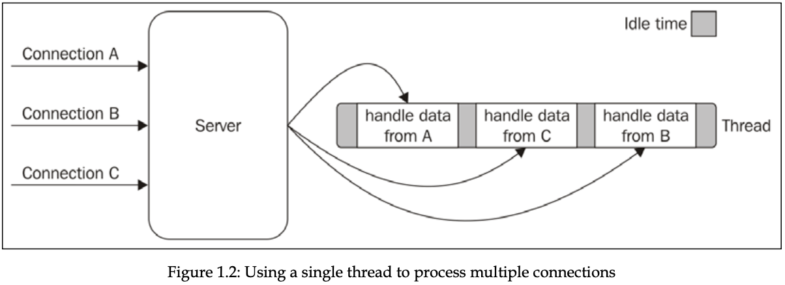

### The reactor pattern

It’s specialization of algorithms that has a handler associated with each I/O operation, and represented by callback function.

1. Application submits a new I/O request to **Event Demultiplexer** and specifies handler with it. This operation is non-blocking ⇒ returns immediately.
2. When the result is available in event demultiplexer, it pushes a set of corresponding event and handler to **Event Queue.**
3. Event loop iterates over event queue, invoking each handler for each event.
4. The handler (which is part of app code) gives control back to the event loop when its execution completes. Or it submits another I/O request that triggers the cycle once more.
5. When all items in Event Queue are processed, event loop goes idle, waiting event demultiplexer to push another items.

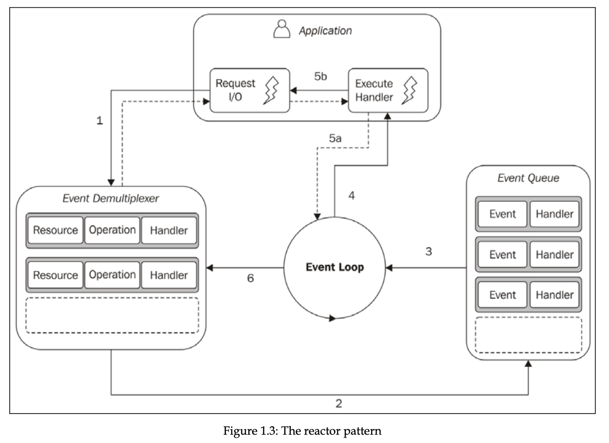

Node.js application exits, when there are no more pending operations in event demultiplexer and no more events being processed in event queue.

So, the reactor pattern handles i/o by going idle until new events are available from a set of observed resources, and then reacts by dispatching each event to associated handler.

### Libuv

Each operating system has different API interfaces for the event demultiplexer, and each i/o may behave differently even with one operating system. For example in Unix there is no way to access files in non-blocking manner. To simulate it, we need to create another thread and process it there.

Libuv is low-level i/o engine of node.js, which makes node.js compatible with all major OSs, and normalizes the behavior among them. It implements the reactor pattern, providing APIs for creating event loops, managing event queue and others.

### Recipe of Node.js

Reactor pattern and libuv are building blocks of Node.js, but we need three more components:

1. A set of bindings for wrapping and exposing libuv and other low-level functionalities to JavaScript.
2. V8, JavaScript engine, to compile JavaScript into machine code.
3. A core JavaScript library that implements high-level node.js api, for example `fs` or `http`

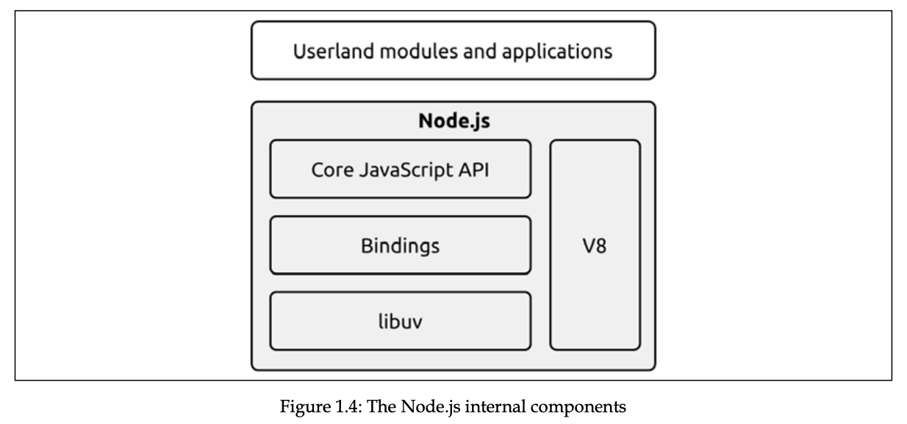

Node.js ships with very recent versions of V8, which means we can use the most new features with confidence.

### Native code

Node.js allows us to reuse components written in C/C++ native code. It can be beneficial because with native code we can access lower-level APIs, for example communicating with hardware drivers. Although V8 is very fast, it is still a bit slower than native code. For CPU-intensive apps, it makes sense to use native code.

## Module system

ES6 specification didn’t come with implementation of modules (ESM), so different browsers companies and node.js had to come up with their own implementation according to the spec.

### CommonJS

CommonJS is the original module system for Node.js that provides a way to organize and structure code by dividing it into reusable modules.

#### Homemade module system

```js
import fs from "fs";

function loadModule(filename, module, require) {
  const wrapperSrc = `((module, exports, require)=>{
    ${fs.readFileSync(filename, "utf-8")}
  })(module, module.exports, require)`;

  eval(wrapperSrc);
}

function require(filename) {
  const id = require.resolve(filename);
  if (require.cache[id]) {
    return require.cache[id].exports;
  }

  const module = {
    id,
    exports: {},
  };

  loadModule(filename, module, require);

  return module.exports;
}
require.resolve = (filename) => {
  return filename;
};
require.cache = {};
```

Complete resolving algorithm can be found [here](https://nodejs.org/api/modules.html#modules_all_together).

Synchronous nature of `require` function makes it impossible to export asynchronously. Any assignment to `module.exports` must be synchronous. That’s why most Node.js core modules offer synchronous APIs instead of asynchronous.

CommonJS module system has one disadvantage, it can’t solve the problem with circular dependencies, where different module can have different version of its counterpart depending on when it was required.

```js
// module a
module.exports.loaded = false;
const b = require("./b");
module.exports = {
  b,
  loaded: true, // overrides the previous export }
};

// module b
module.exports.loaded = false;
const a = require("./a");
module.exports = {
  a,
  loaded: true,
};

// main.js
const a = require("./a");
const b = require("./b");
console.log("a ->", JSON.stringify(a, null, 2));
console.log("b ->", JSON.stringify(b, null, 2));

/* a = {
  b: {
    a: {
      loaded: false,
    },
    loaded: true,
  },
  loaded: true,
};
b = {
  a: {
    loaded: false,
  },
  loaded: true,
}; */
```

Explanation

1. **`main.js` requires `./a`:**

   - Node checks its module cache for `"./a"` and finds nothing. It starts loading `a.js`.

2. **Inside `a.js`:**

   1. `module.exports.loaded = false;`
      - So far, `module.exports` is `{ loaded: false }`.
   2. `const b = require("./b");`
      - Node checks if `"./b"` is in the cache. It isn’t, so it starts loading `b.js`.

3. **Inside `b.js`:**

   1. `module.exports.loaded = false;`
      - So far, `module.exports` is `{ loaded: false }`.
   2. `const a = require("./a");`
      - Node sees `"./a"` is **in the process** of loading (so it’s partially complete). It returns that partial export of `a`: `{ loaded: false }`.
   3. `module.exports = { a, loaded: true };`

      - Final export for `b` becomes:

      ```js
      {
        a: { loaded: false }, // partial version of a
        loaded: true
      }
      ```

      - `b.js` finishes, and Node caches this export under `"./b"`.

4. **Back to `a.js`:**

   - We resume after `const b = require("./b");`, which at this point is `{ a: { loaded: false }, loaded: true }`.

   1. `module.exports = { b, loaded: true };`

      - Final export for `a` becomes:

      ```js
      {
        b: { a: { loaded: false }, loaded: true },
        loaded: true
      }
      ```

   - `a.js` finishes, and Node caches this export under `"./a"`.

5. **Back to `main.js`:**
   - `const a = require("./a");` now returns the **fully** exported `a`.
   - `const b = require("./b");` returns the cached export of `b`.

#### Monkey patching

It’s a practice of modifying existing objects (other modules exports) at runtime to change or extend behaviour, or apply temporary fixes. Monkey patching is considered harmful.

```js
require("./logger").customFunction = () => {
  console.log("monkey");
};
```

### ESModules

ESM were introduced as ECMAScript 2015 spec, with goal to give JS official module system across different environments. It has support for cyclic dependencies, and load modules async. ES modules are static, and cannot be imported conditionally, only at top of the file.

With ESM we **_must_** include extension of the file in the import path, whereas in CJS we could use either `./myModule.js` or `./myModule`

With ESM absolute path must be like `file:///....` and `/...` or `//...` is not supported.

(browser only) With ESM we can load modules from outside, for example `import mdl from "https://mdl.pkg.com"`.

Namespace import can be imported like:

```js
import * as myModule from "./myModule.js";
```

#### default export notes

When default exporting, the name of variable or function is ignored, so we can use any name when importing it.

Default export can prevent tree shaking for some cases. For example, when module exports object with properties and methods, even if neither of them were used, most module bundlers think it’s used.

#### async imports

Suppose we want to load specific module of language based on which lang pref user has. We can use dynamic imports with `import()` operation. It returns a promise that resolves to the module object.

```js
const translationModule = `./strings-${lang}.js`;
import(translationModule).then((strings) => {
  console.log(strings);
});
```

#### Modules loading

The goal of interpreter is to build dependency graph of the modules. It helps interpreter to determine the order in which modules should be loaded. Entry point is passed to interpreter as an entry point, and it recursively starts to explore and evaluate the code.

1. **Phase 1 - Construction.** FInd all imports and recursively load the content of every module from it.
2. **Phase 2 - Instantiation.** For every exported and imported entity, keep reference in memory, but don’t assign any value (because code is not executed yet). Keep tracking of deps relationship between them (linking).
3. **Phase 3 - Evaluation.** All blanks are filled, **c**ode is executed.

In simple terms, phase 1 is finding dots, phase 2 is connecting them, phase 3 is going through paths in the right order.

Difference from CJS is that in cjs the code before `require` is already executed, whereas no code is executed until phase 3 in ESM, this makes exports and imports to be static.

In case of ESM, all modules will have up-to-date imports from other modules, because ESM uses live bindings, and evaluation order ensures every module imports fresh exports from other modules and that dependencies are resolved before execution. Circular deps problem with CJS is now resolved.

#### Read-only live binding and live binding

When entity is imported from other module, it is readonly (read-only live binding) and cannot be mutated directly, whereas it can be mutated in its original module (live binding). We can provide a function as an export to mutate the read-only live binding variables.

```js
// count.js
export let count = 0;
export function increment() {
  count++;
}

// index.js
import { count, increment } from "./count.js";
console.log(count); // 0
increment();
console.log(count); // 1

console.log(++count); // TypeError, assignment to constant variable.
```

We can modify other modules, if they provide default export as an object, we can modify it’s properties and methods.

Object itself is read-only live binding, but its properties are not.

Note that by importing `import * as fs from 'fs'` or `import { someFunc } from 'fs'` gives us read-only live binding.

### differences

ESModules run in strict mode, whereas CommonJS modules do not.

We can import CJS modules in ESM, whereas we cannot import ESM in CJS. We can import CJS in ESM like this:

```tsx
// 1) default import, importing specific exports fails.
import mod from "./mymod.cjs"; // success
import { func } from "./mymod.cjs"; // fails

// 2) we can create our require for ESM:
import { createRequire } from "module";
const require = createRequire(import.meta.url);

// and use it:
const server = require("./server.cjs");
server2.func1();
```

In ESM we don’t have predefined properties, like module, \_\_dirname (absolute path of parent folder), or \_\_filename (absolute path of current file). But we can define them ourselves:

```tsx
import { fileURLToPath } from "url";
import { dirname } from "path";

const __filename = fileURLToPath(import.meta.url);
const __dirname = dirname(__filename);
// import.meta is object with properties for metadata like current url in
// the form of: file:///Users/123/... fileURLToPath transforms it to normal
// absolute path -> /Users/123/...
console.log({ __filename });
```

In ESM, `this` refers to `undefined`, whereas in CJS it’s reference to `exports`.

Also we cannot import JSON in ESM, whereas we can in CJS, but we can use our `require` to do this in ESM:

```tsx
import { createRequire } from "module";
const require = createRequire(import.meta.url);
const json = require("./j.json");
console.log({ json });
```

## Callbacks and Events

### CPS and direct style

Direct style is returning the result of a function to caller, whereas continuation-passing style (CPS) is accepting the callback to invoke when async operation completes.

Always choose a direct style for purely syncronous functions.

Bear in mind that sync API will break Node.js concurrency model, slowing down whole app.

### guaranteeing asynchronicity with deferred execution

Sometimes we might need to turn sync function into async. Suppose we have this synchronous function.

```jsx
import fs from "fs";

const cache = new Map();

function readSync(filename) {
  if (cache.has(filename)) {
    return cache.get(filename);
  }

  const data = fs.readFileSync(filename);
  cache.set(filename, data);
  return data;
}
```

And you want to turn it into asynchronous function. You might think of next implementation, which is incorrect, because first branch runs synchronously, and second one asynchronously. This makes our function unpredictable.

```jsx
function readAsync(filename, callback) {
  if (cache.has(filename)) {
    callback(cache.get(filename));
  } else {
    const data = fs.readFileSync(filename);
    cache.set(filename, data);
    callback(data);
  }
}
```

We can defer execution with `process.nextTick()`, which defers execution of function after currently running operation completes. It pushes the callback to the top of event queue, in front of any pending I/O event, and returns immediately. The callback will be invoked as soon as currently running operation yields control back to the event loop.

```jsx
function readAsync(filename, callback) {
  if (cache.has(filename)) {
    process.nextTick(() => {
      callback(cache.get(filename));
    });
    return;
  }

  const data = fs.readFileSync(filename);
  cache.set(filename, data);
  callback(data);
}
```

There are other ways also to defer the execution of some code like `setImmediate` or `setTimeout(cb, 0)`, and difference between them all is having different running phases in event loop. Note that `process.nextTick()` callback is **microtask**.

### Propagating errors

In synchronous direct style functions, errors are propagated with `throw` keyword, in which errors are propagated in the callstack. Whereas in continuation-passing style (CPS), errors are propagated by passing error to next callback in the chain.

Sometimes we may have CPS async function, and inside callback the error might be thrown. In this case, even if we surround the entire function with `try catch` block, it will not catch our error, because the stack in which the block operates is different from the one in which our callback is invoked. So, the error will go straight to the event loop, where it is caught and thrown to the console.

```tsx
// example on how error is not caught inside catch block and propagated
// to the event loop, crashing the whole app.
try {
  wait(1000).then(() => {
    throw new Error("");
  });
} catch (error) {
  console.log("Error!");
}
```

However in Node.js we can still catch the error with `process.on("uncaughtException")` event. It’s not recommended to let the app continue after such event anyway.

The process of exiting and making some cleanups is called fail-fast approach, and is recommended approach in Node.js

### Observer pattern

The Observer pattern defines an object (called subject) that can notify a set of observers (or listeners) when a change in its state occurs.

Difference from callback pattern is that observer pattern can continuously notify multiple listeners, whereas in callback pattern, only one listener, its callback.

#### EventEmitter

Observer pattern is built-in feature in Node.js, and is available with `EventEmitter` class from “events” module.

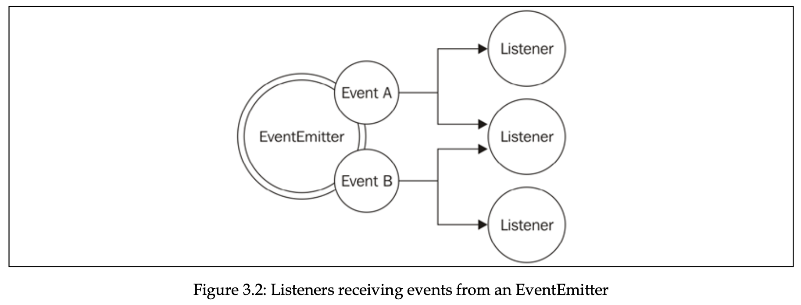

Following code demonstrates usage example:

```tsx
import { EventEmitter } from "events";
import { readFile } from "fs";

function findRegex(files, regex) {
  const emitter = new EventEmitter();
  for (const file of files) {
    readFile(file, { encoding: "utf-8" }, (err, data) => {
      if (err) {
        return emitter.emit("error", err);
      }
      emitter.emit("fileRead", file);
      const match = data.match(regex);
      if (match) {
        match.forEach((elem) => {
          emitter.emit("found", file, elem);
        });
      }
    });
  }
  return emitter;
}

findRegex(["./package.json", "./index.ts"], /hello/g)
  .on("fileRead", (file) => {
    console.log(`File has been read: ${file.toString()}`);
  })
  .on("error", (error) => {
    console.log(`Error reading a file: ${error.toString()}`);
  })
  .on("found", (file, elem) => {
    console.log(
      `Found in file ${file.toString()} in element ${elem.toString()}`
    );
  });
```

Again, note that we can’t throw errors in callbacks of event emitter events, and what we do in the code above is recommended approach.

There is special event type `error` , and if there is no listener for such event, EventEmitter will automatically throw exception and exit from application.

Event emitter is not commonly used on its own, and is used in following way, by being extended by other class:

```jsx
import { EventEmitter } from "events";
import { readFile } from "fs";
class FindRegex extends EventEmitter {
  constructor(regex) {
    super();
    this.regex = regex;
    this.files = [];
  }
  addFile(file) {
    this.files.push(file);
    return this;
  }
  find() {
    for (const file of this.files) {
      readFile(file, "utf8", (err, content) => {
        if (err) {
          return this.emit("error", err);
        }
        this.emit("fileread", file);
        const match = content.match(this.regex);
        if (match) {
          match.forEach((elem) => this.emit("found", file, elem));
        }
      });
    }
    return this;
  }
}
```

Examples of modules extending from EventEmitter are `http` server, in which EventEmitter is used to produce events such as request, connection, or closed. Another example is Node.js `streams`.

#### Memory leaks

One thing to note with observable pattern is that it can cause memory leaks.

If the observables we are subscribing to have a long life span, we have to unsubscribe from them once there is no need, otherwise it’s going to cause memory leaks.

Following code demonstrates an example. Variable `thisTakesMemory` is referenced inside listener, and is not garbage collected until listener is released from emitter, or until emitter is not garbage collected itself.

```jsx
const thisTakesMemory = "A big string....";
const listener = () => {
  console.log(thisTakesMemory);
};
emitter.on("an_event", listener);
```

We can prevent this by releasing the listener with `emitter.removeListener` method. EventEmitter itself warns developer when listeners count are > 10 (by default). Or we can use `emitter.once` to release it after first invokation.

#### Antipatterns

It’s generally not recommended to emit the events synchronously. In case if we do, we have to register all the listeners before we launch the task. If we register listener after the task launch, it’ll not be triggered.

If we emit the events asynchronously, we can register the listeners after the task launch, because async tasks are guaranteed not to be executed in the same event loop cycle.

Note that we can delegate the execution of sync task with `process.nextTick` and making it async.

### Combining

There is also a pattern of combining callbacks with events, where callback is passed as argument and used for general use, whereas event emitter is returned from the function and is used for advanced use cases.

For example in `glob` package in nodejs, we can pass a callback, which will have error as first arg, and matched files as second arg. The function returns event emitter, which is used for advanced scenarios, for example attaching a listener for each file match.

### Exercises for Callbacks and Events

- Write a function that accepts a number and a callback as the arguments. The function will return an `EventEmitter` that emits an event called tick every 50 milliseconds until the number of milliseconds is passed from the invocation of the function. The function will also call the callback when the number of milliseconds has passed, providing, as the result, the total count of tick events emitted. recursively.

  ```jsx
  import EventEmitter from "events";

  const exercise = (max, cb) => {
    const eventEmitter = new EventEmitter();

    let msPassed = 0;
    const intervalId = setInterval(() => {
      if (msPassed >= max) {
        clearInterval(intervalId);
        cb(msPassed / 50);
        return;
      }

      eventEmitter.emit("tick");
      msPassed += 50;
    }, 50);

    return eventEmitter;
  };

  const emitter = exercise(1000, (count) => {
    console.log(count);
  });

  emitter.on("tick", () => {
    console.log("tick");
  });
  ```

- Modify the function created in exercise 3.2 so that it emits a tick event immediately after the function is invoked.

  ```tsx
  // add this code after new EventEmitter();
  process.nextTick(() => {
    eventEmitter.emit("tick");
  });

  // this is because if we just use eventEmitter.emit("tick") after
  // declaring eventEmitter variable, at that time there are no listeners
  // attached to event emitter, so callback is not executed.
  ```

- Modify the function created in exercise 3.3 so that it produces an error if the timestamp at the moment of a tick (including the initial one that we added as part of exercise 3.3) is divisible by 5. Propagate the error using both the callback and the event emitter. Hint: use Date.now() to get the timestamp and the remainder (%) operator to check whether the timestamp is divisible by 5.

  ```tsx
  import EventEmitter from "events";

  const exercise = (max, cb) => {
    const eventEmitter = new EventEmitter();
    let error;

    eventEmitter.on("tick", () => {
      const date = Date.now();
      if (date % 5 === 0) {
        error = date;
      }
    });

    eventEmitter.emit("tick");

    let msPassed = 0;
    const intervalId = setInterval(() => {
      if (error) {
        eventEmitter.emit("error", error);
        cb(error, null);
        clearInterval(intervalId);
        return;
      }
      if (msPassed >= max) {
        clearInterval(intervalId);
        cb(null, msPassed / 50);
        return;
      }

      eventEmitter.emit("tick");
      msPassed += 50;
    }, 50);

    return eventEmitter;
  };

  const emitter = exercise(1000, (err, count) => {
    if (err) {
      return console.error(1, err);
    }
    console.log(count);
  });
  emitter.on("error", (error) => {
    console.error(2, error);
  });
  ```

## Asynchronous Control Flow Patterns with Callbacks

The situation where the abundance of closures and in-place callback definitions
transforms the code into an unreadable and unmanageable blob is known as **callback
hell.**

The most notable negatives of callback hell besides the unclean code, is perfomance bottlenecks and memory leaks. Closures come with a little price in terms of perfomance and memory consumption, and they can create memory leaks, because any context referenced by an active closure will not be garbage collected.

We can refactor callback hell with simple techniques, like early return, and separating common code into their own functions.

### The Sequential Iterator pattern

We can map the values of an array asynchronously. We can pass the result of operation to the next function, making asynchronous version of reduce function. We can even iterate over an infinite number of elements in the array of tasks. But note here that all the tasks must be asynchronous, otherwise we might hit the callstack exceeded error.

This pattern is useful when order of execution of asynchronous operations matters.

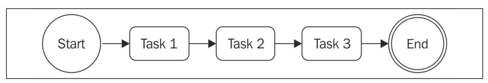

Below is my implementation of sequential iterator pattern.

```jsx
function iterator(collection, itemCb, cb) {
  function iterate(index) {
    if (index === collection.length) {
      return cb();
    }

    collection[index](() => {
      itemCb(index);
      iterate(index + 1);
    });
  }

  iterate(0);
}

function wait(ms, cb) {
  return new Promise((resolve) => {
    setTimeout(() => {
      resolve();
      cb();
    }, ms);
  });
}

iterator(
  [
    (cb) => wait(100, cb),
    (cb) => wait(100, cb),
    (cb) => wait(100, cb),
    (cb) => wait(100, cb),
  ],
  console.log,
  console.log
);
```

### Parallel execution with callbacks

In fact word “parallel” is improper here, because, knowing the underlying mechanism of node.js with event loop, we know that these tasks do not run in different threads. The proper way is to say this kind of flow is concurrent, but word parallel is used for simplicity.

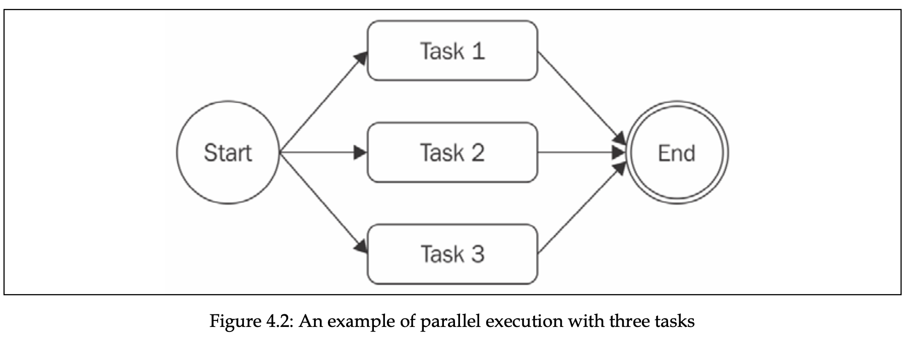

In Node.js, synchronous tasks can’t run in parallel, unless the execution of them is not interleaved with setTimeout or similar async APIs.

**The Unlimited Parallel Execution pattern.** Run a set of asynchronous tasks in parallel by launching them all at once, and then wait for all of them to complete by counting the number of times their callbacks are invoked.

```jsx
function iterator(tasks, finish) {
  let completed = 0;
  tasks.forEach((task) => {
    task(() => {
      completed++;
      if (completed === tasks.length) {
        console.log(completed, tasks);
        finish();
      }
    });
  });
}

function wait(ms, cb) {
  return new Promise((resolve) => {
    setTimeout(() => {
      resolve();
      cb();
    }, ms);
  });
}

iterator(
  [
    (cb) => wait(100, cb),
    (cb) => wait(100, cb),
    (cb) => wait(100, cb),
    (cb) => wait(100, cb),
  ],
  () => console.log("Finished")
);
```

### Fix race conditions with concurrent tasks

In multithreaded languages, there are complex techniques to prevent race conditions, like mutexes and semaphores. In Node.js, because it’s single threaded, it’s way easier. We can just create a set with running inputs and check for the input when executing.

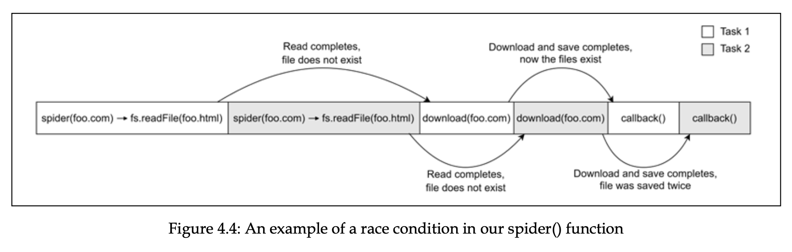

```jsx
const spidering = new Set();
function spider(url, nesting, cb) {
  if (spidering.has(url)) {
    return process.nextTick(cb);
  }
  spidering.add(url);
  // ...
}
```

### Limited parallel execution

Spawning parallel tasks without control can often lead to excessive load. In this case, server might be exploited with DoS (denial of service) attack, in which it just refuses connections and becomes unresponsive.

We can use techniques to limit the number of executing tasks.

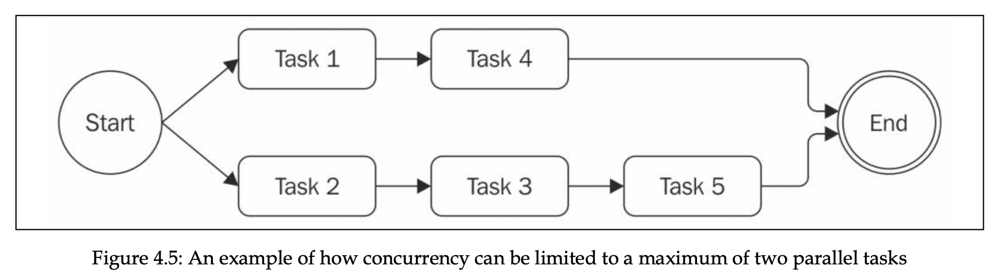

```jsx
const tasks = [];
const concurrency = 2;
let running = 0;
let completed = 0;
let index = 0;

function next() {
  while (running < concurrency && index < tasks.length) {
    const task = tasks[index++];
    task(() => {
      if (++completed === tasks.length) {
        return;
      }
      running--;
      next();
    });

    running++;
  }
}

next();
```

We can take this to another level and separate it to its own class, that handles limiting execution of concurrent tasks.

```jsx
import { EventEmitter } from "events";

export class TaskQueue extends EventEmitter {
  constructor(concurrency) {
    super();
    this.concurrency = concurrency;
    this.running = 0;
    this.queue = [];
  }

  pushTask(task) {
    this.queue.push(task);
    process.nextTick(this.next.bind(this));

    return this;
  }

  next() {
    if (this.running === 0 && this.queue.length === 0) {
      return this.emit("empty");
    }

    while (this.running < this.concurrency && this.queue.length) {
      const task = this.queue.shift();
      task((err) => {
        if (err) {
          this.emit("error", err);
        }
        this.running--;
        process.nextTick(this.next.bind(this));
      });
      this.running++;
    }
  }
}
```

#### Async control flow patterns with callbacks exercises

- 4.1 File concatenation: Write the implementation of `concatFiles()`, a callback-style function that takes two or more paths to text files in the filesystem and a destination file.

  ```jsx
  import fs from "fs";

  function concatFiles(sources, destination, callback) {
    let data = "";

    function iterate(index) {
      if (index === sources.length) {
        fs.writeFile(destination, data, callback);
        return;
      }

      fs.readFile(sources[index], (err, fileData) => {
        if (err) {
          console.error(err);
          return;
        }

        data += fileData.toString("utf-8");
        iterate(index + 1);
      });
    }
    iterate(0);
  }

  concatFiles(["./index1.txt", "./index2.txt"], "./text.txt", () => {
    console.log("done");
  });
  ```

- 4.2 List files recursively: Write listNestedFiles(), a callback-style function that takes, as the input, the path to a directory in the local filesystem and that asynchronously iterates over all the subdirectories to eventually return a list of all the files discovered.

  ```jsx
  import fs from "fs";

  // we could also use limited parallel execution pattern.

  function listNestedFiles(dir, cb) {
    fs.readdir(dir, { encoding: "utf-8" }, (err, files) => {
      if (err) {
        return cb(err, null);
      }

      const data = [];
      let pending = files.length;
      for (const file of files) {
        const path = dir + "/" + file;
        fs.stat(path, (err, stats) => {
          if (err) {
            return cb(err, data);
          }

          if (stats.isDirectory()) {
            listNestedFiles(path, (err, nestedData) => {
              if (err) {
                return cb(err, data);
              }

              pending--;
              data.push(...nestedData);
              if (pending === 0) {
                return cb(null, data);
              }
            });
          } else {
            fs.readFile(path, (err, fileContent) => {
              if (err) {
                return cb(err, data);
              }
              pending--;
              data.push(fileContent.toString());

              if (pending === 0) {
                return cb(null, data);
              }
            });
          }
        });
      }
    });
  }

  listNestedFiles("dir", (err, content) => {
    if (err) {
      console.error({ err });
      return;
    }

    console.log({ content });
  });
  ```

## Asynchronous Control Flow Patterns with Promises and Async/Await

Promises are part of ES6, which offer alternative to CPS for propagating async result.

Promise is an object which represent eventual result (or error) of an async operation. Promise is `pending` when async operation is not complete, `fulfilled` when operation successfully completes, and `rejected` when operation terminates with error. Once it’s fulfilled or rejected, it’s considered `settled`.

To receive the fullfillment value or rejection reason, following syntax is used:

```jsx
promise.then(onFullfilled, onRejected);
// onFulfilled is callback with fulfillment value
// onRejected is callback with rejected reason.
// Both are optional

// usage example. asyncOperation returns a promise
asyncOperation().then(console.log, console.log);
```

Important notes:

1. `then()` method **_synchronously returns another Promise._**
2. If `onFullfilled` or `onRejected` methods return a value, promise returned by `then()` will fulfill with that value.
3. If `onFullfilled` method returns a promise that fulfills, promise returned by `then()` will fulfill with fulfillment value of that promise.
4. if `onRejected` method returns a promise that rejects, promise returned by `then()` will reject with reason of that promise.
5. if we don't specify `onRejected` or `onFullfilled`, the resolved value or rejected reason is propagated down the chain, until it's caught by resolving handler or rejected reason there.
6. `onFulfilled()` and `onRejected()` callbacks are _guaranteed_ to be invoked asynchronously and at most once, even if we resolve the Promise synchronously with a value. This helps us prevent Zalgo problem, where the behavior of function is unpredictable.
7. If exception is thrown in `onFulfilled()` or `onRejected()` handlers, the promise returned by `then()` is rejected with exception reason. In comparison, in CPS, the thrown errors must have been carried with care, but in this case, the exception is propagated across the chain.
8. `then()` methods synchronously return another promises, whereas the callbacks provided are executed asynchronously.

   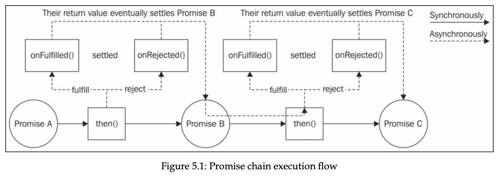

### Promises/A+ and thennables

Historically, there were many implementations of promises, and they varied such that they were not compatible between each other. Because of this **Promises/A+** spec was developed to make them working between each other. Native promises are also built on top of it.

According to Promises/A+ spec, any object with `then()` method is considered Promise-like object **(thennable)**.

> If it looks like a duck, swims like a duck, and quacks like a duck, then it probably is a duck - **Duck typing,** technique of recognizing (or typing) objects based on their external behavior, rather than their actual type.

### **The promise API**

The Promise constructor `new Promise((resolve, reject) => {})` creates a new Promise instance that fulfills or rejects based on the behavior of the function provided as an argument. The function provided to the constructor will receive two arguments.

- `resolve(obj)`: This function will fulfill the Promise with the provided fulfillment value, which will be obj if obj is a value. If obj is Promise, it’ll be the fullfillment value of the obj.
- `reject(err)`: This rejects the Promise with the reason err.

  Promise static methods:

- `Promise.resolve(obj)`: If a Promise is passed, then that Promise is returned as it is. If a thenable is provided, then it's **_converted_** 🤯 \*\*to the Promise implementation in use. If a value is provided, then the Promise will be fulfilled with that value.
- `Promise.reject(err)`: This method creates a Promise that rejects with err as the reason.
- `Promise.all(iterable)`: This method creates a Promise that fulfills with an array of fulfillment values when every item in the input iterable (such as an Array) object fulfills. If any Promise in the iterable object rejects, then the Promise returned by Promise.all() will reject with the first rejection reason. Each item in the iterable object can be a Promise, a generic thenable 🤯, or a value.
- `Promise.allSettled(iterable)`: This method waits for all the input promises to fulfill or reject and then returns an array of objects containing the fulfillment value or the rejection reason for each input Promise. The difference with Promise.all() is that Promise.allSettled() will always wait for each Promise to either fulfill or reject, instead of immediately rejecting when one of the promises rejects.
- `Promise.race(iterable)`: This method returns a Promise that is equivalent to the first Promise in iterable that settles.

Promise instance methods:

- `promise.then(onFulfilled, onRejected)`: This is the essential method of a Promise. Its behavior is compatible with the Promises/A+ standard.
- `promise.catch(onRejected)`: This method is just syntactic sugar for promise.then(undefined, onRejected).
- `promise.finally(onFinally)`: This method allows us to set up an onFinally callback, which is invoked when the Promise is settled. Unlike onFulfilled and onRejected, the onFinally callback will not receive any argument as input, and any value returned from it will be ignored. The Promise returned by finally will settle with the same fulfillment value or rejection reason of the current Promise instance. There is only once exception to all this, which is the case in which we throw inside the onFinally callback or return a rejected Promise. In this case, the returned Promise will reject with the error that is thrown or the rejection reason of the rejected Promise returned.

- Question 1

  ```jsx
  // What’s returned?
  Promise.resolve({
    then: () => {},
  });
  ```

  - Answer
    Pending promise, because Promise.resolve will resolve with given value if value is not promise. If promise, it fulfills with fulfillment value of that promise or thennable.

- Question 2

  ```jsx
  Promise.resolve({
    then: (resolve) => {
      resolve(5);
    },
  });
  ```

  - Answer
    Fulfilled promise with 5, because returning promise fulfils with the value of inner promise.

- Question 3

  ```jsx
  // what's returned?
  new Promise((resolve) => {
    return {
      then: () => {
        resolve("then");
      },
    };
  });
  ```

  - Answer
    Pending promise, because the return value of the executor function is ignored. If we resolve with the object, and inner promise is fulfilled with value, then the returning promise will be fulfilled with that value.

- Question 4

  ```jsx
  // what's returned?

  new Promise((resolve, reject) => {
    reject("error");
  })
    .then(undefined, (rejectedReason) => {
      if (rejectedReason) {
        return console.log({ rejectedReason });
      }
      return "value";
    })
    .then(undefined, (err) => {
      console.log({ err });
    });
  ```

  - Answer
    Fulfilled promise, error is not propagated to the event loop, because it’s caught by the second argument of then. Unless we do this, error is propagated to the event loop.

- Question 5

  ```jsx
  // what's get logged?
  Promise.resolve(1).then((value) => console.log(value));
  console.log(2);
  ```

  - Answer
    2, then 1. Because the onFulfilled and onRejected callbacks are guaranteed to be invoked asynchronously, later than the synchronous code in the event loop cycle.

### **Pattern (sequential iteration with promises)**

Dynamically build a chain of promises using a loop. The promises are executed synchronously, meaning next promise starts executing when the previous is settled.

```jsx
// first implementation

function runSequentially(tasks) {
  let promise = Promise.resolve();

  for (const task of tasks) {
    promise = promise.then(() => task());
  }

  return promise;
}

// second implementation

function runSequentially(tasks) {
  return tasks.reduce((promise, task) => {
    return promise.then(() => task());
  }, Promise.resolve());
}

// Example usage
const tasks = [
  () =>
    new Promise((resolve) =>
      setTimeout(() => {
        console.log("Task 1");
        resolve();
      }, 1000)
    ),
  () =>
    new Promise((resolve) =>
      setTimeout(() => {
        console.log("Task 2");
        resolve();
      }, 500)
    ),
  () =>
    new Promise((resolve) =>
      setTimeout(() => {
        console.log("Task 3");
        resolve();
      }, 1500)
    ),
];

runSequentially(tasks).then(() => console.log("All tasks completed"));
```

### Limited parallel execution with promises

Same TaskQueue can be built with promises. Complete code is as follows. In the runTask method, we are making wrapper function, and deferring its execution to prevent Zalgo issues.

```jsx
export class TaskQueue {
  constructor(concurrency) {
    super();
    this.concurrency = concurrency;
    this.running = 0;
    this.queue = [];
  }

  next() {
    while (this.running < this.concurrency && this.queue.length) {
      const task = this.queue.shift();
      task().finally(() => {
        this.running--;
        this.next();
      });
      this.running++;
    }
  }

  runTask(task) {
    return new Promise((resolve, reject) => {
      this.queue.push(() => {
        return task().then(resolve, reject);
      });
      process.nextTick(this.next.bind(this));
    });
  }
}
```

### async/await

The async/await allows us to write functions that appear to block at each asynchronous operation, waiting for the results before continuing with the following statement. Also it has readability similar to synchronous code.

Async functions always return a promise. If the function has `await` inside, the promise will have a status of pending. Otherwise, if it has no `await` , it will be just a `Promise {<fulfilled>: undefined}`

The await expression works with any value, not just promises. If a value other than a Promise is provided, then its behavior is similar to awaiting a value that it first passed to `Promise.resolve()` . So `const result = await 10` results in 10 being the value of result.

Async functions return a Promise synchronously. That Promise will then eventually settle based on the result or error produced by the function.

async/await is just a syntatic sugar for a simpler consumption of promises.

### Error handling

async/await normalizes the error handling with asynchronous code, because awaited promise rejections are catched by `catch` block in `try-catch` .

- Example

  ```jsx
  function delayError(milliseconds) {
    return new Promise((resolve, reject) => {
      setTimeout(() => {
        reject(new Error(`Error after ${milliseconds}ms`));
      }, milliseconds);
    });
  }

  async function playingWithErrors(throwSyncError) {
    try {
      if (throwSyncError) {
        throw new Error("This is a synchronous error");
      }
      await delayError(1000);
    } catch (err) {
      console.error(`We have an error: ${err.message}`);
    } finally {
      console.log("Done");
    }
  }

  playingWithErrors(true);
  playingWithErrors(false);
  // both errors are catched by catch block.
  ```

### trap when returning

When we have a `try-catch` block, and if we are returning a promise **_without_** using `await` , the rejection of a promise (do not forget that error thrown in `then/catch` of a promise instance resolves to rejected promise) is not caught in catch block. Instead we should use `await` before returning it to the consumer.

- Example

  ```jsx
  // delayError(){ ... }

  async function errorNotCaught() {
    try {
      return delayError(1000);
    } catch (err) {
      // error is not caught in catch block
      console.error("Error caught by the async function: " + err.message);
    }
  }

  errorNotCaught().catch((err) =>
    // consumer will have to deal with the rejection.
    console.error("Error caught by the caller: " + err.message)
  );

  // instead do:

  async function errorCaught() {
    try {
      return await delayError(1000);
    } catch (err) {
      console.error("Error caught by the async function: " + err.message);
    }
  }

  errorCaught().catch((err) =>
    console.error("Error caught by the caller: " + err.message)
  );
  ```

### Sequential execution and iteration

The code using `async/await` looks like it’s being executed synchronously.

One thing i liked about `async/await` is that there is no any specific pattern to learn when we want to execute the asynchronous operations sequentially. See example below.

- Example

  ```jsx
  function delay(ms) {
    return new Promise((resolve) => {
      setTimeout(() => {
        resolve();
      }, ms);
    });
  }
  const msArray = [1000, 2000, 3000];

  async function example() {
    for (const ms of msArray) {
      await delay(ms);
      console.log(ms);
    }
  }

  example();
  // console.log after 1 second: 1000
  // console.log after 3 seconds: 2000
  // console.log after 6 seconds: 3000
  ```

Sometimes developers use `forEach` or `map` to execute the asynchronous code sequentially, but it’s not correct. Using `async/await` with `Array.forEach` for serial execution is anti-pattern, and is considered incorrect. See example with explanation below.

- Example
  Here, we can see that all of the asynchronous operations run in parallel, instead of running sequentially. This is because `forEach` invokes every callback sequentially, and those callbacks return promises, and `forEach` doesn’t wait for them, and instead invokes next callback.

  ```jsx
  const msArray = [2000, 1000, 500, 100];

  function example() {
    msArray.forEach(async (ms) => {
      await delay(ms);
      console.log(ms);
    });
  }
  example();
  // console.log after 100ms: 100
  // console.log after 500ms: 500
  // console.log after 1000ms: 1000
  // console.log after 2000ms: 2000
  ```

### Parallel execution

Parallel execution can be done in 2 ways.

- `Promise.all` - recommended approach, it runs all asynchronous callbacks provided as an array in parallel, and returns a promise with resolves when all of the provided callbacks resolve, or rejects immediately when one of them rejects.
- Collecting all the executed promises, and then awaiting each of them. This is not as good as `Promise.all` , because we will have to wait for all the promises to settle, even if one of them rejects.

- Example

```jsx
async function example() {
  const promises = [delay(100), delay(200), delay(300)];
  for (const promise of promises) {
    await promise;
  }
  // code to be executed when all promises fulfill.
}
example();
```

### **The problem with infinite recursive promise resolution chains.**

Suppose you want to create a infinite recursive promise resolution chains, in this case your solution might be:

```tsx
function leakingLoop() {
  return delay(1).then(() => {
    console.log(`Tick ${Date.now()}`);
    return leakingLoop();
  });
}

// or

async function leakingLoop() {
  await delay(1);
  console.log(`Tick ${Date.now()}`);
  return leakingLoop();
}
```

In this case, it’s easy to introduce memory leak in our program, and both implementations above have memory leak. Remember when a promise **(a)** returns a promise **(b)**, promise **a** resolves only when promise **b** resolves. In our case, it’s going infinitely down the chain, so the first promise returned from the function never resolves. We can see how memory goes indefinitely for the process in process view monitor (Activity Monitor in Mac).

To fix this issue, we should omit the `return` keyword.

```tsx
function nonLeakingLoop() {
  delay(1).then(() => {
    console.log(`Tick ${Date.now()}`);
    nonLeakingLoop();
  });
}

// or

async function nonLeakingLoop() {
  await delay(1);
  console.log(`Tick ${Date.now()}`);
  nonLeakingLoop();
}
```

In this case, the issue is fixed we break the promise chain. But one problem is that the errors are not going to be propagated to the first function we declared, so we can’t catch errors with `catch` with function we invoked. We can also fix this problem:

```tsx
function nonLeakingLoopWithErrors() {
  return new Promise((resolve, reject) => {
    (function internalLoop() {
      delay(1)
        .then(() => {
          console.log(`Tick ${Date.now()}`);
          internalLoop();
        })
        .catch((err) => {
          reject(err);
        });
    })();
  });
}

// or

async function nonLeakingLoopAsync() {
  while (true) {
    await delay(1);
    console.log(`Tick ${Date.now()}`);
  }
}
```

### Exercises

- `Promise.all` from scratch

  ```tsx
  // Implement your own version of Promise. all() leveraging promises,
  // async/await, or a combination of the two. The function must be
  // functionally equivalent to its original counterpart.

  function delay(ms, value) {
    return new Promise((resolve) => {
      setTimeout(() => {
        resolve(value);
      }, ms);
    });
  }

  async function myPromiseAll(tasks) {
    const list = tasks.map((task) => task());

    for (let i = 0; i < list.length; i++) {
      try {
        const value = await list[i];
        list[i] = value;
      } catch (error) {
        return Promise.reject(error);
      }
    }

    // we can also just return list
    return Promise.resolve(list);
  }

  async function main() {
    const list = await myPromiseAll([
      () => delay(1000, "a"),
      () => delay(2000, "b"),
      () => delay(3000, "c"),
    ]);
  }

  main();
  ```

## Coding with streams

In event-based Node.js, almost all asynchronous APIs we have seen so far work using **buffer mode.** Buffering is creating a buffer (storage), and pushing there the chunks of data received from resource, and when the whole input is processed, passing it back as single blob of data to the caller.

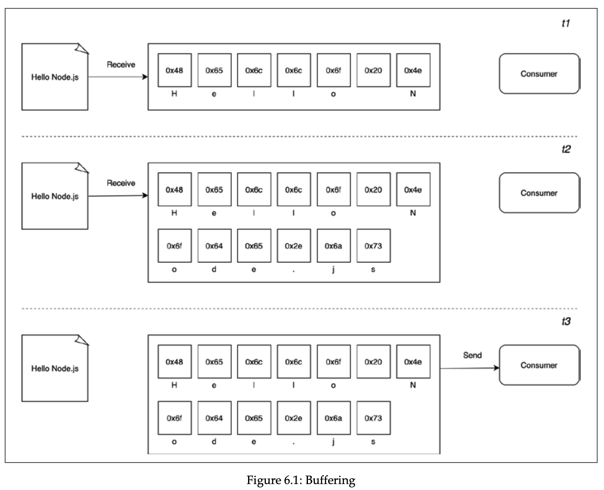

On the other side, streams allow us to pass the data as soon as it’s arrives from the resource. As soon as each chunk is available, it can send this chunk to the caller right away, without waiting for all the data to be collected.

Node.js streams have advantages of space efficiency, time efficiency, and composability.

In terms of space efficiency, consider the case when we need to process a large file, creating buffer for that is probably not a good idea, and in fact buffer size is limited. We can check it with `console.log(buffer.constants.MAX_LENGTH);` with `import buffer from 'buffer'`.

- Gzipping using buffer example

  ```jsx
  import { readFile, writeFile } from "fs/promises";
  import { gzip } from "zlib";
  import { promisify } from "util";
  const promiseGzip = promisify(gzip);

  const filename = process.argv[2];

  async function main() {
    const data = await readFile(filename);
    // notice that the data type returned is Buffer
    const gzippedData = await promiseGzip(data);
    await writeFile(`${filename}.gz`, gzippedData);
    console.log(`File successfully compressed`);
  }

  main();
  ```

  If we try to compress large file, we get error: `RangeError [ERR_FS_FILE_TOO_LARGE]: File size (10737418240) is greater than 2 GiB`. This is, again, because V8 has Buffer size limit.

- Gzipping using streams example

  ```jsx
  import { createReadStream, createWriteStream } from "fs";
  import { createGzip } from "zlib";

  const filename = process.argv[2];

  createReadStream(filename)
    .pipe(createGzip())
    .pipe(createWriteStream(`${filename}.gz`))
    .on("finish", () => {
      console.log(`Successfully compressed file`);
    });
  ```

  Now, we don’t have the problem of memory outage, because we don’t store chunks in the buffer, we send the chunks right away.

In terms of time efficiency, it’s described in the following image.

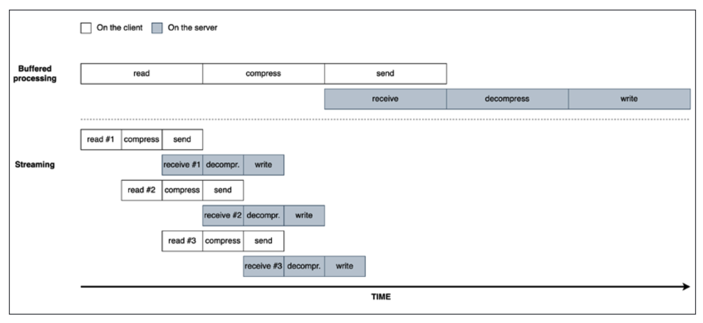

In terms of composability, streams can be composed with `pipe` method, which allows us to connect different processing units, each responsible for single functionality. They can understand each other in terms of API, but the next stream must understand the output produced by previous stream.

The order of the data chunks matters, and Node.js manages the order for us under the hood.

### Getting started with streams

Streams are everywhere in Node.js, examples include write and read functions with streaming support, http request/response objects (which are basically streams)

Every stream in Node.js is implementation of one of four base abstract classes available in `stream` core module: `Readable`, `Writable`, `Duplex`, `Transform`. Each stream class is instance of `EventEmitter`.

Streams support 2 operating modes: **Binary mode** (data is transferred in form of chunks such as buffers or strings), and **Object mode** (data is transferred as sequence of discrete objects, allowing us to use almost any js value).

### Readable

A `Readable` stream represents a source of data, and in node.js implemented using the Readable abstract class. We can receive a data from Readable stream with 2 approaches:

- **non-flowing (paused).** Using this approach the data is pulled from the stream, and is not continuously sent by stream. It involves attaching a listener to the stream for the readable event (which signals the availability of new chunk of data), and continuously reading the internal buffer until it’s emptied. This can be done with `read` method, which synchronously reads from the internal buffer and returns a Buffer object representing the chunk of data.
  When `read` method returns `null` , there is no more data available in internal buffer. Readable stream also emits `end` event when stream ends. We can also set encoding of the stream with `[stream].setEncoding(encoding)`, so we don’t read buffers, but strings.

- Example

```jsx
// process.stdin.setEncoding("utf8");

process.stdin;
on("readable", () => {
  let chunk;
  console.log("New data is available");
  while ((chunk = process.stdin.read()) !== null) {
    console.log(`Chunk read (${chunk.length} bytes): ${chunk.toString()}`);
  }
});
on("end", () => {
  console.log(`End of stream`);
});
```

Note that if we don’t continuously pull the data from stream, the size of internal buffer grows to a certain limit (can be specified with highWaterMark option), and once the buffer is full, stream stops reading more data from source until you pull data from buffer. This is called **.**

- **flowing.** In this case, the data is automatically pushed when it’s arrived, and `Readable` stream emits `data` event for this.

- Example

```jsx
process.stdin
  .on("data", (chunk) => {
    console.log("New data available");
    console.log(`Chunk read (${chunk.length} bytes): "${chunk.toString()}"`);
  })
  .on("end", () => console.log("End of stream"));
```

Because default operating mode for stream is non-flowing, we can switch to flowing by attaching listener to `data` event, or explicitly invoking `resume` method. To temporality stop the stream from emitting data events, we can invoke `pause` method, causing incoming data be cached in internal buffer. So, calling `pause` method switches the stream back to non-flowing mode.

Readable streams are also async iterators.

- Example

```jsx
async function main() {
  for await (const chunk of process.stdin) {
    console.log("New data available");
    console.log(`Chunk read (${chunk.length} bytes): "${chunk.toString()}"`);
  }
  console.log("End of stream");
}
main();
```

### Implementing Readable streams

We can implement our own custom readable stream. For this we need to inherit from `Readable` class and specify `_read` method, which is called by internals of `Readable` to start filling the internal buffer using `push` (meaning \_read method can use push method to push to the buffer). `_read` must not be called by stream consumers, and is for internal purposes only.

- Example

  ```jsx
  import { Readable } from "stream";
  import Chance from "chance";
  const chance = new Chance();

  export class RandomStream extends Readable {
    constructor(options) {
      super(options);
      this.emittedBytes = 0;
    }
    _read(size) {
      const chunk = chance.string({ length: size });
      // because we are pushing string, we need to specify encoding
      this.push(chunk, "utf8");
      this.emittedBytes += chunk.length;
      if (chance.bool({ likelihood: 5 })) {
        this.push(null);
      }
    }
  }

  // usage

  const randomStream = new RandomStream();
  randomStream
    .on("data", (chunk) => {
      console.log(
        `Chunk received (${chunk.length} bytes): ${chunk.toString()}`
      );
    })
    .on("end", () => {
      console.log(`Produced ${randomStream.emittedBytes} bytes of random
  data`);
    });
  ```

  Fun fact: in the `options`, consumer can pass an option of highWaterMark to limit the size of buffer, but stream can ignore it. Default highWaterMark is 16KB. We can check if buffer is full when `push` method of stream returns `false`.

We can specify the construction of our custom readable stream by passing a `read` method as an option. The behaviour is the same as in our previous approach.

- Example

  ```jsx
  import { Readable } from "stream";
  import Chance from "chance";
  const chance = new Chance();
  let emittedBytes = 0;

  const randomStream = new Readable({
    read(size) {
      const chunk = chance.string({ length: size });
      this.push(chunk, "utf8");
      emittedBytes += chunk.length;
      if (chance.bool({ likelihood: 5 })) {
        this.push(null);
      }
    },
  });
  ```

### Writable

A `Writable` stream represents a data destination, for example file in filesystem, a database table, a socket, or standard output interface. In Node.js, all of these are implemented with `Writable` abstract class from `stream` module.

To write to a writable stream we need to invoke `writable.write(chunk, [encoding], [callback])` method. Encoding is `utf8` by default, and callback fn is called when chunk is flushed to the underlying resource to indicate successful or failed operation (if we pass `Error` as an argument), and if error it can be caught by `error` event emitted by writable.

Note that the `write` method of writable is not asynchronous unless async API is used inside. You can verify this by logging some message. But the callback provided is run async.

To signal that no more data will be written, we can invoke `writable.end([chunk], [encoding], [callback])` , where chunk is final chunk to stream, and callback is equivalent to registering listener to `finish` event, which is fired when all data in stream has been flushed into underlying resource.
