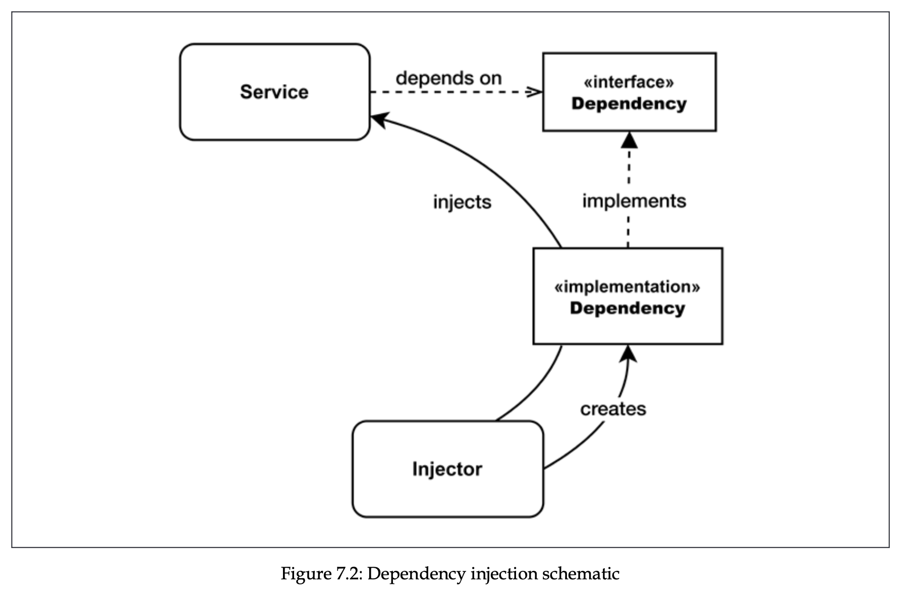
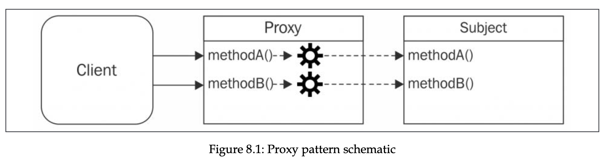
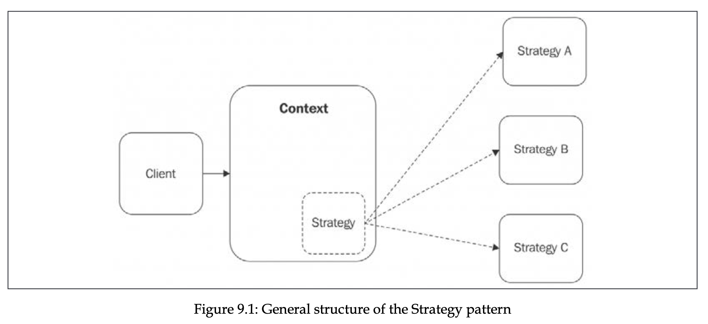
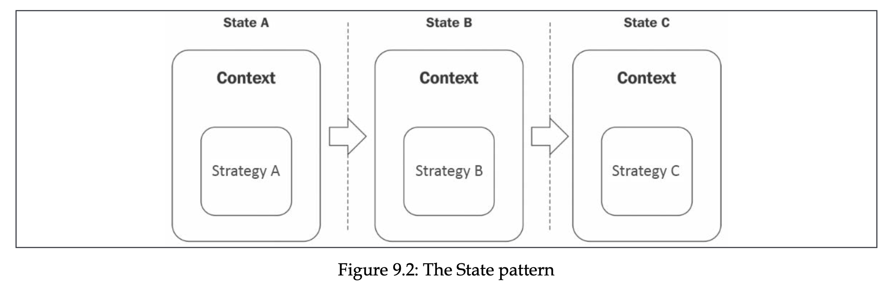
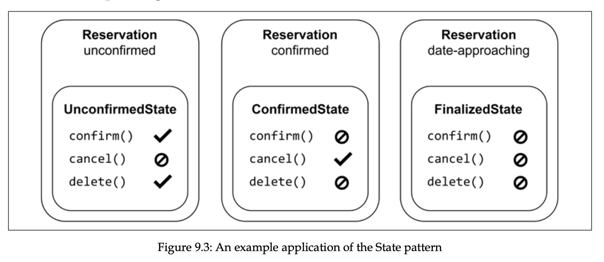
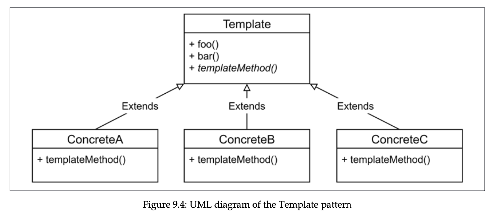

# NodeJS design patterns


My notes and takeaways from the NodeJS Design Patterns book by Mario Casciaro and Luciano Mammino. See the [book](https://www.nodejsdesignpatterns.com/) for more details.

## Table of contents

- [The Node.js platform](#the-nodejs-platform)
  - [I/O (Input / Output)](#io-input--output)
  - [Event demultiplexing](#event-demultiplexing)
  - [The reactor pattern](#the-reactor-pattern)
  - [Libuv](#libuv)
  - [Recipe of Node.js](#recipe-of-nodejs)
  - [Native code](#native-code)
- [Module system](#module-system)
  - [CommonJS](#commonjs)
    - [Homemade module system](#homemade-module-system)
    - [Monkey patching](#monkey-patching)
  - [ESModules](#esmodules)
    - [default export notes](#default-export-notes)
    - [async imports](#async-imports)
    - [Modules loading](#modules-loading)
    - [Read-only live binding and live binding](#read-only-live-binding-and-live-binding)
  - [differences](#differences)
- [Callbacks and Events](#callbacks-and-events)
  - [CPS and direct style](#cps-and-direct-style)
  - [guaranteeing asynchronicity with deferred execution](#guaranteeing-asynchronicity-with-deferred-execution)
  - [Propagating errors](#propagating-errors)
  - [Observer pattern](#observer-pattern)
    - [EventEmitter](#eventemitter)
    - [Memory leaks](#memory-leaks)
    - [Antipatterns](#antipatterns)
    - [Combining](#combining)
    - [Exercises for Callbacks and Events](#exercises-for-callbacks-and-events)
- [Asynchronous Control Flow Patterns with Callbacks](#asynchronous-control-flow-patterns-with-callbacks)
  - [The Sequential Iterator pattern](#the-sequential-iterator-pattern)
  - [Parallel execution with callbacks](#parallel-execution-with-callbacks)
  - [Fix race conditions with concurrent tasks](#fix-race-conditions-with-concurrent-tasks)
  - [Limited parallel execution](#limited-parallel-execution)
  - [Exercises](#async-control-flow-patterns-with-callbacks-exercises)
- [Asynchronous Control Flow Patterns with Promises and Async/Await](#asynchronous-control-flow-patterns-with-promises-and-asyncawait)
  - [Promises/A+ and thennables](#promisesa-and-thennables)
  - [The Promise API](#the-promise-api)
  - [Sequential iteration with promises](#pattern-sequential-iteration-with-promises)
  - [Limited parallel execution with promises](#limited-parallel-execution-with-promises)
  - [Async/await](#asyncawait)
  - [Error handling](#error-handling)
  - [Trap when returning](#trap-when-returning)
  - [Sequential execution and iteration](#sequential-execution-and-iteration)
  - [The problem with infinite recursive promise resolution chains](#the-problem-with-infinite-recursive-promise-resolution-chains)
  - [Exercises](#exercises)
- [Coding with streams](#coding-with-streams)
  - [Getting started with streams](#getting-started-with-streams)
  - [Readable](#readable)
  - [Implementing Readable streams](#implementing-readable-streams)
  - [Writable](#writable)
  - [Backpressure](#backpressure)
  - [Implementing Writable streams](#implementing-writable-streams)
  - [Duplex](#duplex)
  - [Transform](#transform)
  - [PassThrough](#passthrough)
  - [Late piping](#late-piping)
  - [Lazy streams](#lazy-streams)
  - [Connecting streams using pipes](#connecting-streams-using-pipes)
  - [Pipes and error handling](#pipes-and-error-handling)
- [Creational design patterns](#creational-design-patterns)
  - [Factory](#factory)
    - [Simple profiler](#simple-profiler)
  - [Builder pattern](#builder-pattern)
  - [Revealing pattern](#revealing-pattern)
    - [Immutable buffer](#immutable-buffer)
  - [Singleton](#singleton-pattern)
  - [Dependency Injection](#dependency-injection)
  - [Inversion of control](#inversion-of-control)
  - [Exercises for patterns](#exercises-for-patterns)
- [Structural design patterns](#structural-design-patterns)
  - [Proxy, surrogate](#proxy-surrogate)
    - [Object composition](#object-composition)
    - [Object augmentation, monkey patching](#object-augmentation-monkey-patching)
    - [Built in proxy object](#built-in-proxy-object)
  - [Decorator](#decorator)
    - [Difference from Proxy](#difference-from-proxy)
  - [Adapter](#adepter)
  - [Structural design patterns conclusion](#structural-design-patterns-conclusion)
  - [Structural design patterns exercises](#structural-design-patterns-exercises)
- [Behavioral design patterns](#behavioral-design-patterns)
  - [Strategy](#strategy)
  - [State](#state)
  - [Template](#template)
  - [Iterator](#iterator)
    - [Iterable protocol](#iterable-protocol)
  - [Generators](#generators)
  - [Async iterators](#async-iterators)
  - [Async generators](#async-generators)
  - [Async iterators and Node.JS streams](#async-iterators-and-nodejs-streams)

## The Node.js platform

The Node.js core (or runtime) is built on top of few principles, one of them is having small core. It keeps all functionalities at a bare minimum leaving all others to the userland.

Another principle in Node.js is designing small modules, which take its roots from Unix philosophy:

1. Small is beautiful.
2. Make each program do one thing well.

Another principle is having small surface area, where a common pattern is to export certain class or function, which is entry point, and not exposing the internals to the outside world.

### I/O (Input / Output)

I/O is slow, accessing the RAM takes nanoseconds, whereas accessing hard disks or network may take milliseconds. There are 2 types of I/O.

1. Blocking. Traditional one used in programming, where function call correspond to some I/O, which blocks the execution of the thread until request is completed. This means a webserver with blocking i/o cannot handle multiple connections in the same thread, it now has to open new threads to process new connections concurrently (note that idle times could be big in each thread, which is wasteful). Unfortunately, threads are expensive, it consumes memory, has context switches (that’s why each thread has idle times) ⇒ having long running thread for each connection is expensive.
2. Non-blocking. Many Operating Systems support it, it returns immediately without waiting for the request to complete. You could make a polling to access the data when it’s available, if it’s not available yet it returns some constant. We can use loop, which checks for the result until it’s available, but this is not efficient, because the loop itself wastes a lot of CPU cycles and time.

### Event demultiplexing

Most Operating Systems provide a native mechanism for handling concurrent non-blocking resources in better way, called **_synchronous event demultiplexer (event notification interface)._**

It watches multiple resources and returns event (or events) when an operations on those resources complete. It goes idle until there are new events to process. When each event is processed by event demultiplexer, the resource associated with each event is guaranteed to be ready to be read. When all events are processed, the flow will block again (thead goes idle) until new events are again available to process. This is called **event loop.**

Now we can handle multiple connections in the same thread, with idle time of the thread reduced. Demultiplexing in this technique refers to using one thread to handle multiple connections. This strategy not only has resources benefits, but also it simplifies concurrency strategies (for example in multi-threads environment we would have to use semaphores).

See difference between blocking i/o and non-blocking i/o (with event demultiplexing) below:


### The reactor pattern

It’s specialization of algorithms that has a handler associated with each I/O operation, and represented by callback function.

1. Application submits a new I/O request to **Event Demultiplexer** and specifies handler with it. This operation is non-blocking ⇒ returns immediately.
2. When the result is available in event demultiplexer, it pushes a set of corresponding event and handler to **Event Queue.**
3. Event loop iterates over event queue, invoking each handler for each event.
4. The handler (which is part of app code) gives control back to the event loop when its execution completes. Or it submits another I/O request that triggers the cycle once more.
5. When all items in Event Queue are processed, event loop goes idle, waiting event demultiplexer to push another items.


Node.js application exits, when there are no more pending operations in event demultiplexer and no more events being processed in event queue.

So, the reactor pattern handles i/o by going idle until new events are available from a set of observed resources, and then reacts by dispatching each event to associated handler.

### Libuv

Each operating system has different API interfaces for the event demultiplexer, and each i/o may behave differently even with one operating system. For example in Unix there is no way to access files in non-blocking manner. To simulate it, we need to create another thread and process it there.

Libuv is low-level i/o engine of node.js, which makes node.js compatible with all major OSs, and normalizes the behavior among them. It implements the reactor pattern, providing APIs for creating event loops, managing event queue and others.

### Recipe of Node.js

Reactor pattern and libuv are building blocks of Node.js, but we need three more components:

1. A set of bindings for wrapping and exposing libuv and other low-level functionalities to JavaScript.
2. V8, JavaScript engine, to compile JavaScript into machine code.
3. A core JavaScript library that implements high-level node.js api, for example `fs` or `http`


Node.js ships with very recent versions of V8, which means we can use the most new features with confidence.

### Native code

Node.js allows us to reuse components written in C/C++ native code. It can be beneficial because with native code we can access lower-level APIs, for example communicating with hardware drivers. Although V8 is very fast, it is still a bit slower than native code. For CPU-intensive apps, it makes sense to use native code.

## Module system

ES6 specification didn’t come with implementation of modules (ESM), so different browsers companies and node.js had to come up with their own implementation according to the spec.

### CommonJS

CommonJS is the original module system for Node.js that provides a way to organize and structure code by dividing it into reusable modules.

#### Homemade module system

```js
import fs from "fs";

function loadModule(filename, module, require) {
  const wrapperSrc = `((module, exports, require)=>{
    ${fs.readFileSync(filename, "utf-8")}
  })(module, module.exports, require)`;

  eval(wrapperSrc);
}

function require(filename) {
  const id = require.resolve(filename);
  if (require.cache[id]) {
    return require.cache[id].exports;
  }

  const module = {
    id,
    exports: {},
  };

  loadModule(filename, module, require);

  return module.exports;
}
require.resolve = (filename) => {
  return filename;
};
require.cache = {};
```

Complete resolving algorithm can be found [here](https://nodejs.org/api/modules.html#modules_all_together).

Synchronous nature of `require` function makes it impossible to export asynchronously. Any assignment to `module.exports` must be synchronous. That’s why most Node.js core modules offer synchronous APIs instead of asynchronous.

CommonJS module system has one disadvantage, it can’t solve the problem with circular dependencies, where different module can have different version of its counterpart depending on when it was required.

```js
// module a
module.exports.loaded = false;
const b = require("./b");
module.exports = {
  b,
  loaded: true, // overrides the previous export }
};

// module b
module.exports.loaded = false;
const a = require("./a");
module.exports = {
  a,
  loaded: true,
};

// main.js
const a = require("./a");
const b = require("./b");
console.log("a ->", JSON.stringify(a, null, 2));
console.log("b ->", JSON.stringify(b, null, 2));

/* a = {
  b: {
    a: {
      loaded: false,
    },
    loaded: true,
  },
  loaded: true,
};
b = {
  a: {
    loaded: false,
  },
  loaded: true,
}; */
```

Explanation

1. **`main.js` requires `./a`:**

   - Node checks its module cache for `"./a"` and finds nothing. It starts loading `a.js`.

2. **Inside `a.js`:**

   1. `module.exports.loaded = false;`
      - So far, `module.exports` is `{ loaded: false }`.
   2. `const b = require("./b");`
      - Node checks if `"./b"` is in the cache. It isn’t, so it starts loading `b.js`.

3. **Inside `b.js`:**

   1. `module.exports.loaded = false;`
      - So far, `module.exports` is `{ loaded: false }`.
   2. `const a = require("./a");`
      - Node sees `"./a"` is **in the process** of loading (so it’s partially complete). It returns that partial export of `a`: `{ loaded: false }`.
   3. `module.exports = { a, loaded: true };`

      - Final export for `b` becomes:

      ```js
      {
        a: { loaded: false }, // partial version of a
        loaded: true
      }
      ```

      - `b.js` finishes, and Node caches this export under `"./b"`.

4. **Back to `a.js`:**

   - We resume after `const b = require("./b");`, which at this point is `{ a: { loaded: false }, loaded: true }`.

   1. `module.exports = { b, loaded: true };`

      - Final export for `a` becomes:

      ```js
      {
        b: { a: { loaded: false }, loaded: true },
        loaded: true
      }
      ```

   - `a.js` finishes, and Node caches this export under `"./a"`.

5. **Back to `main.js`:**
   - `const a = require("./a");` now returns the **fully** exported `a`.
   - `const b = require("./b");` returns the cached export of `b`.

#### Monkey patching

It’s a practice of modifying existing objects (other modules exports) at runtime to change or extend behaviour, or apply temporary fixes. Monkey patching is considered harmful.

```js
require("./logger").customFunction = () => {
  console.log("monkey");
};
```

### ESModules

ESM were introduced as ECMAScript 2015 spec, with goal to give JS official module system across different environments. It has support for cyclic dependencies, and load modules async. ES modules are static, and cannot be imported conditionally, only at top of the file.

With ESM we **_must_** include extension of the file in the import path, whereas in CJS we could use either `./myModule.js` or `./myModule`

With ESM absolute path must be like `file:///....` and `/...` or `//...` is not supported.

(browser only) With ESM we can load modules from outside, for example `import mdl from "https://mdl.pkg.com"`.

Namespace import can be imported like:

```js
import * as myModule from "./myModule.js";
```

#### default export notes

When default exporting, the name of variable or function is ignored, so we can use any name when importing it.

Default export can prevent tree shaking for some cases. For example, when module exports object with properties and methods, even if neither of them were used, most module bundlers think it’s used.

#### async imports

Suppose we want to load specific module of language based on which lang pref user has. We can use dynamic imports with `import()` operation. It returns a promise that resolves to the module object.

```js
const translationModule = `./strings-${lang}.js`;
import(translationModule).then((strings) => {
  console.log(strings);
});
```

#### Modules loading

The goal of interpreter is to build dependency graph of the modules. It helps interpreter to determine the order in which modules should be loaded. Entry point is passed to interpreter as an entry point, and it recursively starts to explore and evaluate the code.

1. **Phase 1 - Construction.** FInd all imports and recursively load the content of every module from it.
2. **Phase 2 - Instantiation.** For every exported and imported entity, keep reference in memory, but don’t assign any value (because code is not executed yet). Keep tracking of deps relationship between them (linking).
3. **Phase 3 - Evaluation.** All blanks are filled, **c**ode is executed.

In simple terms, phase 1 is finding dots, phase 2 is connecting them, phase 3 is going through paths in the right order.

Difference from CJS is that in cjs the code before `require` is already executed, whereas no code is executed until phase 3 in ESM, this makes exports and imports to be static.

In case of ESM, all modules will have up-to-date imports from other modules, because ESM uses live bindings, and evaluation order ensures every module imports fresh exports from other modules and that dependencies are resolved before execution. Circular deps problem with CJS is now resolved.

#### Read-only live binding and live binding

When entity is imported from other module, it is readonly (read-only live binding) and cannot be mutated directly, whereas it can be mutated in its original module (live binding). We can provide a function as an export to mutate the read-only live binding variables.

```js
// count.js
export let count = 0;
export function increment() {
  count++;
}

// index.js
import { count, increment } from "./count.js";
console.log(count); // 0
increment();
console.log(count); // 1

console.log(++count); // TypeError, assignment to constant variable.
```

We can modify other modules, if they provide default export as an object, we can modify it’s properties and methods.

Object itself is read-only live binding, but its properties are not.

Note that by importing `import * as fs from 'fs'` or `import { someFunc } from 'fs'` gives us read-only live binding.

### differences

ESModules run in strict mode, whereas CommonJS modules do not.

We can import CJS modules in ESM, whereas we cannot import ESM in CJS. We can import CJS in ESM like this:

```tsx
// 1) default import, importing specific exports fails.
import mod from "./mymod.cjs"; // success
import { func } from "./mymod.cjs"; // fails

// 2) we can create our require for ESM:
import { createRequire } from "module";
const require = createRequire(import.meta.url);

// and use it:
const server = require("./server.cjs");
server2.func1();
```

In ESM we don’t have predefined properties, like module, \_\_dirname (absolute path of parent folder), or \_\_filename (absolute path of current file). But we can define them ourselves:

```tsx
import { fileURLToPath } from "url";
import { dirname } from "path";

const __filename = fileURLToPath(import.meta.url);
const __dirname = dirname(__filename);
// import.meta is object with properties for metadata like current url in
// the form of: file:///Users/123/... fileURLToPath transforms it to normal
// absolute path -> /Users/123/...
console.log({ __filename });
```

In ESM, `this` refers to `undefined`, whereas in CJS it’s reference to `exports`.

Also we cannot import JSON in ESM, whereas we can in CJS, but we can use our `require` to do this in ESM:

```tsx
import { createRequire } from "module";
const require = createRequire(import.meta.url);
const json = require("./j.json");
console.log({ json });
```

### Similarities

> If module is imported multiple times in different files, it is executed only once, and subsequent imports use cached version of the module.

## Callbacks and Events

### CPS and direct style

Direct style is returning the result of a function to caller, whereas continuation-passing style (CPS) is accepting the callback to invoke when async operation completes.

Always choose a direct style for purely syncronous functions.

Bear in mind that sync API will break Node.js concurrency model, slowing down whole app.

### guaranteeing asynchronicity with deferred execution

Sometimes we might need to turn sync function into async. Suppose we have this synchronous function.

```jsx
import fs from "fs";

const cache = new Map();

function readSync(filename) {
  if (cache.has(filename)) {
    return cache.get(filename);
  }

  const data = fs.readFileSync(filename);
  cache.set(filename, data);
  return data;
}
```

And you want to turn it into asynchronous function. You might think of next implementation, which is incorrect, because first branch runs synchronously, and second one asynchronously. This makes our function unpredictable.

```jsx
function readAsync(filename, callback) {
  if (cache.has(filename)) {
    callback(cache.get(filename));
  } else {
    const data = fs.readFileSync(filename);
    cache.set(filename, data);
    callback(data);
  }
}
```

We can defer execution with `process.nextTick()`, which defers execution of function after currently running operation completes. It pushes the callback to the top of event queue, in front of any pending I/O event, and returns immediately. The callback will be invoked as soon as currently running operation yields control back to the event loop.

```jsx
function readAsync(filename, callback) {
  if (cache.has(filename)) {
    process.nextTick(() => {
      callback(cache.get(filename));
    });
    return;
  }

  const data = fs.readFileSync(filename);
  cache.set(filename, data);
  callback(data);
}
```

There are other ways also to defer the execution of some code like `setImmediate` or `setTimeout(cb, 0)`, and difference between them all is having different running phases in event loop. Note that `process.nextTick()` callback is **microtask**.

### Propagating errors

In synchronous direct style functions, errors are propagated with `throw` keyword, in which errors are propagated in the callstack. Whereas in continuation-passing style (CPS), errors are propagated by passing error to next callback in the chain.

Sometimes we may have CPS async function, and inside callback the error might be thrown. In this case, even if we surround the entire function with `try catch` block, it will not catch our error, because the stack in which the block operates is different from the one in which our callback is invoked. So, the error will go straight to the event loop, where it is caught and thrown to the console.

```tsx
// example on how error is not caught inside catch block and propagated
// to the event loop, crashing the whole app.
try {
  wait(1000).then(() => {
    throw new Error("");
  });
} catch (error) {
  console.log("Error!");
}
```

However in Node.js we can still catch the error with `process.on("uncaughtException")` event. It’s not recommended to let the app continue after such event anyway.

The process of exiting and making some cleanups is called fail-fast approach, and is recommended approach in Node.js

### Observer pattern

The Observer pattern defines an object (called subject) that can notify a set of observers (or listeners) when a change in its state occurs.

Difference from callback pattern is that observer pattern can continuously notify multiple listeners, whereas in callback pattern, only one listener, its callback.

#### EventEmitter

Observer pattern is built-in feature in Node.js, and is available with `EventEmitter` class from “events” module.


Following code demonstrates usage example:

```tsx
import { EventEmitter } from "events";
import { readFile } from "fs";

function findRegex(files, regex) {
  const emitter = new EventEmitter();
  for (const file of files) {
    readFile(file, { encoding: "utf-8" }, (err, data) => {
      if (err) {
        return emitter.emit("error", err);
      }
      emitter.emit("fileRead", file);
      const match = data.match(regex);
      if (match) {
        match.forEach((elem) => {
          emitter.emit("found", file, elem);
        });
      }
    });
  }
  return emitter;
}

findRegex(["./package.json", "./index.ts"], /hello/g)
  .on("fileRead", (file) => {
    console.log(`File has been read: ${file.toString()}`);
  })
  .on("error", (error) => {
    console.log(`Error reading a file: ${error.toString()}`);
  })
  .on("found", (file, elem) => {
    console.log(
      `Found in file ${file.toString()} in element ${elem.toString()}`
    );
  });
```

Again, note that we can’t throw errors in callbacks of event emitter events, and what we do in the code above is recommended approach.

There is special event type `error` , and if there is no listener for such event, EventEmitter will automatically throw exception and exit from application.

Event emitter is not commonly used on its own, and is used in following way, by being extended by other class:

```jsx
import { EventEmitter } from "events";
import { readFile } from "fs";
class FindRegex extends EventEmitter {
  constructor(regex) {
    super();
    this.regex = regex;
    this.files = [];
  }
  addFile(file) {
    this.files.push(file);
    return this;
  }
  find() {
    for (const file of this.files) {
      readFile(file, "utf8", (err, content) => {
        if (err) {
          return this.emit("error", err);
        }
        this.emit("fileread", file);
        const match = content.match(this.regex);
        if (match) {
          match.forEach((elem) => this.emit("found", file, elem));
        }
      });
    }
    return this;
  }
}
```

Examples of modules extending from EventEmitter are `http` server, in which EventEmitter is used to produce events such as request, connection, or closed. Another example is Node.js `streams`.

#### Memory leaks

One thing to note with observable pattern is that it can cause memory leaks.

If the observables we are subscribing to have a long life span, we have to unsubscribe from them once there is no need, otherwise it’s going to cause memory leaks.

Following code demonstrates an example. Variable `thisTakesMemory` is referenced inside listener, and is not garbage collected until listener is released from emitter, or until emitter is not garbage collected itself.

```jsx
const thisTakesMemory = "A big string....";
const listener = () => {
  console.log(thisTakesMemory);
};
emitter.on("an_event", listener);
```

We can prevent this by releasing the listener with `emitter.removeListener` method. EventEmitter itself warns developer when listeners count are > 10 (by default). Or we can use `emitter.once` to release it after first invokation.

#### Antipatterns

It’s generally not recommended to emit the events synchronously. In case if we do, we have to register all the listeners before we launch the task. If we register listener after the task launch, it’ll not be triggered.

If we emit the events asynchronously, we can register the listeners after the task launch, because async tasks are guaranteed not to be executed in the same event loop cycle.

Note that we can delegate the execution of sync task with `process.nextTick` and making it async.

### Combining

There is also a pattern of combining callbacks with events, where callback is passed as argument and used for general use, whereas event emitter is returned from the function and is used for advanced use cases.

For example in `glob` package in nodejs, we can pass a callback, which will have error as first arg, and matched files as second arg. The function returns event emitter, which is used for advanced scenarios, for example attaching a listener for each file match.

### Exercises for Callbacks and Events

- Write a function that accepts a number and a callback as the arguments. The function will return an `EventEmitter` that emits an event called tick every 50 milliseconds until the number of milliseconds is passed from the invocation of the function. The function will also call the callback when the number of milliseconds has passed, providing, as the result, the total count of tick events emitted. recursively.

  ```jsx
  import EventEmitter from "events";

  const exercise = (max, cb) => {
    const eventEmitter = new EventEmitter();

    let msPassed = 0;
    const intervalId = setInterval(() => {
      if (msPassed >= max) {
        clearInterval(intervalId);
        cb(msPassed / 50);
        return;
      }

      eventEmitter.emit("tick");
      msPassed += 50;
    }, 50);

    return eventEmitter;
  };

  const emitter = exercise(1000, (count) => {
    console.log(count);
  });

  emitter.on("tick", () => {
    console.log("tick");
  });
  ```

- Modify the function created in exercise 3.2 so that it emits a tick event immediately after the function is invoked.

  ```tsx
  // add this code after new EventEmitter();
  process.nextTick(() => {
    eventEmitter.emit("tick");
  });

  // this is because if we just use eventEmitter.emit("tick") after
  // declaring eventEmitter variable, at that time there are no listeners
  // attached to event emitter, so callback is not executed.
  ```

- Modify the function created in exercise 3.3 so that it produces an error if the timestamp at the moment of a tick (including the initial one that we added as part of exercise 3.3) is divisible by 5. Propagate the error using both the callback and the event emitter. Hint: use Date.now() to get the timestamp and the remainder (%) operator to check whether the timestamp is divisible by 5.

  ```tsx
  import EventEmitter from "events";

  const exercise = (max, cb) => {
    const eventEmitter = new EventEmitter();
    let error;

    eventEmitter.on("tick", () => {
      const date = Date.now();
      if (date % 5 === 0) {
        error = date;
      }
    });

    eventEmitter.emit("tick");

    let msPassed = 0;
    const intervalId = setInterval(() => {
      if (error) {
        eventEmitter.emit("error", error);
        cb(error, null);
        clearInterval(intervalId);
        return;
      }
      if (msPassed >= max) {
        clearInterval(intervalId);
        cb(null, msPassed / 50);
        return;
      }

      eventEmitter.emit("tick");
      msPassed += 50;
    }, 50);

    return eventEmitter;
  };

  const emitter = exercise(1000, (err, count) => {
    if (err) {
      return console.error(1, err);
    }
    console.log(count);
  });
  emitter.on("error", (error) => {
    console.error(2, error);
  });
  ```

## Asynchronous Control Flow Patterns with Callbacks

The situation where the abundance of closures and in-place callback definitions
transforms the code into an unreadable and unmanageable blob is known as **callback
hell.**

The most notable negatives of callback hell besides the unclean code, is perfomance bottlenecks and memory leaks. Closures come with a little price in terms of perfomance and memory consumption, and they can create memory leaks, because any context referenced by an active closure will not be garbage collected.

We can refactor callback hell with simple techniques, like early return, and separating common code into their own functions.

### The Sequential Iterator pattern

We can map the values of an array asynchronously. We can pass the result of operation to the next function, making asynchronous version of reduce function. We can even iterate over an infinite number of elements in the array of tasks. But note here that all the tasks must be asynchronous, otherwise we might hit the callstack exceeded error.

This pattern is useful when order of execution of asynchronous operations matters.


Below is my implementation of sequential iterator pattern.

```jsx
function iterator(collection, itemCb, cb) {
  function iterate(index) {
    if (index === collection.length) {
      return cb();
    }

    collection[index](() => {
      itemCb(index);
      iterate(index + 1);
    });
  }

  iterate(0);
}

function wait(ms, cb) {
  return new Promise((resolve) => {
    setTimeout(() => {
      resolve();
      cb();
    }, ms);
  });
}

iterator(
  [
    (cb) => wait(100, cb),
    (cb) => wait(100, cb),
    (cb) => wait(100, cb),
    (cb) => wait(100, cb),
  ],
  console.log,
  console.log
);
```

### Parallel execution with callbacks

In fact word “parallel” is improper here, because, knowing the underlying mechanism of node.js with event loop, we know that these tasks do not run in different threads. The proper way is to say this kind of flow is concurrent, but word parallel is used for simplicity.


In Node.js, synchronous tasks can’t run in parallel, unless the execution of them is not interleaved with setTimeout or similar async APIs.

**The Unlimited Parallel Execution pattern.** Run a set of asynchronous tasks in parallel by launching them all at once, and then wait for all of them to complete by counting the number of times their callbacks are invoked.

```jsx
function iterator(tasks, finish) {
  let completed = 0;
  tasks.forEach((task) => {
    task(() => {
      completed++;
      if (completed === tasks.length) {
        console.log(completed, tasks);
        finish();
      }
    });
  });
}

function wait(ms, cb) {
  return new Promise((resolve) => {
    setTimeout(() => {
      resolve();
      cb();
    }, ms);
  });
}

iterator(
  [
    (cb) => wait(100, cb),
    (cb) => wait(100, cb),
    (cb) => wait(100, cb),
    (cb) => wait(100, cb),
  ],
  () => console.log("Finished")
);
```

### Fix race conditions with concurrent tasks

In multithreaded languages, there are complex techniques to prevent race conditions, like mutexes and semaphores. In Node.js, because it’s single threaded, it’s way easier. We can just create a set with running inputs and check for the input when executing.


```jsx
const spidering = new Set();
function spider(url, nesting, cb) {
  if (spidering.has(url)) {
    return process.nextTick(cb);
  }
  spidering.add(url);
  // ...
}
```

### Limited parallel execution

Spawning parallel tasks without control can often lead to excessive load. In this case, server might be exploited with DoS (denial of service) attack, in which it just refuses connections and becomes unresponsive.

We can use techniques to limit the number of executing tasks.


```jsx
const tasks = [];
const concurrency = 2;
let running = 0;
let completed = 0;
let index = 0;

function next() {
  while (running < concurrency && index < tasks.length) {
    const task = tasks[index++];
    task(() => {
      if (++completed === tasks.length) {
        return;
      }
      running--;
      next();
    });

    running++;
  }
}

next();
```

We can take this to another level and separate it to its own class, that handles limiting execution of concurrent tasks.

```jsx
import { EventEmitter } from "events";

export class TaskQueue extends EventEmitter {
  constructor(concurrency) {
    super();
    this.concurrency = concurrency;
    this.running = 0;
    this.queue = [];
  }

  pushTask(task) {
    this.queue.push(task);
    process.nextTick(this.next.bind(this));

    return this;
  }

  next() {
    if (this.running === 0 && this.queue.length === 0) {
      return this.emit("empty");
    }

    while (this.running < this.concurrency && this.queue.length) {
      const task = this.queue.shift();
      task((err) => {
        if (err) {
          this.emit("error", err);
        }
        this.running--;
        process.nextTick(this.next.bind(this));
      });
      this.running++;
    }
  }
}
```

#### Async control flow patterns with callbacks exercises

- 4.1 File concatenation: Write the implementation of `concatFiles()`, a callback-style function that takes two or more paths to text files in the filesystem and a destination file.

  ```jsx
  import fs from "fs";

  function concatFiles(sources, destination, callback) {
    let data = "";

    function iterate(index) {
      if (index === sources.length) {
        fs.writeFile(destination, data, callback);
        return;
      }

      fs.readFile(sources[index], (err, fileData) => {
        if (err) {
          console.error(err);
          return;
        }

        data += fileData.toString("utf-8");
        iterate(index + 1);
      });
    }
    iterate(0);
  }

  concatFiles(["./index1.txt", "./index2.txt"], "./text.txt", () => {
    console.log("done");
  });
  ```

- 4.2 List files recursively: Write listNestedFiles(), a callback-style function that takes, as the input, the path to a directory in the local filesystem and that asynchronously iterates over all the subdirectories to eventually return a list of all the files discovered.

  ```jsx
  import fs from "fs";

  // we could also use limited parallel execution pattern.

  function listNestedFiles(dir, cb) {
    fs.readdir(dir, { encoding: "utf-8" }, (err, files) => {
      if (err) {
        return cb(err, null);
      }

      const data = [];
      let pending = files.length;
      for (const file of files) {
        const path = dir + "/" + file;
        fs.stat(path, (err, stats) => {
          if (err) {
            return cb(err, data);
          }

          if (stats.isDirectory()) {
            listNestedFiles(path, (err, nestedData) => {
              if (err) {
                return cb(err, data);
              }

              pending--;
              data.push(...nestedData);
              if (pending === 0) {
                return cb(null, data);
              }
            });
          } else {
            fs.readFile(path, (err, fileContent) => {
              if (err) {
                return cb(err, data);
              }
              pending--;
              data.push(fileContent.toString());

              if (pending === 0) {
                return cb(null, data);
              }
            });
          }
        });
      }
    });
  }

  listNestedFiles("dir", (err, content) => {
    if (err) {
      console.error({ err });
      return;
    }

    console.log({ content });
  });
  ```

## Asynchronous Control Flow Patterns with Promises and Async/Await

Promises are part of ES6, which offer alternative to CPS for propagating async result.

Promise is an object which represent eventual result (or error) of an async operation. Promise is `pending` when async operation is not complete, `fulfilled` when operation successfully completes, and `rejected` when operation terminates with error. Once it’s fulfilled or rejected, it’s considered `settled`.

To receive the fullfillment value or rejection reason, following syntax is used:

```jsx
promise.then(onFullfilled, onRejected);
// onFulfilled is callback with fulfillment value
// onRejected is callback with rejected reason.
// Both are optional

// usage example. asyncOperation returns a promise
asyncOperation().then(console.log, console.log);
```

Important notes:

1. `then()` method **_synchronously returns another Promise._**
2. If `onFullfilled` or `onRejected` methods return a value, promise returned by `then()` will fulfill with that value.
3. If `onFullfilled` method returns a promise that fulfills, promise returned by `then()` will fulfill with fulfillment value of that promise.
4. if `onRejected` method returns a promise that rejects, promise returned by `then()` will reject with reason of that promise.
5. if we don't specify `onRejected` or `onFullfilled`, the resolved value or rejected reason is propagated down the chain, until it's caught by resolving handler or rejected reason there.
6. `onFulfilled()` and `onRejected()` callbacks are _guaranteed_ to be invoked asynchronously and at most once, even if we resolve the Promise synchronously with a value. This helps us prevent Zalgo problem, where the behavior of function is unpredictable.
7. If exception is thrown in `onFulfilled()` or `onRejected()` handlers, the promise returned by `then()` is rejected with exception reason. In comparison, in CPS, the thrown errors must have been carried with care, but in this case, the exception is propagated across the chain.
8. `then()` methods synchronously return another promises, whereas the callbacks provided are executed asynchronously.

   

### Promises/A+ and thennables

Historically, there were many implementations of promises, and they varied such that they were not compatible between each other. Because of this **Promises/A+** spec was developed to make them working between each other. Native promises are also built on top of it.

According to Promises/A+ spec, any object with `then()` method is considered Promise-like object **(thennable)**.

> If it looks like a duck, swims like a duck, and quacks like a duck, then it probably is a duck - **Duck typing,** technique of recognizing (or typing) objects based on their external behavior, rather than their actual type.

### **The promise API**

The Promise constructor `new Promise((resolve, reject) => {})` creates a new Promise instance that fulfills or rejects based on the behavior of the function provided as an argument. The function provided to the constructor will receive two arguments.

- `resolve(obj)`: This function will fulfill the Promise with the provided fulfillment value, which will be obj if obj is a value. If obj is Promise, it’ll be the fullfillment value of the obj.
- `reject(err)`: This rejects the Promise with the reason err.

  Promise static methods:

- `Promise.resolve(obj)`: If a Promise is passed, then that Promise is returned as it is. If a thenable is provided, then it's **_converted_** 🤯 \*\*to the Promise implementation in use. If a value is provided, then the Promise will be fulfilled with that value.
- `Promise.reject(err)`: This method creates a Promise that rejects with err as the reason.
- `Promise.all(iterable)`: This method creates a Promise that fulfills with an array of fulfillment values when every item in the input iterable (such as an Array) object fulfills. If any Promise in the iterable object rejects, then the Promise returned by Promise.all() will reject with the first rejection reason. Each item in the iterable object can be a Promise, a generic thenable 🤯, or a value.
- `Promise.allSettled(iterable)`: This method waits for all the input promises to fulfill or reject and then returns an array of objects containing the fulfillment value or the rejection reason for each input Promise. The difference with Promise.all() is that Promise.allSettled() will always wait for each Promise to either fulfill or reject, instead of immediately rejecting when one of the promises rejects.
- `Promise.race(iterable)`: This method returns a Promise that is equivalent to the first Promise in iterable that settles.

Promise instance methods:

- `promise.then(onFulfilled, onRejected)`: This is the essential method of a Promise. Its behavior is compatible with the Promises/A+ standard.
- `promise.catch(onRejected)`: This method is just syntactic sugar for promise.then(undefined, onRejected).
- `promise.finally(onFinally)`: This method allows us to set up an onFinally callback, which is invoked when the Promise is settled. Unlike onFulfilled and onRejected, the onFinally callback will not receive any argument as input, and any value returned from it will be ignored. The Promise returned by finally will settle with the same fulfillment value or rejection reason of the current Promise instance. There is only once exception to all this, which is the case in which we throw inside the onFinally callback or return a rejected Promise. In this case, the returned Promise will reject with the error that is thrown or the rejection reason of the rejected Promise returned.

- Question 1

  ```jsx
  // What’s returned?
  Promise.resolve({
    then: () => {},
  });
  ```

  - Answer
    Pending promise, because Promise.resolve will resolve with given value if value is not promise. If promise, it fulfills with fulfillment value of that promise or thennable.

- Question 2

  ```jsx
  Promise.resolve({
    then: (resolve) => {
      resolve(5);
    },
  });
  ```

  - Answer
    Fulfilled promise with 5, because returning promise fulfils with the value of inner promise.

- Question 3

  ```jsx
  // what's returned?
  new Promise((resolve) => {
    return {
      then: () => {
        resolve("then");
      },
    };
  });
  ```

  - Answer
    Pending promise, because the return value of the executor function is ignored. If we resolve with the object, and inner promise is fulfilled with value, then the returning promise will be fulfilled with that value.

- Question 4

  ```jsx
  // what's returned?

  new Promise((resolve, reject) => {
    reject("error");
  })
    .then(undefined, (rejectedReason) => {
      if (rejectedReason) {
        return console.log({ rejectedReason });
      }
      return "value";
    })
    .then(undefined, (err) => {
      console.log({ err });
    });
  ```

  - Answer
    Fulfilled promise, error is not propagated to the event loop, because it’s caught by the second argument of then. Unless we do this, error is propagated to the event loop.

- Question 5

  ```jsx
  // what's get logged?
  Promise.resolve(1).then((value) => console.log(value));
  console.log(2);
  ```

  - Answer
    2, then 1. Because the onFulfilled and onRejected callbacks are guaranteed to be invoked asynchronously, later than the synchronous code in the event loop cycle.

### **Pattern (sequential iteration with promises)**

Dynamically build a chain of promises using a loop. The promises are executed synchronously, meaning next promise starts executing when the previous is settled.

```jsx
// first implementation

function runSequentially(tasks) {
  let promise = Promise.resolve();

  for (const task of tasks) {
    promise = promise.then(() => task());
  }

  return promise;
}

// second implementation

function runSequentially(tasks) {
  return tasks.reduce((promise, task) => {
    return promise.then(() => task());
  }, Promise.resolve());
}

// Example usage
const tasks = [
  () =>
    new Promise((resolve) =>
      setTimeout(() => {
        console.log("Task 1");
        resolve();
      }, 1000)
    ),
  () =>
    new Promise((resolve) =>
      setTimeout(() => {
        console.log("Task 2");
        resolve();
      }, 500)
    ),
  () =>
    new Promise((resolve) =>
      setTimeout(() => {
        console.log("Task 3");
        resolve();
      }, 1500)
    ),
];

runSequentially(tasks).then(() => console.log("All tasks completed"));
```

### Limited parallel execution with promises

Same TaskQueue can be built with promises. Complete code is as follows. In the runTask method, we are making wrapper function, and deferring its execution to prevent Zalgo issues.

```jsx
export class TaskQueue {
  constructor(concurrency) {
    super();
    this.concurrency = concurrency;
    this.running = 0;
    this.queue = [];
  }

  next() {
    while (this.running < this.concurrency && this.queue.length) {
      const task = this.queue.shift();
      task().finally(() => {
        this.running--;
        this.next();
      });
      this.running++;
    }
  }

  runTask(task) {
    return new Promise((resolve, reject) => {
      this.queue.push(() => {
        return task().then(resolve, reject);
      });
      process.nextTick(this.next.bind(this));
    });
  }
}
```

### async/await

The async/await allows us to write functions that appear to block at each asynchronous operation, waiting for the results before continuing with the following statement. Also it has readability similar to synchronous code.

Async functions always return a promise. If the function has `await` inside, the promise will have a status of pending. Otherwise, if it has no `await` , it will be just a `Promise {<fulfilled>: undefined}`

The await expression works with any value, not just promises. If a value other than a Promise is provided, then its behavior is similar to awaiting a value that it first passed to `Promise.resolve()` . So `const result = await 10` results in 10 being the value of result.

Async functions return a Promise synchronously. That Promise will then eventually settle based on the result or error produced by the function.

async/await is just a syntatic sugar for a simpler consumption of promises.

### Error handling

async/await normalizes the error handling with asynchronous code, because awaited promise rejections are catched by `catch` block in `try-catch` .

- Example

  ```jsx
  function delayError(milliseconds) {
    return new Promise((resolve, reject) => {
      setTimeout(() => {
        reject(new Error(`Error after ${milliseconds}ms`));
      }, milliseconds);
    });
  }

  async function playingWithErrors(throwSyncError) {
    try {
      if (throwSyncError) {
        throw new Error("This is a synchronous error");
      }
      await delayError(1000);
    } catch (err) {
      console.error(`We have an error: ${err.message}`);
    } finally {
      console.log("Done");
    }
  }

  playingWithErrors(true);
  playingWithErrors(false);
  // both errors are catched by catch block.
  ```

### trap when returning

When we have a `try-catch` block, and if we are returning a promise **_without_** using `await` , the rejection of a promise (do not forget that error thrown in `then/catch` of a promise instance resolves to rejected promise) is not caught in catch block. Instead we should use `await` before returning it to the consumer.

- Example

  ```jsx
  // delayError(){ ... }

  async function errorNotCaught() {
    try {
      return delayError(1000);
    } catch (err) {
      // error is not caught in catch block
      console.error("Error caught by the async function: " + err.message);
    }
  }

  errorNotCaught().catch((err) =>
    // consumer will have to deal with the rejection.
    console.error("Error caught by the caller: " + err.message)
  );

  // instead do:

  async function errorCaught() {
    try {
      return await delayError(1000);
    } catch (err) {
      console.error("Error caught by the async function: " + err.message);
    }
  }

  errorCaught().catch((err) =>
    console.error("Error caught by the caller: " + err.message)
  );
  ```

### Sequential execution and iteration

The code using `async/await` looks like it’s being executed synchronously.

One thing i liked about `async/await` is that there is no any specific pattern to learn when we want to execute the asynchronous operations sequentially. See example below.

- Example

  ```jsx
  function delay(ms) {
    return new Promise((resolve) => {
      setTimeout(() => {
        resolve();
      }, ms);
    });
  }
  const msArray = [1000, 2000, 3000];

  async function example() {
    for (const ms of msArray) {
      await delay(ms);
      console.log(ms);
    }
  }

  example();
  // console.log after 1 second: 1000
  // console.log after 3 seconds: 2000
  // console.log after 6 seconds: 3000
  ```

Sometimes developers use `forEach` or `map` to execute the asynchronous code sequentially, but it’s not correct. Using `async/await` with `Array.forEach` for serial execution is anti-pattern, and is considered incorrect. See example with explanation below.

- Example
  Here, we can see that all of the asynchronous operations run in parallel, instead of running sequentially. This is because `forEach` invokes every callback sequentially, and those callbacks return promises, and `forEach` doesn’t wait for them, and instead invokes next callback.

  ```jsx
  const msArray = [2000, 1000, 500, 100];

  function example() {
    msArray.forEach(async (ms) => {
      await delay(ms);
      console.log(ms);
    });
  }
  example();
  // console.log after 100ms: 100
  // console.log after 500ms: 500
  // console.log after 1000ms: 1000
  // console.log after 2000ms: 2000
  ```

### Parallel execution

Parallel execution can be done in 2 ways.

- `Promise.all` - recommended approach, it runs all asynchronous callbacks provided as an array in parallel, and returns a promise with resolves when all of the provided callbacks resolve, or rejects immediately when one of them rejects.
- Collecting all the executed promises, and then awaiting each of them. This is not as good as `Promise.all` , because we will have to wait for all the promises to settle, even if one of them rejects.

- Example

```jsx
async function example() {
  const promises = [delay(100), delay(200), delay(300)];
  for (const promise of promises) {
    await promise;
  }
  // code to be executed when all promises fulfill.
}
example();
```

### **The problem with infinite recursive promise resolution chains.**

Suppose you want to create a infinite recursive promise resolution chains, in this case your solution might be:

```tsx
function leakingLoop() {
  return delay(1).then(() => {
    console.log(`Tick ${Date.now()}`);
    return leakingLoop();
  });
}

// or

async function leakingLoop() {
  await delay(1);
  console.log(`Tick ${Date.now()}`);
  return leakingLoop();
}
```

In this case, it’s easy to introduce memory leak in our program, and both implementations above have memory leak. Remember when a promise **(a)** returns a promise **(b)**, promise **a** resolves only when promise **b** resolves. In our case, it’s going infinitely down the chain, so the first promise returned from the function never resolves. We can see how memory goes indefinitely for the process in process view monitor (Activity Monitor in Mac).

To fix this issue, we should omit the `return` keyword.

```tsx
function nonLeakingLoop() {
  delay(1).then(() => {
    console.log(`Tick ${Date.now()}`);
    nonLeakingLoop();
  });
}

// or

async function nonLeakingLoop() {
  await delay(1);
  console.log(`Tick ${Date.now()}`);
  nonLeakingLoop();
}
```

In this case, the issue is fixed we break the promise chain. But one problem is that the errors are not going to be propagated to the first function we declared, so we can’t catch errors with `catch` with function we invoked. We can also fix this problem:

```tsx
function nonLeakingLoopWithErrors() {
  return new Promise((resolve, reject) => {
    (function internalLoop() {
      delay(1)
        .then(() => {
          console.log(`Tick ${Date.now()}`);
          internalLoop();
        })
        .catch((err) => {
          reject(err);
        });
    })();
  });
}

// or

async function nonLeakingLoopAsync() {
  while (true) {
    await delay(1);
    console.log(`Tick ${Date.now()}`);
  }
}
```

### Exercises

- `Promise.all` from scratch

  ```tsx
  // Implement your own version of Promise. all() leveraging promises,
  // async/await, or a combination of the two. The function must be
  // functionally equivalent to its original counterpart.

  function delay(ms, value) {
    return new Promise((resolve) => {
      setTimeout(() => {
        resolve(value);
      }, ms);
    });
  }

  async function myPromiseAll(tasks) {
    const list = tasks.map((task) => task());

    for (let i = 0; i < list.length; i++) {
      try {
        const value = await list[i];
        list[i] = value;
      } catch (error) {
        return Promise.reject(error);
      }
    }

    // we can also just return list
    return Promise.resolve(list);
  }

  async function main() {
    const list = await myPromiseAll([
      () => delay(1000, "a"),
      () => delay(2000, "b"),
      () => delay(3000, "c"),
    ]);
  }

  main();
  ```

## Coding with streams

In event-based Node.js, almost all asynchronous APIs we have seen so far work using **buffer mode.** Buffering is creating a buffer (storage), and pushing there the chunks of data received from resource, and when the whole input is processed, passing it back as single blob of data to the caller.


On the other side, streams allow us to pass the data as soon as it’s arrives from the resource. As soon as each chunk is available, it can send this chunk to the caller right away, without waiting for all the data to be collected.

Node.js streams have advantages of space efficiency, time efficiency, and composability.

In terms of space efficiency, consider the case when we need to process a large file, creating buffer for that is probably not a good idea, and in fact buffer size is limited. We can check it with `console.log(buffer.constants.MAX_LENGTH);` with `import buffer from 'buffer'`.

- Gzipping using buffer example

  ```jsx
  import { readFile, writeFile } from "fs/promises";
  import { gzip } from "zlib";
  import { promisify } from "util";
  const promiseGzip = promisify(gzip);

  const filename = process.argv[2];

  async function main() {
    const data = await readFile(filename);
    // notice that the data type returned is Buffer
    const gzippedData = await promiseGzip(data);
    await writeFile(`${filename}.gz`, gzippedData);
    console.log(`File successfully compressed`);
  }

  main();
  ```

  If we try to compress large file, we get error: `RangeError [ERR_FS_FILE_TOO_LARGE]: File size (10737418240) is greater than 2 GiB`. This is, again, because V8 has Buffer size limit.

- Gzipping using streams example

  ```jsx
  import { createReadStream, createWriteStream } from "fs";
  import { createGzip } from "zlib";

  const filename = process.argv[2];

  createReadStream(filename)
    .pipe(createGzip())
    .pipe(createWriteStream(`${filename}.gz`))
    .on("finish", () => {
      console.log(`Successfully compressed file`);
    });
  ```

  Now, we don’t have the problem of memory outage, because we don’t store chunks in the buffer, we send the chunks right away.

In terms of time efficiency, it’s described in the following image.


In terms of composability, streams can be composed with `pipe` method, which allows us to connect different processing units, each responsible for single functionality. They can understand each other in terms of API, but the next stream must understand the output produced by previous stream.

The order of the data chunks matters, and Node.js manages the order for us under the hood.

### Getting started with streams

Streams are everywhere in Node.js, examples include write and read functions with streaming support, http request/response objects (which are basically streams)

Every stream in Node.js is implementation of one of four base abstract classes available in `stream` core module: `Readable`, `Writable`, `Duplex`, `Transform`. Each stream class is instance of `EventEmitter`.

Streams support 2 operating modes: **Binary mode** (data is transferred in form of chunks such as buffers or strings), and **Object mode** (data is transferred as sequence of discrete objects, allowing us to use almost any js value).

### Readable

A `Readable` stream represents a source of data, and in node.js implemented using the Readable abstract class. We can receive a data from Readable stream with 2 approaches:

- **non-flowing (paused).** Using this approach the data is pulled from the stream, and is not continuously sent by stream. It involves attaching a listener to the stream for the readable event (which signals the availability of new chunk of data), and continuously reading the internal buffer until it’s emptied. This can be done with `read` method, which synchronously reads from the internal buffer and returns a Buffer object representing the chunk of data.
  When `read` method returns `null` , there is no more data available in internal buffer. Readable stream also emits `end` event when stream ends. We can also set encoding of the stream with `[stream].setEncoding(encoding)`, so we don’t read buffers, but strings.

- Example

```jsx
// process.stdin.setEncoding("utf8");

process.stdin;
on("readable", () => {
  let chunk;
  console.log("New data is available");
  while ((chunk = process.stdin.read()) !== null) {
    console.log(`Chunk read (${chunk.length} bytes): ${chunk.toString()}`);
  }
});
on("end", () => {
  console.log(`End of stream`);
});
```

Note that if we don’t continuously pull the data from stream, the size of internal buffer grows to a certain limit (can be specified with highWaterMark option), and once the buffer is full, stream stops reading more data from source until you pull data from buffer. This is called **.**

- **flowing.** In this case, the data is automatically pushed when it’s arrived, and `Readable` stream emits `data` event for this.

- Example

```jsx
process.stdin
  .on("data", (chunk) => {
    console.log("New data available");
    console.log(`Chunk read (${chunk.length} bytes): "${chunk.toString()}"`);
  })
  .on("end", () => console.log("End of stream"));
```

Because default operating mode for stream is non-flowing, we can switch to flowing by attaching listener to `data` event, or explicitly invoking `resume` method. To temporality stop the stream from emitting data events, we can invoke `pause` method, causing incoming data be cached in internal buffer. So, calling `pause` method switches the stream back to non-flowing mode.

Readable streams are also async iterators.

- Example

```jsx
async function main() {
  for await (const chunk of process.stdin) {
    console.log("New data available");
    console.log(`Chunk read (${chunk.length} bytes): "${chunk.toString()}"`);
  }
  console.log("End of stream");
}
main();
```

### Implementing Readable streams

We can implement our own custom readable stream. For this we need to inherit from `Readable` class and specify `_read` method, which is called by internals of `Readable` to start filling the internal buffer using `push` (meaning \_read method can use push method to push to the buffer). `_read` must not be called by stream consumers, and is for internal purposes only.

- Example

  ```jsx
  import { Readable } from "stream";
  import Chance from "chance";
  const chance = new Chance();

  export class RandomStream extends Readable {
    constructor(options) {
      super(options);
      this.emittedBytes = 0;
    }
    _read(size) {
      const chunk = chance.string({ length: size });
      // because we are pushing string, we need to specify encoding
      this.push(chunk, "utf8");
      this.emittedBytes += chunk.length;
      if (chance.bool({ likelihood: 5 })) {
        this.push(null);
      }
    }
  }

  // usage

  const randomStream = new RandomStream();
  randomStream
    .on("data", (chunk) => {
      console.log(
        `Chunk received (${chunk.length} bytes): ${chunk.toString()}`
      );
    })
    .on("end", () => {
      console.log(`Produced ${randomStream.emittedBytes} bytes of random
  data`);
    });
  ```

  Fun fact: in the `options`, consumer can pass an option of highWaterMark to limit the size of buffer, but stream can ignore it. Default highWaterMark is 16KB. We can check if buffer is full when `push` method of stream returns `false`.

We can specify the construction of our custom readable stream by passing a `read` method as an option. The behaviour is the same as in our previous approach.

- Example

  ```jsx
  import { Readable } from "stream";
  import Chance from "chance";
  const chance = new Chance();
  let emittedBytes = 0;

  const randomStream = new Readable({
    read(size) {
      const chunk = chance.string({ length: size });
      this.push(chunk, "utf8");
      emittedBytes += chunk.length;
      if (chance.bool({ likelihood: 5 })) {
        this.push(null);
      }
    },
  });
  ```

### Writable

A `Writable` stream represents a data destination, for example file in filesystem, a database table, a socket, or standard output interface. In Node.js, all of these are implemented with `Writable` abstract class from `stream` module.

To write to a writable stream we need to invoke `writable.write(chunk, [encoding], [callback])` method. Encoding is `utf8` by default, and callback fn is called when chunk is flushed to the underlying resource to indicate successful or failed operation (if we pass `Error` as an argument), and if error it can be caught by `error` event emitted by writable.

Note that the `write` method of writable is not asynchronous unless async API is used inside. You can verify this by logging some message. But the callback provided is run async.

To signal that no more data will be written, we can invoke `writable.end([chunk], [encoding], [callback])` , where chunk is final chunk to stream, and callback is equivalent to registering listener to `finish` event, which is fired when all data in stream has been flushed into underlying resource.

- Example

  Note that the response is an object, instance of `http.ServerResponse`, and also a `Writable` stream.

  If you test this in browser, note that browser might choose to buffer the chunks.

  ```jsx
  import { createServer } from "http";
  import Chance from "chance";

  const chance = new Chance();
  const server = createServer((request, response) => {
    response.writeHead(200, { "Content-Type": "text/plain" });
    while (chance.bool({ likelihood: 95 })) {
      response.write(`${chance.string()}\n`);
    }
    response.end("\n\n");
    response.on("finish", () => {
      console.log("All data is sent");
    });
  });

  server.listen(3000, () => {
    console.log("Server running on port 3000");
  });
  ```

### Backpressure

`writable.write` will return `false` if the `highWaterMark` is reached, meaning the internal buffer is full. We can ignore this, but it’s not recommended to ignore. When the data is emptied from buffer, a `drain` event is emitted, saying it’s now safe to write. This mechanism is called **backpressure.**

- Example

  ```jsx
  import { createServer } from "http";
  import Chance from "chance";

  const chance = new Chance();
  const server = createServer((req, res) => {
    res.writeHead(200, { "Content-Type": "text/plain" });

    function generateMore() {
      while (chance.bool({ likelihood: 95 })) {
        const randomChunk = chance.string({
          length: 16 * 1024 - 1,
        });
        const shouldContinue = res.write(`${randomChunk}\n`);
        if (!shouldContinue) {
          console.log("back-pressure");
          return res.once("drain", generateMore);
        }
      }
      res.end("\n\n");
    }

    generateMore();
    res.on("finish", () => console.log("All data sent"));
  });

  server.listen(3000, () => {
    console.log("Server running on port 3000");
  });
  ```

### Implementing Writable streams

We can implement our own stream with `Writable` abstract class. We can either extend from it, or use simplified construction.

- Example with extending

  ```jsx
  import { Writable } from "stream";
  import { promises as fs } from "fs";
  import { dirname } from "path";
  import mkdirp from "mkdirp-promise";

  export class ToFileStream extends Writable {
    constructor(options) {
      super({ ...options, objectMode: true });
    }

    _write(chunk, encoding, cb) {
      mkdirp(dirname(chunk.path))
        .then(() => fs.writeFile(chunk.path, chunk.content))
        .then(() => cb())
        .catch(cb);
    }
  }

  // usage

  import { join } from "path";
  import { ToFileStream } from "./to-file-stream.js";
  const tfs = new ToFileStream();
  tfs.write({
    path: join("files", "file1.txt"),
    content: "Hello",
  });
  tfs.write({
    path: join("files", "file2.txt"),
    content: "Node.js",
  });
  tfs.write({
    path: join("files", "file3.txt"),
    content: "streams",
  });
  tfs.end(() => console.log("All files created"));
  ```

- Example with simplified construction

  ```jsx
  import { Writable } from "stream";
  import { promises as fs } from "fs";
  import { dirname } from "path";
  import mkdirp from "mkdirp-promise";

  const tfs = new Writable({
    objectMode: true,
    write(chunk, encoding, cb) {
      mkdirp(dirname(chunk.path))
        .then(() => fs.writeFile(chunk.path, chunk.content))
        .then(() => cb())
        .catch(cb);
    },
  });
  ```

- Here is a program that reads logs file and writes error logs into specified file, and summary of other logs to another specified file. Note that the input being taken is pathname to file, which has logs in following format: [Timestamp] [LogLevel] [Message]

  ```jsx
  import { createReadStream, createWriteStream } from "fs";
  import { Writable } from "stream";

  const inputFilename = process.argv[2];
  const HIGH_WATER_MARK = 16;
  const ERROR_FLAG = "ERROR";
  const ERROR_LOG_PATHNAME = "./output/error.log";
  const SUMMARY_LOG_PATH = "./output/summary.log";

  class LogsWritableStream extends Writable {
    logLevels = {};
    bufferedLine = "";
    errorFlag = "";
    summaryLogStream;
    errorLogStream;

    constructor({
      highWaterMark,
      errorFlag,
      summaryLogPathname,
      errorLogPathname,
    }) {
      super({ highWaterMark, objectMode: true });
      this.errorFlag = errorFlag;
      this.summaryLogStream = createWriteStream(summaryLogPathname);
      this.errorLogStream = createWriteStream(errorLogPathname);
    }

    _write(data, _, callback) {
      const { logLevels, bufferedLine, errorFlag, errorLogStream } = this;

      if (data.includes("\n") === false) {
        bufferedLine += data;
        return;
      }

      const chunks = (bufferedLine + data).split("\n");
      this.bufferedLine = chunks.pop() || "";

      for (let i = 0; i < chunks.length; i++) {
        const chunk = chunks[i];
        if (chunk.includes(errorFlag)) {
          errorLogStream.write(chunk + "\n");
          continue;
        }

        const match = chunk.match(/\[([A-Z]+)\]/);

        if (match) {
          const level = match[1];
          logLevels[level] = (logLevels[level] || 0) + 1;
        }
      }

      callback();
    }

    _final() {
      let chunk = "";
      const { logLevels, summaryLogStream } = this;
      for (const level in logLevels) {
        chunk += `${level}: ${logLevels[level]}\n`;
      }
      summaryLogStream.write(chunk);

      this.summaryLogStream.close();
      this.errorLogStream.close();
    }

    _destroy(error) {
      console.log(`Error reading a file: ${error}`);
    }
  }

  const logsWritableStream = new LogsWritableStream({
    highWaterMark: HIGH_WATER_MARK,
    errorFlag: ERROR_FLAG,
    errorLogPathname: ERROR_LOG_PATHNAME,
    summaryLogPathname: SUMMARY_LOG_PATH,
  });

  createReadStream(inputFilename).pipe(logsWritableStream);
  ```

### Duplex

A `Duplex` stream is both `Readable` and `Writable`, used to describe an entity that is both data source and destination. To create custom Duplex, we have to specify both `_write` and `_read` methods, which are internally forwarded to `Writable` and `Readable` constructors. Options are same, except `allowHalfOpen` (default true), which, if false, closes the second part if one part closes.

We can configure it to operate in both parts differently, with `readableObjectMode` and `writableObjectMode` options.

In Duplex streams, there is no relationship between data written and data read, meaning Readable and Writable channels are independent of each other, and we need to explicitly manage the logic to transfer the data between the two.


- Example program that outputs uppercase letter to readable side from letters received from writable side.

```jsx
import { Duplex } from "stream";

class UppercaseStream extends Duplex {
  constructor() {
    super({ objectMode: true });
    this.buffer = [];
  }

  _write(data, encoding, callback) {
    const chunk = data.toUpperCase();
    this.push(chunk);
    callback();
  }

  _read() {
    if (this.buffer.length > 0) {
      this.push(this.buffer.shift());
    } else {
      this.push(null);
    }
  }
}

const uppercaseStream = new UppercaseStream();
uppercaseStream.write("hello");
uppercaseStream.write("world");

uppercaseStream
  .on("data", (chunk) => {
    console.log(chunk);
  })
  .on("end", () => {
    console.log("end of stream");
  });
```

### Transform

`Transform` stream is special kind of `Duplex` stream, where the data read has relationship with data written, and is designed to handle data transformations. It applies transformations to each chunk they receive from `Writable` part, and send it to `Readable` part.


To implement transform streams, we need to pass `_transform` and `_flush` methods.

`_transform` method has practically the same signature as `_write` of writable, but instead of writing it to an underlying resource, it writes it to the internal buffer with `this.push`, from where it’s then read.

`_flush` method is invoked when stream is ready to be closed. It has callback argument, which should be invoked by us (in stream implementation) when all operations are complete. It terminates the stream.

- Example with class

  ```jsx
  import { Transform } from "stream";

  export class ReplaceStream extends Transform {
    constructor(searchStr, replaceStr, options) {
      super({ ...options });
      this.searchStr = searchStr;
      this.replaceStr = replaceStr;
      this.tail = "";
    }

    _transform(chunk, encoding, callback) {
      const pieces = (this.tail + chunk).split(this.searchStr);
      const lastPiece = pieces[pieces.length - 1];
      const tailLen = this.searchStr.length - 1;

      pieces[pieces.length - 1] = lastPiece.slice(0, -tailLen);
      this.push(pieces.join(this.replaceStr));
      callback();
    }

    _flush(callback) {
      this.push(this.tail);
      callback();
    }
  }

  const replaceStream = new ReplaceStream("Python", "Node.js");
  replaceStream.write("Hello Python");
  console.log(replaceStream.read().toString());
  replaceStream.write("Goodbye Python");
  console.log(replaceStream.read().toString());
  replaceStream.write("Python is the best");
  console.log(replaceStream.read().toString());

  replaceStream.end();
  ```

- Example with simplified construction

  ```jsx
  const replaceStream = new Transform({
    defaultEncoding: "utf8",
    transform(chunk, encoding, cb) {
      const pieces = (tail + chunk).split(searchStr);
      const lastPiece = pieces[pieces.length - 1];
      const tailLen = searchStr.length - 1;
      tail = lastPiece.slice(-tailLen);
      pieces[pieces.length - 1] = lastPiece.slice(0, -tailLen);
      this.push(pieces.join(replaceStr));
      cb();
    },
    flush(cb) {
      this.push(tail);
      cb();
    },
  });
  ```

- Example with data filtering and aggregation
  Transform streams are also common when doing data filtering and aggregation. We can implement pipelines to do such operations. In the following example, csvParser is transform stream that reads the csv and transforms it to the rows array.
  `FilterByCountry` stream takes the rows, and iterates, if country is as specified in arg, it pushed it to internal buffer for the next stream to read, if it’s not, it does nothing, and in both those cases it invokes callback that says chunk has been operated.
  `SumProfit` takes all the filtered rows, and sums the profit, and when there is no more data to process, it internally invokes (automatically invoked before the stream is closed) `_flush` that we use to push sum to the internal buffer of that stream.
  This pattern of processing data with `_transform` and accumulating the partial result, then calling `this.push` in `_flush` to emit the result, is called **streaming aggregation pattern.**

  ```jsx
  import { createReadStream } from "fs";
  import parse from "csv-parse";
  import { Transform } from "stream";

  const csvParser = parse({ columns: true });

  class FilterByCountry extends Transform {
    constructor(country, options = {}) {
      options.objectMode = true;
      super(options);
      this.country = country;
    }
    _transform(record, enc, cb) {
      if (record.country === this.country) {
        this.push(record);
      }
      cb();
    }
  }

  class SumProfit extends Transform {
    constructor(options = {}) {
      options.objectMode = true;
      super(options);
      this.total = 0;
    }
    _transform(record, enc, cb) {
      this.total += Number.parseFloat(record.profit);
      cb();
    }
    _flush(cb) {
      this.push(this.total.toString());
      cb();
    }
  }

  createReadStream("data.csv")
    .pipe(csvParser)
    .pipe(new FilterByCountry("Italy"))
    .pipe(new SumProfit())
    .pipe(process.stdout);
  ```

- Another simple example

```jsx
import { createReadStream, createWriteStream } from "fs";
import { Transform } from "stream";

class CapitalizeStream extends Transform {
  constructor(options) {
    super(options);
  }

  _transform(chunk, encoding, callback) {
    this.push(chunk.toString().toUpperCase());
    callback();
  }
}

createReadStream("./input.txt", { highWaterMark: 1 })
  .pipe(new CapitalizeStream())
  .pipe(createWriteStream("./output.txt"));
```

### PassThrough

There is another type of streams called PassThrough. It receives the chunks and pushes it next in the pipeline without any modification or delay. This behaviour can be achieved with transform stream, but in this case we would need to implement write method ourselves. This is what PassThrough stream does for us.

- Example

  ```jsx
  import { PassThrough } from "stream";

  let bytesWritten = 0;

  const passThrough = new PassThrough();
  passThrough.on("data", (chunk) => {
    bytesWritten += chunk.length;
  });
  passThrough.on("finish", () => {
    console.log(`${bytesWritten} bytes written`);
  });

  passThrough.write("hello");
  passThrough.write("there");
  passThrough.end();
  ```

### Late piping

Let’s suppose we have a function that accepts a Readable stream, and uploads the content to S3:

```jsx
function upload(filename, contentStream) {
  // ...
}

import { createReadStream } from "fs";
upload("a-picture.jpg", createReadStream("path/image.jpg"));
```

But what if we want to make a transformation, for instance, compressing, before pushing to the server? We can do this with placeholder stream, which is done with PassThrough stream. It holds until data arrives, and is not closed until source stream closes.

```jsx
import { createReadStream } from "fs";
import { createBrotliCompress } from "zlib";
import { PassThrough } from "stream";
import { basename } from "path";
import { upload } from "./upload.js";
const filepath = process.argv[2];
const filename = basename(filepath);
const contentStream = new PassThrough();

upload(`${filename}.br`, contentStream)
  .then((response) => {
    console.log(`Server response: ${response.data}`);
  })
  .catch((err) => {
    console.error(err);
    process.exit(1);
  });

createReadStream(filepath).pipe(createBrotliCompress()).pipe(contentStream);
```

In this example we are delaying uploading until the chunk is compressed, and PassThrough stream acts as a placeholder. This is another use case of PassThrough stream.

Use a PassThrough stream when you need to provide a placeholder for data that will be read or written in the future.

### Lazy streams

Sometimes we want to create a large number of streams to consume later. For example to use [archiver](https://www.npmjs.com/package/archiver) package. The problem is that if we try to open many files with `createReadStream` we would get `EMFILE`, too many open files error. Even though we haven’t used the stream yet, the function triggers opening of file descriptor.

Solution is to use lazy streams, which are created only when they are used. We can use [lazystream](https://www.npmjs.com/package/lazystream) for this. Under the hood it uses proxies for actual stream instances, and proxies instance is not created until it’s used:

```jsx
import lazystream from "lazystream";
const lazyURandom = new lazystream.Readable(function (options) {
  return fs.createReadStream("/dev/urandom");
});
```

It also uses PassThrough stream, and when `_read` method is invoked for the first time, creates proxied instance by invoking factory function, and then pipes generated stream into the PassThrough stream.

### Connecting streams using pipes

Piping concept is taken from Unix, where `echo hello | pbcopy` copies hello to the clipboard (in mac). The output of first command is forwarded to second as an input.

In NodeJS streams it’s similar. `pipe` method takes output from readable and forward it as an input to the writable stream. `pipe` method of Readable stream takes the output produced by `readable` event, and pumps it into writable stream.

Piping two streams creates `suction`, which allows data to flow automatically from one stream to another, and the most important thing is we don’t have to worry about backpressure.

`pipe` method returns Writable given as an argument. We can chain pipes if this argument is also Readable (such as Transform or Duplex streams).

Writable stream is ended automatically when Readable stream emits an `end` event.

```jsx
process.stdin.pipe(process.stdout);
```

### Pipes and error handling

In the pipelines of streams, errors are not propagated through the pipeline. Instead, error is caught where the listener is attached to. To make things worse, failing stream is only unpiped from the stream, meaning we need to explicitly destroy stream ourselves to cleanup resources properly, with `destroy` method.

```jsx
const stream1 = new PassThrough();
const stream2 = new PassThrough();
const stream3 = new PassThrough();

stream2.on("data", () => stream2.emit("error", new Error("error")));
stream2.on("error", () => console.log("Error on stream 2"));
stream3.on("error", () => console.log("Error on stream 3"));

stream1.pipe(stream2).pipe(stream3);
stream1.write("hello");

// Error on stream 2 is logged
```

We can do the following to look better and destroy the streams, but it’s not ideal still:

```jsx
const handleError = (error) => {
  console.log(error.message);
  stream1.destroy();
  stream2.destroy();
  stream3.destroy();
};

stream1
  .on("error", handleError)
  .pipe(stream2)
  .on("error", handleError)
  .pipe(stream3)
  .on("error", handleError);
```

For such cases there is a `pipeline` function in stream module which that does what we did, in essence it pipes every stream we provided as an argument to next one, and registers proper error and close listeners to each one, properly destroying streams for us. The last argument is optional, and is called when stream finishes. If it finishes with error, first argument of error is provided.

```jsx
import { pipeline, Transform } from "stream";

class UppercaseStream extends Transform {
  _transform(chunk, encoding, callback) {
    this.push(chunk.toString().toUpperCase());
    callback();
  }
}
const uppercaseStream = new UppercaseStream();

pipeline(process.stdin, uppercaseStream, process.stdout, (err) => {
  if (err) {
    console.error(err);
    process.exit(1);
  }
});
```

## Creational design patterns

A design pattern is reusable solution to a recurring problem. It’s often associated with well-known set of object-oriented patterns that were popularized in the 90s by book _Design Patterns: Elements of Reusable Object-Oriented Software_, _Pearson Education._

Applying these design patterns in JavaScript is not simple. As we know JS is object-oriented, prototype-based, and with dynamic typing. These characteristics give JS a lot of power, but also enough freedom to create fragmentation of design patterns. Easy example is libraries and frameworks in ecosystem. This way there are also there are patterns that can be implemented in JS, which are not relevant in other languages.

### Factory

Factory pattern has ability of _separating the creation of an object from its implementation_, it allows us for ex to create an object whose class is determined at runtime. Factory allows us to expose a small surface area, so consumer doesn’t extend or manipulate it. It also allow us to force encapsulation with closures.

```jsx
const image = new Image("photo.jpeg");

// can be converted to:
function createImage(name) {
  return new Image(name);
}

// Why? Let's consider when we want to split Image class into multiple classses,
// depending on extension. With factory pattern, it's piece of cake.

function createImage(name) {
  if (name.match(/\.jpe?g$/)) {
    return new ImageJpeg(name);
  } else if (name.match(/\.gif$/)) {
    return new ImageGif(name);
  } else if (name.match(/\.png$/)) {
    return new ImagePng(name);
  } else {
    throw new Error("Unsupported format");
  }
}
```

We can enforce encapsulation by:

- Function scopes and closures

  ```jsx
  function createPerson(name) {
    const privateProperties = {};
    const person = {
      setName(name) {
        if (!name) {
          throw new Error("A person must have a name");
        }
        privateProperties.name = name;
      },
      getName() {
        return privateProperties.name;
      },
    };
    person.setName(name);
    return person;
  }
  ```

- Private fields

  ```jsx
  class Tree {
    #apple = "apple";

    getApple() {
      return this.#apple;
    }
  }
  ```

- Symbols
  [Explained here](https://2ality.com/2016/01/private-data-classes.html#using-symbols-as-keys-for-private-properties)

#### Simple profiler

Let's say we have a profiler class that logs start and end time:

```jsx
class Profiler {
  constructor(label) {
    this.label = label;
    this.lastTime = null;
  }
  start() {
    this.lastTime = process.hrtime();
  }
  end() {
    const diff = process.hrtime(this.lastTime);
    console.log(
      `Timer "${this.label}" took ${diff[0]} seconds ` +
        `and ${diff[1]} nanoseconds.`
    );
  }
}
```

If we wanted it to log only in development mode, we would have to include this logic inside this class, or in the client side when we invoke it with new keyword.

Factory function offers better solution:

```jsx
const noopProfiler = {
  start() {},
  end() {},
};

function createProfiler(label) {
  if (process.env.NODE_ENV === "production") {
    return noopProfiler;
  }

  return new Profiler(label);
}
```

### Builder pattern

Builder pattern is creational pattern that simplifies creation of complex object or invocation of complex functions (takes many arguments).

Simple example is when we have Boat class, we have to pass many arguments there:

```jsx
class Boat {
  constructor(allParameters) {
    // ...
  }
}
const myBoat = new Boat({
  hasMotor: true,
  motorCount: 2,
  motorBrand: "Best Motor Co. ",
  motorModel: "OM123",
  hasSails: true,
  sailsCount: 1,
  sailsMaterial: "fabric",
  sailsColor: "white",
  hullColor: "blue",
  hasCabin: false,
});
```

Builder pattern simplifies it by creating object step by step. Also builder pattern is self-documenting. In our Boat class, if we pass hasMotor, we are not aware that we also need to pass other params related to motor, in which case documentation or even the code of class has to be read. Let’s see how builder pattern solves it:

```jsx
class BoatBuilder {
  withMotor(count, brand, model) {
    this.hasMotor = true;
    this.motorCount = count;
    this.motorBrand = brand;
    this.motorModel = model;
    return this;
  }
  withSails(count, material, color) {
    this.hasSails = true;
    this.sailsCount = count;
    this.sailsMaterial = material;
    this.sailsColor = color;
    return this;
  }
  hullColor(color) {
    this.hullColor = color;
    return this;
  }
  withCabin() {
    this.hasCabin = true;
    return this;
  }
  build() {
    return new Boat({
      hasMotor: this.hasMotor,
      motorCount: this.motorCount,
      motorBrand: this.motorBrand,
      motorModel: this.motorModel,
      hasSails: this.hasSails,
      sailsCount: this.sailsCount,
      sailsMaterial: this.sailsMaterial,
      sailsColor: this.sailsColor,
      hullColor: this.hullColor,
      hasCabin: this.hasCabin,
    });
  }
}

const myBoat = new BoatBuilder()
  .withMotor(2, "Best Motor Co. ", "OM123")
  .withSails(1, "fabric", "white")
  .withCabin()
  .hullColor("blue")
  .build();
```

So the rules for implementing Builder pattern are:

1. Break down complex construction into small and more readable steps.
2. Try to create builder methods that can set multiple related params at once.
3. Implicitly set params based on values of input, try to encapsulate param setting logic into setter methods so consumer doesn’t have to do so.
4. If necessary, it’s possible to further manipulate params, for example validating.

In JavaScript builder pattern is not limited to objects creation, it can also be used for functions invocations. But the difference is we have `invoke()` method, not `build()`.

### Revealing pattern

The revealing constructor pattern is the pattern that is originated from the NodeJS community, and is not used or popular in other languages. It lets us to reveal some functionalities of an object only at creation time. It’s useful when we want an object internals to be manipulated only at creation time. Benefits:

1. Creating objects that can be modified only at creation time
2. Creating objects whose custom behavior can be defined only at creation time
3. Creating objects that can be initialized only once at creation time

Skeleton for the pattern looks like the following:

```jsx
const object = new SomeClass((revealedMembers) => {
  // manipulation code
});

// where revealed members are private members that are
// accessible at creation time.
```

#### Immutable buffer

Following example is example of immutable buffer, which exposes only properties and methods that don’t mutate the buffer. Buffer can be mutated only at construction, creation time.

```jsx
const MODIFIER_NAMES = ["write", "fill", "swap"];

export class ImmutableBuffer {
  constructor(size, executor) {
    const buffer = Buffer.alloc(size);
    const modifiers = {};

    for (const prop in buffer) {
      if (typeof buffer[prop] !== "function") {
        continue;
      }

      if (MODIFIER_NAMES.some((name) => prop.startsWith(name))) {
        modifiers[prop] = buffer[prop].bind(buffer);
      } else {
        this[prop] = buffer[prop].bind(buffer);
      }
    }

    executor(modifiers);
  }
}

const buffer = new ImmutableBuffer(16, ({ fill }) => {
  fill("okay");
});

console.log(buffer.toString()); // okayokayokayokay

// this raises error: buffer.write();
```

Other example is Promise class. It accepts resolve and reject callbacks to mutate internal state, and once created, state of promise cannot be altered. All we can do it receive fulfillment or rejection reason.

### Singleton pattern

Singleton pattern is popular in OOP. It allows us to create only one instance of an object, and centralize its access. It shares stateful info, optimizes resource usage, and synchronize access to resource. For example Database class. It doesn’t make sense to create new DB instance for every request, one instance can keep pool of db connections, and it may share stateful info. So we need only one such class across application.

```jsx
export class Database {
  constructor(dbName, connectionDetails) {
    // ...
  }
  // ...
}
```

In Node.JS its implementation is very simple.

```jsx
export const dbInstance = new Database("my-app-db", {
  url: "localhost:5432",
  username: "user",
  password: "password",
});
```

By doing this we export only one instance from the module, and consumers are left to only consume from this instance. As we know from module resolution chapter, Node.JS will cache the module, making sure not to execute its code at every import.

But there is caveat. The module is cached using its full path as a lookup key, meaning it’s guaranteed to be singleton ONLY in current package. If we have two packages in our application that imports our package (mydb package for example), it’s not singleton anymore, and if we compare the instances taken from these 2 packages, they are different. This case is rare, but it is possible.

```jsx
// mydb
export dbInstance = new Database();

// package-a , package-b
import { dbInstance } from "mydb";
export function getDbInstance() {
  return dbInstance;
}

// our program
import { getDbInstance as getDbFromA } from "package-a";
import { getDbInstance as getDbFromB } from "package-b";
const isSame = getDbFromA() === getDbFromB();
console.log(
  "Is the db instance in package-a the same " +
    `as package-b? ${isSame ? "YES" : "NO"}`
);

// NO
```

If two packages in node_modules folder share a package that is NOT compatible between each other, package manager like npm downloads two different versions to fix the error. If they share package that IS compatible between each other (for example ^2.0.1 and ^2.0.7), package manager would install it into the top-level node_modules directory (this practice is called dependency hoisting).

```jsx
global.dbInstance = new Database("my-app-db", {
  /*...*/
});
```

> However, most of the time we don’t need pure singleton, or our code is not for public package. We usually create and import singletons within the main package of an application or, at worst, in a subcomponent of the application that has been modularized into a dependency.

### Dependency injection

Dependency injection is pattern where dependencies of a component are provided as input by external entity, ofter referred as injector. Injector initializes components and ties their dependencies together. It improves decoupling, and dependent module can use any compatible dependency, and module can be used in many contexts differently with minimum effort.

Injector is responsible for creating actual instance that implements interface compatible with the dependency of service.



Rewritten Blog class now looks like the following. It is identical, but now db is not imported from another module, and instead expects a dependency. Injector, in this case client component that uses Blog class, should provide db as a dependency. It can be any class that implements [db.run](http://db.run) and db.all methods (referred as a duck typing).

```jsx
// blog.js

class Blog {
  constructor(db) {
    this.db = db;
    this.dbRun = promisify(db.run.bind(db));
    this.dbAll = promisify(db.all.bind(db));
  }
  // ... methods, which reference db as this.db
}

// db.js
// we can also refactor db module to be more reusable with factory

import sqlite3 from "sqlite3";
export function createDb(dbFile) {
  return new sqlite3.Database(dbFile);
}

// main.js

const db = createDb(/* filepath */);
const blog = new Blog(db);
// ...
```

Now Blog class is totally decoupled from db module, making it more composable and easy to test in isolation.

Dependency injection comes with its own price. Although we decoupled the modules, it may make it harder to understand the dependencies of a module in large projects. Also, we can see that db should have been instantiated before passing to Blog class. This means that we should manually build dependency graph of the application by hand, making everything in the right order.

> What we saw in this example is known as constructor injection. But dependencies can also be passed when invoking functions (function injection) or assigning relevant property of an object (property injection).

### Inversion of control

Inversion of control lets us to shift responsibility of wiring the modules of an application to third party entity. It can be service locator (component that can retrieve a dependency), or dependency injection container (system that injects the dependencies into component based on some metadata in code or config file).

- Example with service locator
  Service locator decides how to wire the dependencies, and consumer doesn’t instantiate them directly. This makes dependencies management more configurable. Consumers of service locator don’t register or manage services, but rather retrieve them.

  ```jsx
  class ServiceLocator {
    constructor() {
      this.services = new Map();
    }

    register(name, instance) {
      this.services.set(name, instance);
    }

    get(name) {
      if (!this.services.has(name)) {
        throw new Error("No such service");
      }

      return this.services.get(name);
    }
  }

  class Logger {
    log(message) {
      console.log(`Log: ${message}`);
    }
  }

  class Database {
    query(sql) {
      console.log(`Executing SQL: ${sql}`);
    }
  }

  // Register services
  const serviceLocator = new ServiceLocator();
  serviceLocator.register("logger", new Logger());
  serviceLocator.register("database", new Database());

  export default { serviceLocator };
  ```

- Example with dependency injection container

Following example uses awilix library to create container.

```jsx
import { createContainer, asClass } from "awilix";

class Database {
  query(sql) {
    console.log(`Executing query: ${sql}`);
  }
}

class UserService {
  constructor({ db }) {
    this.db = db;
  }

  getUser(id) {
    return this.db.query(`SELECT * FROM users WHERE id = ${id}`);
  }
}

const container = createContainer();

// Register services and components
container.register({
  db: asClass(Database).singleton(),
  userService: asClass(UserService),
});

// Resolve the UserService with its dependencies injected.
// In this step dependencies are already injected, because awilix
// look for the keys in constructor of userService, and maps
// dependencies to components passed to it.
const userService = container.resolve("userService");
userService.getUser(1);
```

### Exercises for patterns

- Console log factory

  Create a class called ColorConsole that has just one empty method called log(). Then, create three subclasses: RedConsole, BlueConsole, and GreenConsole. The log() method of every ColorConsole subclass will accept a string as input and will print that string to the console using the color that gives the name to the class. Then, create a factory function that takes color as input, such as 'red', and returns the related ColorConsole subclass. Finally, write a small command-line script to try the new console color factory. You can use this Stack Overflow answer as a reference for using colors in the console: nodejsdp.link/console-colors.

  ```jsx
  class ColorConsole {
    log(_message) {
      throw new Error("method log must be implemented in subclass");
    }
  }

  class RedConsole extends ColorConsole {
    // overriding parent class method
    log(message) {
      console.log("\x1b[31m", message);
    }
  }

  class BlueConsole extends ColorConsole {
    log(message) {
      console.log("\x1b[34m", message);
    }
  }

  class GreenConsole extends ColorConsole {
    log(message) {
      console.log("\x1b[32m", message);
    }
  }

  function createColorfulConsole(color) {
    if (color === "red") {
      return new RedConsole();
    } else if (color === "blue") {
      return new BlueConsole();
    } else if (color === "green") {
      return new GreenConsole();
    }

    throw new Error("Available colors are red, blur and green");
  }

  const specifiedColor = process.argv[2];
  const textToPrint = process.argv[3];
  const colorfulConsole = createColorfulConsole(specifiedColor);

  colorfulConsole.log(textToPrint);
  ```

- Request builder
  Create your own Builder class around the built-in http.request() function. The builder must be able to provide at least basic facilities to specify the HTTP method, the URL, the query component of the URL, the header parameters, and the eventual body data to be sent. To send the request, provide an invoke() method that returns a Promise for the invocation.

  ```jsx
  import http from "http";

  class HttpRequestBuilder {
    constructor() {
      this.method = "GET";
      this.url = "";
      this.queryParams = {};
      this.headers = {};
      this.body = null;
    }

    setMethod(method) {
      this.method = method.toUpperCase();
      return this;
    }

    setUrl(url) {
      this.url = url;
      return this;
    }

    setQueryParams(params) {
      this.queryParams = params;
      return this;
    }

    setHeaders(headers) {
      this.headers = headers;
      return this;
    }

    setBody(body) {
      this.body = body;
      return this;
    }

    _buildFullUrl() {
      const urlObj = new URL(this.url);
      for (const [key, value] of Object.entries(this.queryParams)) {
        urlObj.searchParams.append(key, value);
      }
      return urlObj.toString();
    }

    invoke() {
      return new Promise((resolve, reject) => {
        const fullUrl = this._buildFullUrl();
        const urlObj = new URL(fullUrl);

        const options = {
          hostname: urlObj.hostname,
          port: urlObj.port,
          path: urlObj.pathname + urlObj.search,
          method: this.method,
          headers: this.headers,
        };

        const req = http.request(options, (res) => {
          let responseData = "";

          res.on("data", (chunk) => {
            responseData += chunk;
          });

          res.on("end", () => {
            resolve({
              statusCode: res.statusCode,
              headers: res.headers,
              body: responseData,
            });
          });
        });

        req.on("error", (error) => {
          reject(error);
        });

        if (this.body) {
          req.write(this.body);
        }

        req.end();
      });
    }
  }
  ```

- A tamper-free queue

  Create a Queue class that has only one publicly accessible method called dequeue(). Such a method returns a Promise that resolves with a new element extracted from an internal queue data structure. If the queue is empty, then the Promise will resolve when a new item is added. The Queue class must also have a revealing constructor that provides a function called enqueue() to the executor that pushes a new element to the end of the internal queue. The enqueue() function can be invoked asynchronously and it must also take care of "unblocking" any eventual Promise returned by the dequeue() method. To try out the Queue class, you could build a small HTTP server into the executor function. Such a server would receive messages or tasks from a client and would push them into the queue. A loop would then consume all those messages using the dequeue() method.

  ```jsx
  class Queue {
    queue = [];
    resolvers = [];

    constructor(executor) {
      const enqueue = (item) => {
        if (this.resolvers.length > 0) {
          this.resolvers.pop()(item);
        } else {
          this.queue.push(item);
        }
      };

      executor(enqueue);
    }

    dequeue() {
      return new Promise((resolve) => {
        if (this.queue.length === 0) {
          this.resolvers.push(resolve);
        } else {
          resolve(this.queue.shift());
        }
      });
    }
  }
  ```

## Structural design patterns

Structural design patterns focus on providing ways to realize relationships between entities.

### Proxy (surrogate)

A proxy is an object that controls access to another object, called subject. It has same interface as subject, and intercepts all operations meant to be executed on subject, augmenting or complementing its behavior.



Proxy can be used for data validation, security checks, caching, lazy initialization (when subject is expensive, and creating it when it’s really needed), logging (params for example), remote objects (take a remote object and make it appear local).

```jsx
class StackCalculator {
  constructor() {
    this.stack = [];
  }
  putValue(value) {
    this.stack.push(value);
  }
  getValue() {
    return this.stack.pop();
  }
  peekValue() {
    return this.stack[this.stack.length - 1];
  }
  clear() {
    this.stack = [];
  }
  divide() {
    const divisor = this.getValue();
    const dividend = this.getValue();
    const result = dividend / divisor;
    this.putValue(result);
    return result;
  }
  multiply() {
    const multiplicand = this.getValue();
    const multiplier = this.getValue();
    const result = multiplier * multiplicand;
    this.putValue(result);
    return result;
  }
}
```

As we know, in JavaScript if we divide by zero, we get Infinity. It’s not common for other languages, so lets make behavior same here. Let’s use proxy pattern with stack calculator to make division throw an error if divided by 0.

### Object composition

Following solution uses object composition technique, which is combining object with another object in purpose of extending it or using its functionality. In case of proxy pattern, new object with same interface is created, and reference to subject is stored internally. Subject can be created by proxy itself, or injected by the client.

```jsx
class SafeCalculator {
  constructor(calculator) {
    this.calculator = calculator;
  }
  // proxied method
  divide() {
    // additional validation logic
    const divisor = this.calculator.peekValue();
    if (divisor === 0) {
      throw Error("Division by 0");
    }
    // if valid delegates to the subject
    return this.calculator.divide();
  }
  // delegated methods
  putValue(value) {
    return this.calculator.putValue(value);
  }
  getValue() {
    return this.calculator.getValue();
  }
  peekValue() {
    return this.calculator.peekValue();
  }
  clear() {
    return this.calculator.clear();
  }
  multiply() {
    return this.calculator.multiply();
  }
}

// or with factory

function createSafeCalculator(calculator) {
  return {
    // proxied method
    divide() {
      // additional validation logic
      const divisor = calculator.peekValue();
      if (divisor === 0) {
        throw Error("Division by 0");
      }
      // if valid delegates to the subject
      return calculator.divide();
    },
    // delegated methods
    putValue(value) {
      return calculator.putValue(value);
    },
    getValue() {
      return calculator.getValue();
    },
    peekValue() {
      return calculator.peekValue();
    },
    clear() {
      return calculator.clear();
    },
    multiply() {
      return calculator.multiply();
    },
  };
}
```

As we can see, we delegate many methods to the original methods of the subject. In more complex scenarios, this might lead to a lot of code.

Object properties can be delegated with Object.defineProperty. In our calculator, constructor would look like:

```jsx
constructor(calculator) {
    this.calculator = calculator;
    Object.defineProperty(this, "stack", {
      value: calculator.stack,
    });
  }
```

### Object augmentation (monkey patching)

This technique involves modifying subject directly by replacing method with its proxied implementation.

```jsx
function patchToSafeCalculator(calculator) {
  const divideOrig = calculator.divide;
  calculator.divide = () => {
    // additional validation logic
    const divisor = calculator.peekValue();
    if (divisor === 0) {
      throw Error("Division by 0");
    }
    // if valid delegates to the subject
    return divideOrig.apply(calculator);
  };
  return calculator;
}

const calculator = new StackCalculator();
const safeCalculator = patchToSafeCalculator(calculator);
```

Here we don’t have to delegate all other methods. Simplicity comes with cost. We are mutating the subject directly, which is dangerous. Such technique should be avoided, or used when such component is in private scope, because if it’s shared with other components, this might lead to undesirable side effects. When other components divide by zero, they now have error thrown, not infinity.

### Built-in Proxy object

The ES2015 spec introduced native way to create proxy objects with Proxy constructor that accepts target and handler arguments. Target is the subject, and handler defines behavior of proxy. Handler is an object with predefined methods called traps (for getting, setting, and defining properties), that are called when corresponding operation is performed on proxy instance.

Our safe calculator would look like this with Proxy constructor:

```jsx
const calculator = new StackCalculator();
const safeCalculator = new Proxy(calculator, {
  get: (target, method) => {
    // redefine proxied method
    if (method === "divide") {
      return () => {
        const divisor = target.peekValue();
        if (divisor === 0) {
          throw new Error("Division by 0, Carl");
        }
        // else delegate to original method
        target.divide();
      };
    }

    // delegate other methods
    return target[method];
  },
});
```

This is clearly better than our older solutions.

Proxy constructor comes with many patterns that can be used, for example next example uses it to virtualize an array:

```jsx
const evenNumbers = new Proxy([], {
  get: (_, index) => index * 2,
  has: (_, index) => index % 2 === 0,
  set: (_, _) => "i dont allow you",
});

console.log(2 in evenNumbers); // true
console.log(3 in evenNumbers); // false
console.log(evenNumbers[8]); // 16
console.log((evenNumbers[3] = 3)); // 3
console.log(evenNumbers); // []
```

Other traps include set, delete, and construct, and allows us to create proxies that can be revoked on demand, disable all the traps and restore original behavior.

Downside of Proxy class is that it cannot be transpiled (convert to equivalent with older syntax) or polyfilled (provide implementation in plain JS for where API is not available), because some of the traps can only be implemented at runtime level and cannot be rewritten in another in plain JS.

- Example with stream

  In this example, we are intercepting call to write method. Note that proxiedWritable.end closes original stream, because proxy is not another instance, but the original instance itself.

  ```jsx
  import { createWriteStream } from "fs";

  function createLoggingWritable(writable) {
    return new Proxy(writable, {
      get(target, method) {
        if (method === "write") {
          return (...args) => {
            const [chunk] = args;
            console.log("Writing", chunk);
            target.write(...args);
          };
        }

        return target[method];
      },
    });
  }

  const writable = createWriteStream("test.txt");
  const proxiedWritable = createLoggingWritable(writable);

  proxiedWritable.write("with log hello");
  proxiedWritable.write("with log there");
  writable.write("no log ok");
  proxiedWritable.end();
  ```

- Example with change observer

  Proxy is effective to create observable objects. Observer pattern from chapter 3 is broader term. Here, this pattern allows us to detect property changes.
  Also observables are cornerstone to reactive programming and functional reactive programming.

  ```jsx
  const createObservable = (target, observer) => {
    const observable = new Proxy(target, {
      set(target, key, value) {
        if (value !== target[key]) {
          const prev = target[key];
          target[key] = value;
          observer({ key, prev, curr: value });
        }
        return true;
      },
    });

    return observable;
  };

  function calculateTotal(invoice) {
    return invoice.subtotal - invoice.discount + invoice.tax;
  }
  const invoice = {
    subtotal: 100,
    discount: 10,
    tax: 20,
  };
  let total = calculateTotal(invoice);
  console.log(`Starting total: ${total}`);

  const obsInvoice = createObservable(invoice, ({ key, prev, curr }) => {
    total = calculateTotal(invoice);
    console.log(`TOTAL: ${total} (${key} changed: ${prev} ->
    ${curr})`);
  });

  obsInvoice.subtotal = 200;
  console.log(`Final total: ${total}`);
  ```

In the wild Proxy pattern is implemented in popular projects like LoopBack, Vue.JS v3, MobX and others.

### Decorator

Decorator pattern consists of dynamically augmenting behavior of existing object. Only instances that are explicitly decorated has something modified, not all instances. It looks like Proxy, but instead of augmenting, it adds new functionality. Sometimes, however, it might also augment with extra behaviors.


Following examples use StackCalculator we wrote earlier. Example have same caveats we discussed earlier. Lets add new add method.

- Example with composition
  In this case, decorator is EnhancedCalculator itself, and it needs to add new method.

  ```jsx
  class EnhancedCalculator {
    constructor(calculator) {
      this.calculator = calculator;
    }

    add() {
      const addend2 = this.getValue();
      const addend1 = this.getValue();
      const result = addend1 + addend2;
      this.putValue(result);
      return result;
    }

    // delegated methods
    putValue(value) {
      return this.calculator.putValue(value);
    }

    // ... other delegations
  }
  ```

- Example with object augmentation
  Object augmentation can be achieved by simply attaching new method to decorator object (monkey patching). Function is a decorator.

  ```jsx
  function patchCalculator(calculator) {
    calculator.add = function () {
      const addend2 = calculator.getValue();
      const addend1 = calculator.getValue();
      const result = addend1 + addend2;
      calculator.putValue(result);
      return result;
    };

    return calculator;
  }
  ```

- Example with Proxy object
  It’s also possible to implement object decoration with Proxy object.

  ```jsx
  const enhancedCalculatorHandler = {
    get(target, property) {
      if (property === "add") {
        return () => {
          const addend2 = target.getValue();
          const addend1 = target.getValue();
          const result = addend1 + addend2;
          target.putValue(result);
          return result;
        };
      }

      return target[property];
    },
  };
  ```

- Example with LevelUP
  LevelUP is a Node.js wrapper around Google's LevelDB,a key-value store originally built to implement IndexedDB in the Chrome browser. It’s minimal, extensible, and very fast, provides only minimum functionality. It now supports from in-memory DBs to NoSQL DBs like Redis and web storage engines like indexedDB and localStorage (yes, with same API). Complete DBs are also built on it, like PouchDB or LevelGraph.
  Following example is a plugin for LevelUP, which uses Object augmentation method of decoration.

  ```jsx
  import { Level } from "level";
  import { dirname, join } from "path";
  import { fileURLToPath } from "url";

  const levelSubscribe = (db) => {
    db.subscribe = (pattern, listener) => {
      db.on("put", (key, val) => {
        const match = Object.keys(pattern).every((k) => {
          return pattern[k] === val[k];
        });

        if (match) {
          listener(key, val);
        }
      });
    };
  };

  const __dirname = dirname(fileURLToPath(import.meta.url));
  const dbPath = join(__dirname, "db");
  const db = new Level(dbPath, { valueEncoding: "json" });

  levelSubscribe(db);

  db.subscribe({ doctype: "tweet", language: "en" }, (k, val) =>
    console.log(val)
  );

  db.put("1", {
    doctype: "tweet",
    text: "Hi",
    language: "en",
  }); // logged

  db.put("2", {
    doctype: "company",
    name: "ACME Co.",
  }); // not logger
  ```

Pattern of decorator is widely used, and examples include plugins for LevelUP, Fastify web app framework, json-socket library and many others.

#### Difference from Proxy

These 2 are sometimes interchangeable tools, and even names are used interchangeably sometimes. In JavaScript, where types are dynamic, the differences might be blurry. It is more obvious in statically typed languages.

The decorator pattern is defined as a mechanism that allows us to enhance existing object with new behavior, while Proxy pattern is used to control access to a concrete or virtual object. It doesn’t change the interface. We can pass proxied object to context where it expects original object, but with decorator this doesn’t work (for statically typed languages, of course). Difference is in the way they are used at runtime.

### Adepter

Adapter pattern allows us to access functionality of object using different interface. Simple example is device, that allows us to plug USB type A into USB type C port.

The Adapter pattern is used to take the interface of an object (the **adaptee**) and make it compatible with another interface that is expected by a given client.


- Example with LevelUP
  Let’s make an adapter for LevelUP db. It lets the client to use LevelUP db with interface of fs module (which is originally adapter).

  ```jsx
  import { resolve } from "path";

  export function createFSAdapter(db) {
    return {
      readFile(filename, options, callback) {
        if (typeof options === "function") {
          callback = options;
          options = {};
        } else if (typeof options === "string") {
          options = { encoding: options };
        }
        db.get(
          resolve(filename),
          {
            valueEncoding: options.encoding,
          },
          (err, value) => {
            if (err) {
              if (err.type === "NotFoundError") {
                err = new Error(`ENOENT, open "${filename}"`);
                err.code = "ENOENT";
                err.errno = 34;
                err.path = filename;
              }
              return callback && callback(err);
            }
            callback && callback(null, value);
          }
        );
      },
      writeFile(filename, contents, options, callback) {
        if (typeof options === "function") {
          callback = options;
          options = {};
        } else if (typeof options === "string") {
          options = { encoding: options };
        }
        db.put(
          resolve(filename),
          contents,
          {
            valueEncoding: options.encoding,
          },
          callback
        );
      },
    };
  }
  ```

  This adapter is not perfect and handles well not all situations, but the concept is understandable. We create different interface for the client that uses LevelUP with another interface, interface of fs module. It might look unnecessary, but let’s not forget that LevelDB can be used in both browser (with level-js) and Node.JS thanks to adapters.

### Structural design patterns conclusion

Proxy, Decorator and Adapter are quite similar in implementation, but the difference is in the perspective of consumer. Proxy provides same interface, Decorator provides enhanced interface, and Adapter provides different interface.

### Structural design patterns exercises

- HTTP client cache
  Write a proxy for your favorite HTTP client library that caches the response of a given HTTP request, so that if you make the same request again, the response is immediately returned from the local cache, rather than being fetched from the remote URL

  ```jsx
  const createCacheableFetch = () => {
    const cache = new Map();

    return new Proxy(fetch, {
      apply: async (target, _, args) => {
        const [url, ...rest] = args;

        if (cache.has(url)) {
          console.log("CACHE HIT");
          return cache.get(url);
        }

        console.log("CACHE MISS");
        const response = await target(url, rest);
        cache.set(url, response);
      },
    });
  };
  ```

  Implementation above doesn’t cover pending requests. Usage example is below:

  ```jsx
  const cacheableFetch = createCacheableFetch();

  await cacheableFetch("https://jsonplaceholder.typicode.com/posts/1", {
    method: "GET",
  });

  await cacheableFetch("https://jsonplaceholder.typicode.com/posts/1", {
    method: "GET",
  });

  await cacheableFetch("https://jsonplaceholder.typicode.com/posts/1", {
    method: "GET",
  });

  await cacheableFetch("https://jsonplaceholder.typicode.com/posts/1", {
    method: "GET",
  });

  await cacheableFetch("https://jsonplaceholder.typicode.com/posts/1", {
    method: "GET",
  });
  ```

- Timestamped logs
  Create a proxy for the console object that enhances every logging function (log(), error(), debug(), and info()) by prepending the current timestamp to the message you want to print in the logs. For instance, executing consoleProxy.log('hello') should print something like 2020-02-18T15:59:30.699Z hello in the console.

  ```jsx
  const createTimeConsole = () => {
    return new Proxy(console, {
      get(target, method) {
        const timestamp = new Date();

        return target[method].bind(null, timestamp);
      },
    });
  };

  const timeConsole = createTimeConsole(console);
  timeConsole.log("hello");
  ```

- Colored console output
  Write a decorator for the console that adds the red(message), yellow(message), and green(message) methods. These methods will have to behave like console.log(message) except they will print the message in red, yellow, or green, respectively. In one of the exercises from the previous chapter, we already pointed you to some useful packages to to create colored console output.

  ```jsx
  // with proxy
  const createColorfulConsole = () => {
    return new Proxy(console, {
      get(target, method) {
        if (method === "red") {
          return (message) => console.log("\x1b[31m", message);
        } else if (method === "green") {
          return (message) => console.log("\x1b[32m", message);
        } else if (method === "blue") {
          return (message) => console.log("\x1b[34m", message);
        }

        return target[method];
      },
    });
  };

  const colorfulConsole = createColorfulConsole();
  colorfulConsole.red("red");
  colorfulConsole.green("green");
  colorfulConsole.blue("blue");
  ```

  ```jsx
  // with augmenting
  const augmentConsoleToColorful = () => {
    console.red = (message) => {
      console.log("\x1b[31m", message);
    };

    console.green = (message) => {
      console.log("\x1b[32m", message);
    };

    console.blue = (message) => {
      console.log("\x1b[34m", message);
    };
  };

  augmentConsoleToColorful();
  console.red("red");
  console.blue("blue");
  console.green("green");
  ```

- Virtual filesystem
  Modify our LevelDB filesystem adapter example to write the file data in memory rather than in LevelDB. You can use an object or a Map instance to store the key-value pairs of filenames and the associated data.

  ```jsx
  import { resolve } from "path";

  /**
   * @param {Map} store
   */
  export function createMemoryAdapter(store) {
    return {
      readFile(filename, options, callback) {
        if (typeof options === "function") {
          callback = options;
          options = {};
        } else if (typeof options === "string") {
          options = { encoding: options };
        }

        const key = resolve(filename);

        if (!store.has(key)) {
          const error = new Error(`ENOENT, open "${filename}"`);
          error.code = "ENOENT";
          error.errno = 34;
          error.path = filename;

          return callback && callback(error);
        }

        callback(null, store.get(key));
      },
      writeFile(filename, contents, options, callback) {
        if (typeof options === "function") {
          callback = options;
          options = {};
        } else if (typeof options === "string") {
          options = { encoding: options };
        }

        const key = resolve(filename);
        store.set(key, contents);
      },
    };
  }
  ```

- The lazy buffer
  Can you implement createLazyBuffer(size), a factory function that generates a virtual proxy for a Buffer of the given size? The proxy instance should instantiate a Buffer object (effectively allocating the given amount of memory) only when write() is being invoked for the first time. If no attempt to write into the buffer is made, no Buffer instance should be created.

  ```jsx
  const createLazyBuffer = (size) => {
    let buffer = null;

    return new Proxy(
      {},
      {
        get(_, method) {
          if (method === "write" && !buffer) {
            buffer = Buffer.alloc(size);
          } else if (!buffer) {
            throw new Error("Data should be written to buffer first");
          }

          return buffer[method].bind(buffer);
        },
      }
    );
  };

  const buffer = createLazyBuffer(10);
  buffer.write("hi", "utf-8");
  buffer.write("ok", "utf-8");
  buffer.write("hey", "utf-8");
  console.log(buffer.toString());
  ```

## Behavioral design patterns

In last chapter we learnt about patterns that help us in building complex data structures. Now we will see how to combine these complex components, defining extensible, modular and reusable structures. One member of this family is Observer pattern we learnt in chapter 3.

### Strategy

Strategy pattern enables object, called context, to support variations in its logic by extracting the variable parts into separate, interchangeable objects, called strategies. The context itself implements common logic of algorithms, while strategy implements mutable parts, allowing context to adapt its behavior depending on different factors. All of strategies implement same interface expected by the context.



Simple analogy is a car. We have a car, and its tires are changed based on the weather conditions. We don’t want to change entire car to have different tires, or have one car with all tires inside for just in case.

Real example is Order object, which has pay method. We can have many payment methods, and we fill the method with if else conditions. We can delegate the logic of payment to a strategy objects that implement this logic, each strategy for each payment method. This makes context (Order object) to manage only to manage rest of stuff.

- Another example

  Let’s say we want to have a Config object, that stores config in serialized way, and deserializes when retrieved. Config can be in various formats.

  ```jsx
  // strategies/json.js

  export const jsonStrategy = {
    serialize: JSON.stringify,
    deserialize: JSON.parse,
  };

  // strategies/(other config formats)

  // config.js

  export class Config {
    constructor(formatStrategy) {
      this.data = {};
      this.formatStrategy = formatStrategy;
    }

    get() {
      return this.formatStrategy.deserialize(this.data);
    }

    set(data) {
      this.data = this.formatStrategy.serialize(data);
    }
  }

  // index.js

  const config = new Config(jsonStrategy);
  config.set({ hello: "hi" });
  console.log(config.get());
  ```

  Implementation may differ, but the concept is the same. We could also create separate family for serializers and deserializers.

> Difference between adapter pattern is that, in adapter pattern, adapter doesn’t add any behavior to the adaptee, it just makes available under other interface. In strategy pattern, however, context and strategies implement different parts of the logic, and both are essential to build final algorithm when combined.

In the wild this pattern is used in [passport package](http://nodejsdp.link/passportjs), which provides different authentication schemes. All these schemes are implemented as strategies. Note that [there are 539 strategies](https://www.passportjs.org/packages/). 539 CARL!!!

### State

State pattern is strategy pattern, but in this case strategy is not “hardcoded” in the lifespan of an object. It (strategy, or state in this case) changes dynamically, based on state it’s in.



Simple example is Reservation class. It may be in 3 states: unconfirmed - user can confirm, delete, but not cancel. Confirmed - user can cancel only, and date-approaching - user can do nothing. This is perfect case for state pattern. Changing state to another simply requires activation of another different strategy. This state can be controlled by context object, but its better to let state object itself control it.



- Example program

  Following program is safe version of tcp, which changes its state based on the connection status to the server. We use json-over-tcp-2 to easily transmit json over tcp.

  ```jsx
  // index.js

  import { OfflineState } from "./offlineState.js";
  import { OnlineState } from "./onlineState.js";
  export class FailsafeSocket {
    constructor(options) {
      this.options = options;
      this.queue = [];
      this.currentState = null;
      this.socket = null;
      this.states = {
        offline: new OfflineState(this),
        online: new OnlineState(this),
      };
      this.changeState("offline");
    }
    changeState(state) {
      console.log(`Activating state: ${state}`);
      this.currentState = this.states[state];
      this.currentState.activate();
    }
    send(data) {
      this.currentState.send(data);
    }
  }
  ```

  ```jsx
  // onlineState.js
  export class OnlineState {
    constructor(failsafeSocket) {
      this.failsafeSocket = failsafeSocket;
      this.hasDisconnected = false;
    }
    send(data) {
      this.failsafeSocket.queue.push(data);
      this._safeWrite(data);
    }
    _safeWrite(data) {
      this.failsafeSocket.socket.write(data, (err) => {
        if (!this.hasDisconnected && !err) {
          this.failsafeSocket.queue.shift();
        }
      });
    }
    activate() {
      this.hasDisconnected = false;
      for (const data of this.failsafeSocket.queue) {
        this._safeWrite(data);
      }
      this.failsafeSocket.socket.once("error", () => {
        this.hasDisconnected = true;
        this.failsafeSocket.changeState("offline");
      });
    }
  }
  ```

  ```jsx
  import jsonOverTcp from "json-over-tcp-2";
  export class OfflineState {
    constructor(failsafeSocket) {
      this.failsafeSocket = failsafeSocket;
    }
    send(data) {
      this.failsafeSocket.queue.push(data);
    }
    activate() {
      const retry = () => {
        setTimeout(() => this.activate(), 1000);
      };
      console.log("Trying to connect...");
      this.failsafeSocket.socket = jsonOverTcp.connect(
        this.failsafeSocket.options,
        () => {
          console.log("Connection established");
          this.failsafeSocket.socket.removeListener("error", retry);
          this.failsafeSocket.changeState("online");
        }
      );
      this.failsafeSocket.socket.once("error", retry);
    }
  }
  ```

  Then we activate both server and client codes. Server just listens and logs data received from the client, while client establishes safe socket and writes to it.

  ```jsx
  // server.js

  import jsonOverTcp from "json-over-tcp-2";

  const server = jsonOverTcp.createServer({ port: 5000 });
  server.on("connection", (socket) => {
    socket.on("data", (data) => {
      console.log("Client data", data);
    });
  });

  server.listen(5000, () => console.log("Server started"));
  ```

  ```jsx
  // client.js

  import { FailsafeSocket } from "./index.js";

  const failsafeSocket = new FailsafeSocket({ port: 5000 });

  setInterval(() => {
    failsafeSocket.send(process.memoryUsage());
  }, 1000);
  ```

### Template

Template pattern is like Strategy pattern. It implements skeleton (common parts), while letting other parts to be defined by the class using template, which fill the gaps for template methods (missing parts). The only difference is strategy of consumer is determined when it’s defined, it’s not dynamic like in Strategy pattern, and strategies are not baked in one component.

It’s more of type OOP rather those we considered earlier, because it relies on inheritance.



In JavaScript we don’t have any way to define abstract classes (we do in TypeScript), so only way is to throw runtime Error if method is not redefined.

- Example

  ```jsx
  import { promises as fsPromises } from "fs";
  import objectPath from "object-path";

  export class ConfigTemplate {
    async load(file) {
      console.log(`Deserializing from ${file}`);
      this.data = this._deserialize(await fsPromises.readFile(file, "utf-8"));
    }
    async save(file) {
      console.log(`Serializing to ${file}`);
      await fsPromises.writeFile(file, this._serialize(this.data));
    }
    get(path) {
      return objectPath.get(this.data, path);
    }
    set(path, value) {
      return objectPath.set(this.data, path, value);
    }

    // template methods, need to be redefined.
    _serialize() {
      throw new Error("_serialize() must be implemented");
    }
    _deserialize() {
      throw new Error("_deserialize() must be implemented");
    }
  }

  export class JsonConfig extends ConfigTemplate {
    _deserialize(data) {
      return JSON.parse(data);
    }
    _serialize(data) {
      return JSON.stringify(data, null, "  ");
    }
  }

  const jsonConfig = new JsonConfig();
  ```

In practice this pattern is widely used. For example, when coding with streams, we had to override \_read or \_write methods of abstract Readable or Writable classes. This fit into template pattern.

### Iterator

Iterator pattern is common so that programming langs implement built-in iterators, including javascript. Built-in iterators provide interface to iterate over containers, such as arrays. But iterator pattern provides interface to iterate over any type of a container, and thus hiding details about algorithms used inside. In JavaScript, iterators also work greatly with event emitters and streams. So accurate definition is iterator provide interface to iterate over elements retrieved in a sequence.

In JS, Iterator pattern is implemented through protocols, so shape of interaction between implementer and consumer of the Iterator will agreed in advance. In JS, iterator is protocol that defines interface that produces sequence of values, which basically implement a next() method. Each time this method is called, it returns two properties - `done` (optional, can be undefined) is set to true if iteration is finished, and there is nothing more to iterate, and `value` that includes the retrieved value. If `done` is true, `value` can be set to other arbitrary values, such as iteration total time and others (additional properties will be ignored by built-in APIs consuming iterator).

In fact there are infinite iterators, such as returning next random number, or next number of Fibonacci series, so `done` property can be omitted here.

Some iterators can be stateful, or stateless, depending on situation. In following example we keep state in a closure.

Also iterators can specify two methods, `return([value])` and `throw(error)` . First signals iterator that consumer has stopped iteration before its completion, while second allows consumer to say that error condition occurred. These are also included in TS typings.

- Example

  ```jsx
  const A_CHAR_CODE = 65;
  const Z_CHAR_CODE = 90;

  function createAlphabetIterator() {
    let cursor = A_CHAR_CODE;

    return {
      next() {
        if (cursor > Z_CHAR_CODE) {
          return { done: true };
        }

        const value = String.fromCharCode(cursor);
        cursor++;
        return { value };
      },
    };
  }

  // usage

  const iterator = createAlphabetIterator();

  let iterationResult = iterator.next();
  while (!iterationResult.done) {
    console.log(iterationResult.value);
    iterationResult = iterator.next();
  }
  ```

### Iterable protocol

Iterable protocol defines a standard way for an object to return an iterator. Such objects are called iterables, usually it’s container of elements, but it can be an object representing set of elements. We can implement iterable by implementing `@@iterator` method, or in other words, a method that is accessible through `Symbol.iterator`.

> `@@name` means well-known symbol according to ES spec, more [here](https://262.ecma-international.org/6.0/#sec-well-known-symbols).

Such `@@iterator` method should return an iterator object, which can be used to iterate over the elements in iterable. Reminder: iterator object coming from `@@iterator` method should have `next()` function specified, as said in protocol.

```jsx
class MyIterable {
  [Symbol.iterator]() {
    return {
      next() {
        // iteration code
      },
    };
  }
}

function myIterable() {
  return {
    [Symbol.iterator]() {
      return {
        next() {
          // iteration code
        },
      };
    },
  };
}
```

Now the cool part, the point of such interfaces is that iterables is native JavaScript interface to iterate over the elements, native APIs are accessible for us. We can use for example `for of` loop to iterate over the elements in iterator, or spread operator, or destructuring. Here are accessible APIs:

1. `Map([iterable])`
2. `WeakMap([iterable])`
3. `Set([iterable])`
4. `WeakSet([iterable])`
5. `Promise.all([iterable])`
6. `Promise.race([iterable])`
7. `Array.from([iterable])`
8. `stream.Readable.from(iterable, [options])`

There are many JS APIs that implement `@@iterable` method, including Array, Map, Set, String and Buffer. Yes, that is mind-blowing, at least for me.

- Example

  ```jsx
  const A_CHAR_CODE = 65;
  const Z_CHAR_CODE = 90;

  function createAlphabetIterator() {
    let cursor = A_CHAR_CODE;

    return {
      [Symbol.iterator]: () => {
        return {
          next() {
            if (cursor > Z_CHAR_CODE) {
              return { done: true };
            }

            const value = String.fromCharCode(cursor);
            cursor++;
            return { value };
          },
        };
      },
    };
  }

  for (const element of createAlphabetIterator()) {
    console.log(element);
  }
  ```

- Example

  ```jsx
  function createCountIterator(limit) {
    let count = 0;

    return {
      [Symbol.iterator]() {
        return {
          next() {
            if (count >= limit) {
              return { done: true };
            }

            count++;
            return { value: count };
          },
        };
      },
    };
  }

  const countIterator = createCountIterator(10);
  console.log(...countIterator);
  ```

### Generators

Generators (or semicoroutines) were introduced in ES2015 spec, and are closely related to iterators. They are generalization of standard functions, in which they can have different entry points, rather one as in functions, which is invocation of the function. Generators can be suspended and resumed later. Generator object returned by generator function is indeed both an iterator and iterable.

To define it we use syntax `function* name() {}`. Invocation of it will return generator object (both iterable and iterator), and doesn’t execute its body immediately. Invoking `next()` on generator object will start or resume execution of the body until `yield` instruction is invoked, in which case `{ done: false, value: yield value }` is returned. When function body explicitly or implicitly returns, it returns `{ done: true, value: return value }`.

```jsx
function* myGenerator() {
  yield "1";
  yield "2";
  yield "3";
  return "end";
}

const generator = myGenerator();
console.log(generator.next()); // { value: '1', done: false }
console.log(generator.next()); // { value: '2', done: false }
console.log(generator.next()); // { value: '3', done: false }
console.log(generator.next()); // { value: 'end', done: true }
```

Since generator is also iterable, we can iterator over it with `for ... of` loop. But note that return value is not logged, because it’s not yielded, but instead returned, which says that iteration is complete with “end” value.

```jsx
const generator = myGenerator();
for (const element of generator) {
  console.log(element);
}
```

We can also control the generator iterator (we couldn’t in iterators) by passing arguments. Such argument is passed as the return value of the `yield` instruction. When we invoke `generator.next()` for the first time, it stops in the first `yield`, and when invoked second time with argument, generator starts from where it stopped, but this time assigns argument to the variable. In the result, in second time invocation, we get “Hello world”.

```jsx
function* myGenerator() {
  const what = yield null;
  yield `Hello ${what}`;
}

const generator = myGenerator();
generator.next();
console.log(generator.next("World"));
```

There are two extra methods in generator object: `throw()` and `return()`. First throws passed exception as it was thrown in the place of last `yield`, and returns the iterator with `done` and `value` properties. Second forces generator to terminate and return with object like `{ done: true, value: returnArgument }`, where `returnArgument` is value passed to the method.

```jsx
function* myGenerator() {
  try {
    const what = yield null;
    yield `Hello ${what}`;
  } catch (error) {
    // if yield, done is false
    // if return, done is true
    yield `Error: ${error.message}`;
  }
}

const generatorWithError = myGenerator();
generatorWithError.next();
const errorResponse = generatorWithError.throw(new Error("some error"));
console.log(errorResponse); // { value: 'Error: some error', done: true }

const generatorWithReturn = myGenerator();
generatorWithReturn.next();
const res = generatorWithReturn.return("return value");
// return always returns done: true
console.log(res); //{ value: 'return value', done: true }
```

`yield` instruction also accepts iterable, in which case it loop over element of iterable and yield each element one by one. Syntax is `yield* iterable`.

```jsx
function* myGenerator() {
  yield* [1, 2, 3];
}

const generator = myGenerator();
console.log(generator.next()); // { value: 1, done: false }
console.log(generator.next()); // { value: 2, done: false }
console.log(generator.next()); // { value: 3, done: false }
console.log(generator.next()); // { value: undefined, done: true }
```

Because generators are also iterables (object we obtain from the generator function implements `Symbol.iterator` method), we can refactor createAlphabet Iterator function to the following:

```jsx
const A_CHAR_CODE = 65;
const Z_CHAR_CODE = 90;

function* createAlphabetIterator() {
  let cursor = A_CHAR_CODE;

  while (cursor <= Z_CHAR_CODE) {
    const value = String.fromCharCode(cursor);
    cursor++;
    yield value;
  }
}

const iterator = createAlphabetIterator();

for (const element of iterator) {
  console.log(element);
}
```

Because generators are also iterators, they can be used to implement `@@iterator` method of an iterable, so createAlphabetIterator can also be written following. Note that `@@iterator` is now a generator.

```jsx
const A_CHAR_CODE = 65;
const Z_CHAR_CODE = 90;

function createAlphabetIterator() {
  return {
    *[Symbol.iterator]() {
      // we can keep cursor here instead of using closure
      // because in generators state of body is preserved
      let cursor = A_CHAR_CODE;

      while (cursor <= Z_CHAR_CODE) {
        const value = String.fromCharCode(cursor);
        cursor++;
        yield value;
      }
    },
  };
}

const iterator = createAlphabetIterator();

for (const element of iterator) {
  console.log(element);
}
```

### Async iterators

So far so cool. But imagine a situation when we need to iterate over the list of sql queries, it would be great to return a promise, or even better use `async await`. There is where async iterators come in. They are iterators returning a promise, so this means we can use async function to define `next()` method of the iterator. Async iterables should implement an `@@asyncIterator` method, or in other words, method accessible with `Symbol.asyncIterator` key, which synchronously returns an async iterator (object with async `next()` method).

We can use `for await ... of` syntax to iterate over async iterables, and it’s just syntax sugar over following. In the following we are invoking `@@asyncIterator` method of iterable to get async iterator, and go over the loop ourselves. Note that `for await ... of` loop requires iterable itself, not iterator. Also note that `for await ... of` syntax can also be used with regular iterables.

```jsx
const asyncIterator = iterable[Symbol.asyncIterator]();
let iterationResult = await asyncIterator.next();
while (!iterationResult.done) {
  console.log(iterationResult.value);
  iterationResult = await asyncIterator.next();
}
```

Here is the simple example:

```jsx
const wait = (ms) => {
  return new Promise((resolve) => {
    resolve();
  }, ms);
};

function createCountIterable(count) {
  return {
    [Symbol.asyncIterator]() {
      let cursor = 1;
      return {
        async next() {
          if (cursor > count) {
            cursor++;
            return { done: true };
          }

          await wait(1);
          return { value: cursor++, done: false };
        },
      };
    },
  };
}

const countIterable = createCountIterable(5);
for await (const count of countIterable) {
  console.log(count);
}
```

> The `for await ... of` and `for ... of` loops will call the `return()` method if it’s prematurely interrupted with a break, a return, or an exception. This can be used to perform cleanup, that would usually be performed when the task competes.

### Async generators

As well as async iterators, generators can also be async. To define it, we prepend `async` keyword to generator function:

```jsx
async function* foo() {}
```

The return value of their `next()` method is Promise that resolves to `{ done: boolean, value: value }`. Async generators can also be used with `for await ... of` loop.

- Example

  ```jsx
  const wait = (ms) => {
    return new Promise((resolve) => {
      resolve();
    }, ms);
  };

  async function* createCountIterable(maxCount) {
    let count = 0;

    while (maxCount > count) {
      await wait(1);
      count++;
      yield count;
    }
  }

  for await (const element of createCountIterable(5)) {
    console.log(element);
  }
  ```

### Async iterators and Node.JS streams

Streams are also closely related to async iterators. Node.JS streams are indeed async iterators construct, as they can be used to process the data of async resource piece by piece. `stream.Readable` implements `@@asyncIterator` method, so we can iterate over the data pulled.

- Example

  Here split transform stream emits a new chunk when it sees a newline character.

  ```jsx
  import split from "split2";

  async function main() {
    const stream = process.stdin.pipe(split());
    for await (const line of stream) {
      console.log(`You wrote: ${line}`);
    }
  }

  main();
  ```

These paradigms are similar, and can interoperate seamlessly. For example, `stream.Readable.from(iterable, [options])` takes an iterable (can be both async and sync) as an argument, and returns a readable stream that wraps provided iterable, adapting its interface to a readable stream.

We can also iterate EventEmitter itself. With `events.on(emitter, eventName)` we can get async iterable, whose iterator will return all the events matching specified eventName.

- Example

  ```jsx
  import { on, EventEmitter } from "events";

  const emitter = new EventEmitter();

  async function processEvents() {
    for await (const [data] of on(emitter, "data")) {
      console.log(data);
    }
  }

  processEvents();

  emitter.emit("data", "ok1");
  emitter.emit("data", "ok2");
  emitter.emit("data", "ok3");
  ```
