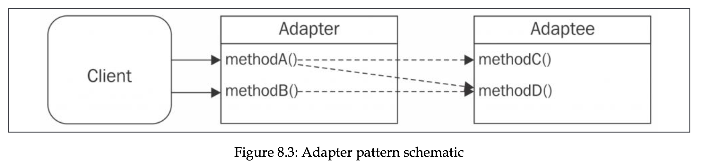

# NodeJS design patterns


My notes and takeaways from the NodeJS Design Patterns book by Mario Casciaro and Luciano Mammino. See the [book](https://www.nodejsdesignpatterns.com/) for more details.

## Table of contents

- [The Node.js platform](#the-nodejs-platform)
  - [I/O (Input / Output)](#io-input--output)
  - [Event demultiplexing](#event-demultiplexing)
  - [The reactor pattern](#the-reactor-pattern)
  - [Libuv](#libuv)
  - [Recipe of Node.js](#recipe-of-nodejs)
  - [Native code](#native-code)
- [Module system](#module-system)
  - [CommonJS](#commonjs)
    - [Homemade module system](#homemade-module-system)
    - [Monkey patching](#monkey-patching)
  - [ESModules](#esmodules)
    - [default export notes](#default-export-notes)
    - [async imports](#async-imports)
    - [Modules loading](#modules-loading)
    - [Read-only live binding and live binding](#read-only-live-binding-and-live-binding)
  - [differences](#differences)
- [Callbacks and Events](#callbacks-and-events)
  - [CPS and direct style](#cps-and-direct-style)
  - [guaranteeing asynchronicity with deferred execution](#guaranteeing-asynchronicity-with-deferred-execution)
  - [Propagating errors](#propagating-errors)
  - [Observer pattern](#observer-pattern)
    - [EventEmitter](#eventemitter)
    - [Memory leaks](#memory-leaks)
    - [Antipatterns](#antipatterns)
    - [Combining](#combining)
    - [Exercises for Callbacks and Events](#exercises-for-callbacks-and-events)
- [Asynchronous Control Flow Patterns with Callbacks](#asynchronous-control-flow-patterns-with-callbacks)
  - [The Sequential Iterator pattern](#the-sequential-iterator-pattern)
  - [Parallel execution with callbacks](#parallel-execution-with-callbacks)
  - [Fix race conditions with concurrent tasks](#fix-race-conditions-with-concurrent-tasks)
  - [Limited parallel execution](#limited-parallel-execution)
  - [Exercises](#async-control-flow-patterns-with-callbacks-exercises)
- [Asynchronous Control Flow Patterns with Promises and Async/Await](#asynchronous-control-flow-patterns-with-promises-and-asyncawait)
  - [Promises/A+ and thennables](#promisesa-and-thennables)
  - [The Promise API](#the-promise-api)
  - [Sequential iteration with promises](#pattern-sequential-iteration-with-promises)
  - [Limited parallel execution with promises](#limited-parallel-execution-with-promises)
  - [Async/await](#asyncawait)
  - [Error handling](#error-handling)
  - [Trap when returning](#trap-when-returning)
  - [Sequential execution and iteration](#sequential-execution-and-iteration)
  - [The problem with infinite recursive promise resolution chains](#the-problem-with-infinite-recursive-promise-resolution-chains)
  - [Exercises](#exercises)
- [Coding with streams](#coding-with-streams)
  - [Getting started with streams](#getting-started-with-streams)
  - [Readable](#readable)
  - [Implementing Readable streams](#implementing-readable-streams)
  - [Writable](#writable)
  - [Backpressure](#backpressure)
  - [Implementing Writable streams](#implementing-writable-streams)
  - [Duplex](#duplex)
  - [Transform](#transform)
  - [PassThrough](#passthrough)
  - [Late piping](#late-piping)
  - [Lazy streams](#lazy-streams)
  - [Connecting streams using pipes](#connecting-streams-using-pipes)
  - [Pipes and error handling](#pipes-and-error-handling)
- [Creational design patterns](#creational-design-patterns)
  - [Factory](#factory)
    - [Simple profiler](#simple-profiler)
  - [Builder pattern](#builder-pattern)
  - [Revealing pattern](#revealing-pattern)
    - [Immutable buffer](#immutable-buffer)
  - [Singleton](#singleton-pattern)
  - [Dependency Injection](#dependency-injection)
  - [Inversion of control](#inversion-of-control)
  - [Exercises for patterns](#exercises-for-patterns)
- [Structural design patterns](#structural-design-patterns)
  - [Proxy, surrogate](#proxy-surrogate)
    - [Object composition](#object-composition)
    - [Object augmentation, monkey patching](#object-augmentation-monkey-patching)
    - [Built in proxy object](#built-in-proxy-object)
  - [Decorator](#decorator)
    - [Difference from Proxy](#difference-from-proxy)
  - [Adapter](#adepter)
  - [Structural design patterns conclusion](#structural-design-patterns-conclusion)
  - [Structural design patterns exercises](#structural-design-patterns-exercises)
- [Behavioral design patterns](#behavioral-design-patterns)
  - [Strategy](#strategy)
  - [State](#state)
  - [Template](#template)
  - [Iterator](#iterator)
    - [Iterable protocol](#iterable-protocol)
    - [Generators](#generators)
    - [Async iterators](#async-iterators)
    - [Async generators](#async-generators)
    - [Async iterators and Node.JS streams](#async-iterators-and-nodejs-streams)
    - [In the wild](#in-the-wild)
  - [Middleware](#middleware)
  - [Command](#command)
  - [Exercises](#exercises-for-behavioral-design-patterns)

## Creational design patterns

A design pattern is reusable solution to a recurring problem. It’s often associated with well-known set of object-oriented patterns that were popularized in the 90s by book _Design Patterns: Elements of Reusable Object-Oriented Software_, _Pearson Education._

Applying these design patterns in JavaScript is not simple. As we know JS is object-oriented, prototype-based, and with dynamic typing. These characteristics give JS a lot of power, but also enough freedom to create fragmentation of design patterns. Easy example is libraries and frameworks in ecosystem. This way there are also there are patterns that can be implemented in JS, which are not relevant in other languages.

### Factory

Factory pattern has ability of _separating the creation of an object from its implementation_, it allows us for ex to create an object whose class is determined at runtime. Factory allows us to expose a small surface area, so consumer doesn’t extend or manipulate it. It also allow us to force encapsulation with closures.

```jsx
const image = new Image("photo.jpeg");

// can be converted to:
function createImage(name) {
  return new Image(name);
}

// Why? Let's consider when we want to split Image class into multiple classses,
// depending on extension. With factory pattern, it's piece of cake.

function createImage(name) {
  if (name.match(/\.jpe?g$/)) {
    return new ImageJpeg(name);
  } else if (name.match(/\.gif$/)) {
    return new ImageGif(name);
  } else if (name.match(/\.png$/)) {
    return new ImagePng(name);
  } else {
    throw new Error("Unsupported format");
  }
}
```

We can enforce encapsulation by:

- Function scopes and closures

  ```jsx
  function createPerson(name) {
    const privateProperties = {};
    const person = {
      setName(name) {
        if (!name) {
          throw new Error("A person must have a name");
        }
        privateProperties.name = name;
      },
      getName() {
        return privateProperties.name;
      },
    };
    person.setName(name);
    return person;
  }
  ```

- Private fields

  ```jsx
  class Tree {
    #apple = "apple";

    getApple() {
      return this.#apple;
    }
  }
  ```

- Symbols
  [Explained here](https://2ality.com/2016/01/private-data-classes.html#using-symbols-as-keys-for-private-properties)

#### Simple profiler

Let's say we have a profiler class that logs start and end time:

```jsx
class Profiler {
  constructor(label) {
    this.label = label;
    this.lastTime = null;
  }
  start() {
    this.lastTime = process.hrtime();
  }
  end() {
    const diff = process.hrtime(this.lastTime);
    console.log(
      `Timer "${this.label}" took ${diff[0]} seconds ` +
        `and ${diff[1]} nanoseconds.`
    );
  }
}
```

If we wanted it to log only in development mode, we would have to include this logic inside this class, or in the client side when we invoke it with new keyword.

Factory function offers better solution:

```jsx
const noopProfiler = {
  start() {},
  end() {},
};

function createProfiler(label) {
  if (process.env.NODE_ENV === "production") {
    return noopProfiler;
  }

  return new Profiler(label);
}
```

### Builder pattern

Builder pattern is creational pattern that simplifies creation of complex object or invocation of complex functions (takes many arguments).

Simple example is when we have Boat class, we have to pass many arguments there:

```jsx
class Boat {
  constructor(allParameters) {
    // ...
  }
}
const myBoat = new Boat({
  hasMotor: true,
  motorCount: 2,
  motorBrand: "Best Motor Co. ",
  motorModel: "OM123",
  hasSails: true,
  sailsCount: 1,
  sailsMaterial: "fabric",
  sailsColor: "white",
  hullColor: "blue",
  hasCabin: false,
});
```

Builder pattern simplifies it by creating object step by step. Also builder pattern is self-documenting. In our Boat class, if we pass hasMotor, we are not aware that we also need to pass other params related to motor, in which case documentation or even the code of class has to be read. Let’s see how builder pattern solves it:

```jsx
class BoatBuilder {
  withMotor(count, brand, model) {
    this.hasMotor = true;
    this.motorCount = count;
    this.motorBrand = brand;
    this.motorModel = model;
    return this;
  }
  withSails(count, material, color) {
    this.hasSails = true;
    this.sailsCount = count;
    this.sailsMaterial = material;
    this.sailsColor = color;
    return this;
  }
  hullColor(color) {
    this.hullColor = color;
    return this;
  }
  withCabin() {
    this.hasCabin = true;
    return this;
  }
  build() {
    return new Boat({
      hasMotor: this.hasMotor,
      motorCount: this.motorCount,
      motorBrand: this.motorBrand,
      motorModel: this.motorModel,
      hasSails: this.hasSails,
      sailsCount: this.sailsCount,
      sailsMaterial: this.sailsMaterial,
      sailsColor: this.sailsColor,
      hullColor: this.hullColor,
      hasCabin: this.hasCabin,
    });
  }
}

const myBoat = new BoatBuilder()
  .withMotor(2, "Best Motor Co. ", "OM123")
  .withSails(1, "fabric", "white")
  .withCabin()
  .hullColor("blue")
  .build();
```

So the rules for implementing Builder pattern are:

1. Break down complex construction into small and more readable steps.
2. Try to create builder methods that can set multiple related params at once.
3. Implicitly set params based on values of input, try to encapsulate param setting logic into setter methods so consumer doesn’t have to do so.
4. If necessary, it’s possible to further manipulate params, for example validating.

In JavaScript builder pattern is not limited to objects creation, it can also be used for functions invocations. But the difference is we have `invoke()` method, not `build()`.

### Revealing pattern

The revealing constructor pattern is the pattern that is originated from the NodeJS community, and is not used or popular in other languages. It lets us to reveal some functionalities of an object only at creation time. It’s useful when we want an object internals to be manipulated only at creation time. Benefits:

1. Creating objects that can be modified only at creation time
2. Creating objects whose custom behavior can be defined only at creation time
3. Creating objects that can be initialized only once at creation time

Skeleton for the pattern looks like the following:

```jsx
const object = new SomeClass((revealedMembers) => {
  // manipulation code
});

// where revealed members are private members that are
// accessible at creation time.
```

#### Immutable buffer

Following example is example of immutable buffer, which exposes only properties and methods that don’t mutate the buffer. Buffer can be mutated only at construction, creation time.

```jsx
const MODIFIER_NAMES = ["write", "fill", "swap"];

export class ImmutableBuffer {
  constructor(size, executor) {
    const buffer = Buffer.alloc(size);
    const modifiers = {};

    for (const prop in buffer) {
      if (typeof buffer[prop] !== "function") {
        continue;
      }

      if (MODIFIER_NAMES.some((name) => prop.startsWith(name))) {
        modifiers[prop] = buffer[prop].bind(buffer);
      } else {
        this[prop] = buffer[prop].bind(buffer);
      }
    }

    executor(modifiers);
  }
}

const buffer = new ImmutableBuffer(16, ({ fill }) => {
  fill("okay");
});

console.log(buffer.toString()); // okayokayokayokay

// this raises error: buffer.write();
```

Other example is Promise class. It accepts resolve and reject callbacks to mutate internal state, and once created, state of promise cannot be altered. All we can do it receive fulfillment or rejection reason.

### Singleton pattern

Singleton pattern is popular in OOP. It allows us to create only one instance of an object, and centralize its access. It shares stateful info, optimizes resource usage, and synchronize access to resource. For example Database class. It doesn’t make sense to create new DB instance for every request, one instance can keep pool of db connections, and it may share stateful info. So we need only one such class across application.

```jsx
export class Database {
  constructor(dbName, connectionDetails) {
    // ...
  }
  // ...
}
```

In Node.JS its implementation is very simple.

```jsx
export const dbInstance = new Database("my-app-db", {
  url: "localhost:5432",
  username: "user",
  password: "password",
});
```

By doing this we export only one instance from the module, and consumers are left to only consume from this instance. As we know from module resolution chapter, Node.JS will cache the module, making sure not to execute its code at every import.

But there is caveat. The module is cached using its full path as a lookup key, meaning it’s guaranteed to be singleton ONLY in current package. If we have two packages in our application that imports our package (mydb package for example), it’s not singleton anymore, and if we compare the instances taken from these 2 packages, they are different. This case is rare, but it is possible.

```jsx
// mydb
export dbInstance = new Database();

// package-a , package-b
import { dbInstance } from "mydb";
export function getDbInstance() {
  return dbInstance;
}

// our program
import { getDbInstance as getDbFromA } from "package-a";
import { getDbInstance as getDbFromB } from "package-b";
const isSame = getDbFromA() === getDbFromB();
console.log(
  "Is the db instance in package-a the same " +
    `as package-b? ${isSame ? "YES" : "NO"}`
);

// NO
```

If two packages in node_modules folder share a package that is NOT compatible between each other, package manager like npm downloads two different versions to fix the error. If they share package that IS compatible between each other (for example ^2.0.1 and ^2.0.7), package manager would install it into the top-level node_modules directory (this practice is called dependency hoisting).

```jsx
global.dbInstance = new Database("my-app-db", {
  /*...*/
});
```

> However, most of the time we don’t need pure singleton, or our code is not for public package. We usually create and import singletons within the main package of an application or, at worst, in a subcomponent of the application that has been modularized into a dependency.

### Dependency injection

Dependency injection is pattern where dependencies of a component are provided as input by external entity, ofter referred as injector. Injector initializes components and ties their dependencies together. It improves decoupling, and dependent module can use any compatible dependency, and module can be used in many contexts differently with minimum effort.

Injector is responsible for creating actual instance that implements interface compatible with the dependency of service.


Rewritten Blog class now looks like the following. It is identical, but now db is not imported from another module, and instead expects a dependency. Injector, in this case client component that uses Blog class, should provide db as a dependency. It can be any class that implements [db.run](http://db.run) and db.all methods (referred as a duck typing).

```jsx
// blog.js

class Blog {
  constructor(db) {
    this.db = db;
    this.dbRun = promisify(db.run.bind(db));
    this.dbAll = promisify(db.all.bind(db));
  }
  // ... methods, which reference db as this.db
}

// db.js
// we can also refactor db module to be more reusable with factory

import sqlite3 from "sqlite3";
export function createDb(dbFile) {
  return new sqlite3.Database(dbFile);
}

// main.js

const db = createDb(/* filepath */);
const blog = new Blog(db);
// ...
```

Now Blog class is totally decoupled from db module, making it more composable and easy to test in isolation.

Dependency injection comes with its own price. Although we decoupled the modules, it may make it harder to understand the dependencies of a module in large projects. Also, we can see that db should have been instantiated before passing to Blog class. This means that we should manually build dependency graph of the application by hand, making everything in the right order.

> What we saw in this example is known as constructor injection. But dependencies can also be passed when invoking functions (function injection) or assigning relevant property of an object (property injection).

### Inversion of control

Inversion of control lets us to shift responsibility of wiring the modules of an application to third party entity. It can be service locator (component that can retrieve a dependency), or dependency injection container (system that injects the dependencies into component based on some metadata in code or config file).

- Example with service locator
  Service locator decides how to wire the dependencies, and consumer doesn’t instantiate them directly. This makes dependencies management more configurable. Consumers of service locator don’t register or manage services, but rather retrieve them.

  ```jsx
  class ServiceLocator {
    constructor() {
      this.services = new Map();
    }

    register(name, instance) {
      this.services.set(name, instance);
    }

    get(name) {
      if (!this.services.has(name)) {
        throw new Error("No such service");
      }

      return this.services.get(name);
    }
  }

  class Logger {
    log(message) {
      console.log(`Log: ${message}`);
    }
  }

  class Database {
    query(sql) {
      console.log(`Executing SQL: ${sql}`);
    }
  }

  // Register services
  const serviceLocator = new ServiceLocator();
  serviceLocator.register("logger", new Logger());
  serviceLocator.register("database", new Database());

  export default { serviceLocator };
  ```

- Example with dependency injection container

Following example uses awilix library to create container.

```jsx
import { createContainer, asClass } from "awilix";

class Database {
  query(sql) {
    console.log(`Executing query: ${sql}`);
  }
}

class UserService {
  constructor({ db }) {
    this.db = db;
  }

  getUser(id) {
    return this.db.query(`SELECT * FROM users WHERE id = ${id}`);
  }
}

const container = createContainer();

// Register services and components
container.register({
  db: asClass(Database).singleton(),
  userService: asClass(UserService),
});

// Resolve the UserService with its dependencies injected.
// In this step dependencies are already injected, because awilix
// look for the keys in constructor of userService, and maps
// dependencies to components passed to it.
const userService = container.resolve("userService");
userService.getUser(1);
```

### Exercises for patterns

- Console log factory

  Create a class called ColorConsole that has just one empty method called log(). Then, create three subclasses: RedConsole, BlueConsole, and GreenConsole. The log() method of every ColorConsole subclass will accept a string as input and will print that string to the console using the color that gives the name to the class. Then, create a factory function that takes color as input, such as 'red', and returns the related ColorConsole subclass. Finally, write a small command-line script to try the new console color factory. You can use this Stack Overflow answer as a reference for using colors in the console: nodejsdp.link/console-colors.

  ```jsx
  class ColorConsole {
    log(_message) {
      throw new Error("method log must be implemented in subclass");
    }
  }

  class RedConsole extends ColorConsole {
    // overriding parent class method
    log(message) {
      console.log("\x1b[31m", message);
    }
  }

  class BlueConsole extends ColorConsole {
    log(message) {
      console.log("\x1b[34m", message);
    }
  }

  class GreenConsole extends ColorConsole {
    log(message) {
      console.log("\x1b[32m", message);
    }
  }

  function createColorfulConsole(color) {
    if (color === "red") {
      return new RedConsole();
    } else if (color === "blue") {
      return new BlueConsole();
    } else if (color === "green") {
      return new GreenConsole();
    }

    throw new Error("Available colors are red, blur and green");
  }

  const specifiedColor = process.argv[2];
  const textToPrint = process.argv[3];
  const colorfulConsole = createColorfulConsole(specifiedColor);

  colorfulConsole.log(textToPrint);
  ```

- Request builder
  Create your own Builder class around the built-in http.request() function. The builder must be able to provide at least basic facilities to specify the HTTP method, the URL, the query component of the URL, the header parameters, and the eventual body data to be sent. To send the request, provide an invoke() method that returns a Promise for the invocation.

  ```jsx
  import http from "http";

  class HttpRequestBuilder {
    constructor() {
      this.method = "GET";
      this.url = "";
      this.queryParams = {};
      this.headers = {};
      this.body = null;
    }

    setMethod(method) {
      this.method = method.toUpperCase();
      return this;
    }

    setUrl(url) {
      this.url = url;
      return this;
    }

    setQueryParams(params) {
      this.queryParams = params;
      return this;
    }

    setHeaders(headers) {
      this.headers = headers;
      return this;
    }

    setBody(body) {
      this.body = body;
      return this;
    }

    _buildFullUrl() {
      const urlObj = new URL(this.url);
      for (const [key, value] of Object.entries(this.queryParams)) {
        urlObj.searchParams.append(key, value);
      }
      return urlObj.toString();
    }

    invoke() {
      return new Promise((resolve, reject) => {
        const fullUrl = this._buildFullUrl();
        const urlObj = new URL(fullUrl);

        const options = {
          hostname: urlObj.hostname,
          port: urlObj.port,
          path: urlObj.pathname + urlObj.search,
          method: this.method,
          headers: this.headers,
        };

        const req = http.request(options, (res) => {
          let responseData = "";

          res.on("data", (chunk) => {
            responseData += chunk;
          });

          res.on("end", () => {
            resolve({
              statusCode: res.statusCode,
              headers: res.headers,
              body: responseData,
            });
          });
        });

        req.on("error", (error) => {
          reject(error);
        });

        if (this.body) {
          req.write(this.body);
        }

        req.end();
      });
    }
  }
  ```

- A tamper-free queue

  Create a Queue class that has only one publicly accessible method called dequeue(). Such a method returns a Promise that resolves with a new element extracted from an internal queue data structure. If the queue is empty, then the Promise will resolve when a new item is added. The Queue class must also have a revealing constructor that provides a function called enqueue() to the executor that pushes a new element to the end of the internal queue. The enqueue() function can be invoked asynchronously and it must also take care of "unblocking" any eventual Promise returned by the dequeue() method. To try out the Queue class, you could build a small HTTP server into the executor function. Such a server would receive messages or tasks from a client and would push them into the queue. A loop would then consume all those messages using the dequeue() method.

  ```jsx
  class Queue {
    queue = [];
    resolvers = [];

    constructor(executor) {
      const enqueue = (item) => {
        if (this.resolvers.length > 0) {
          this.resolvers.pop()(item);
        } else {
          this.queue.push(item);
        }
      };

      executor(enqueue);
    }

    dequeue() {
      return new Promise((resolve) => {
        if (this.queue.length === 0) {
          this.resolvers.push(resolve);
        } else {
          resolve(this.queue.shift());
        }
      });
    }
  }
  ```

## Structural design patterns

Structural design patterns focus on providing ways to realize relationships between entities.

### Proxy (surrogate)

A proxy is an object that controls access to another object, called subject. It has same interface as subject, and intercepts all operations meant to be executed on subject, augmenting or complementing its behavior.


Proxy can be used for data validation, security checks, caching, lazy initialization (when subject is expensive, and creating it when it’s really needed), logging (params for example), remote objects (take a remote object and make it appear local).

```jsx
class StackCalculator {
  constructor() {
    this.stack = [];
  }
  putValue(value) {
    this.stack.push(value);
  }
  getValue() {
    return this.stack.pop();
  }
  peekValue() {
    return this.stack[this.stack.length - 1];
  }
  clear() {
    this.stack = [];
  }
  divide() {
    const divisor = this.getValue();
    const dividend = this.getValue();
    const result = dividend / divisor;
    this.putValue(result);
    return result;
  }
  multiply() {
    const multiplicand = this.getValue();
    const multiplier = this.getValue();
    const result = multiplier * multiplicand;
    this.putValue(result);
    return result;
  }
}
```

As we know, in JavaScript if we divide by zero, we get Infinity. It’s not common for other languages, so lets make behavior same here. Let’s use proxy pattern with stack calculator to make division throw an error if divided by 0.

### Object composition

Following solution uses object composition technique, which is combining object with another object in purpose of extending it or using its functionality. In case of proxy pattern, new object with same interface is created, and reference to subject is stored internally. Subject can be created by proxy itself, or injected by the client.

```jsx
class SafeCalculator {
  constructor(calculator) {
    this.calculator = calculator;
  }
  // proxied method
  divide() {
    // additional validation logic
    const divisor = this.calculator.peekValue();
    if (divisor === 0) {
      throw Error("Division by 0");
    }
    // if valid delegates to the subject
    return this.calculator.divide();
  }
  // delegated methods
  putValue(value) {
    return this.calculator.putValue(value);
  }
  getValue() {
    return this.calculator.getValue();
  }
  peekValue() {
    return this.calculator.peekValue();
  }
  clear() {
    return this.calculator.clear();
  }
  multiply() {
    return this.calculator.multiply();
  }
}

// or with factory

function createSafeCalculator(calculator) {
  return {
    // proxied method
    divide() {
      // additional validation logic
      const divisor = calculator.peekValue();
      if (divisor === 0) {
        throw Error("Division by 0");
      }
      // if valid delegates to the subject
      return calculator.divide();
    },
    // delegated methods
    putValue(value) {
      return calculator.putValue(value);
    },
    getValue() {
      return calculator.getValue();
    },
    peekValue() {
      return calculator.peekValue();
    },
    clear() {
      return calculator.clear();
    },
    multiply() {
      return calculator.multiply();
    },
  };
}
```

As we can see, we delegate many methods to the original methods of the subject. In more complex scenarios, this might lead to a lot of code.

Object properties can be delegated with Object.defineProperty. In our calculator, constructor would look like:

```jsx
constructor(calculator) {
    this.calculator = calculator;
    Object.defineProperty(this, "stack", {
      value: calculator.stack,
    });
  }
```

### Object augmentation (monkey patching)

This technique involves modifying subject directly by replacing method with its proxied implementation.

```jsx
function patchToSafeCalculator(calculator) {
  const divideOrig = calculator.divide;
  calculator.divide = () => {
    // additional validation logic
    const divisor = calculator.peekValue();
    if (divisor === 0) {
      throw Error("Division by 0");
    }
    // if valid delegates to the subject
    return divideOrig.apply(calculator);
  };
  return calculator;
}

const calculator = new StackCalculator();
const safeCalculator = patchToSafeCalculator(calculator);
```

Here we don’t have to delegate all other methods. Simplicity comes with cost. We are mutating the subject directly, which is dangerous. Such technique should be avoided, or used when such component is in private scope, because if it’s shared with other components, this might lead to undesirable side effects. When other components divide by zero, they now have error thrown, not infinity.

### Built-in Proxy object

The ES2015 spec introduced native way to create proxy objects with Proxy constructor that accepts target and handler arguments. Target is the subject, and handler defines behavior of proxy. Handler is an object with predefined methods called traps (for getting, setting, and defining properties), that are called when corresponding operation is performed on proxy instance.

Our safe calculator would look like this with Proxy constructor:

```jsx
const calculator = new StackCalculator();
const safeCalculator = new Proxy(calculator, {
  get: (target, method) => {
    // redefine proxied method
    if (method === "divide") {
      return () => {
        const divisor = target.peekValue();
        if (divisor === 0) {
          throw new Error("Division by 0, Carl");
        }
        // else delegate to original method
        target.divide();
      };
    }

    // delegate other methods
    return target[method];
  },
});
```

This is clearly better than our older solutions.

Proxy constructor comes with many patterns that can be used, for example next example uses it to virtualize an array:

```jsx
const evenNumbers = new Proxy([], {
  get: (_, index) => index * 2,
  has: (_, index) => index % 2 === 0,
  set: (_, _) => "i dont allow you",
});

console.log(2 in evenNumbers); // true
console.log(3 in evenNumbers); // false
console.log(evenNumbers[8]); // 16
console.log((evenNumbers[3] = 3)); // 3
console.log(evenNumbers); // []
```

Other traps include set, delete, and construct, and allows us to create proxies that can be revoked on demand, disable all the traps and restore original behavior.

Downside of Proxy class is that it cannot be transpiled (convert to equivalent with older syntax) or polyfilled (provide implementation in plain JS for where API is not available), because some of the traps can only be implemented at runtime level and cannot be rewritten in another in plain JS.

- Example with stream

  In this example, we are intercepting call to write method. Note that proxiedWritable.end closes original stream, because proxy is not another instance, but the original instance itself.

  ```jsx
  import { createWriteStream } from "fs";

  function createLoggingWritable(writable) {
    return new Proxy(writable, {
      get(target, method) {
        if (method === "write") {
          return (...args) => {
            const [chunk] = args;
            console.log("Writing", chunk);
            target.write(...args);
          };
        }

        return target[method];
      },
    });
  }

  const writable = createWriteStream("test.txt");
  const proxiedWritable = createLoggingWritable(writable);

  proxiedWritable.write("with log hello");
  proxiedWritable.write("with log there");
  writable.write("no log ok");
  proxiedWritable.end();
  ```

- Example with change observer

  Proxy is effective to create observable objects. Observer pattern from chapter 3 is broader term. Here, this pattern allows us to detect property changes.
  Also observables are cornerstone to reactive programming and functional reactive programming.

  ```jsx
  const createObservable = (target, observer) => {
    const observable = new Proxy(target, {
      set(target, key, value) {
        if (value !== target[key]) {
          const prev = target[key];
          target[key] = value;
          observer({ key, prev, curr: value });
        }
        return true;
      },
    });

    return observable;
  };

  function calculateTotal(invoice) {
    return invoice.subtotal - invoice.discount + invoice.tax;
  }
  const invoice = {
    subtotal: 100,
    discount: 10,
    tax: 20,
  };
  let total = calculateTotal(invoice);
  console.log(`Starting total: ${total}`);

  const obsInvoice = createObservable(invoice, ({ key, prev, curr }) => {
    total = calculateTotal(invoice);
    console.log(`TOTAL: ${total} (${key} changed: ${prev} ->
    ${curr})`);
  });

  obsInvoice.subtotal = 200;
  console.log(`Final total: ${total}`);
  ```

In the wild Proxy pattern is implemented in popular projects like LoopBack, Vue.JS v3, MobX and others.

### Decorator

Decorator pattern consists of dynamically augmenting behavior of existing object. Only instances that are explicitly decorated has something modified, not all instances. It looks like Proxy, but instead of augmenting, it adds new functionality. Sometimes, however, it might also augment with extra behaviors.


Following examples use StackCalculator we wrote earlier. Example have same caveats we discussed earlier. Lets add new add method.

- Example with composition
  In this case, decorator is EnhancedCalculator itself, and it needs to add new method.

  ```jsx
  class EnhancedCalculator {
    constructor(calculator) {
      this.calculator = calculator;
    }

    add() {
      const addend2 = this.getValue();
      const addend1 = this.getValue();
      const result = addend1 + addend2;
      this.putValue(result);
      return result;
    }

    // delegated methods
    putValue(value) {
      return this.calculator.putValue(value);
    }

    // ... other delegations
  }
  ```

- Example with object augmentation
  Object augmentation can be achieved by simply attaching new method to decorator object (monkey patching). Function is a decorator.

  ```jsx
  function patchCalculator(calculator) {
    calculator.add = function () {
      const addend2 = calculator.getValue();
      const addend1 = calculator.getValue();
      const result = addend1 + addend2;
      calculator.putValue(result);
      return result;
    };

    return calculator;
  }
  ```

- Example with Proxy object
  It’s also possible to implement object decoration with Proxy object.

  ```jsx
  const enhancedCalculatorHandler = {
    get(target, property) {
      if (property === "add") {
        return () => {
          const addend2 = target.getValue();
          const addend1 = target.getValue();
          const result = addend1 + addend2;
          target.putValue(result);
          return result;
        };
      }

      return target[property];
    },
  };
  ```

- Example with LevelUP
  LevelUP is a Node.js wrapper around Google's LevelDB,a key-value store originally built to implement IndexedDB in the Chrome browser. It’s minimal, extensible, and very fast, provides only minimum functionality. It now supports from in-memory DBs to NoSQL DBs like Redis and web storage engines like indexedDB and localStorage (yes, with same API). Complete DBs are also built on it, like PouchDB or LevelGraph.
  Following example is a plugin for LevelUP, which uses Object augmentation method of decoration.

  ```jsx
  import { Level } from "level";
  import { dirname, join } from "path";
  import { fileURLToPath } from "url";

  const levelSubscribe = (db) => {
    db.subscribe = (pattern, listener) => {
      db.on("put", (key, val) => {
        const match = Object.keys(pattern).every((k) => {
          return pattern[k] === val[k];
        });

        if (match) {
          listener(key, val);
        }
      });
    };
  };

  const __dirname = dirname(fileURLToPath(import.meta.url));
  const dbPath = join(__dirname, "db");
  const db = new Level(dbPath, { valueEncoding: "json" });

  levelSubscribe(db);

  db.subscribe({ doctype: "tweet", language: "en" }, (k, val) =>
    console.log(val)
  );

  db.put("1", {
    doctype: "tweet",
    text: "Hi",
    language: "en",
  }); // logged

  db.put("2", {
    doctype: "company",
    name: "ACME Co.",
  }); // not logger
  ```

Pattern of decorator is widely used, and examples include plugins for LevelUP, Fastify web app framework, json-socket library and many others.

#### Difference from Proxy

These 2 are sometimes interchangeable tools, and even names are used interchangeably sometimes. In JavaScript, where types are dynamic, the differences might be blurry. It is more obvious in statically typed languages.

The decorator pattern is defined as a mechanism that allows us to enhance existing object with new behavior, while Proxy pattern is used to control access to a concrete or virtual object. It doesn’t change the interface. We can pass proxied object to context where it expects original object, but with decorator this doesn’t work (for statically typed languages, of course). Difference is in the way they are used at runtime.

### Adepter

Adapter pattern allows us to access functionality of object using different interface. Simple example is device, that allows us to plug USB type A into USB type C port.

The Adapter pattern is used to take the interface of an object (the **adaptee**) and make it compatible with another interface that is expected by a given client.



- Example with LevelUP
  Let’s make an adapter for LevelUP db. It lets the client to use LevelUP db with interface of fs module (which is originally adapter).

  ```jsx
  import { resolve } from "path";

  export function createFSAdapter(db) {
    return {
      readFile(filename, options, callback) {
        if (typeof options === "function") {
          callback = options;
          options = {};
        } else if (typeof options === "string") {
          options = { encoding: options };
        }
        db.get(
          resolve(filename),
          {
            valueEncoding: options.encoding,
          },
          (err, value) => {
            if (err) {
              if (err.type === "NotFoundError") {
                err = new Error(`ENOENT, open "${filename}"`);
                err.code = "ENOENT";
                err.errno = 34;
                err.path = filename;
              }
              return callback && callback(err);
            }
            callback && callback(null, value);
          }
        );
      },
      writeFile(filename, contents, options, callback) {
        if (typeof options === "function") {
          callback = options;
          options = {};
        } else if (typeof options === "string") {
          options = { encoding: options };
        }
        db.put(
          resolve(filename),
          contents,
          {
            valueEncoding: options.encoding,
          },
          callback
        );
      },
    };
  }
  ```

  This adapter is not perfect and handles well not all situations, but the concept is understandable. We create different interface for the client that uses LevelUP with another interface, interface of fs module. It might look unnecessary, but let’s not forget that LevelDB can be used in both browser (with level-js) and Node.JS thanks to adapters.

### Structural design patterns conclusion

Proxy, Decorator and Adapter are quite similar in implementation, but the difference is in the perspective of consumer. Proxy provides same interface, Decorator provides enhanced interface, and Adapter provides different interface.

### Structural design patterns exercises

- HTTP client cache
  Write a proxy for your favorite HTTP client library that caches the response of a given HTTP request, so that if you make the same request again, the response is immediately returned from the local cache, rather than being fetched from the remote URL

  ```jsx
  const createCacheableFetch = () => {
    const cache = new Map();

    return new Proxy(fetch, {
      apply: async (target, _, args) => {
        const [url, ...rest] = args;

        if (cache.has(url)) {
          console.log("CACHE HIT");
          return cache.get(url);
        }

        console.log("CACHE MISS");
        const response = await target(url, rest);
        cache.set(url, response);
      },
    });
  };
  ```

  Implementation above doesn’t cover pending requests. Usage example is below:

  ```jsx
  const cacheableFetch = createCacheableFetch();

  await cacheableFetch("https://jsonplaceholder.typicode.com/posts/1", {
    method: "GET",
  });

  await cacheableFetch("https://jsonplaceholder.typicode.com/posts/1", {
    method: "GET",
  });

  await cacheableFetch("https://jsonplaceholder.typicode.com/posts/1", {
    method: "GET",
  });

  await cacheableFetch("https://jsonplaceholder.typicode.com/posts/1", {
    method: "GET",
  });

  await cacheableFetch("https://jsonplaceholder.typicode.com/posts/1", {
    method: "GET",
  });
  ```

- Timestamped logs
  Create a proxy for the console object that enhances every logging function (log(), error(), debug(), and info()) by prepending the current timestamp to the message you want to print in the logs. For instance, executing consoleProxy.log('hello') should print something like 2020-02-18T15:59:30.699Z hello in the console.

  ```jsx
  const createTimeConsole = () => {
    return new Proxy(console, {
      get(target, method) {
        const timestamp = new Date();

        return target[method].bind(null, timestamp);
      },
    });
  };

  const timeConsole = createTimeConsole(console);
  timeConsole.log("hello");
  ```

- Colored console output
  Write a decorator for the console that adds the red(message), yellow(message), and green(message) methods. These methods will have to behave like console.log(message) except they will print the message in red, yellow, or green, respectively. In one of the exercises from the previous chapter, we already pointed you to some useful packages to to create colored console output.

  ```jsx
  // with proxy
  const createColorfulConsole = () => {
    return new Proxy(console, {
      get(target, method) {
        if (method === "red") {
          return (message) => console.log("\x1b[31m", message);
        } else if (method === "green") {
          return (message) => console.log("\x1b[32m", message);
        } else if (method === "blue") {
          return (message) => console.log("\x1b[34m", message);
        }

        return target[method];
      },
    });
  };

  const colorfulConsole = createColorfulConsole();
  colorfulConsole.red("red");
  colorfulConsole.green("green");
  colorfulConsole.blue("blue");
  ```

  ```jsx
  // with augmenting
  const augmentConsoleToColorful = () => {
    console.red = (message) => {
      console.log("\x1b[31m", message);
    };

    console.green = (message) => {
      console.log("\x1b[32m", message);
    };

    console.blue = (message) => {
      console.log("\x1b[34m", message);
    };
  };

  augmentConsoleToColorful();
  console.red("red");
  console.blue("blue");
  console.green("green");
  ```

- Virtual filesystem
  Modify our LevelDB filesystem adapter example to write the file data in memory rather than in LevelDB. You can use an object or a Map instance to store the key-value pairs of filenames and the associated data.

  ```jsx
  import { resolve } from "path";

  /**
   * @param {Map} store
   */
  export function createMemoryAdapter(store) {
    return {
      readFile(filename, options, callback) {
        if (typeof options === "function") {
          callback = options;
          options = {};
        } else if (typeof options === "string") {
          options = { encoding: options };
        }

        const key = resolve(filename);

        if (!store.has(key)) {
          const error = new Error(`ENOENT, open "${filename}"`);
          error.code = "ENOENT";
          error.errno = 34;
          error.path = filename;

          return callback && callback(error);
        }

        callback(null, store.get(key));
      },
      writeFile(filename, contents, options, callback) {
        if (typeof options === "function") {
          callback = options;
          options = {};
        } else if (typeof options === "string") {
          options = { encoding: options };
        }

        const key = resolve(filename);
        store.set(key, contents);
      },
    };
  }
  ```

- The lazy buffer
  Can you implement createLazyBuffer(size), a factory function that generates a virtual proxy for a Buffer of the given size? The proxy instance should instantiate a Buffer object (effectively allocating the given amount of memory) only when write() is being invoked for the first time. If no attempt to write into the buffer is made, no Buffer instance should be created.

  ```jsx
  const createLazyBuffer = (size) => {
    let buffer = null;

    return new Proxy(
      {},
      {
        get(_, method) {
          if (method === "write" && !buffer) {
            buffer = Buffer.alloc(size);
          } else if (!buffer) {
            throw new Error("Data should be written to buffer first");
          }

          return buffer[method].bind(buffer);
        },
      }
    );
  };

  const buffer = createLazyBuffer(10);
  buffer.write("hi", "utf-8");
  buffer.write("ok", "utf-8");
  buffer.write("hey", "utf-8");
  console.log(buffer.toString());
  ```

## Behavioral design patterns

In last chapter we learnt about patterns that help us in building complex data structures. Now we will see how to combine these complex components, defining extensible, modular and reusable structures. One member of this family is Observer pattern we learnt in chapter 3.

### Strategy

Strategy pattern enables object, called context, to support variations in its logic by extracting the variable parts into separate, interchangeable objects, called strategies. The context itself implements common logic of algorithms, while strategy implements mutable parts, allowing context to adapt its behavior depending on different factors. All of strategies implement same interface expected by the context.


Simple analogy is a car. We have a car, and its tires are changed based on the weather conditions. We don’t want to change entire car to have different tires, or have one car with all tires inside for just in case.

Real example is Order object, which has pay method. We can have many payment methods, and we fill the method with if else conditions. We can delegate the logic of payment to a strategy objects that implement this logic, each strategy for each payment method. This makes context (Order object) to manage only to manage rest of stuff.

- Another example

  Let’s say we want to have a Config object, that stores config in serialized way, and deserializes when retrieved. Config can be in various formats.

  ```jsx
  // strategies/json.js

  export const jsonStrategy = {
    serialize: JSON.stringify,
    deserialize: JSON.parse,
  };

  // strategies/(other config formats)

  // config.js

  export class Config {
    constructor(formatStrategy) {
      this.data = {};
      this.formatStrategy = formatStrategy;
    }

    get() {
      return this.formatStrategy.deserialize(this.data);
    }

    set(data) {
      this.data = this.formatStrategy.serialize(data);
    }
  }

  // index.js

  const config = new Config(jsonStrategy);
  config.set({ hello: "hi" });
  console.log(config.get());
  ```

  Implementation may differ, but the concept is the same. We could also create separate family for serializers and deserializers.

> Difference between adapter pattern is that, in adapter pattern, adapter doesn’t add any behavior to the adaptee, it just makes available under other interface. In strategy pattern, however, context and strategies implement different parts of the logic, and both are essential to build final algorithm when combined.

In the wild this pattern is used in [passport package](http://nodejsdp.link/passportjs), which provides different authentication schemes. All these schemes are implemented as strategies. Note that [there are 539 strategies](https://www.passportjs.org/packages/). 539 CARL!!!

### State

State pattern is strategy pattern, but in this case strategy is not “hardcoded” in the lifespan of an object. It (strategy, or state in this case) changes dynamically, based on state it’s in.


Simple example is Reservation class. It may be in 3 states: unconfirmed - user can confirm, delete, but not cancel. Confirmed - user can cancel only, and date-approaching - user can do nothing. This is perfect case for state pattern. Changing state to another simply requires activation of another different strategy. This state can be controlled by context object, but its better to let state object itself control it.


- Example program

  Following program is safe version of tcp, which changes its state based on the connection status to the server. We use json-over-tcp-2 to easily transmit json over tcp.

  ```jsx
  // index.js

  import { OfflineState } from "./offlineState.js";
  import { OnlineState } from "./onlineState.js";
  export class FailsafeSocket {
    constructor(options) {
      this.options = options;
      this.queue = [];
      this.currentState = null;
      this.socket = null;
      this.states = {
        offline: new OfflineState(this),
        online: new OnlineState(this),
      };
      this.changeState("offline");
    }
    changeState(state) {
      console.log(`Activating state: ${state}`);
      this.currentState = this.states[state];
      this.currentState.activate();
    }
    send(data) {
      this.currentState.send(data);
    }
  }
  ```

  ```jsx
  // onlineState.js
  export class OnlineState {
    constructor(failsafeSocket) {
      this.failsafeSocket = failsafeSocket;
      this.hasDisconnected = false;
    }
    send(data) {
      this.failsafeSocket.queue.push(data);
      this._safeWrite(data);
    }
    _safeWrite(data) {
      this.failsafeSocket.socket.write(data, (err) => {
        if (!this.hasDisconnected && !err) {
          this.failsafeSocket.queue.shift();
        }
      });
    }
    activate() {
      this.hasDisconnected = false;
      for (const data of this.failsafeSocket.queue) {
        this._safeWrite(data);
      }
      this.failsafeSocket.socket.once("error", () => {
        this.hasDisconnected = true;
        this.failsafeSocket.changeState("offline");
      });
    }
  }
  ```

  ```jsx
  import jsonOverTcp from "json-over-tcp-2";
  export class OfflineState {
    constructor(failsafeSocket) {
      this.failsafeSocket = failsafeSocket;
    }
    send(data) {
      this.failsafeSocket.queue.push(data);
    }
    activate() {
      const retry = () => {
        setTimeout(() => this.activate(), 1000);
      };
      console.log("Trying to connect...");
      this.failsafeSocket.socket = jsonOverTcp.connect(
        this.failsafeSocket.options,
        () => {
          console.log("Connection established");
          this.failsafeSocket.socket.removeListener("error", retry);
          this.failsafeSocket.changeState("online");
        }
      );
      this.failsafeSocket.socket.once("error", retry);
    }
  }
  ```

  Then we activate both server and client codes. Server just listens and logs data received from the client, while client establishes safe socket and writes to it.

  ```jsx
  // server.js

  import jsonOverTcp from "json-over-tcp-2";

  const server = jsonOverTcp.createServer({ port: 5000 });
  server.on("connection", (socket) => {
    socket.on("data", (data) => {
      console.log("Client data", data);
    });
  });

  server.listen(5000, () => console.log("Server started"));
  ```

  ```jsx
  // client.js

  import { FailsafeSocket } from "./index.js";

  const failsafeSocket = new FailsafeSocket({ port: 5000 });

  setInterval(() => {
    failsafeSocket.send(process.memoryUsage());
  }, 1000);
  ```

### Template

Template pattern is like Strategy pattern. It implements skeleton (common parts), while letting other parts to be defined by the class using template, which fill the gaps for template methods (missing parts). The only difference is strategy of consumer is determined when it’s defined, it’s not dynamic like in Strategy pattern, and strategies are not baked in one component.

It’s more of type OOP rather those we considered earlier, because it relies on inheritance.


In JavaScript we don’t have any way to define abstract classes (we do in TypeScript), so only way is to throw runtime Error if method is not redefined.

- Example

  ```jsx
  import { promises as fsPromises } from "fs";
  import objectPath from "object-path";

  export class ConfigTemplate {
    async load(file) {
      console.log(`Deserializing from ${file}`);
      this.data = this._deserialize(await fsPromises.readFile(file, "utf-8"));
    }
    async save(file) {
      console.log(`Serializing to ${file}`);
      await fsPromises.writeFile(file, this._serialize(this.data));
    }
    get(path) {
      return objectPath.get(this.data, path);
    }
    set(path, value) {
      return objectPath.set(this.data, path, value);
    }

    // template methods, need to be redefined.
    _serialize() {
      throw new Error("_serialize() must be implemented");
    }
    _deserialize() {
      throw new Error("_deserialize() must be implemented");
    }
  }

  export class JsonConfig extends ConfigTemplate {
    _deserialize(data) {
      return JSON.parse(data);
    }
    _serialize(data) {
      return JSON.stringify(data, null, "  ");
    }
  }

  const jsonConfig = new JsonConfig();
  ```

In practice this pattern is widely used. For example, when coding with streams, we had to override \_read or \_write methods of abstract Readable or Writable classes. This fit into template pattern.

### Iterator

Iterator pattern is common so that programming langs implement built-in iterators, including javascript. Built-in iterators provide interface to iterate over containers, such as arrays. But iterator pattern provides interface to iterate over any type of a container, and thus hiding details about algorithms used inside. In JavaScript, iterators also work greatly with event emitters and streams. So accurate definition is iterator provide interface to iterate over elements retrieved in a sequence.

In JS, Iterator pattern is implemented through protocols, so shape of interaction between implementer and consumer of the Iterator will agreed in advance. In JS, iterator is protocol that defines interface that produces sequence of values, which basically implement a next() method. Each time this method is called, it returns two properties - `done` (optional, can be undefined) is set to true if iteration is finished, and there is nothing more to iterate, and `value` that includes the retrieved value. If `done` is true, `value` can be set to other arbitrary values, such as iteration total time and others (additional properties will be ignored by built-in APIs consuming iterator).

In fact there are infinite iterators, such as returning next random number, or next number of Fibonacci series, so `done` property can be omitted here.

Some iterators can be stateful, or stateless, depending on situation. In following example we keep state in a closure.

Also iterators can specify two methods, `return([value])` and `throw(error)` . First signals iterator that consumer has stopped iteration before its completion, while second allows consumer to say that error condition occurred. These are also included in TS typings.

- Example

  ```jsx
  const A_CHAR_CODE = 65;
  const Z_CHAR_CODE = 90;

  function createAlphabetIterator() {
    let cursor = A_CHAR_CODE;

    return {
      next() {
        if (cursor > Z_CHAR_CODE) {
          return { done: true };
        }

        const value = String.fromCharCode(cursor);
        cursor++;
        return { value };
      },
    };
  }

  // usage

  const iterator = createAlphabetIterator();

  let iterationResult = iterator.next();
  while (!iterationResult.done) {
    console.log(iterationResult.value);
    iterationResult = iterator.next();
  }
  ```

#### Iterable protocol

Iterable protocol defines a standard way for an object to return an iterator. Such objects are called iterables, usually it’s container of elements, but it can be an object representing set of elements. We can implement iterable by implementing `@@iterator` method, or in other words, a method that is accessible through `Symbol.iterator`.

> `@@name` means well-known symbol according to ES spec, more [here](https://262.ecma-international.org/6.0/#sec-well-known-symbols).

Such `@@iterator` method should return an iterator object, which can be used to iterate over the elements in iterable. Reminder: iterator object coming from `@@iterator` method should have `next()` function specified, as said in protocol.

```jsx
class MyIterable {
  [Symbol.iterator]() {
    return {
      next() {
        // iteration code
      },
    };
  }
}

function myIterable() {
  return {
    [Symbol.iterator]() {
      return {
        next() {
          // iteration code
        },
      };
    },
  };
}
```

Now the cool part, the point of such interfaces is that iterables is native JavaScript interface to iterate over the elements, native APIs are accessible for us. We can use for example `for of` loop to iterate over the elements in iterator, or spread operator, or destructuring. Here are accessible APIs:

1. `Map([iterable])`
2. `WeakMap([iterable])`
3. `Set([iterable])`
4. `WeakSet([iterable])`
5. `Promise.all([iterable])`
6. `Promise.race([iterable])`
7. `Array.from([iterable])`
8. `stream.Readable.from(iterable, [options])`

There are many JS APIs that implement `@@iterable` method, including Array, Map, Set, String and Buffer. Yes, that is mind-blowing, at least for me.

- Example

  ```jsx
  const A_CHAR_CODE = 65;
  const Z_CHAR_CODE = 90;

  function createAlphabetIterator() {
    let cursor = A_CHAR_CODE;

    return {
      [Symbol.iterator]: () => {
        return {
          next() {
            if (cursor > Z_CHAR_CODE) {
              return { done: true };
            }

            const value = String.fromCharCode(cursor);
            cursor++;
            return { value };
          },
        };
      },
    };
  }

  for (const element of createAlphabetIterator()) {
    console.log(element);
  }
  ```

- Example

  ```jsx
  function createCountIterator(limit) {
    let count = 0;

    return {
      [Symbol.iterator]() {
        return {
          next() {
            if (count >= limit) {
              return { done: true };
            }

            count++;
            return { value: count };
          },
        };
      },
    };
  }

  const countIterator = createCountIterator(10);
  console.log(...countIterator);
  ```

#### Generators

Generators (or semicoroutines) were introduced in ES2015 spec, and are closely related to iterators. They are generalization of standard functions, in which they can have different entry points, rather one as in functions, which is invocation of the function. Generators can be suspended and resumed later. Generator object returned by generator function is indeed both an iterator and iterable.

To define it we use syntax `function* name() {}`. Invocation of it will return generator object (both iterable and iterator), and doesn’t execute its body immediately. Invoking `next()` on generator object will start or resume execution of the body until `yield` instruction is invoked, in which case `{ done: false, value: yield value }` is returned. When function body explicitly or implicitly returns, it returns `{ done: true, value: return value }`.

```jsx
function* myGenerator() {
  yield "1";
  yield "2";
  yield "3";
  return "end";
}

const generator = myGenerator();
console.log(generator.next()); // { value: '1', done: false }
console.log(generator.next()); // { value: '2', done: false }
console.log(generator.next()); // { value: '3', done: false }
console.log(generator.next()); // { value: 'end', done: true }
```

Since generator is also iterable, we can iterator over it with `for ... of` loop. But note that return value is not logged, because it’s not yielded, but instead returned, which says that iteration is complete with “end” value.

```jsx
const generator = myGenerator();
for (const element of generator) {
  console.log(element);
}
```

We can also control the generator iterator (we couldn’t in iterators) by passing arguments. Such argument is passed as the return value of the `yield` instruction. When we invoke `generator.next()` for the first time, it stops in the first `yield`, and when invoked second time with argument, generator starts from where it stopped, but this time assigns argument to the variable. In the result, in second time invocation, we get “Hello world”.

```jsx
function* myGenerator() {
  const what = yield null;
  yield `Hello ${what}`;
}

const generator = myGenerator();
generator.next();
console.log(generator.next("World"));
```

There are two extra methods in generator object: `throw()` and `return()`. First throws passed exception as it was thrown in the place of last `yield`, and returns the iterator with `done` and `value` properties. Second forces generator to terminate and return with object like `{ done: true, value: returnArgument }`, where `returnArgument` is value passed to the method.

```jsx
function* myGenerator() {
  try {
    const what = yield null;
    yield `Hello ${what}`;
  } catch (error) {
    // if yield, done is false
    // if return, done is true
    yield `Error: ${error.message}`;
  }
}

const generatorWithError = myGenerator();
generatorWithError.next();
const errorResponse = generatorWithError.throw(new Error("some error"));
console.log(errorResponse); // { value: 'Error: some error', done: true }

const generatorWithReturn = myGenerator();
generatorWithReturn.next();
const res = generatorWithReturn.return("return value");
// return always returns done: true
console.log(res); //{ value: 'return value', done: true }
```

`yield` instruction also accepts iterable, in which case it loop over element of iterable and yield each element one by one. Syntax is `yield* iterable`.

```jsx
function* myGenerator() {
  yield* [1, 2, 3];
}

const generator = myGenerator();
console.log(generator.next()); // { value: 1, done: false }
console.log(generator.next()); // { value: 2, done: false }
console.log(generator.next()); // { value: 3, done: false }
console.log(generator.next()); // { value: undefined, done: true }
```

Because generators are also iterables (object we obtain from the generator function implements `Symbol.iterator` method), we can refactor createAlphabet Iterator function to the following:

```jsx
const A_CHAR_CODE = 65;
const Z_CHAR_CODE = 90;

function* createAlphabetIterator() {
  let cursor = A_CHAR_CODE;

  while (cursor <= Z_CHAR_CODE) {
    const value = String.fromCharCode(cursor);
    cursor++;
    yield value;
  }
}

const iterator = createAlphabetIterator();

for (const element of iterator) {
  console.log(element);
}
```

Because generators are also iterators, they can be used to implement `@@iterator` method of an iterable, so createAlphabetIterator can also be written following. Note that `@@iterator` is now a generator.

```jsx
const A_CHAR_CODE = 65;
const Z_CHAR_CODE = 90;

function createAlphabetIterator() {
  return {
    *[Symbol.iterator]() {
      // we can keep cursor here instead of using closure
      // because in generators state of body is preserved
      let cursor = A_CHAR_CODE;

      while (cursor <= Z_CHAR_CODE) {
        const value = String.fromCharCode(cursor);
        cursor++;
        yield value;
      }
    },
  };
}

const iterator = createAlphabetIterator();

for (const element of iterator) {
  console.log(element);
}
```

#### Async iterators

So far so cool. But imagine a situation when we need to iterate over the list of sql queries, it would be great to return a promise, or even better use `async await`. There is where async iterators come in. They are iterators returning a promise, so this means we can use async function to define `next()` method of the iterator. Async iterables should implement an `@@asyncIterator` method, or in other words, method accessible with `Symbol.asyncIterator` key, which synchronously returns an async iterator (object with async `next()` method).

We can use `for await ... of` syntax to iterate over async iterables, and it’s just syntax sugar over following. In the following we are invoking `@@asyncIterator` method of iterable to get async iterator, and go over the loop ourselves. Note that `for await ... of` loop requires iterable itself, not iterator. Also note that `for await ... of` syntax can also be used with regular iterables.

```jsx
const asyncIterator = iterable[Symbol.asyncIterator]();
let iterationResult = await asyncIterator.next();
while (!iterationResult.done) {
  console.log(iterationResult.value);
  iterationResult = await asyncIterator.next();
}
```

Here is the simple example:

```jsx
const wait = (ms) => {
  return new Promise((resolve) => {
    resolve();
  }, ms);
};

function createCountIterable(count) {
  return {
    [Symbol.asyncIterator]() {
      let cursor = 1;
      return {
        async next() {
          if (cursor > count) {
            cursor++;
            return { done: true };
          }

          await wait(1);
          return { value: cursor++, done: false };
        },
      };
    },
  };
}

const countIterable = createCountIterable(5);
for await (const count of countIterable) {
  console.log(count);
}
```

> The `for await ... of` and `for ... of` loops will call the `return()` method if it’s prematurely interrupted with a break, a return, or an exception. This can be used to perform cleanup, that would usually be performed when the task competes.

#### Async generators

As well as async iterators, generators can also be async. To define it, we prepend `async` keyword to generator function:

```jsx
async function* foo() {}
```

The return value of their `next()` method is Promise that resolves to `{ done: boolean, value: value }`. Async generators can also be used with `for await ... of` loop.

- Example

  ```jsx
  const wait = (ms) => {
    return new Promise((resolve) => {
      resolve();
    }, ms);
  };

  async function* createCountIterable(maxCount) {
    let count = 0;

    while (maxCount > count) {
      await wait(1);
      count++;
      yield count;
    }
  }

  for await (const element of createCountIterable(5)) {
    console.log(element);
  }
  ```

#### Async iterators and Node.JS streams

Streams are also closely related to async iterators. Node.JS streams are indeed async iterators construct, as they can be used to process the data of async resource piece by piece. `stream.Readable` implements `@@asyncIterator` method, so we can iterate over the data pulled.

- Example

  Here split transform stream emits a new chunk when it sees a newline character.

  ```jsx
  import split from "split2";

  async function main() {
    const stream = process.stdin.pipe(split());
    for await (const line of stream) {
      console.log(`You wrote: ${line}`);
    }
  }

  main();
  ```

These paradigms are similar, and can interoperate seamlessly. For example, `stream.Readable.from(iterable, [options])` takes an iterable (can be both async and sync) as an argument, and returns a readable stream that wraps provided iterable, adapting its interface to a readable stream.

We can also iterate EventEmitter itself. With `events.on(emitter, eventName)` we can get async iterable, whose iterator will return all the events matching specified eventName.

- Example

  ```jsx
  import { on, EventEmitter } from "events";

  const emitter = new EventEmitter();

  async function processEvents() {
    for await (const [data] of on(emitter, "data")) {
      console.log(data);
    }
  }

  processEvents();

  emitter.emit("data", "ok1");
  emitter.emit("data", "ok2");
  emitter.emit("data", "ok3");
  ```

#### In the wild

In the wild async iterators are used in popular libraries like `@databases/pg`, `@databases/mysql`, `@databases/sqlite`, and `zeromq`. In fact it’s being widely adopted in Node.JS ecosystem.

### Middleware

Middleware, in generic term, means software layer which acts as a glue between low-level services and applications, literally software in the middle.

In the context of Express.JS, middleware has following signature:

```jsx
function (req, res, next) {};
```

These parameters allow us to parse the body of the request, compress/decompress requests and responses, produce access logs, manage sessions and many others. Middleware allows developers to focus only on business logic with ready requests/response forms.

In general term middleware means a set of processing units, handlers, filters, in a form of functions, which are connected in a pipeline for preprocessing and postprocessing any data. Middleware units can be easily connected and disconnected, allowing flexibility.


Middleware manager organizes and executes middleware functions. Middleware can be added with `use()` keyword (traditionally), usually to the end. When new data comes, next middleware accepts as input the result of prev middleware. Any middleware can choose to stop further processing, and invoke special function or propagate and error, which triggers another set of middleware to run.

### Command

Command is an object that encapsulates all information needed to perform an action at a later time. Instead of directly making an action, we create an object with intention to perform that action. Then another component is responsible to materialize it and perform that action. It consists of 4 components, these components can vary depending on how we want to implement them:

1. Command - an object with all information needed to invoke a method or function.
2. Client - creates command and passes it to invoker.
3. Invoker - responsible for executing the command on the target.
4. Target (receiver) - subject of invocation. Can be lone function or method of object.


Some benefits of command are:

1. Can be executed at a later time.
2. Can be serialized and sent over network to distribute jobs across multiple machines for example.
3. Can be cancelled if not yet executed, and also can be reverted back to state when it’s not executed.
4. Can be grouped together and executed at once.

Command pattern should be used only when necessary, because it adds a lot of overhead. An example is omitted for brevity.

### Exercises for behavioral design patterns

- Logging with strategy

  Implement a logging component having at least the following methods: `debug()`, `info()`, `warn()`, and `error()`. The logging component should also accept a strategy that defines where the log messages are sent. For example, we might have a ConsoleStrategy to send the messages to the console, or a FileStrategy to save the log messages to a file.

  ```jsx
  import fs from "fs";

  class Logger {
    strategy = null;

    constructor(strategy) {
      this.strategy = strategy;
    }

    debug(message) {
      this.strategy.log(`DEBUG: ${message}`);
    }

    info(message) {
      this.strategy.log(`INFO: ${message}`);
    }

    warn(message) {
      this.strategy.log(`WARN: ${message}`);
    }

    error(message) {
      this.strategy.log(`ERROR: ${message}`);
    }
  }

  const fileStrategy = {
    log(message) {
      fs.appendFileSync("./example.txt", `${message}\n`);
    },
  };

  const consoleStrategy = {
    log: console.log,
  };

  const consoleLogger = new Logger(consoleStrategy);
  const fileLogger = new Logger(fileStrategy);

  consoleLogger.warn("Warning");
  fileLogger.debug("Testing");
  ```

- Logging with template

  Implement the same logging component we defined in the previous exercise, but this time using the Template pattern. We would then obtain a ConsoleLogger class to log to the console or FileLogger class to log to a file. Appreciate the differences between the Template and the Strategy approaches.

  ```jsx
  class Logger {
    debug() {
      throw new Error("debug must be implemented");
    }

    info() {
      throw new Error("info must be implemented");
    }

    warn() {
      throw new Error("warn must be implemented");
    }

    error() {
      throw new Error("error must be implemented");
    }
  }

  class ConsoleLogger extends Logger {
    debug(message) {
      console.debug(message);
    }

    info(message) {
      console.info(message);
    }

    warn(message) {
      console.warn(message);
    }

    error(message) {
      console.error(message);
    }
  }

  const consoleLogger = new ConsoleLogger();
  consoleLogger.debug("Debugging");
  ```

- Warehouse item

  Imagine we are working on a warehouse management program. Our next task is to create a class to model a warehouse item and help track it. Such a WarehouseItem class has a constructor, which accepts an id and the initial state of the item (which can be one of arriving, stored, or delivered). It has three public methods:
  • store(locationId) moves the item into the stored state and records the locationId where it's stored.
  • deliver(address) changes the state of the item to delivered, sets the delivery address, and clears the locationId.
  • describe() returns a string representation of the current state of the item (for example, "Item 5821 is on its way to the warehouse," or "Item 3647 is stored in location 1ZH3," or "Item 3452 was delivered to John Smith, 1st Avenue, New York."
  The arriving state can be set only when the object is created as it cannot be transitioned to from the other states. An item can't move back to the arriving state once it's stored or delivered, it cannot be moved back to stored once it's delivered, and it cannot be delivered if it's not stored first. Use the State pattern to implement the WarehouseItem class.

  ```jsx
  class ArrivingState {
    warehouseItem = null;

    constructor(warehouseItem) {
      this.warehouseItem = warehouseItem;
    }

    store(locationId) {
      this.warehouseItem.locationId = locationId;
      this.warehouseItem.changeState("stored");
    }

    deliver() {
      throw new Error("Cannot deliver from arriving state");
    }

    describe() {
      return `Item ${this.warehouseItem.id} is on its way to warehouse`;
    }
  }
  ```

  ```jsx
  class StoredState {
    warehouseItem = null;

    constructor(warehouseItem) {
      this.warehouseItem = warehouseItem;
    }

    store() {
      throw new Error("WarehouseItem is already stored");
    }

    deliver(address) {
      this.warehouseItem.address = address;
      this.warehouseItem.changeState("delivered");
      this.warehouseItem.locationId = null;
    }

    describe() {
      return `Item ${this.warehouseItem.id} is stored in location ${this.warehouseItem.locationId}`;
    }
  }
  ```

  ```jsx
  class DeliveredState {
    warehouseItem = null;

    constructor(warehouseItem) {
      this.warehouseItem = warehouseItem;
    }

    store() {
      throw new Error("Cannot store in delivered state");
    }

    deliver() {
      throw new Error("Already delivered");
    }

    describe() {
      return `Item ${this.warehouseItem.id} was delivered to ${this.warehouseItem.address}`;
    }
  }
  ```

  ```jsx
  class WarehouseItem {
    id = null;
    activeState = null;
    locationId = null;
    address = null;
    states = {
      arriving: new ArrivingState(this),
      stored: new StoredState(this),
      delivered: new DeliveredState(this),
    };

    constructor(id, initialState) {
      this.id = id;
      this.changeState(initialState);
    }

    changeState(state) {
      this.activeState = this.states[state];
    }

    store(locationId) {
      return this.activeState.store(locationId);
    }

    deliver(address) {
      return this.activeState.deliver(address);
    }

    describe() {
      return this.activeState.describe();
    }
  }
  ```

  ```jsx
  // usage
  const warehouseItem = new WarehouseItem("1", "stored");
  warehouseItem.store("Avenue street");
  console.log(warehouseItem.describe());
  ```

- Logging with middleware

  Rewrite the logging component you implemented for exercises 9.1 and 9.2, but this time use the Middleware pattern to postprocess each log message allowing different middlewares to customize how to handle the messages and how to output them. We could, for example, add a serialize() middleware to convert the log messages to a string representation ready to be sent over the wire or saved somewhere. Then, we could add a saveToFile() middleware that saves each message to a file. This exercise should highlight the flexibility and universality of the Middleware pattern.

  ```jsx
  class Logger {
    strategy = null;
    middlewares = [];

    constructor(strategy) {
      this.strategy = strategy;
    }

    postprocess(message) {
      return this.middlewares.reduceRight((acc, curr) => {
        const returnValue = curr(acc);
        if (!returnValue) throw new Error("Middleware must return value");
        return returnValue;
      }, message);
    }

    use(middleware) {
      this.middlewares.unshift(middleware);
    }

    debug(message) {
      this.strategy.log(`DEBUG: ${message}`);
      this.postprocess(message);
    }

    info(message) {
      this.strategy.log(`INFO: ${message}`);
      this.postprocess(message);
    }

    warn(message) {
      this.strategy.log(`WARN: ${message}`);
      this.postprocess(message);
    }

    error(message) {
      this.strategy.log(`ERROR: ${message}`);
      this.postprocess(message);
    }
  }

  const consoleStrategy = {
    log: console.log,
  };

  const serialize = (message) => {
    return {
      message,
      timestamp: new Date(),
    };
  };

  const log = (serializedMessage) => {
    console.dir(serializedMessage, { depth: Infinity });
    return serializedMessage;
  };

  const consoleLogger = new Logger(consoleStrategy);
  consoleLogger.use(serialize);
  consoleLogger.use(log);

  consoleLogger.info("ok");
  ```

- Queues with iterators

  Implement an AsyncQueue class similar to one of the TaskQueue classes we defined in Chapter 5, Asynchronous Control Flow Patterns with Promises and Async/Await, but with a slightly different behavior and interface. Such an AsyncQueue class will have a method called enqueue() to append new items to the queue and then expose an `@@asyncIterable` method, which should provide the ability to process the elements of the queue asynchronously, one at a time (so, with a concurrency of 1). The async iterator returned from AsyncQueue should terminate only after the done() method of AsyncQueue is invoked and only after all items in the queue are consumed. Consider that the `@@asyncIterable` method could be invoked in more than one place, thus returning an additional async iterator, which would allow you to increase the concurrency with which the queue is consumed.

  ```jsx
  class AsyncQueue {
    queue = [];
    isDone = false;

    enqueue(element) {
      this.queue.push(element);
    }

    done() {
      this.isDone = true;
    }

    async *[Symbol.asyncIterator]() {
      if (this.isDone && this.queue.length === 0) {
        return;
      }

      yield this.queue.shift();
    }
  }

  const queue = new AsyncQueue();
  queue.enqueue(1);
  queue.enqueue(2);
  queue.enqueue(3);
  queue.enqueue(4);

  for await (const element of queue) {
    console.log(element);
  }

  for await (const element of queue) {
    console.log(element);
  }

  for await (const element of queue) {
    console.log(element);
  }

  for await (const element of queue) {
    console.log(element);
  }

  queue.done();
  ```
