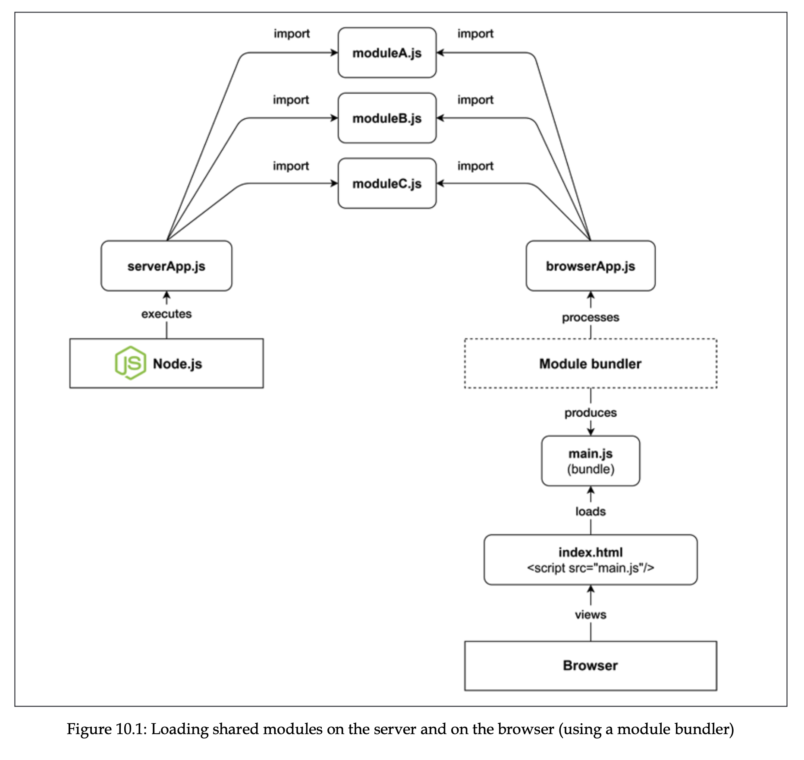
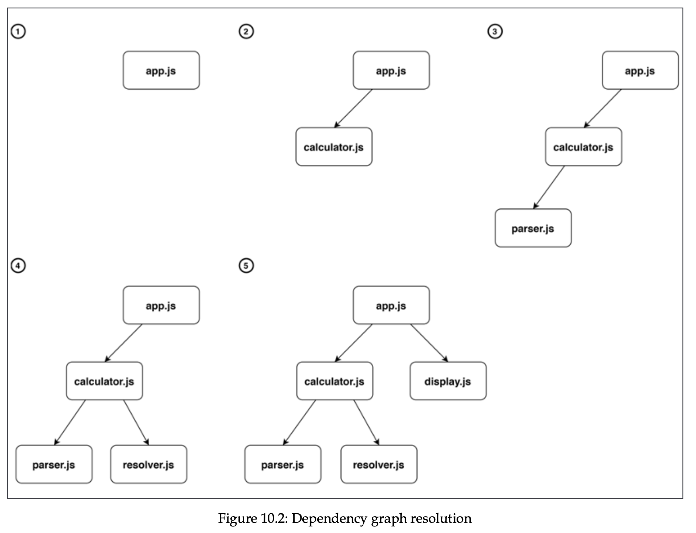

# Universal JavaScript for Web Applications

- [Dependency resolution](#dependency-resolution)
- [Packing](#packing)
- [Runtime code branching](#runtime-code-branching)

These days JS can be used in many applications, starting from the web, servers and ending with drones. These days it’s being very important to share the code between browser and server, making JS universal. You might think that sharing JS engine between browser and server is enough, but it’s not, because different browser users may use older versions of browser with older engines, while it’s ok for server, because we exactly know which Node is running on the server.

While in Node.js files are server from the filesystem, and it’s encouraged to split the code into multiple files for better organization, in browser things work differently. In browser we don’t have `require` keyword to load files, and not all browsers support `import` keyword. Process starts with `index.html` file, where references to js files are given, and browser downloads them. If we have large number of such files, there is perf penalty. This is where bundels come in. It includes collate all source files into minimum number, and reduce number of files to download (1 per page for example). Also supports code minification and other optimizations.



Browser code should go 2 steps before being processes: build and runtime, while for server runtime is only one.

So, bundler takes a file as an entry file and its dependencies, and produces on or more bundle files, that are optimized to run in the browser, we can think of bundler as a compiler for browser. It also allow us to downgrade JS syntax with tools like Babel, and optimize assets such as js, images, or css files. Bundler job can be divided into 2 steps: dependency resolution and packing.

## Dependency resolution

When entry point file is given to the bundler, it starts to scan it, and build dependency graph. When it sees import, it recursively goes inside and wires up the dependencies. In below images, numbers are steps. The same happens with cyclic dependencies.



Bundler may also perform tree shaking, where unused modules don’t appear in dependency graph, and will not be included in the final bundle. More advanced bundlers may also track exported and imported entities, to exclude single entities that are not imported.

Bundler builds a data structure called “modules map” during dependency resolution. It includes unique module identifiers (file path for example) as keys, and representation of source code as values.

```jsx
{
	'app.js': (module, require) => {/* ... */},
	'calculator.js': (module, require) => {/* ... */},
	'display.js': (module, require) => {/* ... */},
	'parser.js': (module, require) => {/* ... */},
	'resolver.js': (module, require) => {/* ... */}
}

// where calculator.js
import { parser } from "parser.js"
import { resolver } from "resolver.js"
export function calculator(expr){
	return resolver(parser(expr))
}

// is turned into
(module, require) => {
  const { parser } = require('parser.js')
  const { resolver } = require('resolver.js')
  module.exports.calculator = function (expr) {
    return resolver(parser(expr))
  }
}
```

Note that ESM syntax is converted to something reminding CJS, in real world scenario, every bundler uses its own unique identifiers (for example webpack uses `_webpack_require_` and `_webpack_exports_`)

## Packing

We already have a modules map, and now what we need to do is convert it to the executable browser can run. This can be done with wrapper function for modules map:

```jsx
((modulesMap) => {
  const require = (name) => {
    const module = { exports: {} };
    modulesMap[name](module, require);
    return module.exports;
  };
  require("app.js");
})({
  "app.js": (module, require) => {},
  "calculator.js": (module, require) => {},
  "display.js": (module, require) => {},
  "parser.js": (module, require) => {},
  "resolver.js": (module, require) => {},
});
```

We declare custom require function, which accepts name of module in the modulesMap, and executes it with newly declared module variable. If the executing module also requires other modules, they will be recursively loaded. After that module exports is returned. Finally we require the entry point for the application so our application is loaded recursively.

## Runtime code branching

Let’s think of library that works in the browser and the server. How we manage this code? Code branching is the way, and one of its technique is runtime code branching. Example:

```jsx
import nunjucks from "nunjucks";
const template = "<h1>Hello <i>{{ name }}</i></h1>";
export function sayHello(name) {
  if (typeof window !== "undefined" && window.document) {
    // client-side code
    return nunjucks.renderString(template, { name });
  }

  // Node.js code
  return `Hello ${name}`;
}
```

This is intuitive, but has negatives: same code is served to both client and server, so unreachable code is included in the bundle. Server code might have api keys or other things that are not meant to be sent to client. Business logic is mixed with branching logic.

Bundlers have no way of guessing these variables, so dynamic imports using variables are not included in the final bundle:

```jsx
moduleList.forEach(function (module) {
  import(module);
});
```

However there are some cases where bundlers can guess and include modules in the bundle, like in the following case (webpack):

```jsx
function getControllerModule(controllerName) {
  return import(`./controller/${controllerName}`);
}
```
