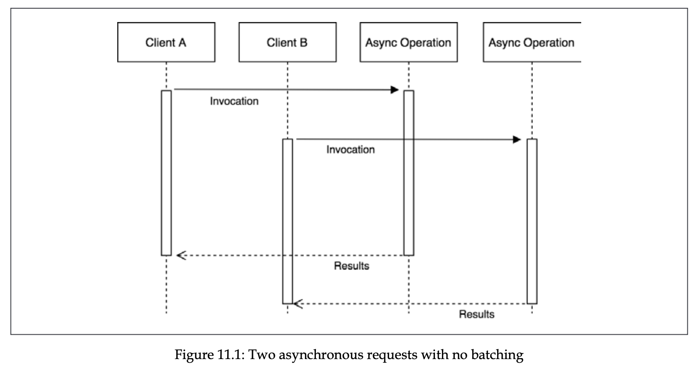
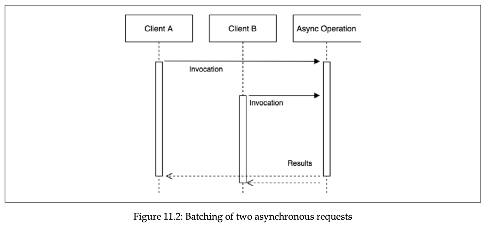
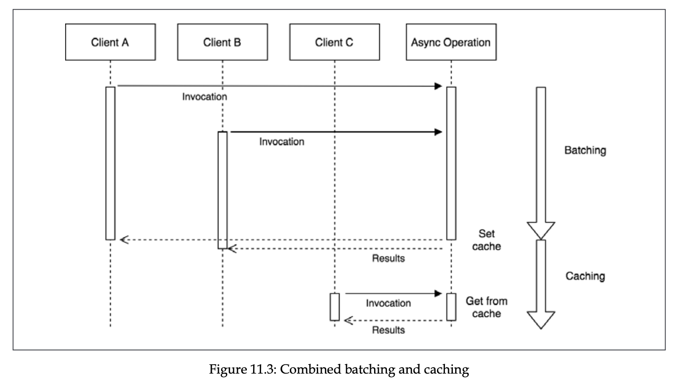

# Advanced recipes

- [Asynchronously initialized components](#asynchronously-initialized-components)
- [Asynchronous request batching and caching](#asynchronous-request-batching-and-caching)
- [Cancelling asynchronous operations](#cancelling-asynchronous-operations)

## Asynchronously initialized components

- Let’s say we have a DB class

  ```jsx
  import EventEmitter from "node:events";

  class DB extends EventEmitter {
    connected = false;

    connect() {
      setTimeout(() => {
        this.connected = true;
        this.emit("connect");
      }, 1000);
    }

    async query(queryString: string) {
      if (!this.connected) {
        throw new Error("Not connected to DB yet");
      }

      console.log("Query executed: ", queryString);
    }
  }

  export const db = new DB();
  ```

Database requires connection before executing any queries, so the startup of the program cannot be synchronous, we need until database client is connected to the database. In this case, there are 2 ways we can follow to execute queries.

- First way is wait until the connection is established before executing any query.
  Another variance is to wait for connected event inside asynchronous method of the component.

  ```jsx
  import { once } from "node:events";
  import { db } from "./db";

  db.connect();

  const getUsers = async () => {
    await once(db, "connected");

    return db.query("GET * from users");
  };

  getUsers();
  ```

- Second way is to delay execution of program until connection is established.
  If there are multiple async component, we might need to wait a long time before executing our program. And it might separate the code dependent on async component from non-dependent ones, making our code ugly.

  ```jsx
  import { once } from "node:events";
  import { db } from "./db";

  db.connect();

  once(db, "connected").then(() => {
    db.query("GET * from users");

    // ... rest of program
  });
  ```

The better approach is to use pre-initialization queues with Command pattern.

In this approach we delay the execution of queries, and execute them once connection is established.

- This MIGHT (and might not) be better than listening for connected event inside query method
  Because it might create a lot of listeners for the same event, if many of queries are invoked.

  ```jsx
  import EventEmitter, { once } from "node:events";

  class DB extends EventEmitter {
    connected = false;
    queryQueue: any[] = [];

    async connect() {
      setTimeout(() => {
        this.connected = true;
        this.emit("connect");
      }, 1000);
    }

    async query(queryString: string) {
      if (!this.connected) {
        await once(this, "connected");
      }

      console.log("Query executed: ", queryString);
    }
  }

  export const db = new DB();
  ```

```jsx
import EventEmitter from "node:events";

class DB extends EventEmitter {
  connected = false;
  queryQueue: any[] = [];

  async connect() {
    setTimeout(() => {
      this.connected = true;
      this.emit("connect");
      this.queryQueue.forEach((queryFn) => queryFn());
      this.queryQueue = [];
    }, 1000);
  }

  async query(queryString: string) {
    if (!this.connected) {
      return new Promise((resolve, reject) => {
        const command = () => this.query(queryString).then(resolve, reject);

        this.queryQueue.push(command);
      });
    }

    console.log("Query executed: ", queryString);
  }
}

export const db = new DB();
```

- It’s also possible to further improve our code using State pattern
  We can see that we created class (InitializedState) purely for business logic, free from preinitializing queue boilerplate.

  ```jsx
  import EventEmitter from "node:events";

  const METHODS_REQUIRING_CONNECTION = ["query"];
  const deactivate = Symbol("deactivate");

  class PendingState {
    queryQueue: any[] = [];

    constructor(db: DB) {
      METHODS_REQUIRING_CONNECTION.forEach((method) => {
        this[method] = (...args: any) => {
          return new Promise((resolve, reject) => {
            const command = () => {
              db[method](...args).then(resolve, reject);
            };
            this.queryQueue.push(command);
          });
        };
      });
    }

    [deactivate]() {
      this.queryQueue.forEach((query) => query());
      this.queryQueue = [];
    }
  }

  class InitializedState {
    async query(queryString: string) {
      console.log("Query executed: ", queryString);
    }
  }

  class DB extends EventEmitter {
    state: any = null;
    connected = false;

    constructor() {
      super();
      this.state = new PendingState(this);
    }

    async query(queryString: string) {
      return this.state.query(queryString);
    }

    connect() {
      setTimeout(() => {
        this.connected = true;
        this.emit("connected");

        this.state[deactivate]();
        this.state = new InitializedState();
      }, 1000);
    }
  }
  ```

The approach of pre-initialization queue is used in [Mongoose](https://github.com/Automattic/mongoose/blob/321995d769ff085aa0a4553b2befb012eb2c11c8/lib/drivers/node-mongodb-native/collection.js#L141) and [Pg](https://github.com/brianc/node-postgres/blob/2013d77b28be5a0d563addb1852eb97e9693e452/packages/pg/lib/client.js#L549) packages.

## Asynchronous request batching and caching

Caching is involved in many applications. Consider a case when a request is made to the server, async operation happen. When multiple identical requests are made, async operation executes multiple times.



Request batching refers to appending identical request to clients queue, executing async operation only once, and notify all the clients with the result.



Assuming content doesn’t change so often, request batching might not be effective if async operation is fast, or when clients send request in a long time distance from each other. In such cases, caching comes into scene.

Request batching is effective in high-load applications with slow APIs.

There are many types of caching, but the idea is same. We cache a result, and return it. If multiple identical requests are made, cache is set multiple times. The idea is to batch requests until the cache is set up, set the cache only once, and serve cached result when it’s done. Note to asynchronously return cached result to prevent Zalgo, even if the operation is synchronous.



- The source code with example program utilizing request batching and caching, with load testing and db population scripts
  [ts.zip](./assets/ts.zip)

## Cancelling asynchronous operations

Note that this is not about cancelling promises, it’s about cancelling underlying asynchronous operation. In fact, Promise/A+ spec doesn’t define any way to cancel a promise.
