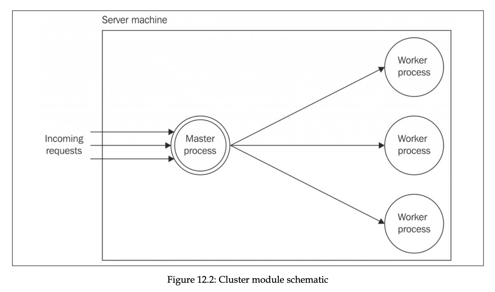
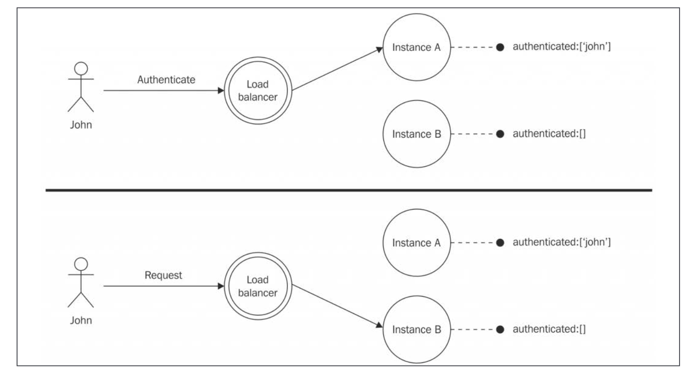
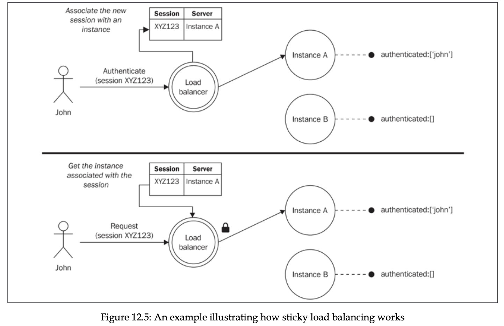
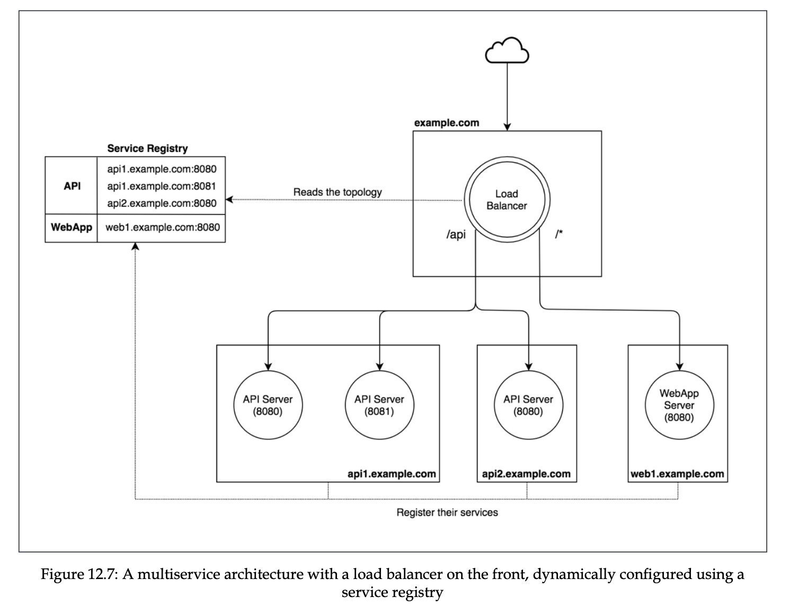

# Chapter 12: Scalability and Architectural Patterns

## Table of contents

- [Cluster](#cluster)
- [Stateful communications](#stateful-communications)
- [Reverse proxy](#reverse-proxy)
- [Dynamic horizontal scaling](#dynamic-horizontal-scaling)
- [Peer-to-peer load balancing](#peer-to-peer-load-balancing)
- [Scaling with containers](#scaling-with-containers)

When JavaScript was created, it was perfect for distributed systems because of its non-blocking behavior. Ranging from a few nodes to thousands, communicating with each other over the network.

NodeJS is single-threaded, so it might not utilize all the capacity of multi-core machine, but this is one side of coin. In reality, scalability doesn’t only refer to increasing capacity of machine and handling more requests faster, but also high availability, and fault-tolerance. Breaking the code in multiple components can also be considered as scalability strategy in terms of development.

Because NodeJS is single-threaded, the only way to scale it is to distribute it over multiple instances and machines. But with this, we also get higher availability and fault tolerance of the application.

When talking about scalability, the first principle is about three dimensions scaling.

1. X dimension - cloning the application. It’s the easiest one. It’s about cloning the application into N processes and machines, and letting each instance handle 1/Nth of the workload.
2. Y dimension - decomposing by functionality, breaking it into multiple components based on functionality. These components are standalone application codebases, possibly with their own databases, functionality, and even UI. For example, having a monolith application, this means breaking it into microservices, each with its set of functionalities. For example, making separate server for auth operations, or making internal product management vs product management for clients.
3. Z dimension - splitting by data partition. This is mostly about databases, also known as horizontal/vertical partitioning. When there is too much data, such database might be limited (disk/memory limit, high I/O), so data partitioning can be used, which would for example separate users database into users with common starting letter of name (range partitioning), or hash of the user (hash partitioning), or country of the user (list partitioning). Each instance of application uses specific database partition.
   Application partitioning can also be done, but there are few use cases for these. For example when using databases that don’t support data partitioning, or making applications at Google scale.
   Z-scaling is very complex, so should be considered only after X and Y axes are fully exploited.

In NodeJS, applications are scaled sooner compared to others, NodeJS is single-threaded. But it’s not disadvantage, because scaling is not only about resources and computing power, but also about fault-tolerance and high availability. Also, this makes NodeJS developers to consider scalability in early stages of development, for example not using process memory, and share common information among the processes (let’s say user session) in database.

## Cluster

Simple pattern in NodeJS for scaling the application is `cluster` native module. It lets us define the master process, and spawn worker processes. Master process distributes the load into the worker processes with Round-Robin algorithm, but a little smarter. It’s default scheduling algorithm in all OSs except Windows. In Windows it should be assigned explicitly.



When we use `cluster` module, `server.listen` from worker process is delegated to the master process. This delegation is simple, but sometimes it might not behave how we might expect:

1. When using specific file descriptor to listen (`server.listen({fd: 14})`). In this case, because file descriptors table differ for each process. When we listen with file descriptor in worker process, the master process doesn’t have same FD number (which is basically index in FD table) mapped to the same file. To overcome this, we can create file descriptor in master and pass to worker. This way worker uses FD which is known for master. (Side note: it’s possible that in worker process, the FD table entry is created, but underlying kernel object is same, though index might differ).
2. `server.listen(handle)` prevents the worker from delegating this to parent.
3. `server.listen(0)` causes server to listen on random port every time. The difference when using master process is first port is random, but next ones are incremented.

- We can create simple http server and make a load balancing with `autocannon` package.
  200 concurrent connections for 10 seconds resulted in average of 350ms.

  ```jsx
  const server = http.createServer((req, res) => {
    for (let i = 0; i < 1e7; i++) {}

    res.end(`Hello from worker: ${pid}`);
  });

  server.listen(8000, () => {
    console.log("Started server with pid", pid);
  });
  ```

- And with `cluster` module.
  200 concurrent connections for 10 seconds resulted in average of 50ms of response time. Mac M3 Pro, 12 cores.
  In this code, when we `cluster.fork`, the same module is re-run as a separate process, but in worker mode, with `cluster.isWorker` set to `true`. Note that separate process has its own event loop, memory, and modules loaded. `cluster.fork` uses `child_process.fork()` under the hood, so it’s possible to communicate with worker process via communication channel.

  ```jsx
  import cluster from "cluster";
  import { cpus } from "os";
  import http from "http";

  const { pid } = process;

  if (cluster.isPrimary) {
    const cpusNumber = cpus().length;

    console.log("Clustering to CPUs:", cpusNumber);

    for (let i = 0; i < cpusNumber; i++) {
      cluster.fork();
    }
  } else {
    const server = http.createServer((req, res) => {
      for (let i = 0; i < 1e7; i++) {}

      res.end(`Hello from worker: ${pid}`);
    });

    server.listen(8000, () => {
      console.log("Started server with pid", pid);
    });
  }
  ```

Consider a case when our application crashes for whatever reason. In this case, if we have just one process serving requests, and some tools like `pm2` to monitor our process and restart in the case of crash, we still have some window gap, where application is not available.

Scalability is also about high-availability. The property of keeping certain level of service even after crashes is known as **resiliency**. It contributes to high-availability.

- We can achieve it with `cluster` module.
  In this case, in the master process we listen for `exit` event from `cluster` module, which is fired when worker exits. By checking certain properties, we can ensure that it exited because of the error. When so, we fork another worker process.
  When making 200 concurrent requests for 10s, there was 34k requests, and only 1k failed. This is 97% availability.

  ```jsx
  import cluster from "cluster";
  import { cpus } from "os";
  import http from "http";

  const { pid } = process;

  if (cluster.isPrimary) {
    cluster.on("exit", (worker, code) => {
      if (code !== 0 && !worker.exitedAfterDisconnect) {
        console.log(
          `Worker with pid ${worker.process.pid} crashed,
           starting a new worker`
        );
        cluster.fork();
      }
    });

    // ...
  } else {
    setTimeout(() => {
      throw new Error("crash");
    }, Math.ceil(Math.random() * 3) * 1000);

    // ...
  }
  ```

Sometimes we want to update our application and deploy to server. In this case, there is still small window gap when our service is not available.

- We can use `cluster` module to make `zero-downtime` restarts.
  In this case, we restart the workers one by one. We first disconnect and wait for exit event, spawn another worker and wait when it starts to listen, and after that start processing next worker.
  With 200 concurrent requests for 10 seconds, the availability of the application was 99.7%

  ```jsx
  import cluster from "cluster";
  import { cpus } from "os";
  import http from "http";
  import { once } from "events";

  const { pid } = process;

  if (cluster.isPrimary) {
    process.on("SIGUSR2", async () => {
      const workers = Object.values(cluster.workers);

      for (let i = 0; i < workers.length; i++) {
        const worker = workers[i];
        console.log(`Stopping worker with pid ${worker.process.pid}`);

        worker.disconnect();
        await once(worker, "exit");

        if (!worker.exitedAfterDisconnect) continue;

        const newWorker = cluster.fork();
        await once(newWorker, "listening");
      }
    });

    // ...
  } else {
    // ...
  }
  ```

## Stateful communications

Consider a case where an application instance stores some information in memory. In this case, there is a state stored in memory. When the request, where a state matters, is made, it can be handled differently depending on which instance of the application handles it, because different instances might have different states.



Sharing a state between instances can be done with a database, or in-memory stores like Redis or Memcached. But this might require significant changes in our application, because we now might rewrite the logic of storing locally with storing in a shared place.

Sharing a state between instances can be done with a database, or in-memory stores like Redis or Memcached. But this might require significant changes in our application, because we now might rewrite the logic of storing locally with storing in a shared place.

It’s also possible to use sticky load balancing. When the request is made, the load balancer associates the session with application instance, and for every subsequent request, it forwards the request to the according application instance. The session is generated by application, or load balancer, and usually attached to the cookies.

Another simpler approach is using hash function that, according to the request IP, generates an ID representing application instance. However, this breaks for devices using different IPs (changing network for example).

Sticky load balancing nullifies the redundancy of the application, where any instance of the application can handle the request the same way, and the stop of one doesn’t affect the result. For this reason, this technique should be avoided.

Sticky load balancing is not natively supported by `cluster` module can be done with `sticky-session` package.



## Reverse proxy

`cluster` module is not an only technique we can use to scale our application. Another option is to use multiple instances of the application running on the same, or different machines, and then use a reverse proxy. Reverse proxy is service or device that forwards the request to the application instances, and return the result as it were a request destination itself. In this case, reverse proxy also acts as a load balancer. The reasons to use this technique:

1. Load balancing can be managed not only with application instances in the same machine, but in multiple machines.
2. The request is forwarded even if the server is written in another language.
3. Most reverse proxies support sticky load balancing out of the box.
4. We can use more complex load balancing algorithms.
5. Many reverse proxies offer additional features, such as URL rewrites, caching, web server (for example serving static files), security features, and others.

Here are reverse proxy options that can be used for load balancing:

1. Nginx. Web server, load balancer, reverse proxy, using non-blocking I/O model..
2. HAProxy. L4 load balancer, for TCP/UDP load balancing.
3. NodeJS. It’s also possible to implement load balancing in NodeJS, though there are pros and cons.
4. Cloud-based proxies. Utilizing load-balancer as a service, with auto-scaling, and dynamic configs support.

- Here is an example with nginx
  After starting the server at some ports with supervisor monitoring (for example node.js based - `forever`, or OS level - `systemd`, or container based - `Docker swarm` or `k8s`), we can start using nginx as a reverse proxy and a load balancer.

  ```jsx
  // nginx.conf

  daemon off;

  error_log /dev/stderr info;

  events {
      worker_connections 2048;
  }

  http {
      upstream nodejs-instance {
          server 127.0.0.1:8081;
          server 127.0.0.1:8082;
          server 127.0.0.1:8083;
          server 127.0.0.1:8084;
      }

      server {
          listen 8080;
          access_log /dev/stdout;

          location / {
              proxy_pass http://nodejs-instance;
          }
      }
  }
  ```

## Dynamic horizontal scaling

Consider a case when we have 5 servers with application instances running. Traffic might not be so much, so probably only 2 servers are enough. Sometimes traffic is too high, so 10 servers are required. Sometimes we might want to scale the application baed on a schedule, for example increasing servers number before peak hours. In this case, load balancer should be aware of the services and its instances, dynamically.

**Service registry** is a central repository, which provides the services and its instances currently available. For this to work, service instance should register itself when available, and unregister itself when not.

In the following example, there are API (with 2 application instances) and WebApp service (with 1 application instance). Load balancer checks the prefix of the request, and routes the request to the corresponding service instance. If more than 1, it load balances between them



- Dynamic load balancing can be achieved with `consul` as a service registry, and `forever` as a supervisor.
  Note that in following implementation we are requesting services list on each request. It’s better to cache it and periodically request it. Also `cluster` module can be used to spin up multiple load balancers.
  Consul agent is started with `consul agent -dev`, load balancer is started with command `forever start load-balancer.js`, and server instances are started with command `forever start --killSignal=SIGINT server.js [serviceName]`. Note that we are using `SIGINT`, because default is `SIGKILL`, which is not catchable, which causes the service not to be removed from the registry.
  With `consul` it’s also possible to setup health checks. If service doesn’t respond to health check, it’s automatically removed from the registry.

  ```jsx
  // server.js
  import http from "http";
  import { nanoid } from "nanoid";
  import portfinder from "portfinder";
  import Consul from "consul";

  const serviceName = process.argv[2];
  const { pid } = process;

  async function main() {
    const id = nanoid();
    const port = await portfinder.getPortPromise();
    const consulClient = new Consul();
    const address = process.env.ADDRESS || "127.0.0.1";

    const registerService = async () => {
      try {
        await consulClient.agent.service.register({
          id,
          address,
          port,
          name: serviceName,
          tags: [serviceName],
        });

        console.log(`Registered ${serviceName} service successfully`);
      } catch (error) {
        console.log(`Registering ${serviceName} service failed`);
      }
    };

    const unregisterService = async (err) => {
      if (err) console.log(err);

      try {
        await consulClient.agent.service.deregister({
          id,
        });

        console.log(`Deregistered service ${serviceName} successfully`);
      } catch (error) {
        console.log(`Deregistering service ${serviceName} failed`);
      }
    };

    process.on("SIGINT", unregisterService);
    process.on("uncaughtException", unregisterService);
    process.on("exit", unregisterService);

    const server = http.createServer((req, res) => {
      let i = 1e7;
      while (i > 0) i--;
      res.end(`Reply from ${serviceName} with pid ${pid}`);
    });

    server.listen(port, async () => {
      await registerService();
      console.log(
        `${serviceName} started listening on port ${port} with pid ${pid}`
      );
    });
  }

  main().catch((err) => {
    if (err) console.error(err);
  });
  ```

  ```jsx
  // load-balancer.js
  import Consul from "consul";
  import http from "http";
  import httpProxy from "http-proxy";

  const PORT = process.argv[2] || 3000;
  const proxy = httpProxy.createProxyServer();
  const { pid } = process;
  const consulClient = new Consul();

  const routing = [
    {
      service: "api-server",
      path: "/api",
      index: 0,
    },
    {
      service: "web-app",
      path: "/",
      index: 0,
    },
  ];

  const server = http.createServer(async (req, res) => {
    const route = routing.find((route) => {
      return req.url.startsWith(route.path);
    });

    if (!route) {
      res.writeHead(404, "Not Found");
      return res.end();
    }

    try {
      const services = await consulClient.agent.service.list();

      const servers = Object.values(services).filter((server) =>
        server.Tags.includes(route.service)
      );

      console.log({ route, services, servers });

      if (!servers.length) {
        res.writeHead(502, "Bad gateway");
        return res.end();
      }

      route.index += 1;
      const serverIndex = route.index % servers.length;
      const server = servers[serverIndex];

      proxy.web(req, res, {
        target: `http://${server.Address}:${server.Port}`,
      });
    } catch (error) {
      console.error(`Error obtaining services`, error);
      res.writeHead(500, "Some error occurred");
      res.end();
    }
  });

  server.listen(PORT, () => {
    console.log(`Server started on port ${PORT} with PID ${pid}`);
  });
  ```

## Peer-to-peer load balancing

We have learnt so far that service A connects to the service B servers through load balancer, which distributes the load across the servers. However, there is an alternative. We can remove load balancer from the picture, and make the service A send requests directly to servers of service B. This requires that service A knows about the servers of service B.

This would include exposing the load balancing algorithm, and other complexity (keeping servers up to date for example) to client (service A in this case) itself.

Advantages include that network infrastructure would be simpler (minus 1 node), faster communications, scales better because it’s not limited to the limits of load balancer.

- Here is example with `consul` as a registry
  Registering services with `server.js` script from earlier, and running simple `http` client with the use of this function makes peer-to-peer load balancing.

  ```jsx
  // balancedRequest
  import { request } from "http";
  import getStream from "get-stream";
  import Consul from "consul";

  const consulClient = new Consul();

  let i = 0;

  export const balancedRequest = async (options) => {
    // assuming we have servers belonging to single server
    const servers = await consulClient.agent.service.list();
    const serversList = Object.values(servers);
    const server = serversList[++i % serversList.length];

    console.log({ serversList, server });

    options.hostname = server.Address;
    options.port = server.Port;

    return new Promise((resolve, reject) => {
      request(options, (response) => {
        resolve(getStream(response));
      }).end();
    });
  };
  ```

## Scaling with containers

Container, specifically Linux container, as standardized by OCI, is a unit of software that packages the code and all its dependencies so it runs quickly and reliably from one computing environment to another. It’s extremely portable, and can execute the program mostly as executed natively on operating system.

We can use containers to run simple node.js application, and delegate availability, load-balancing, elastic scaling (adjusting computer resources based on the traffic) to the container orchestration platforms such as Kubernetes.

There are many tools and ways to create OCI compliant container, the most popular is Docker.

In order to dockerize our application, we need an image. Image is an actual package that confronts to OCI, that defines the code, dependencies, and how the application should be executed. We can create image with `Dockerfile`, which is basically build script for the docker image.

- Example `Dockerfile`

  ```docker
  FROM node:22-alpine

  COPY index.js package.json /app/

  WORKDIR /app/

  EXPOSE 3000

  CMD [ "npm", "start" ]
  ```

  ```jsx
  // index.js

  import http from "http";
  import { hostname } from "os";

  const version = 1;
  const server = http.createServer((req, res) => {
    res.end(`Hello from ${hostname()} of version ${version}`);
  });

  server.listen(3000, () => {
    console.log(`Server listening on 3000`);
  });
  ```
