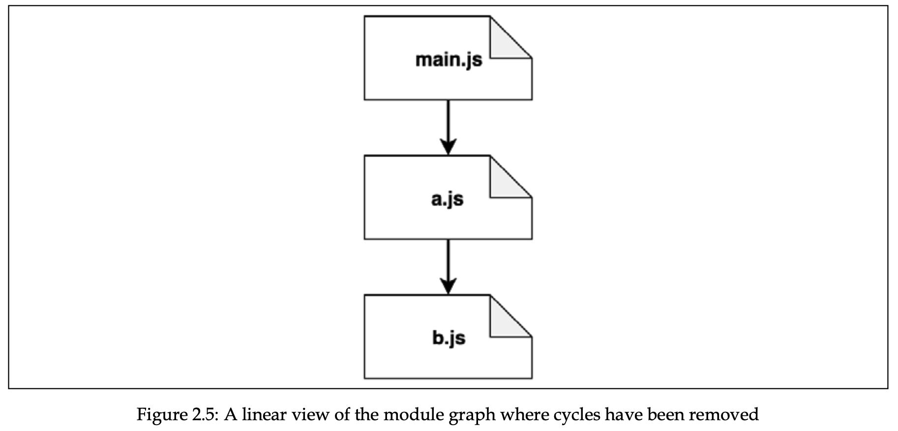
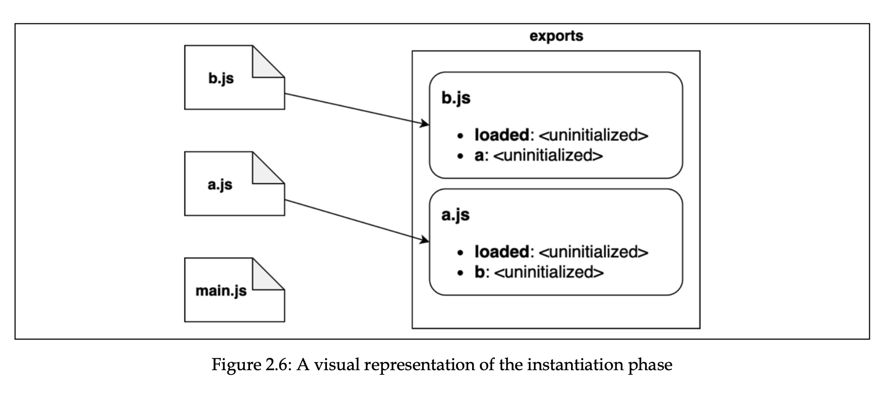
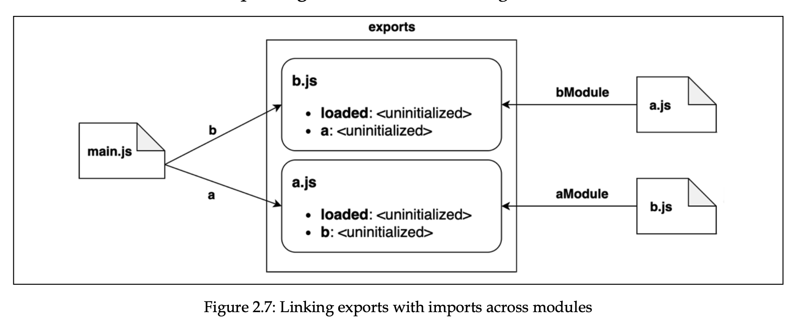

# Chapter 2, Module system

- [CommonJS](#commonjs)
  - [Homemade module system](#homemade-module-system)
  - [Monkey patching](#monkey-patching)
- [ESModules](#esmodules)
  - [default export notes](#default-export-notes)
  - [async imports](#async-imports)
  - [Modules loading](#modules-loading)
  - [Read-only live binding and live binding](#read-only-live-binding-and-live-binding)
- [differences](#differences)

ES6 specification didn’t come with implementation of modules (ESM), so different browsers companies and node.js had to come up with their own implementation according to the spec.

## CommonJS

CommonJS is the original module system for Node.js that provides a way to organize and structure code by dividing it into reusable modules.

### Homemade module system

```js
import fs from "fs";

function loadModule(filename, module, require) {
  const wrapperSrc = `((module, exports, require)=>{
    ${fs.readFileSync(filename, "utf-8")}
  })(module, module.exports, require)`;

  eval(wrapperSrc);
}

function require(filename) {
  const id = require.resolve(filename);
  if (require.cache[id]) {
    return require.cache[id].exports;
  }

  const module = {
    id,
    exports: {},
  };

  loadModule(filename, module, require);

  return module.exports;
}
require.resolve = (filename) => {
  return filename;
};
require.cache = {};
```

Complete resolving algorithm can be found [here](https://nodejs.org/api/modules.html#modules_all_together).

Synchronous nature of `require` function makes it impossible to export asynchronously. Any assignment to `module.exports` must be synchronous. That’s why most Node.js core modules offer synchronous APIs instead of asynchronous.

CommonJS module system has one disadvantage, it can’t solve the problem with circular dependencies, where different module can have different version of its counterpart depending on when it was required.

```js
// module a
module.exports.loaded = false;
const b = require("./b");
module.exports = {
  b,
  loaded: true, // overrides the previous export }
};

// module b
module.exports.loaded = false;
const a = require("./a");
module.exports = {
  a,
  loaded: true,
};

// main.js
const a = require("./a");
const b = require("./b");
console.log("a ->", JSON.stringify(a, null, 2));
console.log("b ->", JSON.stringify(b, null, 2));

/* a = {
  b: {
    a: {
      loaded: false,
    },
    loaded: true,
  },
  loaded: true,
};
b = {
  a: {
    loaded: false,
  },
  loaded: true,
}; */
```

Explanation

1. **`main.js` requires `./a`:**

   - Node checks its module cache for `"./a"` and finds nothing. It starts loading `a.js`.

2. **Inside `a.js`:**

   1. `module.exports.loaded = false;`
      - So far, `module.exports` is `{ loaded: false }`.
   2. `const b = require("./b");`
      - Node checks if `"./b"` is in the cache. It isn’t, so it starts loading `b.js`.

3. **Inside `b.js`:**

   1. `module.exports.loaded = false;`
      - So far, `module.exports` is `{ loaded: false }`.
   2. `const a = require("./a");`
      - Node sees `"./a"` is **in the process** of loading (so it’s partially complete). It returns that partial export of `a`: `{ loaded: false }`.
   3. `module.exports = { a, loaded: true };`

      - Final export for `b` becomes:

      ```js
      {
        a: { loaded: false }, // partial version of a
        loaded: true
      }
      ```

      - `b.js` finishes, and Node caches this export under `"./b"`.

4. **Back to `a.js`:**

   - We resume after `const b = require("./b");`, which at this point is `{ a: { loaded: false }, loaded: true }`.

   1. `module.exports = { b, loaded: true };`

      - Final export for `a` becomes:

      ```js
      {
        b: { a: { loaded: false }, loaded: true },
        loaded: true
      }
      ```

   - `a.js` finishes, and Node caches this export under `"./a"`.

5. **Back to `main.js`:**
   - `const a = require("./a");` now returns the **fully** exported `a`.
   - `const b = require("./b");` returns the cached export of `b`.

### Monkey patching

It’s a practice of modifying existing objects (other modules exports) at runtime to change or extend behaviour, or apply temporary fixes. Monkey patching is considered harmful.

```js
require("./logger").customFunction = () => {
  console.log("monkey");
};
```

## ESModules

ESM were introduced as ECMAScript 2015 spec, with goal to give JS official module system across different environments. It has support for cyclic dependencies, and load modules async. ES modules are static, and cannot be imported conditionally, only at top of the file.

With ESM we **_must_** include extension of the file in the import path, whereas in CJS we could use either `./myModule.js` or `./myModule`

With ESM absolute path must be like `file:///....` and `/...` or `//...` is not supported.

(browser only) With ESM we can load modules from outside, for example `import mdl from "https://mdl.pkg.com"`.

Namespace import can be imported like:

```js
import * as myModule from "./myModule.js";
```

### default export notes

When default exporting, the name of variable or function is ignored, so we can use any name when importing it.

Default export can prevent tree shaking for some cases. For example, when module exports object with properties and methods, even if neither of them were used, most module bundlers think it’s used.

### async imports

Suppose we want to load specific module of language based on which lang pref user has. We can use dynamic imports with `import()` operation. It returns a promise that resolves to the module object.

```js
const translationModule = `./strings-${lang}.js`;
import(translationModule).then((strings) => {
  console.log(strings);
});
```

### Modules loading

The goal of interpreter is to build dependency graph of the modules. It helps interpreter to determine the order in which modules should be loaded. Entry point is passed to interpreter as an entry point, and it recursively starts to explore and evaluate the code.

1. **Phase 1 - Construction.** FInd all imports and recursively load the content of every module from it.
2. **Phase 2 - Instantiation.** For every exported and imported entity, keep reference in memory, but don’t assign any value (because code is not executed yet). Keep tracking of deps relationship between them (linking).
3. **Phase 3 - Evaluation.** All blanks are filled, **c**ode is executed.

In simple terms, phase 1 is finding dots, phase 2 is connecting them, phase 3 is going through paths in the right order.

Difference from CJS is that in cjs the code before `require` is already executed, whereas no code is executed until phase 3 in ESM, this makes exports and imports to be static.

In case of ESM, all modules will have up-to-date imports from other modules, because ESM uses live bindings, and evaluation order ensures every module imports fresh exports from other modules and that dependencies are resolved before execution. Circular deps problem with CJS is now resolved.

- Example
  Let’s say we have 3 modules that have circular dependency.

  ```jsx
  // a.js
  import * as bModule from "./b.js";
  export let loaded = false;
  export const b = bModule;
  loaded = true;

  // b.js
  import * as aModule from "./a.js";
  export let loaded = false;
  export const a = aModule;
  loaded = true;

  // main.js
  import * as a from "./a.js";
  import * as b from "./b.js";
  console.log("a ->", a);
  console.log("b ->", b);
  ```

  Let’s analyze step by step what happens here.

  1. Construction. Code is explored from starting phase, from entry point (index.js), and find all imports load the source code from. Every module is visited only once, and tree structure dependency tree is built. In `main.js` import leads us to `a.js`, from there we go to `b.js` to import source code from it. We see `a.js` import, but because we have already looked it up we don’t go back. Now exploration winds back, b doesn’t have other imports, so we go to a, and there are no more imports, we go back to index. At this point we have dependency graph like this, note that there is no cyclic dependency between a and b.

     

  2. Instantiation. Now, from bottom to up, interpreter starts to analyze modules for exports and build a map of exported names in memory. Interpreter starts from b, which exports `loaded` and `a`. Then it moves to a, which exports `loaded` and `b`. Finally it moves to main, which has no exports. Note that exports map keep track of exported names only, no values are initialized now. Right now exports map looks like this:

     

     After that interpreter does another pass to link the exported names to the modules importing them. So, module b will link exports from `a` referring as `aModule`. Module a will link exports from `b` referring as `bModule`. And finally `main` will link both modules as `a` and `b` respectively. Graph looks like:

     

     1. Evaluation. Again, evaluation starts from bottom to up. Starting from `b`, exported `loaded` is set to false. Then exported property `a` is evaluated to reference of the `a`'s module object, and `loaded` is set to true. Now exports evaluation for module `b` is finished and we move to `a`. We set loaded to false, exported property `b` is evaluted to reference of `b`'s module object, and `loaded` is set to true. Now all exports for `a` is also evaluated, and `main` can be executed. Because all imported modules are tracked as references, we can be sure that every module has up-to-date version of other modules, even with circular deps.

### Read-only live binding and live binding

When entity is imported from other module, it is readonly (read-only live binding) and cannot be mutated directly, whereas it can be mutated in its original module (live binding). We can provide a function as an export to mutate the read-only live binding variables.

```js
// count.js
export let count = 0;
export function increment() {
  count++;
}

// index.js
import { count, increment } from "./count.js";
console.log(count); // 0
increment();
console.log(count); // 1

console.log(++count); // TypeError, assignment to constant variable.
```

We can modify other modules, if they provide default export as an object, we can modify it’s properties and methods.

Object itself is read-only live binding, but its properties are not.

Note that by importing `import * as fs from 'fs'` or `import { someFunc } from 'fs'` gives us read-only live binding.

## differences

ESModules run in strict mode, whereas CommonJS modules do not.

We can import CJS modules in ESM, whereas we cannot import ESM in CJS. We can import CJS in ESM like this:

```tsx
// 1) default import, importing specific exports fails.
import mod from "./mymod.cjs"; // success
import { func } from "./mymod.cjs"; // fails

// 2) we can create our require for ESM:
import { createRequire } from "module";
const require = createRequire(import.meta.url);

// and use it:
const server = require("./server.cjs");
server2.func1();
```

In ESM we don’t have predefined properties, like module, \_\_dirname (absolute path of parent folder), or \_\_filename (absolute path of current file). But we can define them ourselves:

```tsx
import { fileURLToPath } from "url";
import { dirname } from "path";

const __filename = fileURLToPath(import.meta.url);
const __dirname = dirname(__filename);
// import.meta is object with properties for metadata like current url in
// the form of: file:///Users/123/... fileURLToPath transforms it to normal
// absolute path -> /Users/123/...
console.log({ __filename });
```

In ESM, `this` refers to `undefined`, whereas in CJS it’s reference to `exports`.

Also we cannot import JSON in ESM, whereas we can in CJS, but we can use our `require` to do this in ESM:

```tsx
import { createRequire } from "module";
const require = createRequire(import.meta.url);
const json = require("./j.json");
console.log({ json });
```

## Similarities

> If module is imported multiple times in different files, it is executed only once, and subsequent imports use cached version of the module.
