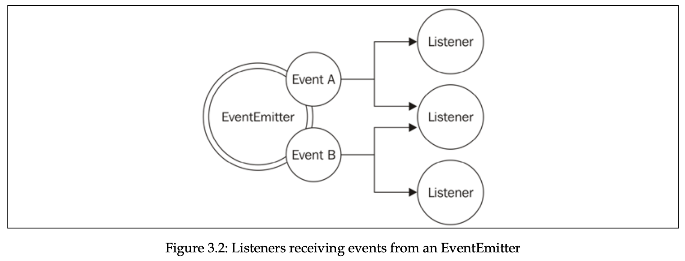

# Chapter 3, Callbacks and Events

- [CPS and direct style](#cps-and-direct-style)
- [guaranteeing asynchronicity with deferred execution](#guaranteeing-asynchronicity-with-deferred-execution)
- [Propagating errors](#propagating-errors)
- [Observer pattern](#observer-pattern)
  - [EventEmitter](#eventemitter)
  - [Memory leaks](#memory-leaks)
  - [Antipatterns](#antipatterns)
  - [Combining](#combining)
- [Exercises for Callbacks and Events](#exercises-for-callbacks-and-events)

## CPS and direct style

Direct style is returning the result of a function to caller, whereas continuation-passing style (CPS) is accepting the callback to invoke when async operation completes.

Always choose a direct style for purely syncronous functions.

Bear in mind that sync API will break Node.js concurrency model, slowing down whole app.

## guaranteeing asynchronicity with deferred execution

Sometimes we might need to turn sync function into async. Suppose we have this synchronous function.

```jsx
import fs from "fs";

const cache = new Map();

function readSync(filename) {
  if (cache.has(filename)) {
    return cache.get(filename);
  }

  const data = fs.readFileSync(filename);
  cache.set(filename, data);
  return data;
}
```

And you want to turn it into asynchronous function. You might think of next implementation, which is incorrect, because first branch runs synchronously, and second one asynchronously. This makes our function unpredictable.

```jsx
function readAsync(filename, callback) {
  if (cache.has(filename)) {
    callback(cache.get(filename));
  } else {
    const data = fs.readFileSync(filename);
    cache.set(filename, data);
    callback(data);
  }
}
```

We can defer execution with `process.nextTick()`, which defers execution of function after currently running operation completes. It pushes the callback to the top of event queue, in front of any pending I/O event, and returns immediately. The callback will be invoked as soon as currently running operation yields control back to the event loop.

```jsx
function readAsync(filename, callback) {
  if (cache.has(filename)) {
    process.nextTick(() => {
      callback(cache.get(filename));
    });
    return;
  }

  const data = fs.readFileSync(filename);
  cache.set(filename, data);
  callback(data);
}
```

There are other ways also to defer the execution of some code like `setImmediate` or `setTimeout(cb, 0)`, and difference between them all is having different running phases in event loop. Note that `process.nextTick()` callback is **microtask**.

## Propagating errors

In synchronous direct style functions, errors are propagated with `throw` keyword, in which errors are propagated in the callstack. Whereas in continuation-passing style (CPS), errors are propagated by passing error to next callback in the chain.

Sometimes we may have CPS async function, and inside callback the error might be thrown. In this case, even if we surround the entire function with `try catch` block, it will not catch our error, because the stack in which the block operates is different from the one in which our callback is invoked. So, the error will go straight to the event loop, where it is caught and thrown to the console.

```tsx
// example on how error is not caught inside catch block and propagated
// to the event loop, crashing the whole app.
try {
  wait(1000).then(() => {
    throw new Error("");
  });
} catch (error) {
  console.log("Error!");
}
```

However in Node.js we can still catch the error with `process.on("uncaughtException")` event. It’s not recommended to let the app continue after such event anyway.

The process of exiting and making some cleanups is called fail-fast approach, and is recommended approach in Node.js

## Observer pattern

The Observer pattern defines an object (called subject) that can notify a set of observers (or listeners) when a change in its state occurs.

Difference from callback pattern is that observer pattern can continuously notify multiple listeners, whereas in callback pattern, only one listener, its callback.

### EventEmitter

Observer pattern is built-in feature in Node.js, and is available with `EventEmitter` class from “events” module.



Following code demonstrates usage example:

```tsx
import { EventEmitter } from "events";
import { readFile } from "fs";

function findRegex(files, regex) {
  const emitter = new EventEmitter();
  for (const file of files) {
    readFile(file, { encoding: "utf-8" }, (err, data) => {
      if (err) {
        return emitter.emit("error", err);
      }
      emitter.emit("fileRead", file);
      const match = data.match(regex);
      if (match) {
        match.forEach((elem) => {
          emitter.emit("found", file, elem);
        });
      }
    });
  }
  return emitter;
}

findRegex(["./package.json", "./index.ts"], /hello/g)
  .on("fileRead", (file) => {
    console.log(`File has been read: ${file.toString()}`);
  })
  .on("error", (error) => {
    console.log(`Error reading a file: ${error.toString()}`);
  })
  .on("found", (file, elem) => {
    console.log(
      `Found in file ${file.toString()} in element ${elem.toString()}`
    );
  });
```

Again, note that we can’t throw errors in callbacks of event emitter events, and what we do in the code above is recommended approach.

There is special event type `error` , and if there is no listener for such event, EventEmitter will automatically throw exception and exit from application.

Event emitter is not commonly used on its own, and is used in following way, by being extended by other class:

```jsx
import { EventEmitter } from "events";
import { readFile } from "fs";
class FindRegex extends EventEmitter {
  constructor(regex) {
    super();
    this.regex = regex;
    this.files = [];
  }
  addFile(file) {
    this.files.push(file);
    return this;
  }
  find() {
    for (const file of this.files) {
      readFile(file, "utf8", (err, content) => {
        if (err) {
          return this.emit("error", err);
        }
        this.emit("fileread", file);
        const match = content.match(this.regex);
        if (match) {
          match.forEach((elem) => this.emit("found", file, elem));
        }
      });
    }
    return this;
  }
}
```

Examples of modules extending from EventEmitter are `http` server, in which EventEmitter is used to produce events such as request, connection, or closed. Another example is Node.js `streams`.

### Memory leaks

One thing to note with observable pattern is that it can cause memory leaks.

If the observables we are subscribing to have a long life span, we have to unsubscribe from them once there is no need, otherwise it’s going to cause memory leaks.

Following code demonstrates an example. Variable `thisTakesMemory` is referenced inside listener, and is not garbage collected until listener is released from emitter, or until emitter is not garbage collected itself.

```jsx
const thisTakesMemory = "A big string....";
const listener = () => {
  console.log(thisTakesMemory);
};
emitter.on("an_event", listener);
```

We can prevent this by releasing the listener with `emitter.removeListener` method. EventEmitter itself warns developer when listeners count are > 10 (by default). Or we can use `emitter.once` to release it after first invokation.

### Antipatterns

It’s generally not recommended to emit the events synchronously. In case if we do, we have to register all the listeners before we launch the task. If we register listener after the task launch, it’ll not be triggered.

If we emit the events asynchronously, we can register the listeners after the task launch, because async tasks are guaranteed not to be executed in the same event loop cycle.

Note that we can delegate the execution of sync task with `process.nextTick` and making it async.

## Combining

There is also a pattern of combining callbacks with events, where callback is passed as argument and used for general use, whereas event emitter is returned from the function and is used for advanced use cases.

For example in `glob` package in nodejs, we can pass a callback, which will have error as first arg, and matched files as second arg. The function returns event emitter, which is used for advanced scenarios, for example attaching a listener for each file match.

## Exercises for Callbacks and Events

- Write a function that accepts a number and a callback as the arguments. The function will return an `EventEmitter` that emits an event called tick every 50 milliseconds until the number of milliseconds is passed from the invocation of the function. The function will also call the callback when the number of milliseconds has passed, providing, as the result, the total count of tick events emitted. recursively.

  ```jsx
  import EventEmitter from "events";

  const exercise = (max, cb) => {
    const eventEmitter = new EventEmitter();

    let msPassed = 0;
    const intervalId = setInterval(() => {
      if (msPassed >= max) {
        clearInterval(intervalId);
        cb(msPassed / 50);
        return;
      }

      eventEmitter.emit("tick");
      msPassed += 50;
    }, 50);

    return eventEmitter;
  };

  const emitter = exercise(1000, (count) => {
    console.log(count);
  });

  emitter.on("tick", () => {
    console.log("tick");
  });
  ```

- Modify the function created in exercise 3.2 so that it emits a tick event immediately after the function is invoked.

  ```tsx
  // add this code after new EventEmitter();
  process.nextTick(() => {
    eventEmitter.emit("tick");
  });

  // this is because if we just use eventEmitter.emit("tick") after
  // declaring eventEmitter variable, at that time there are no listeners
  // attached to event emitter, so callback is not executed.
  ```

- Modify the function created in exercise 3.3 so that it produces an error if the timestamp at the moment of a tick (including the initial one that we added as part of exercise 3.3) is divisible by 5. Propagate the error using both the callback and the event emitter. Hint: use Date.now() to get the timestamp and the remainder (%) operator to check whether the timestamp is divisible by 5.

  ```tsx
  import EventEmitter from "events";

  const exercise = (max, cb) => {
    const eventEmitter = new EventEmitter();
    let error;

    eventEmitter.on("tick", () => {
      const date = Date.now();
      if (date % 5 === 0) {
        error = date;
      }
    });

    eventEmitter.emit("tick");

    let msPassed = 0;
    const intervalId = setInterval(() => {
      if (error) {
        eventEmitter.emit("error", error);
        cb(error, null);
        clearInterval(intervalId);
        return;
      }
      if (msPassed >= max) {
        clearInterval(intervalId);
        cb(null, msPassed / 50);
        return;
      }

      eventEmitter.emit("tick");
      msPassed += 50;
    }, 50);

    return eventEmitter;
  };

  const emitter = exercise(1000, (err, count) => {
    if (err) {
      return console.error(1, err);
    }
    console.log(count);
  });
  emitter.on("error", (error) => {
    console.error(2, error);
  });
  ```
