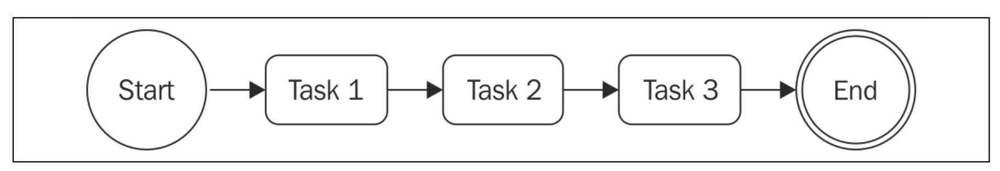
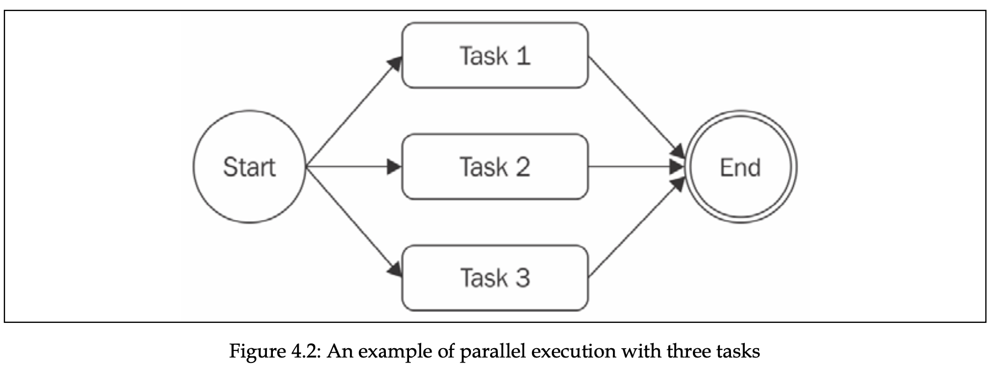
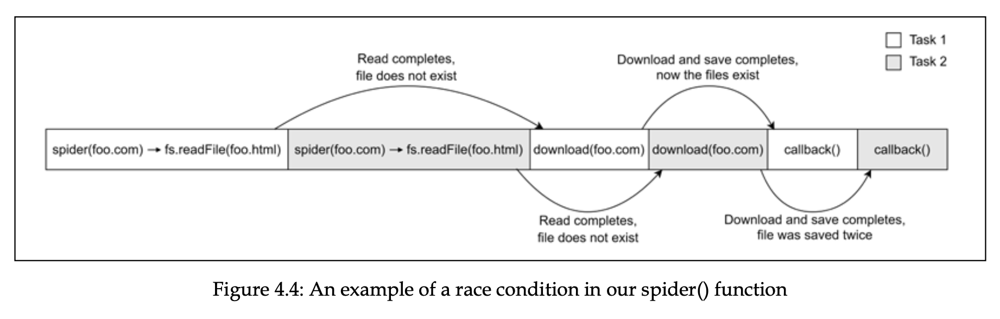
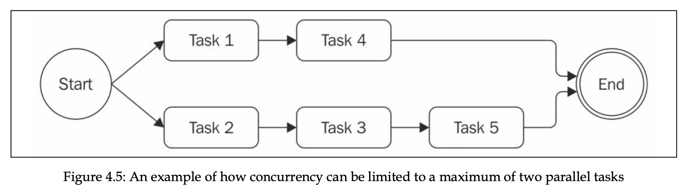

# Chapter 4, Asynchronous Control Flow Patterns with Callbacks

- [The Sequential Iterator pattern](#the-sequential-iterator-pattern)
- [Parallel execution with callbacks](#parallel-execution-with-callbacks)
- [Fix race conditions with concurrent tasks](#fix-race-conditions-with-concurrent-tasks)
- [Limited parallel execution](#limited-parallel-execution)
- [Exercises](#async-control-flow-patterns-with-callbacks-exercises)

The situation where the abundance of closures and in-place callback definitions transforms the code into an unreadable and unmanageable blob is known as **callback hell.**

The most notable negatives of callback hell besides the unclean code, is perfomance bottlenecks and memory leaks. Closures come with a little price in terms of perfomance and memory consumption, and they can create memory leaks, because any context referenced by an active closure will not be garbage collected.

We can refactor callback hell with simple techniques, like early return, and separating common code into their own functions.

## The Sequential Iterator pattern

We can map the values of an array asynchronously. We can pass the result of operation to the next function, making asynchronous version of reduce function. We can even iterate over an infinite number of elements in the array of tasks. But note here that all the tasks must be asynchronous, otherwise we might hit the callstack exceeded error.

This pattern is useful when order of execution of asynchronous operations matters.



Below is my implementation of sequential iterator pattern.

```jsx
function iterator(collection, itemCb, cb) {
  function iterate(index) {
    if (index === collection.length) {
      return cb();
    }

    collection[index](() => {
      itemCb(index);
      iterate(index + 1);
    });
  }

  iterate(0);
}

function wait(ms, cb) {
  return new Promise((resolve) => {
    setTimeout(() => {
      resolve();
      cb();
    }, ms);
  });
}

iterator(
  [
    (cb) => wait(100, cb),
    (cb) => wait(100, cb),
    (cb) => wait(100, cb),
    (cb) => wait(100, cb),
  ],
  console.log,
  console.log
);
```

## Parallel execution with callbacks

In fact word “parallel” is improper here, because, knowing the underlying mechanism of node.js with event loop, we know that these tasks do not run in different threads. The proper way is to say this kind of flow is concurrent, but word parallel is used for simplicity.



In Node.js, synchronous tasks can’t run in parallel, unless the execution of them is not interleaved with setTimeout or similar async APIs.

**The Unlimited Parallel Execution pattern.** Run a set of asynchronous tasks in parallel by launching them all at once, and then wait for all of them to complete by counting the number of times their callbacks are invoked.

```jsx
function iterator(tasks, finish) {
  let completed = 0;
  tasks.forEach((task) => {
    task(() => {
      completed++;
      if (completed === tasks.length) {
        console.log(completed, tasks);
        finish();
      }
    });
  });
}

function wait(ms, cb) {
  return new Promise((resolve) => {
    setTimeout(() => {
      resolve();
      cb();
    }, ms);
  });
}

iterator(
  [
    (cb) => wait(100, cb),
    (cb) => wait(100, cb),
    (cb) => wait(100, cb),
    (cb) => wait(100, cb),
  ],
  () => console.log("Finished")
);
```

## Fix race conditions with concurrent tasks

In multithreaded languages, there are complex techniques to prevent race conditions, like mutexes and semaphores. In Node.js, because it’s single threaded, it’s way easier. We can just create a set with running inputs and check for the input when executing.



```jsx
const spidering = new Set();
function spider(url, nesting, cb) {
  if (spidering.has(url)) {
    return process.nextTick(cb);
  }
  spidering.add(url);
  // ...
}
```

## Limited parallel execution

Spawning parallel tasks without control can often lead to excessive load. In this case, server might be exploited with DoS (denial of service) attack, in which it just refuses connections and becomes unresponsive.

We can use techniques to limit the number of executing tasks.



```jsx
const tasks = [];
const concurrency = 2;
let running = 0;
let completed = 0;
let index = 0;

function next() {
  while (running < concurrency && index < tasks.length) {
    const task = tasks[index++];
    task(() => {
      if (++completed === tasks.length) {
        return;
      }
      running--;
      next();
    });

    running++;
  }
}

next();
```

We can take this to another level and separate it to its own class, that handles limiting execution of concurrent tasks.

```jsx
import { EventEmitter } from "events";

export class TaskQueue extends EventEmitter {
  constructor(concurrency) {
    super();
    this.concurrency = concurrency;
    this.running = 0;
    this.queue = [];
  }

  pushTask(task) {
    this.queue.push(task);
    process.nextTick(this.next.bind(this));

    return this;
  }

  next() {
    if (this.running === 0 && this.queue.length === 0) {
      return this.emit("empty");
    }

    while (this.running < this.concurrency && this.queue.length) {
      const task = this.queue.shift();
      task((err) => {
        if (err) {
          this.emit("error", err);
        }
        this.running--;
        process.nextTick(this.next.bind(this));
      });
      this.running++;
    }
  }
}
```

### Async control flow patterns with callbacks exercises

- 4.1 File concatenation: Write the implementation of `concatFiles()`, a callback-style function that takes two or more paths to text files in the filesystem and a destination file.

  ```jsx
  import fs from "fs";

  function concatFiles(sources, destination, callback) {
    let data = "";

    function iterate(index) {
      if (index === sources.length) {
        fs.writeFile(destination, data, callback);
        return;
      }

      fs.readFile(sources[index], (err, fileData) => {
        if (err) {
          console.error(err);
          return;
        }

        data += fileData.toString("utf-8");
        iterate(index + 1);
      });
    }
    iterate(0);
  }

  concatFiles(["./index1.txt", "./index2.txt"], "./text.txt", () => {
    console.log("done");
  });
  ```

- 4.2 List files recursively: Write listNestedFiles(), a callback-style function that takes, as the input, the path to a directory in the local filesystem and that asynchronously iterates over all the subdirectories to eventually return a list of all the files discovered.

  ```jsx
  import fs from "fs";

  // we could also use limited parallel execution pattern.

  function listNestedFiles(dir, cb) {
    fs.readdir(dir, { encoding: "utf-8" }, (err, files) => {
      if (err) {
        return cb(err, null);
      }

      const data = [];
      let pending = files.length;
      for (const file of files) {
        const path = dir + "/" + file;
        fs.stat(path, (err, stats) => {
          if (err) {
            return cb(err, data);
          }

          if (stats.isDirectory()) {
            listNestedFiles(path, (err, nestedData) => {
              if (err) {
                return cb(err, data);
              }

              pending--;
              data.push(...nestedData);
              if (pending === 0) {
                return cb(null, data);
              }
            });
          } else {
            fs.readFile(path, (err, fileContent) => {
              if (err) {
                return cb(err, data);
              }
              pending--;
              data.push(fileContent.toString());

              if (pending === 0) {
                return cb(null, data);
              }
            });
          }
        });
      }
    });
  }

  listNestedFiles("dir", (err, content) => {
    if (err) {
      console.error({ err });
      return;
    }

    console.log({ content });
  });
  ```
