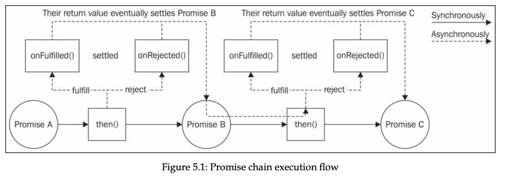
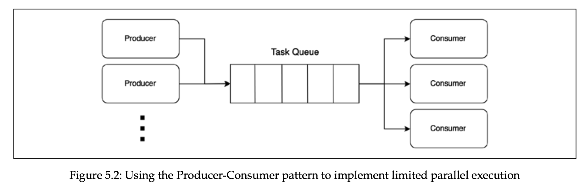

# Chapter 5, Asynchronous Control Flow Patterns with Promises and Async/Await

- [Promises/A+ and thennables](#promisesa-and-thennables)
- [The Promise API](#the-promise-api)
- [Sequential iteration with promises](#pattern-sequential-iteration-with-promises)
- [Limited parallel execution with promises](#limited-parallel-execution-with-promises)
- [Async/await](#asyncawait)
- [Error handling](#error-handling)
- [Trap when returning](#trap-when-returning)
- [Sequential execution and iteration](#sequential-execution-and-iteration)
- [The problem with infinite recursive promise resolution chains](#the-problem-with-infinite-recursive-promise-resolution-chains)
- [Exercises](#exercises)

Promises are part of ES6, which offer alternative to CPS for propagating async result.

Promise is an object which represent eventual result (or error) of an async operation. Promise is `pending` when async operation is not complete, `fulfilled` when operation successfully completes, and `rejected` when operation terminates with error. Once it’s fulfilled or rejected, it’s considered `settled`.

To receive the fullfillment value or rejection reason, following syntax is used:

```jsx
promise.then(onFullfilled, onRejected);
// onFulfilled is callback with fulfillment value
// onRejected is callback with rejected reason.
// Both are optional

// usage example. asyncOperation returns a promise
asyncOperation().then(console.log, console.log);
```

Important notes:

1. `then()` method **_synchronously returns another Promise._**
2. If `onFullfilled` or `onRejected` methods return a value, promise returned by `then()` will fulfill with that value.
3. If `onFullfilled` method returns a promise that fulfills, promise returned by `then()` will fulfill with fulfillment value of that promise.
4. if `onRejected` method returns a promise that rejects, promise returned by `then()` will reject with reason of that promise.
5. if we don't specify `onRejected` or `onFullfilled`, the resolved value or rejected reason is propagated down the chain, until it's caught by resolving handler or rejected reason there.
6. `onFulfilled()` and `onRejected()` callbacks are _guaranteed_ to be invoked asynchronously and at most once, even if we resolve the Promise synchronously with a value. This helps us prevent Zalgo problem, where the behavior of function is unpredictable.
7. If exception is thrown in `onFulfilled()` or `onRejected()` handlers, the promise returned by `then()` is rejected with exception reason. In comparison, in CPS, the thrown errors must have been carried with care, but in this case, the exception is propagated across the chain.
8. `then()` methods synchronously return another promises, whereas the callbacks provided are executed asynchronously.

   

## Promises/A+ and thennables

Historically, there were many implementations of promises, and they varied such that they were not compatible between each other. Because of this **Promises/A+** spec was developed to make them working between each other. Native promises are also built on top of it.

According to Promises/A+ spec, any object with `then()` method is considered Promise-like object **(thennable)**.

> If it looks like a duck, swims like a duck, and quacks like a duck, then it probably is a duck - **Duck typing,** technique of recognizing (or typing) objects based on their external behavior, rather than their actual type.

## **The promise API**

The Promise constructor `new Promise((resolve, reject) => {})` creates a new Promise instance that fulfills or rejects based on the behavior of the function provided as an argument. The function provided to the constructor will receive two arguments.

- `resolve(obj)`: This function will fulfill the Promise with the provided fulfillment value, which will be obj if obj is a value. If obj is Promise, it’ll be the fullfillment value of the obj.
- `reject(err)`: This rejects the Promise with the reason err.

  Promise static methods:

- `Promise.resolve(obj)`: If a Promise is passed, then that Promise is returned as it is. If a thenable is provided, then it's **_converted_** 🤯 \*\*to the Promise implementation in use. If a value is provided, then the Promise will be fulfilled with that value.
- `Promise.reject(err)`: This method creates a Promise that rejects with err as the reason.
- `Promise.all(iterable)`: This method creates a Promise that fulfills with an array of fulfillment values when every item in the input iterable (such as an Array) object fulfills. If any Promise in the iterable object rejects, then the Promise returned by Promise.all() will reject with the first rejection reason. Each item in the iterable object can be a Promise, a generic thenable 🤯, or a value.
- `Promise.allSettled(iterable)`: This method waits for all the input promises to fulfill or reject and then returns an array of objects containing the fulfillment value or the rejection reason for each input Promise. The difference with Promise.all() is that Promise.allSettled() will always wait for each Promise to either fulfill or reject, instead of immediately rejecting when one of the promises rejects.
- `Promise.race(iterable)`: This method returns a Promise that is equivalent to the first Promise in iterable that settles.

Promise instance methods:

- `promise.then(onFulfilled, onRejected)`: This is the essential method of a Promise. Its behavior is compatible with the Promises/A+ standard.
- `promise.catch(onRejected)`: This method is just syntactic sugar for promise.then(undefined, onRejected).
- `promise.finally(onFinally)`: This method allows us to set up an onFinally callback, which is invoked when the Promise is settled. Unlike onFulfilled and onRejected, the onFinally callback will not receive any argument as input, and any value returned from it will be ignored. The Promise returned by finally will settle with the same fulfillment value or rejection reason of the current Promise instance. There is only once exception to all this, which is the case in which we throw inside the onFinally callback or return a rejected Promise. In this case, the returned Promise will reject with the error that is thrown or the rejection reason of the rejected Promise returned.

- Question 1

  ```jsx
  // What’s returned?
  Promise.resolve({
    then: () => {},
  });
  ```

  - Answer
    Pending promise, because Promise.resolve will resolve with given value if value is not promise. If promise, it fulfills with fulfillment value of that promise or thennable.

- Question 2

  ```jsx
  Promise.resolve({
    then: (resolve) => {
      resolve(5);
    },
  });
  ```

  - Answer
    Fulfilled promise with 5, because returning promise fulfils with the value of inner promise.

- Question 3

  ```jsx
  // what's returned?
  new Promise((resolve) => {
    return {
      then: () => {
        resolve("then");
      },
    };
  });
  ```

  - Answer
    Pending promise, because the return value of the executor function is ignored. If we resolve with the object, and inner promise is fulfilled with value, then the returning promise will be fulfilled with that value.

- Question 4

  ```jsx
  // what's returned?

  new Promise((resolve, reject) => {
    reject("error");
  })
    .then(undefined, (rejectedReason) => {
      if (rejectedReason) {
        return console.log({ rejectedReason });
      }
      return "value";
    })
    .then(undefined, (err) => {
      console.log({ err });
    });
  ```

  - Answer
    Fulfilled promise, error is not propagated to the event loop, because it’s caught by the second argument of then. Unless we do this, error is propagated to the event loop.

- Question 5

  ```jsx
  // what's get logged?
  Promise.resolve(1).then((value) => console.log(value));
  console.log(2);
  ```

  - Answer
    2, then 1. Because the onFulfilled and onRejected callbacks are guaranteed to be invoked asynchronously, later than the synchronous code in the event loop cycle.

## **Pattern (sequential iteration with promises)**

Dynamically build a chain of promises using a loop. The promises are executed synchronously, meaning next promise starts executing when the previous is settled.

```jsx
// first implementation

function runSequentially(tasks) {
  let promise = Promise.resolve();

  for (const task of tasks) {
    promise = promise.then(() => task());
  }

  return promise;
}

// second implementation

function runSequentially(tasks) {
  return tasks.reduce((promise, task) => {
    return promise.then(() => task());
  }, Promise.resolve());
}

// Example usage
const tasks = [
  () =>
    new Promise((resolve) =>
      setTimeout(() => {
        console.log("Task 1");
        resolve();
      }, 1000)
    ),
  () =>
    new Promise((resolve) =>
      setTimeout(() => {
        console.log("Task 2");
        resolve();
      }, 500)
    ),
  () =>
    new Promise((resolve) =>
      setTimeout(() => {
        console.log("Task 3");
        resolve();
      }, 1500)
    ),
];

runSequentially(tasks).then(() => console.log("All tasks completed"));
```

## Limited parallel execution with promises

Same TaskQueue can be built with promises. Complete code is as follows. In the runTask method, we are making wrapper function, and deferring its execution to prevent Zalgo issues.

```jsx
export class TaskQueue {
  constructor(concurrency) {
    super();
    this.concurrency = concurrency;
    this.running = 0;
    this.queue = [];
  }

  next() {
    while (this.running < this.concurrency && this.queue.length) {
      const task = this.queue.shift();
      task().finally(() => {
        this.running--;
        this.next();
      });
      this.running++;
    }
  }

  runTask(task) {
    return new Promise((resolve, reject) => {
      this.queue.push(() => {
        return task().then(resolve, reject);
      });
      process.nextTick(this.next.bind(this));
    });
  }
}
```

## async/await

The async/await allows us to write functions that appear to block at each asynchronous operation, waiting for the results before continuing with the following statement. Also it has readability similar to synchronous code.

Async functions always return a promise. If the function has `await` inside, the promise will have a status of pending. Otherwise, if it has no `await` , it will be just a `Promise {<fulfilled>: undefined}`

The await expression works with any value, not just promises. If a value other than a Promise is provided, then its behavior is similar to awaiting a value that it first passed to `Promise.resolve()` . So `const result = await 10` results in 10 being the value of result.

Async functions return a Promise synchronously. That Promise will then eventually settle based on the result or error produced by the function.

async/await is just a syntatic sugar for a simpler consumption of promises.

## Error handling

async/await normalizes the error handling with asynchronous code, because awaited promise rejections are catched by `catch` block in `try-catch` .

- Example

  ```jsx
  function delayError(milliseconds) {
    return new Promise((resolve, reject) => {
      setTimeout(() => {
        reject(new Error(`Error after ${milliseconds}ms`));
      }, milliseconds);
    });
  }

  async function playingWithErrors(throwSyncError) {
    try {
      if (throwSyncError) {
        throw new Error("This is a synchronous error");
      }
      await delayError(1000);
    } catch (err) {
      console.error(`We have an error: ${err.message}`);
    } finally {
      console.log("Done");
    }
  }

  playingWithErrors(true);
  playingWithErrors(false);
  // both errors are catched by catch block.
  ```

## trap when returning

When we have a `try-catch` block, and if we are returning a promise **_without_** using `await` , the rejection of a promise (do not forget that error thrown in `then/catch` of a promise instance resolves to rejected promise) is not caught in catch block. Instead we should use `await` before returning it to the consumer.

- Example

  ```jsx
  // delayError(){ ... }

  async function errorNotCaught() {
    try {
      return delayError(1000);
    } catch (err) {
      // error is not caught in catch block
      console.error("Error caught by the async function: " + err.message);
    }
  }

  errorNotCaught().catch((err) =>
    // consumer will have to deal with the rejection.
    console.error("Error caught by the caller: " + err.message)
  );

  // instead do:

  async function errorCaught() {
    try {
      return await delayError(1000);
    } catch (err) {
      console.error("Error caught by the async function: " + err.message);
    }
  }

  errorCaught().catch((err) =>
    console.error("Error caught by the caller: " + err.message)
  );
  ```

## Sequential execution and iteration

The code using `async/await` looks like it’s being executed synchronously.

One thing i liked about `async/await` is that there is no any specific pattern to learn when we want to execute the asynchronous operations sequentially. See example below.

- Example

  ```jsx
  function delay(ms) {
    return new Promise((resolve) => {
      setTimeout(() => {
        resolve();
      }, ms);
    });
  }
  const msArray = [1000, 2000, 3000];

  async function example() {
    for (const ms of msArray) {
      await delay(ms);
      console.log(ms);
    }
  }

  example();
  // console.log after 1 second: 1000
  // console.log after 3 seconds: 2000
  // console.log after 6 seconds: 3000
  ```

Sometimes developers use `forEach` or `map` to execute the asynchronous code sequentially, but it’s not correct. Using `async/await` with `Array.forEach` for serial execution is anti-pattern, and is considered incorrect. See example with explanation below.

- Example
  Here, we can see that all of the asynchronous operations run in parallel, instead of running sequentially. This is because `forEach` invokes every callback sequentially, and those callbacks return promises, and `forEach` doesn’t wait for them, and instead invokes next callback.

  ```jsx
  const msArray = [2000, 1000, 500, 100];

  function example() {
    msArray.forEach(async (ms) => {
      await delay(ms);
      console.log(ms);
    });
  }
  example();
  // console.log after 100ms: 100
  // console.log after 500ms: 500
  // console.log after 1000ms: 1000
  // console.log after 2000ms: 2000
  ```

## Limited parallel execution

We can use previous TaskQueue implementation and convert using async/await, but it’s trivial task. Instead, we can see another approach to build TaskQueue, with producer/consumer approach. On one side, producers push tasks to the task queue, and on another, the set of consumers execute them. Concurrency determines the number of consumers.



## Parallel execution

Parallel execution can be done in 2 ways.

- `Promise.all` - recommended approach, it runs all asynchronous callbacks provided as an array in parallel, and returns a promise with resolves when all of the provided callbacks resolve, or rejects immediately when one of them rejects.
- Collecting all the executed promises, and then awaiting each of them. This is not as good as `Promise.all` , because we will have to wait for all the promises to settle, even if one of them rejects.

- Example

```jsx
async function example() {
  const promises = [delay(100), delay(200), delay(300)];
  for (const promise of promises) {
    await promise;
  }
  // code to be executed when all promises fulfill.
}
example();
```

## **The problem with infinite recursive promise resolution chains.**

Suppose you want to create a infinite recursive promise resolution chains, in this case your solution might be:

```tsx
function leakingLoop() {
  return delay(1).then(() => {
    console.log(`Tick ${Date.now()}`);
    return leakingLoop();
  });
}

// or

async function leakingLoop() {
  await delay(1);
  console.log(`Tick ${Date.now()}`);
  return leakingLoop();
}
```

In this case, it’s easy to introduce memory leak in our program, and both implementations above have memory leak. Remember when a promise **(a)** returns a promise **(b)**, promise **a** resolves only when promise **b** resolves. In our case, it’s going infinitely down the chain, so the first promise returned from the function never resolves. We can see how memory goes indefinitely for the process in process view monitor (Activity Monitor in Mac).

To fix this issue, we should omit the `return` keyword.

```tsx
function nonLeakingLoop() {
  delay(1).then(() => {
    console.log(`Tick ${Date.now()}`);
    nonLeakingLoop();
  });
}

// or

async function nonLeakingLoop() {
  await delay(1);
  console.log(`Tick ${Date.now()}`);
  nonLeakingLoop();
}
```

In this case, the issue is fixed we break the promise chain. But one problem is that the errors are not going to be propagated to the first function we declared, so we can’t catch errors with `catch` with function we invoked. We can also fix this problem:

```tsx
function nonLeakingLoopWithErrors() {
  return new Promise((resolve, reject) => {
    (function internalLoop() {
      delay(1)
        .then(() => {
          console.log(`Tick ${Date.now()}`);
          internalLoop();
        })
        .catch((err) => {
          reject(err);
        });
    })();
  });
}

// or

async function nonLeakingLoopAsync() {
  while (true) {
    await delay(1);
    console.log(`Tick ${Date.now()}`);
  }
}
```

## Exercises

- `Promise.all` from scratch

  ```tsx
  // Implement your own version of Promise. all() leveraging promises,
  // async/await, or a combination of the two. The function must be
  // functionally equivalent to its original counterpart.

  function delay(ms, value) {
    return new Promise((resolve) => {
      setTimeout(() => {
        resolve(value);
      }, ms);
    });
  }

  async function myPromiseAll(tasks) {
    const list = tasks.map((task) => task());

    for (let i = 0; i < list.length; i++) {
      try {
        const value = await list[i];
        list[i] = value;
      } catch (error) {
        return Promise.reject(error);
      }
    }

    // we can also just return list
    return Promise.resolve(list);
  }

  async function main() {
    const list = await myPromiseAll([
      () => delay(1000, "a"),
      () => delay(2000, "b"),
      () => delay(3000, "c"),
    ]);
  }

  main();
  ```
