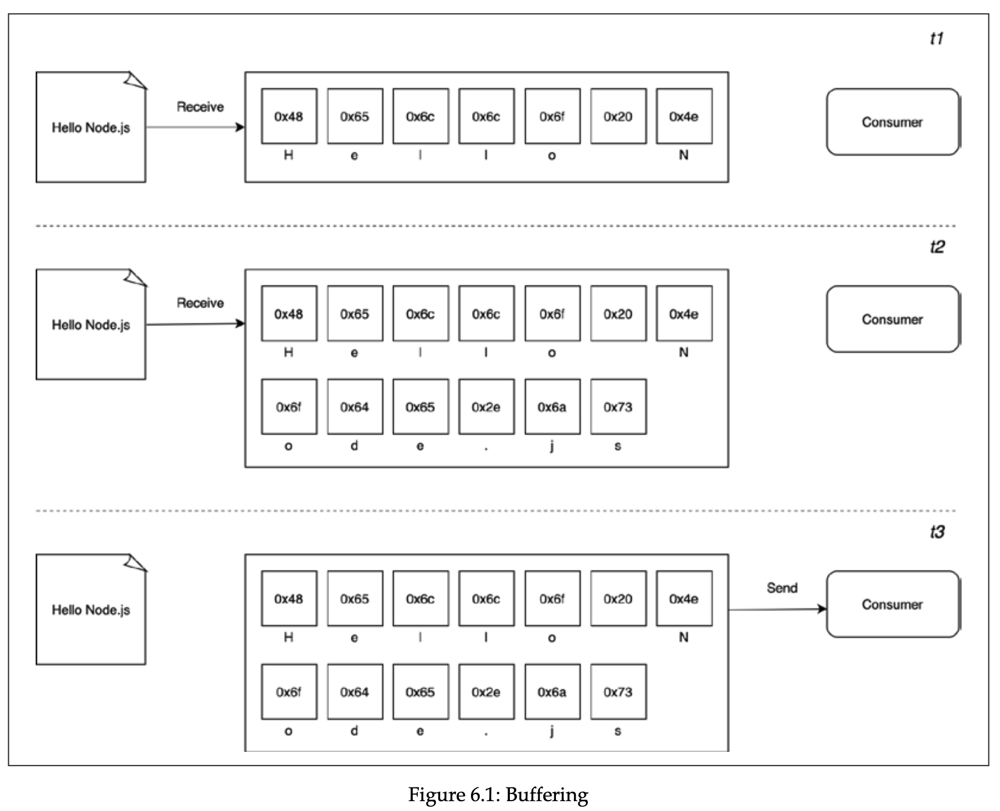
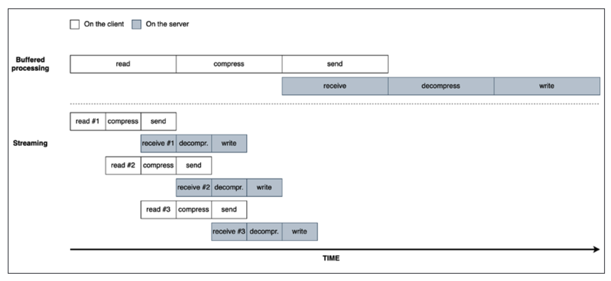

# Chapter 6, Coding with streams

- [Getting started with streams](#getting-started-with-streams)
- [Readable](#readable)
- [Implementing Readable streams](#implementing-readable-streams)
- [Writable](#writable)
- [Backpressure](#backpressure)
- [Implementing Writable streams](#implementing-writable-streams)
- [Duplex](#duplex)
- [Transform](#transform)
- [PassThrough](#passthrough)
- [Late piping](#late-piping)
- [Lazy streams](#lazy-streams)
- [Connecting streams using pipes](#connecting-streams-using-pipes)
- [Pipes and error handling](#pipes-and-error-handling)[]

In event-based Node.js, almost all asynchronous APIs we have seen so far work using **buffer mode.** Buffering is creating a buffer (storage), and pushing there the chunks of data received from resource, and when the whole input is processed, passing it back as single blob of data to the caller.



On the other side, streams allow us to pass the data as soon as it’s arrives from the resource. As soon as each chunk is available, it can send this chunk to the caller right away, without waiting for all the data to be collected.

Node.js streams have advantages of space efficiency, time efficiency, and composability.

In terms of space efficiency, consider the case when we need to process a large file, creating buffer for that is probably not a good idea, and in fact buffer size is limited. We can check it with `console.log(buffer.constants.MAX_LENGTH);` with `import buffer from 'buffer'`.

- Gzipping using buffer example

  ```jsx
  import { readFile, writeFile } from "fs/promises";
  import { gzip } from "zlib";
  import { promisify } from "util";
  const promiseGzip = promisify(gzip);

  const filename = process.argv[2];

  async function main() {
    const data = await readFile(filename);
    // notice that the data type returned is Buffer
    const gzippedData = await promiseGzip(data);
    await writeFile(`${filename}.gz`, gzippedData);
    console.log(`File successfully compressed`);
  }

  main();
  ```

  If we try to compress large file, we get error: `RangeError [ERR_FS_FILE_TOO_LARGE]: File size (10737418240) is greater than 2 GiB`. This is, again, because V8 has Buffer size limit.

- Gzipping using streams example

  ```jsx
  import { createReadStream, createWriteStream } from "fs";
  import { createGzip } from "zlib";

  const filename = process.argv[2];

  createReadStream(filename)
    .pipe(createGzip())
    .pipe(createWriteStream(`${filename}.gz`))
    .on("finish", () => {
      console.log(`Successfully compressed file`);
    });
  ```

  Now, we don’t have the problem of memory outage, because we don’t store chunks in the buffer, we send the chunks right away.

In terms of time efficiency, it’s described in the following image.



In terms of composability, streams can be composed with `pipe` method, which allows us to connect different processing units, each responsible for single functionality. They can understand each other in terms of API, but the next stream must understand the output produced by previous stream.

The order of the data chunks matters, and Node.js manages the order for us under the hood.

## Getting started with streams

Streams are everywhere in Node.js, examples include write and read functions with streaming support, http request/response objects (which are basically streams)

Every stream in Node.js is implementation of one of four base abstract classes available in `stream` core module: `Readable`, `Writable`, `Duplex`, `Transform`. Each stream class is instance of `EventEmitter`.

Streams support 2 operating modes: **Binary mode** (data is transferred in form of chunks such as buffers or strings), and **Object mode** (data is transferred as sequence of discrete objects, allowing us to use almost any js value).

## Readable

A `Readable` stream represents a source of data, and in node.js implemented using the Readable abstract class. We can receive a data from Readable stream with 2 approaches:

- **non-flowing (paused).** Using this approach the data is pulled from the stream, and is not continuously sent by stream. It involves attaching a listener to the stream for the readable event (which signals the availability of new chunk of data), and continuously reading the internal buffer until it’s emptied. This can be done with `read` method, which synchronously reads from the internal buffer and returns a Buffer object representing the chunk of data.
  When `read` method returns `null` , there is no more data available in internal buffer. Readable stream also emits `end` event when stream ends. We can also set encoding of the stream with `[stream].setEncoding(encoding)`, so we don’t read buffers, but strings.

- Example

```jsx
// process.stdin.setEncoding("utf8");

process.stdin.on("readable", () => {
  let chunk;
  console.log("New data is available");
  while ((chunk = process.stdin.read()) !== null) {
    console.log(`Chunk read (${chunk.length} bytes): ${chunk.toString()}`);
  }
});
on("end", () => {
  console.log(`End of stream`);
});
```

Note that if we don’t continuously pull the data from stream, the size of internal buffer grows to a certain limit (can be specified with highWaterMark option), and once the buffer is full, stream stops reading more data from source until you pull data from buffer. This is called **backpressure**.

- **flowing.** In this case, the data is automatically pushed when it’s arrived, and `Readable` stream emits `data` event for this.

- Example

```jsx
process.stdin
  .on("data", (chunk) => {
    console.log("New data available");
    console.log(`Chunk read (${chunk.length} bytes): "${chunk.toString()}"`);
  })
  .on("end", () => console.log("End of stream"));
```

Because default operating mode for stream is non-flowing, we can switch to flowing by attaching listener to `data` event, or explicitly invoking `resume` method. To temporality stop the stream from emitting data events, we can invoke `pause` method, causing incoming data be cached in internal buffer. So, calling `pause` method switches the stream back to non-flowing mode.

Readable streams are also async iterators.

- Example

```jsx
async function main() {
  for await (const chunk of process.stdin) {
    console.log("New data available");
    console.log(`Chunk read (${chunk.length} bytes): "${chunk.toString()}"`);
  }
  console.log("End of stream");
}
main();
```

## Implementing Readable streams

We can implement our own custom readable stream. For this we need to inherit from `Readable` class and specify `_read` method, which is called by internals of `Readable` to start filling the internal buffer using `push` (meaning \_read method can use push method to push to the buffer). `_read` must not be called by stream consumers, and is for internal purposes only.

- Example

  ```jsx
  import { Readable } from "stream";
  import Chance from "chance";
  const chance = new Chance();

  export class RandomStream extends Readable {
    constructor(options) {
      super(options);
      this.emittedBytes = 0;
    }
    _read(size) {
      const chunk = chance.string({ length: size });
      // because we are pushing string, we need to specify encoding
      this.push(chunk, "utf8");
      this.emittedBytes += chunk.length;
      if (chance.bool({ likelihood: 5 })) {
        this.push(null);
      }
    }
  }

  // usage

  const randomStream = new RandomStream();
  randomStream
    .on("data", (chunk) => {
      console.log(
        `Chunk received (${chunk.length} bytes): ${chunk.toString()}`
      );
    })
    .on("end", () => {
      console.log(`Produced ${randomStream.emittedBytes} bytes of random
  data`);
    });
  ```

  Fun fact: in the `options`, consumer can pass an option of highWaterMark to limit the size of buffer, but stream can ignore it. Default highWaterMark is 16KB. We can check if buffer is full when `push` method of stream returns `false`.

We can specify the construction of our custom readable stream by passing a `read` method as an option. The behaviour is the same as in our previous approach.

- Example

  ```jsx
  import { Readable } from "stream";
  import Chance from "chance";
  const chance = new Chance();
  let emittedBytes = 0;

  const randomStream = new Readable({
    read(size) {
      const chunk = chance.string({ length: size });
      this.push(chunk, "utf8");
      emittedBytes += chunk.length;
      if (chance.bool({ likelihood: 5 })) {
        this.push(null);
      }
    },
  });
  ```

## Writable

A `Writable` stream represents a data destination, for example file in filesystem, a database table, a socket, or standard output interface. In Node.js, all of these are implemented with `Writable` abstract class from `stream` module.

To write to a writable stream we need to invoke `writable.write(chunk, [encoding], [callback])` method. Encoding is `utf8` by default, and callback fn is called when chunk is flushed to the underlying resource to indicate successful or failed operation (if we pass `Error` as an argument), and if error it can be caught by `error` event emitted by writable.

Note that the `write` method of writable is not asynchronous unless async API is used inside. You can verify this by logging some message. But the callback provided is run async.

To signal that no more data will be written, we can invoke `writable.end([chunk], [encoding], [callback])` , where chunk is final chunk to stream, and callback is equivalent to registering listener to `finish` event, which is fired when all data in stream has been flushed into underlying resource.

- Example

  Note that the response is an object, instance of `http.ServerResponse`, and also a `Writable` stream.

  If you test this in browser, note that browser might choose to buffer the chunks.

  ```jsx
  import { createServer } from "http";
  import Chance from "chance";

  const chance = new Chance();
  const server = createServer((request, response) => {
    response.writeHead(200, { "Content-Type": "text/plain" });
    while (chance.bool({ likelihood: 95 })) {
      response.write(`${chance.string()}\n`);
    }
    response.end("\n\n");
    response.on("finish", () => {
      console.log("All data is sent");
    });
  });

  server.listen(3000, () => {
    console.log("Server running on port 3000");
  });
  ```

## Backpressure

`writable.write` will return `false` if the `highWaterMark` is reached, meaning the internal buffer is full. We can ignore this, but it’s not recommended to ignore. When the data is emptied from buffer, a `drain` event is emitted, saying it’s now safe to write. This mechanism is called **backpressure.**

- Example

  ```jsx
  import { createServer } from "http";
  import Chance from "chance";

  const chance = new Chance();
  const server = createServer((req, res) => {
    res.writeHead(200, { "Content-Type": "text/plain" });

    function generateMore() {
      while (chance.bool({ likelihood: 95 })) {
        const randomChunk = chance.string({
          length: 16 * 1024 - 1,
        });
        const shouldContinue = res.write(`${randomChunk}\n`);
        if (!shouldContinue) {
          console.log("back-pressure");
          return res.once("drain", generateMore);
        }
      }
      res.end("\n\n");
    }

    generateMore();
    res.on("finish", () => console.log("All data sent"));
  });

  server.listen(3000, () => {
    console.log("Server running on port 3000");
  });
  ```

## Implementing Writable streams

We can implement our own stream with `Writable` abstract class. We can either extend from it, or use simplified construction.

- Example with extending

  ```jsx
  import { Writable } from "stream";
  import { promises as fs } from "fs";
  import { dirname } from "path";
  import mkdirp from "mkdirp-promise";

  export class ToFileStream extends Writable {
    constructor(options) {
      super({ ...options, objectMode: true });
    }

    _write(chunk, encoding, cb) {
      mkdirp(dirname(chunk.path))
        .then(() => fs.writeFile(chunk.path, chunk.content))
        .then(() => cb())
        .catch(cb);
    }
  }

  // usage

  import { join } from "path";
  import { ToFileStream } from "./to-file-stream.js";
  const tfs = new ToFileStream();
  tfs.write({
    path: join("files", "file1.txt"),
    content: "Hello",
  });
  tfs.write({
    path: join("files", "file2.txt"),
    content: "Node.js",
  });
  tfs.write({
    path: join("files", "file3.txt"),
    content: "streams",
  });
  tfs.end(() => console.log("All files created"));
  ```

- Example with simplified construction

  ```jsx
  import { Writable } from "stream";
  import { promises as fs } from "fs";
  import { dirname } from "path";
  import mkdirp from "mkdirp-promise";

  const tfs = new Writable({
    objectMode: true,
    write(chunk, encoding, cb) {
      mkdirp(dirname(chunk.path))
        .then(() => fs.writeFile(chunk.path, chunk.content))
        .then(() => cb())
        .catch(cb);
    },
  });
  ```

- Here is a program that reads logs file and writes error logs into specified file, and summary of other logs to another specified file. Note that the input being taken is pathname to file, which has logs in following format: [Timestamp] [LogLevel] [Message]

  ```jsx
  import { createReadStream, createWriteStream } from "fs";
  import { Writable } from "stream";

  const inputFilename = process.argv[2];
  const HIGH_WATER_MARK = 16;
  const ERROR_FLAG = "ERROR";
  const ERROR_LOG_PATHNAME = "./output/error.log";
  const SUMMARY_LOG_PATH = "./output/summary.log";

  class LogsWritableStream extends Writable {
    logLevels = {};
    bufferedLine = "";
    errorFlag = "";
    summaryLogStream;
    errorLogStream;

    constructor({
      highWaterMark,
      errorFlag,
      summaryLogPathname,
      errorLogPathname,
    }) {
      super({ highWaterMark, objectMode: true });
      this.errorFlag = errorFlag;
      this.summaryLogStream = createWriteStream(summaryLogPathname);
      this.errorLogStream = createWriteStream(errorLogPathname);
    }

    _write(data, _, callback) {
      const { logLevels, bufferedLine, errorFlag, errorLogStream } = this;

      if (data.includes("\n") === false) {
        bufferedLine += data;
        return;
      }

      const chunks = (bufferedLine + data).split("\n");
      this.bufferedLine = chunks.pop() || "";

      for (let i = 0; i < chunks.length; i++) {
        const chunk = chunks[i];
        if (chunk.includes(errorFlag)) {
          errorLogStream.write(chunk + "\n");
          continue;
        }

        const match = chunk.match(/\[([A-Z]+)\]/);

        if (match) {
          const level = match[1];
          logLevels[level] = (logLevels[level] || 0) + 1;
        }
      }

      callback();
    }

    _final() {
      let chunk = "";
      const { logLevels, summaryLogStream } = this;
      for (const level in logLevels) {
        chunk += `${level}: ${logLevels[level]}\n`;
      }
      summaryLogStream.write(chunk);

      this.summaryLogStream.close();
      this.errorLogStream.close();
    }

    _destroy(error) {
      console.log(`Error reading a file: ${error}`);
    }
  }

  const logsWritableStream = new LogsWritableStream({
    highWaterMark: HIGH_WATER_MARK,
    errorFlag: ERROR_FLAG,
    errorLogPathname: ERROR_LOG_PATHNAME,
    summaryLogPathname: SUMMARY_LOG_PATH,
  });

  createReadStream(inputFilename).pipe(logsWritableStream);
  ```

## Duplex

A `Duplex` stream is both `Readable` and `Writable`, used to describe an entity that is both data source and destination. To create custom Duplex, we have to specify both `_write` and `_read` methods, which are internally forwarded to `Writable` and `Readable` constructors. Options are same, except `allowHalfOpen` (default true), which, if false, closes the second part if one part closes.

We can configure it to operate in both parts differently, with `readableObjectMode` and `writableObjectMode` options.

In Duplex streams, there is no relationship between data written and data read, meaning Readable and Writable channels are independent of each other, and we need to explicitly manage the logic to transfer the data between the two.


- Example program that outputs uppercase letter to readable side from letters received from writable side.

```jsx
import { Duplex } from "stream";

class UppercaseStream extends Duplex {
  constructor() {
    super({ objectMode: true });
    this.buffer = [];
  }

  _write(data, encoding, callback) {
    const chunk = data.toUpperCase();
    this.push(chunk);
    callback();
  }

  _read() {
    if (this.buffer.length > 0) {
      this.push(this.buffer.shift());
    } else {
      this.push(null);
    }
  }
}

const uppercaseStream = new UppercaseStream();
uppercaseStream.write("hello");
uppercaseStream.write("world");

uppercaseStream
  .on("data", (chunk) => {
    console.log(chunk);
  })
  .on("end", () => {
    console.log("end of stream");
  });
```

## Transform

`Transform` stream is special kind of `Duplex` stream, where the data read has relationship with data written, and is designed to handle data transformations. It applies transformations to each chunk they receive from `Writable` part, and send it to `Readable` part.


To implement transform streams, we need to pass `_transform` and `_flush` methods.

`_transform` method has practically the same signature as `_write` of writable, but instead of writing it to an underlying resource, it writes it to the internal buffer with `this.push`, from where it’s then read.

`_flush` method is invoked when stream is ready to be closed. It has callback argument, which should be invoked by us (in stream implementation) when all operations are complete. It terminates the stream.

- Example with class

  ```jsx
  import { Transform } from "stream";

  export class ReplaceStream extends Transform {
    constructor(searchStr, replaceStr, options) {
      super({ ...options });
      this.searchStr = searchStr;
      this.replaceStr = replaceStr;
      this.tail = "";
    }

    _transform(chunk, encoding, callback) {
      const pieces = (this.tail + chunk).split(this.searchStr);
      const lastPiece = pieces[pieces.length - 1];
      const tailLen = this.searchStr.length - 1;

      pieces[pieces.length - 1] = lastPiece.slice(0, -tailLen);
      this.push(pieces.join(this.replaceStr));
      callback();
    }

    _flush(callback) {
      this.push(this.tail);
      callback();
    }
  }

  const replaceStream = new ReplaceStream("Python", "Node.js");
  replaceStream.write("Hello Python");
  console.log(replaceStream.read().toString());
  replaceStream.write("Goodbye Python");
  console.log(replaceStream.read().toString());
  replaceStream.write("Python is the best");
  console.log(replaceStream.read().toString());

  replaceStream.end();
  ```

- Example with simplified construction

  ```jsx
  const replaceStream = new Transform({
    defaultEncoding: "utf8",
    transform(chunk, encoding, cb) {
      const pieces = (tail + chunk).split(searchStr);
      const lastPiece = pieces[pieces.length - 1];
      const tailLen = searchStr.length - 1;
      tail = lastPiece.slice(-tailLen);
      pieces[pieces.length - 1] = lastPiece.slice(0, -tailLen);
      this.push(pieces.join(replaceStr));
      cb();
    },
    flush(cb) {
      this.push(tail);
      cb();
    },
  });
  ```

- Example with data filtering and aggregation
  Transform streams are also common when doing data filtering and aggregation. We can implement pipelines to do such operations. In the following example, csvParser is transform stream that reads the csv and transforms it to the rows array.
  `FilterByCountry` stream takes the rows, and iterates, if country is as specified in arg, it pushed it to internal buffer for the next stream to read, if it’s not, it does nothing, and in both those cases it invokes callback that says chunk has been operated.
  `SumProfit` takes all the filtered rows, and sums the profit, and when there is no more data to process, it internally invokes (automatically invoked before the stream is closed) `_flush` that we use to push sum to the internal buffer of that stream.
  This pattern of processing data with `_transform` and accumulating the partial result, then calling `this.push` in `_flush` to emit the result, is called **streaming aggregation pattern.**

  ```jsx
  import { createReadStream } from "fs";
  import parse from "csv-parse";
  import { Transform } from "stream";

  const csvParser = parse({ columns: true });

  class FilterByCountry extends Transform {
    constructor(country, options = {}) {
      options.objectMode = true;
      super(options);
      this.country = country;
    }
    _transform(record, enc, cb) {
      if (record.country === this.country) {
        this.push(record);
      }
      cb();
    }
  }

  class SumProfit extends Transform {
    constructor(options = {}) {
      options.objectMode = true;
      super(options);
      this.total = 0;
    }
    _transform(record, enc, cb) {
      this.total += Number.parseFloat(record.profit);
      cb();
    }
    _flush(cb) {
      this.push(this.total.toString());
      cb();
    }
  }

  createReadStream("data.csv")
    .pipe(csvParser)
    .pipe(new FilterByCountry("Italy"))
    .pipe(new SumProfit())
    .pipe(process.stdout);
  ```

- Another simple example

```jsx
import { createReadStream, createWriteStream } from "fs";
import { Transform } from "stream";

class CapitalizeStream extends Transform {
  constructor(options) {
    super(options);
  }

  _transform(chunk, encoding, callback) {
    this.push(chunk.toString().toUpperCase());
    callback();
  }
}

createReadStream("./input.txt", { highWaterMark: 1 })
  .pipe(new CapitalizeStream())
  .pipe(createWriteStream("./output.txt"));
```

## PassThrough

There is another type of streams called PassThrough. It receives the chunks and pushes it next in the pipeline without any modification or delay. This behaviour can be achieved with transform stream, but in this case we would need to implement write method ourselves. This is what PassThrough stream does for us.

- Example

  ```jsx
  import { PassThrough } from "stream";

  let bytesWritten = 0;

  const passThrough = new PassThrough();
  passThrough.on("data", (chunk) => {
    bytesWritten += chunk.length;
  });
  passThrough.on("finish", () => {
    console.log(`${bytesWritten} bytes written`);
  });

  passThrough.write("hello");
  passThrough.write("there");
  passThrough.end();
  ```

## Late piping

Let’s suppose we have a function that accepts a Readable stream, and uploads the content to S3:

```jsx
function upload(filename, contentStream) {
  // ...
}

import { createReadStream } from "fs";
upload("a-picture.jpg", createReadStream("path/image.jpg"));
```

But what if we want to make a transformation, for instance, compressing, before pushing to the server? We can do this with placeholder stream, which is done with PassThrough stream. It holds until data arrives, and is not closed until source stream closes.

```jsx
import { createReadStream } from "fs";
import { createBrotliCompress } from "zlib";
import { PassThrough } from "stream";
import { basename } from "path";
import { upload } from "./upload.js";
const filepath = process.argv[2];
const filename = basename(filepath);
const contentStream = new PassThrough();

upload(`${filename}.br`, contentStream)
  .then((response) => {
    console.log(`Server response: ${response.data}`);
  })
  .catch((err) => {
    console.error(err);
    process.exit(1);
  });

createReadStream(filepath).pipe(createBrotliCompress()).pipe(contentStream);
```

In this example we are delaying uploading until the chunk is compressed, and PassThrough stream acts as a placeholder. This is another use case of PassThrough stream.

Use a PassThrough stream when you need to provide a placeholder for data that will be read or written in the future.

## Lazy streams

Sometimes we want to create a large number of streams to consume later. For example to use [archiver](https://www.npmjs.com/package/archiver) package. The problem is that if we try to open many files with `createReadStream` we would get `EMFILE`, too many open files error. Even though we haven’t used the stream yet, the function triggers opening of file descriptor.

Solution is to use lazy streams, which are created only when they are used. We can use [lazystream](https://www.npmjs.com/package/lazystream) for this. Under the hood it uses proxies for actual stream instances, and proxies instance is not created until it’s used:

```jsx
import lazystream from "lazystream";
const lazyURandom = new lazystream.Readable(function (options) {
  return fs.createReadStream("/dev/urandom");
});
```

It also uses PassThrough stream, and when `_read` method is invoked for the first time, creates proxied instance by invoking factory function, and then pipes generated stream into the PassThrough stream.

## Connecting streams using pipes

Piping concept is taken from Unix, where `echo hello | pbcopy` copies hello to the clipboard (in mac). The output of first command is forwarded to second as an input.

In NodeJS streams it’s similar. `pipe` method takes output from readable and forward it as an input to the writable stream. `pipe` method of Readable stream takes the output produced by `readable` event, and pumps it into writable stream.

Piping two streams creates `suction`, which allows data to flow automatically from one stream to another, and the most important thing is we don’t have to worry about backpressure.

`pipe` method returns Writable given as an argument. We can chain pipes if this argument is also Readable (such as Transform or Duplex streams).

Writable stream is ended automatically when Readable stream emits an `end` event.

```jsx
process.stdin.pipe(process.stdout);
```

## Pipes and error handling

In the pipelines of streams, errors are not propagated through the pipeline. Instead, error is caught where the listener is attached to. To make things worse, failing stream is only unpiped from the stream, meaning we need to explicitly destroy stream ourselves to cleanup resources properly, with `destroy` method.

```jsx
const stream1 = new PassThrough();
const stream2 = new PassThrough();
const stream3 = new PassThrough();

stream2.on("data", () => stream2.emit("error", new Error("error")));
stream2.on("error", () => console.log("Error on stream 2"));
stream3.on("error", () => console.log("Error on stream 3"));

stream1.pipe(stream2).pipe(stream3);
stream1.write("hello");

// Error on stream 2 is logged
```

We can do the following to look better and destroy the streams, but it’s not ideal still:

```jsx
const handleError = (error) => {
  console.log(error.message);
  stream1.destroy();
  stream2.destroy();
  stream3.destroy();
};

stream1
  .on("error", handleError)
  .pipe(stream2)
  .on("error", handleError)
  .pipe(stream3)
  .on("error", handleError);
```

For such cases there is a `pipeline` function in stream module which that does what we did, in essence it pipes every stream we provided as an argument to next one, and registers proper error and close listeners to each one, properly destroying streams for us. The last argument is optional, and is called when stream finishes. If it finishes with error, first argument of error is provided.

```jsx
import { pipeline, Transform } from "stream";

class UppercaseStream extends Transform {
  _transform(chunk, encoding, callback) {
    this.push(chunk.toString().toUpperCase());
    callback();
  }
}
const uppercaseStream = new UppercaseStream();

pipeline(process.stdin, uppercaseStream, process.stdout, (err) => {
  if (err) {
    console.error(err);
    process.exit(1);
  }
});
```
