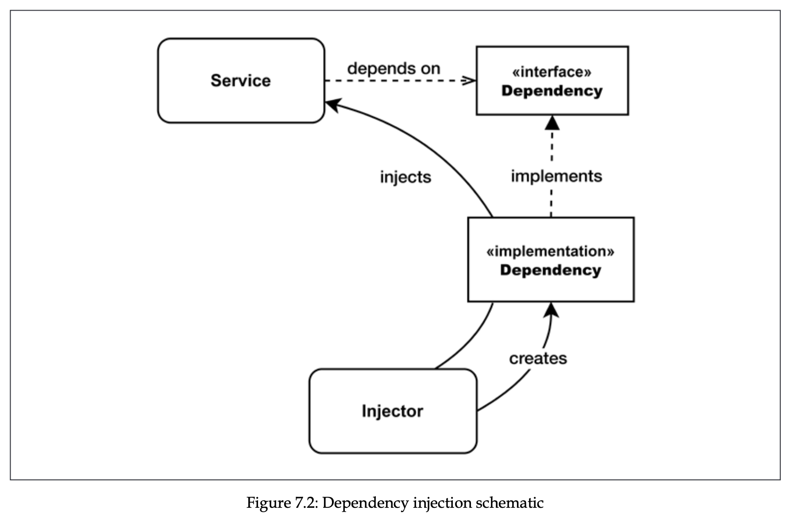

# Creational design patterns

- [Factory](#factory)
  - [Simple profiler](#simple-profiler)
- [Builder pattern](#builder-pattern)
- [Revealing pattern](#revealing-pattern)
  - [Immutable buffer](#immutable-buffer)
- [Singleton](#singleton-pattern)
- [Dependency Injection](#dependency-injection)
- [Inversion of control](#inversion-of-control)
- [Exercises](#exercises-for-patterns)

A design pattern is reusable solution to a recurring problem. It’s often associated with well-known set of object-oriented patterns that were popularized in the 90s by book _Design Patterns: Elements of Reusable Object-Oriented Software_, _Pearson Education._

Applying these design patterns in JavaScript is not simple. As we know JS is object-oriented, prototype-based, and with dynamic typing. These characteristics give JS a lot of power, but also enough freedom to create fragmentation of design patterns. Easy example is libraries and frameworks in ecosystem. This way there are also there are patterns that can be implemented in JS, which are not relevant in other languages.

## Factory

Factory pattern has ability of _separating the creation of an object from its implementation_, it allows us for ex to create an object whose class is determined at runtime. Factory allows us to expose a small surface area, so consumer doesn’t extend or manipulate it. It also allow us to force encapsulation with closures.

```jsx
const image = new Image("photo.jpeg");

// can be converted to:
function createImage(name) {
  return new Image(name);
}

// Why? Let's consider when we want to split Image class into multiple classses,
// depending on extension. With factory pattern, it's piece of cake.

function createImage(name) {
  if (name.match(/\.jpe?g$/)) {
    return new ImageJpeg(name);
  } else if (name.match(/\.gif$/)) {
    return new ImageGif(name);
  } else if (name.match(/\.png$/)) {
    return new ImagePng(name);
  } else {
    throw new Error("Unsupported format");
  }
}
```

We can enforce encapsulation by:

- Function scopes and closures

  ```jsx
  function createPerson(name) {
    const privateProperties = {};
    const person = {
      setName(name) {
        if (!name) {
          throw new Error("A person must have a name");
        }
        privateProperties.name = name;
      },
      getName() {
        return privateProperties.name;
      },
    };
    person.setName(name);
    return person;
  }
  ```

- Private fields

  ```jsx
  class Tree {
    #apple = "apple";

    getApple() {
      return this.#apple;
    }
  }
  ```

- Symbols
  [Explained here](https://2ality.com/2016/01/private-data-classes.html#using-symbols-as-keys-for-private-properties)

## Simple profiler

Let's say we have a profiler class that logs start and end time:

```jsx
class Profiler {
  constructor(label) {
    this.label = label;
    this.lastTime = null;
  }
  start() {
    this.lastTime = process.hrtime();
  }
  end() {
    const diff = process.hrtime(this.lastTime);
    console.log(
      `Timer "${this.label}" took ${diff[0]} seconds ` +
        `and ${diff[1]} nanoseconds.`
    );
  }
}
```

If we wanted it to log only in development mode, we would have to include this logic inside this class, or in the client side when we invoke it with new keyword.

Factory function offers better solution:

```jsx
const noopProfiler = {
  start() {},
  end() {},
};

function createProfiler(label) {
  if (process.env.NODE_ENV === "production") {
    return noopProfiler;
  }

  return new Profiler(label);
}
```

## Builder pattern

Builder pattern is creational pattern that simplifies creation of complex object or invocation of complex functions (takes many arguments).

Simple example is when we have Boat class, we have to pass many arguments there:

```jsx
class Boat {
  constructor(allParameters) {
    // ...
  }
}
const myBoat = new Boat({
  hasMotor: true,
  motorCount: 2,
  motorBrand: "Best Motor Co. ",
  motorModel: "OM123",
  hasSails: true,
  sailsCount: 1,
  sailsMaterial: "fabric",
  sailsColor: "white",
  hullColor: "blue",
  hasCabin: false,
});
```

Builder pattern simplifies it by creating object step by step. Also builder pattern is self-documenting. In our Boat class, if we pass hasMotor, we are not aware that we also need to pass other params related to motor, in which case documentation or even the code of class has to be read. Let’s see how builder pattern solves it:

```jsx
class BoatBuilder {
  withMotor(count, brand, model) {
    this.hasMotor = true;
    this.motorCount = count;
    this.motorBrand = brand;
    this.motorModel = model;
    return this;
  }
  withSails(count, material, color) {
    this.hasSails = true;
    this.sailsCount = count;
    this.sailsMaterial = material;
    this.sailsColor = color;
    return this;
  }
  hullColor(color) {
    this.hullColor = color;
    return this;
  }
  withCabin() {
    this.hasCabin = true;
    return this;
  }
  build() {
    return new Boat({
      hasMotor: this.hasMotor,
      motorCount: this.motorCount,
      motorBrand: this.motorBrand,
      motorModel: this.motorModel,
      hasSails: this.hasSails,
      sailsCount: this.sailsCount,
      sailsMaterial: this.sailsMaterial,
      sailsColor: this.sailsColor,
      hullColor: this.hullColor,
      hasCabin: this.hasCabin,
    });
  }
}

const myBoat = new BoatBuilder()
  .withMotor(2, "Best Motor Co. ", "OM123")
  .withSails(1, "fabric", "white")
  .withCabin()
  .hullColor("blue")
  .build();
```

So the rules for implementing Builder pattern are:

1. Break down complex construction into small and more readable steps.
2. Try to create builder methods that can set multiple related params at once.
3. Implicitly set params based on values of input, try to encapsulate param setting logic into setter methods so consumer doesn’t have to do so.
4. If necessary, it’s possible to further manipulate params, for example validating.

In JavaScript builder pattern is not limited to objects creation, it can also be used for functions invocations. But the difference is we have `invoke()` method, not `build()`.

## Revealing pattern

The revealing constructor pattern is the pattern that is originated from the NodeJS community, and is not used or popular in other languages. It lets us to reveal some functionalities of an object only at creation time. It’s useful when we want an object internals to be manipulated only at creation time. Benefits:

1. Creating objects that can be modified only at creation time
2. Creating objects whose custom behavior can be defined only at creation time
3. Creating objects that can be initialized only once at creation time

Skeleton for the pattern looks like the following:

```jsx
const object = new SomeClass((revealedMembers) => {
  // manipulation code
});

// where revealed members are private members that are
// accessible at creation time.
```

## Immutable buffer

Following example is example of immutable buffer, which exposes only properties and methods that don’t mutate the buffer. Buffer can be mutated only at construction, creation time.

```jsx
const MODIFIER_NAMES = ["write", "fill", "swap"];

export class ImmutableBuffer {
  constructor(size, executor) {
    const buffer = Buffer.alloc(size);
    const modifiers = {};

    for (const prop in buffer) {
      if (typeof buffer[prop] !== "function") {
        continue;
      }

      if (MODIFIER_NAMES.some((name) => prop.startsWith(name))) {
        modifiers[prop] = buffer[prop].bind(buffer);
      } else {
        this[prop] = buffer[prop].bind(buffer);
      }
    }

    executor(modifiers);
  }
}

const buffer = new ImmutableBuffer(16, ({ fill }) => {
  fill("okay");
});

console.log(buffer.toString()); // okayokayokayokay

// this raises error: buffer.write();
```

Other example is Promise class. It accepts resolve and reject callbacks to mutate internal state, and once created, state of promise cannot be altered. All we can do it receive fulfillment or rejection reason.

## Singleton pattern

Singleton pattern is popular in OOP. It allows us to create only one instance of an object, and centralize its access. It shares stateful info, optimizes resource usage, and synchronize access to resource. For example Database class. It doesn’t make sense to create new DB instance for every request, one instance can keep pool of db connections, and it may share stateful info. So we need only one such class across application.

```jsx
export class Database {
  constructor(dbName, connectionDetails) {
    // ...
  }
  // ...
}
```

In Node.JS its implementation is very simple.

```jsx
export const dbInstance = new Database("my-app-db", {
  url: "localhost:5432",
  username: "user",
  password: "password",
});
```

By doing this we export only one instance from the module, and consumers are left to only consume from this instance. As we know from module resolution chapter, Node.JS will cache the module, making sure not to execute its code at every import.

But there is caveat. The module is cached using its full path as a lookup key, meaning it’s guaranteed to be singleton ONLY in current package. If we have two packages in our application that imports our package (mydb package for example), it’s not singleton anymore, and if we compare the instances taken from these 2 packages, they are different. This case is rare, but it is possible.

```jsx
// mydb
export dbInstance = new Database();

// package-a , package-b
import { dbInstance } from "mydb";
export function getDbInstance() {
  return dbInstance;
}

// our program
import { getDbInstance as getDbFromA } from "package-a";
import { getDbInstance as getDbFromB } from "package-b";
const isSame = getDbFromA() === getDbFromB();
console.log(
  "Is the db instance in package-a the same " +
    `as package-b? ${isSame ? "YES" : "NO"}`
);

// NO
```

If two packages in node_modules folder share a package that is NOT compatible between each other, package manager like npm downloads two different versions to fix the error. If they share package that IS compatible between each other (for example ^2.0.1 and ^2.0.7), package manager would install it into the top-level node_modules directory (this practice is called dependency hoisting).

```jsx
global.dbInstance = new Database("my-app-db", {
  /*...*/
});
```

> However, most of the time we don’t need pure singleton, or our code is not for public package. We usually create and import singletons within the main package of an application or, at worst, in a subcomponent of the application that has been modularized into a dependency.

## Dependency injection

Dependency injection is pattern where dependencies of a component are provided as input by external entity, ofter referred as injector. Injector initializes components and ties their dependencies together. It improves decoupling, and dependent module can use any compatible dependency, and module can be used in many contexts differently with minimum effort.

Injector is responsible for creating actual instance that implements interface compatible with the dependency of service.



Rewritten Blog class now looks like the following. It is identical, but now db is not imported from another module, and instead expects a dependency. Injector, in this case client component that uses Blog class, should provide db as a dependency. It can be any class that implements [db.run](http://db.run) and db.all methods (referred as a duck typing).

```jsx
// blog.js

class Blog {
  constructor(db) {
    this.db = db;
    this.dbRun = promisify(db.run.bind(db));
    this.dbAll = promisify(db.all.bind(db));
  }
  // ... methods, which reference db as this.db
}

// db.js
// we can also refactor db module to be more reusable with factory

import sqlite3 from "sqlite3";
export function createDb(dbFile) {
  return new sqlite3.Database(dbFile);
}

// main.js

const db = createDb(/* filepath */);
const blog = new Blog(db);
// ...
```

Now Blog class is totally decoupled from db module, making it more composable and easy to test in isolation.

Dependency injection comes with its own price. Although we decoupled the modules, it may make it harder to understand the dependencies of a module in large projects. Also, we can see that db should have been instantiated before passing to Blog class. This means that we should manually build dependency graph of the application by hand, making everything in the right order.

> What we saw in this example is known as constructor injection. But dependencies can also be passed when invoking functions (function injection) or assigning relevant property of an object (property injection).

## Inversion of control

Inversion of control lets us to shift responsibility of wiring the modules of an application to third party entity. It can be service locator (component that can retrieve a dependency), or dependency injection container (system that injects the dependencies into component based on some metadata in code or config file).

- Example with service locator
  Service locator decides how to wire the dependencies, and consumer doesn’t instantiate them directly. This makes dependencies management more configurable. Consumers of service locator don’t register or manage services, but rather retrieve them.

  ```jsx
  class ServiceLocator {
    constructor() {
      this.services = new Map();
    }

    register(name, instance) {
      this.services.set(name, instance);
    }

    get(name) {
      if (!this.services.has(name)) {
        throw new Error("No such service");
      }

      return this.services.get(name);
    }
  }

  class Logger {
    log(message) {
      console.log(`Log: ${message}`);
    }
  }

  class Database {
    query(sql) {
      console.log(`Executing SQL: ${sql}`);
    }
  }

  // Register services
  const serviceLocator = new ServiceLocator();
  serviceLocator.register("logger", new Logger());
  serviceLocator.register("database", new Database());

  export default { serviceLocator };
  ```

- Example with dependency injection container

Following example uses awilix library to create container.

```jsx
import { createContainer, asClass } from "awilix";

class Database {
  query(sql) {
    console.log(`Executing query: ${sql}`);
  }
}

class UserService {
  constructor({ db }) {
    this.db = db;
  }

  getUser(id) {
    return this.db.query(`SELECT * FROM users WHERE id = ${id}`);
  }
}

const container = createContainer();

// Register services and components
container.register({
  db: asClass(Database).singleton(),
  userService: asClass(UserService),
});

// Resolve the UserService with its dependencies injected.
// In this step dependencies are already injected, because awilix
// look for the keys in constructor of userService, and maps
// dependencies to components passed to it.
const userService = container.resolve("userService");
userService.getUser(1);
```

## Exercises

- Console log factory

  Create a class called ColorConsole that has just one empty method called log(). Then, create three subclasses: RedConsole, BlueConsole, and GreenConsole. The log() method of every ColorConsole subclass will accept a string as input and will print that string to the console using the color that gives the name to the class. Then, create a factory function that takes color as input, such as 'red', and returns the related ColorConsole subclass. Finally, write a small command-line script to try the new console color factory. You can use this Stack Overflow answer as a reference for using colors in the console: nodejsdp.link/console-colors.

  ```jsx
  class ColorConsole {
    log(_message) {
      throw new Error("method log must be implemented in subclass");
    }
  }

  class RedConsole extends ColorConsole {
    // overriding parent class method
    log(message) {
      console.log("\x1b[31m", message);
    }
  }

  class BlueConsole extends ColorConsole {
    log(message) {
      console.log("\x1b[34m", message);
    }
  }

  class GreenConsole extends ColorConsole {
    log(message) {
      console.log("\x1b[32m", message);
    }
  }

  function createColorfulConsole(color) {
    if (color === "red") {
      return new RedConsole();
    } else if (color === "blue") {
      return new BlueConsole();
    } else if (color === "green") {
      return new GreenConsole();
    }

    throw new Error("Available colors are red, blur and green");
  }

  const specifiedColor = process.argv[2];
  const textToPrint = process.argv[3];
  const colorfulConsole = createColorfulConsole(specifiedColor);

  colorfulConsole.log(textToPrint);
  ```

- Request builder
  Create your own Builder class around the built-in http.request() function. The builder must be able to provide at least basic facilities to specify the HTTP method, the URL, the query component of the URL, the header parameters, and the eventual body data to be sent. To send the request, provide an invoke() method that returns a Promise for the invocation.

  ```jsx
  import http from "http";

  class HttpRequestBuilder {
    constructor() {
      this.method = "GET";
      this.url = "";
      this.queryParams = {};
      this.headers = {};
      this.body = null;
    }

    setMethod(method) {
      this.method = method.toUpperCase();
      return this;
    }

    setUrl(url) {
      this.url = url;
      return this;
    }

    setQueryParams(params) {
      this.queryParams = params;
      return this;
    }

    setHeaders(headers) {
      this.headers = headers;
      return this;
    }

    setBody(body) {
      this.body = body;
      return this;
    }

    _buildFullUrl() {
      const urlObj = new URL(this.url);
      for (const [key, value] of Object.entries(this.queryParams)) {
        urlObj.searchParams.append(key, value);
      }
      return urlObj.toString();
    }

    invoke() {
      return new Promise((resolve, reject) => {
        const fullUrl = this._buildFullUrl();
        const urlObj = new URL(fullUrl);

        const options = {
          hostname: urlObj.hostname,
          port: urlObj.port,
          path: urlObj.pathname + urlObj.search,
          method: this.method,
          headers: this.headers,
        };

        const req = http.request(options, (res) => {
          let responseData = "";

          res.on("data", (chunk) => {
            responseData += chunk;
          });

          res.on("end", () => {
            resolve({
              statusCode: res.statusCode,
              headers: res.headers,
              body: responseData,
            });
          });
        });

        req.on("error", (error) => {
          reject(error);
        });

        if (this.body) {
          req.write(this.body);
        }

        req.end();
      });
    }
  }
  ```

- A tamper-free queue

  Create a Queue class that has only one publicly accessible method called dequeue(). Such a method returns a Promise that resolves with a new element extracted from an internal queue data structure. If the queue is empty, then the Promise will resolve when a new item is added. The Queue class must also have a revealing constructor that provides a function called enqueue() to the executor that pushes a new element to the end of the internal queue. The enqueue() function can be invoked asynchronously and it must also take care of "unblocking" any eventual Promise returned by the dequeue() method. To try out the Queue class, you could build a small HTTP server into the executor function. Such a server would receive messages or tasks from a client and would push them into the queue. A loop would then consume all those messages using the dequeue() method.

  ```jsx
  class Queue {
    queue = [];
    resolvers = [];

    constructor(executor) {
      const enqueue = (item) => {
        if (this.resolvers.length > 0) {
          this.resolvers.pop()(item);
        } else {
          this.queue.push(item);
        }
      };

      executor(enqueue);
    }

    dequeue() {
      return new Promise((resolve) => {
        if (this.queue.length === 0) {
          this.resolvers.push(resolve);
        } else {
          resolve(this.queue.shift());
        }
      });
    }
  }
  ```
