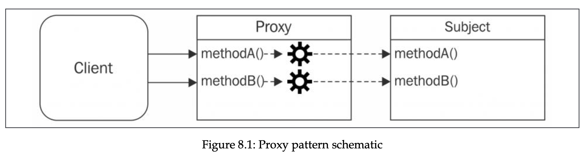
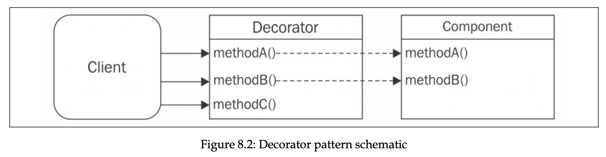
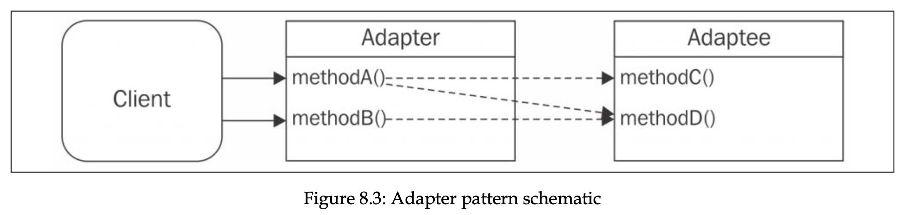

# Structural design patterns

- [Proxy, surrogate](#proxy-surrogate)
  - [Object composition](#object-composition)
  - [Object augmentation, monkey patching](#object-augmentation-monkey-patching)
  - [Built in proxy object](#built-in-proxy-object)
- [Decorator](#decorator)
  - [Difference from Proxy](#difference-from-proxy)
- [Adapter](#adepter)
- [Structural design patterns conclusion](#structural-design-patterns-conclusion)
- [Structural design patterns exercises](#structural-design-patterns-exercises)

Structural design patterns focus on providing ways to realize relationships between entities.

## Proxy (surrogate)

A proxy is an object that controls access to another object, called subject. It has same interface as subject, and intercepts all operations meant to be executed on subject, augmenting or complementing its behavior.



Proxy can be used for data validation, security checks, caching, lazy initialization (when subject is expensive, and creating it when it’s really needed), logging (params for example), remote objects (take a remote object and make it appear local).

```jsx
class StackCalculator {
  constructor() {
    this.stack = [];
  }
  putValue(value) {
    this.stack.push(value);
  }
  getValue() {
    return this.stack.pop();
  }
  peekValue() {
    return this.stack[this.stack.length - 1];
  }
  clear() {
    this.stack = [];
  }
  divide() {
    const divisor = this.getValue();
    const dividend = this.getValue();
    const result = dividend / divisor;
    this.putValue(result);
    return result;
  }
  multiply() {
    const multiplicand = this.getValue();
    const multiplier = this.getValue();
    const result = multiplier * multiplicand;
    this.putValue(result);
    return result;
  }
}
```

As we know, in JavaScript if we divide by zero, we get Infinity. It’s not common for other languages, so lets make behavior same here. Let’s use proxy pattern with stack calculator to make division throw an error if divided by 0.

## Object composition

Following solution uses object composition technique, which is combining object with another object in purpose of extending it or using its functionality. In case of proxy pattern, new object with same interface is created, and reference to subject is stored internally. Subject can be created by proxy itself, or injected by the client.

```jsx
class SafeCalculator {
  constructor(calculator) {
    this.calculator = calculator;
  }
  // proxied method
  divide() {
    // additional validation logic
    const divisor = this.calculator.peekValue();
    if (divisor === 0) {
      throw Error("Division by 0");
    }
    // if valid delegates to the subject
    return this.calculator.divide();
  }
  // delegated methods
  putValue(value) {
    return this.calculator.putValue(value);
  }
  getValue() {
    return this.calculator.getValue();
  }
  peekValue() {
    return this.calculator.peekValue();
  }
  clear() {
    return this.calculator.clear();
  }
  multiply() {
    return this.calculator.multiply();
  }
}

// or with factory

function createSafeCalculator(calculator) {
  return {
    // proxied method
    divide() {
      // additional validation logic
      const divisor = calculator.peekValue();
      if (divisor === 0) {
        throw Error("Division by 0");
      }
      // if valid delegates to the subject
      return calculator.divide();
    },
    // delegated methods
    putValue(value) {
      return calculator.putValue(value);
    },
    getValue() {
      return calculator.getValue();
    },
    peekValue() {
      return calculator.peekValue();
    },
    clear() {
      return calculator.clear();
    },
    multiply() {
      return calculator.multiply();
    },
  };
}
```

As we can see, we delegate many methods to the original methods of the subject. In more complex scenarios, this might lead to a lot of code.

Object properties can be delegated with Object.defineProperty. In our calculator, constructor would look like:

```jsx
constructor(calculator) {
    this.calculator = calculator;
    Object.defineProperty(this, "stack", {
      value: calculator.stack,
    });
  }
```

## Object augmentation (monkey patching)

This technique involves modifying subject directly by replacing method with its proxied implementation.

```jsx
function patchToSafeCalculator(calculator) {
  const divideOrig = calculator.divide;
  calculator.divide = () => {
    // additional validation logic
    const divisor = calculator.peekValue();
    if (divisor === 0) {
      throw Error("Division by 0");
    }
    // if valid delegates to the subject
    return divideOrig.apply(calculator);
  };
  return calculator;
}

const calculator = new StackCalculator();
const safeCalculator = patchToSafeCalculator(calculator);
```

Here we don’t have to delegate all other methods. Simplicity comes with cost. We are mutating the subject directly, which is dangerous. Such technique should be avoided, or used when such component is in private scope, because if it’s shared with other components, this might lead to undesirable side effects. When other components divide by zero, they now have error thrown, not infinity.

## Built-in Proxy object

The ES2015 spec introduced native way to create proxy objects with Proxy constructor that accepts target and handler arguments. Target is the subject, and handler defines behavior of proxy. Handler is an object with predefined methods called traps (for getting, setting, and defining properties), that are called when corresponding operation is performed on proxy instance.

Our safe calculator would look like this with Proxy constructor:

```jsx
const calculator = new StackCalculator();
const safeCalculator = new Proxy(calculator, {
  get: (target, method) => {
    // redefine proxied method
    if (method === "divide") {
      return () => {
        const divisor = target.peekValue();
        if (divisor === 0) {
          throw new Error("Division by 0, Carl");
        }
        // else delegate to original method
        target.divide();
      };
    }

    // delegate other methods
    return target[method];
  },
});
```

This is clearly better than our older solutions.

Proxy constructor comes with many patterns that can be used, for example next example uses it to virtualize an array:

```jsx
const evenNumbers = new Proxy([], {
  get: (_, index) => index * 2,
  has: (_, index) => index % 2 === 0,
  set: (_, _) => "i dont allow you",
});

console.log(2 in evenNumbers); // true
console.log(3 in evenNumbers); // false
console.log(evenNumbers[8]); // 16
console.log((evenNumbers[3] = 3)); // 3
console.log(evenNumbers); // []
```

Other traps include set, delete, and construct, and allows us to create proxies that can be revoked on demand, disable all the traps and restore original behavior.

Downside of Proxy class is that it cannot be transpiled (convert to equivalent with older syntax) or polyfilled (provide implementation in plain JS for where API is not available), because some of the traps can only be implemented at runtime level and cannot be rewritten in another in plain JS.

- Example with stream

  In this example, we are intercepting call to write method. Note that proxiedWritable.end closes original stream, because proxy is not another instance, but the original instance itself.

  ```jsx
  import { createWriteStream } from "fs";

  function createLoggingWritable(writable) {
    return new Proxy(writable, {
      get(target, method) {
        if (method === "write") {
          return (...args) => {
            const [chunk] = args;
            console.log("Writing", chunk);
            target.write(...args);
          };
        }

        return target[method];
      },
    });
  }

  const writable = createWriteStream("test.txt");
  const proxiedWritable = createLoggingWritable(writable);

  proxiedWritable.write("with log hello");
  proxiedWritable.write("with log there");
  writable.write("no log ok");
  proxiedWritable.end();
  ```

- Example with change observer

  Proxy is effective to create observable objects. Observer pattern from chapter 3 is broader term. Here, this pattern allows us to detect property changes.
  Also observables are cornerstone to reactive programming and functional reactive programming.

  ```jsx
  const createObservable = (target, observer) => {
    const observable = new Proxy(target, {
      set(target, key, value) {
        if (value !== target[key]) {
          const prev = target[key];
          target[key] = value;
          observer({ key, prev, curr: value });
        }
        return true;
      },
    });

    return observable;
  };

  function calculateTotal(invoice) {
    return invoice.subtotal - invoice.discount + invoice.tax;
  }
  const invoice = {
    subtotal: 100,
    discount: 10,
    tax: 20,
  };
  let total = calculateTotal(invoice);
  console.log(`Starting total: ${total}`);

  const obsInvoice = createObservable(invoice, ({ key, prev, curr }) => {
    total = calculateTotal(invoice);
    console.log(`TOTAL: ${total} (${key} changed: ${prev} ->
    ${curr})`);
  });

  obsInvoice.subtotal = 200;
  console.log(`Final total: ${total}`);
  ```

In the wild Proxy pattern is implemented in popular projects like LoopBack, Vue.JS v3, MobX and others.

## Decorator

Decorator pattern consists of dynamically augmenting behavior of existing object. Only instances that are explicitly decorated has something modified, not all instances. It looks like Proxy, but instead of augmenting, it adds new functionality. Sometimes, however, it might also augment with extra behaviors.



Following examples use StackCalculator we wrote earlier. Example have same caveats we discussed earlier. Lets add new add method.

- Example with composition
  In this case, decorator is EnhancedCalculator itself, and it needs to add new method.

  ```jsx
  class EnhancedCalculator {
    constructor(calculator) {
      this.calculator = calculator;
    }

    add() {
      const addend2 = this.getValue();
      const addend1 = this.getValue();
      const result = addend1 + addend2;
      this.putValue(result);
      return result;
    }

    // delegated methods
    putValue(value) {
      return this.calculator.putValue(value);
    }

    // ... other delegations
  }
  ```

- Example with object augmentation
  Object augmentation can be achieved by simply attaching new method to decorator object (monkey patching). Function is a decorator.

  ```jsx
  function patchCalculator(calculator) {
    calculator.add = function () {
      const addend2 = calculator.getValue();
      const addend1 = calculator.getValue();
      const result = addend1 + addend2;
      calculator.putValue(result);
      return result;
    };

    return calculator;
  }
  ```

- Example with Proxy object
  It’s also possible to implement object decoration with Proxy object.

  ```jsx
  const enhancedCalculatorHandler = {
    get(target, property) {
      if (property === "add") {
        return () => {
          const addend2 = target.getValue();
          const addend1 = target.getValue();
          const result = addend1 + addend2;
          target.putValue(result);
          return result;
        };
      }

      return target[property];
    },
  };
  ```

- Example with LevelUP
  LevelUP is a Node.js wrapper around Google's LevelDB,a key-value store originally built to implement IndexedDB in the Chrome browser. It’s minimal, extensible, and very fast, provides only minimum functionality. It now supports from in-memory DBs to NoSQL DBs like Redis and web storage engines like indexedDB and localStorage (yes, with same API). Complete DBs are also built on it, like PouchDB or LevelGraph.
  Following example is a plugin for LevelUP, which uses Object augmentation method of decoration.

  ```jsx
  import { Level } from "level";
  import { dirname, join } from "path";
  import { fileURLToPath } from "url";

  const levelSubscribe = (db) => {
    db.subscribe = (pattern, listener) => {
      db.on("put", (key, val) => {
        const match = Object.keys(pattern).every((k) => {
          return pattern[k] === val[k];
        });

        if (match) {
          listener(key, val);
        }
      });
    };
  };

  const __dirname = dirname(fileURLToPath(import.meta.url));
  const dbPath = join(__dirname, "db");
  const db = new Level(dbPath, { valueEncoding: "json" });

  levelSubscribe(db);

  db.subscribe({ doctype: "tweet", language: "en" }, (k, val) =>
    console.log(val)
  );

  db.put("1", {
    doctype: "tweet",
    text: "Hi",
    language: "en",
  }); // logged

  db.put("2", {
    doctype: "company",
    name: "ACME Co.",
  }); // not logger
  ```

Pattern of decorator is widely used, and examples include plugins for LevelUP, Fastify web app framework, json-socket library and many others.

## Difference from Proxy

These 2 are sometimes interchangeable tools, and even names are used interchangeably sometimes. In JavaScript, where types are dynamic, the differences might be blurry. It is more obvious in statically typed languages.

The decorator pattern is defined as a mechanism that allows us to enhance existing object with new behavior, while Proxy pattern is used to control access to a concrete or virtual object. It doesn’t change the interface. We can pass proxied object to context where it expects original object, but with decorator this doesn’t work (for statically typed languages, of course). Difference is in the way they are used at runtime.

## Adepter

Adapter pattern allows us to access functionality of object using different interface. Simple example is device, that allows us to plug USB type A into USB type C port.

The Adapter pattern is used to take the interface of an object (the **adaptee**) and make it compatible with another interface that is expected by a given client.



- Example with LevelUP
  Let’s make an adapter for LevelUP db. It lets the client to use LevelUP db with interface of fs module (which is originally adapter).

  ```jsx
  import { resolve } from "path";

  export function createFSAdapter(db) {
    return {
      readFile(filename, options, callback) {
        if (typeof options === "function") {
          callback = options;
          options = {};
        } else if (typeof options === "string") {
          options = { encoding: options };
        }
        db.get(
          resolve(filename),
          {
            valueEncoding: options.encoding,
          },
          (err, value) => {
            if (err) {
              if (err.type === "NotFoundError") {
                err = new Error(`ENOENT, open "${filename}"`);
                err.code = "ENOENT";
                err.errno = 34;
                err.path = filename;
              }
              return callback && callback(err);
            }
            callback && callback(null, value);
          }
        );
      },
      writeFile(filename, contents, options, callback) {
        if (typeof options === "function") {
          callback = options;
          options = {};
        } else if (typeof options === "string") {
          options = { encoding: options };
        }
        db.put(
          resolve(filename),
          contents,
          {
            valueEncoding: options.encoding,
          },
          callback
        );
      },
    };
  }
  ```

  This adapter is not perfect and handles well not all situations, but the concept is understandable. We create different interface for the client that uses LevelUP with another interface, interface of fs module. It might look unnecessary, but let’s not forget that LevelDB can be used in both browser (with level-js) and Node.JS thanks to adapters.

## Structural design patterns conclusion

Proxy, Decorator and Adapter are quite similar in implementation, but the difference is in the perspective of consumer. Proxy provides same interface, Decorator provides enhanced interface, and Adapter provides different interface.

## Structural design patterns exercises

- HTTP client cache
  Write a proxy for your favorite HTTP client library that caches the response of a given HTTP request, so that if you make the same request again, the response is immediately returned from the local cache, rather than being fetched from the remote URL

  ```jsx
  const createCacheableFetch = () => {
    const cache = new Map();

    return new Proxy(fetch, {
      apply: async (target, _, args) => {
        const [url, ...rest] = args;

        if (cache.has(url)) {
          console.log("CACHE HIT");
          return cache.get(url);
        }

        console.log("CACHE MISS");
        const response = await target(url, rest);
        cache.set(url, response);
      },
    });
  };
  ```

  Implementation above doesn’t cover pending requests. Usage example is below:

  ```jsx
  const cacheableFetch = createCacheableFetch();

  await cacheableFetch("https://jsonplaceholder.typicode.com/posts/1", {
    method: "GET",
  });

  await cacheableFetch("https://jsonplaceholder.typicode.com/posts/1", {
    method: "GET",
  });

  await cacheableFetch("https://jsonplaceholder.typicode.com/posts/1", {
    method: "GET",
  });

  await cacheableFetch("https://jsonplaceholder.typicode.com/posts/1", {
    method: "GET",
  });

  await cacheableFetch("https://jsonplaceholder.typicode.com/posts/1", {
    method: "GET",
  });
  ```

- Timestamped logs
  Create a proxy for the console object that enhances every logging function (log(), error(), debug(), and info()) by prepending the current timestamp to the message you want to print in the logs. For instance, executing consoleProxy.log('hello') should print something like 2020-02-18T15:59:30.699Z hello in the console.

  ```jsx
  const createTimeConsole = () => {
    return new Proxy(console, {
      get(target, method) {
        const timestamp = new Date();

        return target[method].bind(null, timestamp);
      },
    });
  };

  const timeConsole = createTimeConsole(console);
  timeConsole.log("hello");
  ```

- Colored console output
  Write a decorator for the console that adds the red(message), yellow(message), and green(message) methods. These methods will have to behave like console.log(message) except they will print the message in red, yellow, or green, respectively. In one of the exercises from the previous chapter, we already pointed you to some useful packages to to create colored console output.

  ```jsx
  // with proxy
  const createColorfulConsole = () => {
    return new Proxy(console, {
      get(target, method) {
        if (method === "red") {
          return (message) => console.log("\x1b[31m", message);
        } else if (method === "green") {
          return (message) => console.log("\x1b[32m", message);
        } else if (method === "blue") {
          return (message) => console.log("\x1b[34m", message);
        }

        return target[method];
      },
    });
  };

  const colorfulConsole = createColorfulConsole();
  colorfulConsole.red("red");
  colorfulConsole.green("green");
  colorfulConsole.blue("blue");
  ```

  ```jsx
  // with augmenting
  const augmentConsoleToColorful = () => {
    console.red = (message) => {
      console.log("\x1b[31m", message);
    };

    console.green = (message) => {
      console.log("\x1b[32m", message);
    };

    console.blue = (message) => {
      console.log("\x1b[34m", message);
    };
  };

  augmentConsoleToColorful();
  console.red("red");
  console.blue("blue");
  console.green("green");
  ```

- Virtual filesystem
  Modify our LevelDB filesystem adapter example to write the file data in memory rather than in LevelDB. You can use an object or a Map instance to store the key-value pairs of filenames and the associated data.

  ```jsx
  import { resolve } from "path";

  /**
   * @param {Map} store
   */
  export function createMemoryAdapter(store) {
    return {
      readFile(filename, options, callback) {
        if (typeof options === "function") {
          callback = options;
          options = {};
        } else if (typeof options === "string") {
          options = { encoding: options };
        }

        const key = resolve(filename);

        if (!store.has(key)) {
          const error = new Error(`ENOENT, open "${filename}"`);
          error.code = "ENOENT";
          error.errno = 34;
          error.path = filename;

          return callback && callback(error);
        }

        callback(null, store.get(key));
      },
      writeFile(filename, contents, options, callback) {
        if (typeof options === "function") {
          callback = options;
          options = {};
        } else if (typeof options === "string") {
          options = { encoding: options };
        }

        const key = resolve(filename);
        store.set(key, contents);
      },
    };
  }
  ```

- The lazy buffer
  Can you implement createLazyBuffer(size), a factory function that generates a virtual proxy for a Buffer of the given size? The proxy instance should instantiate a Buffer object (effectively allocating the given amount of memory) only when write() is being invoked for the first time. If no attempt to write into the buffer is made, no Buffer instance should be created.

  ```jsx
  const createLazyBuffer = (size) => {
    let buffer = null;

    return new Proxy(
      {},
      {
        get(_, method) {
          if (method === "write" && !buffer) {
            buffer = Buffer.alloc(size);
          } else if (!buffer) {
            throw new Error("Data should be written to buffer first");
          }

          return buffer[method].bind(buffer);
        },
      }
    );
  };

  const buffer = createLazyBuffer(10);
  buffer.write("hi", "utf-8");
  buffer.write("ok", "utf-8");
  buffer.write("hey", "utf-8");
  console.log(buffer.toString());
  ```
