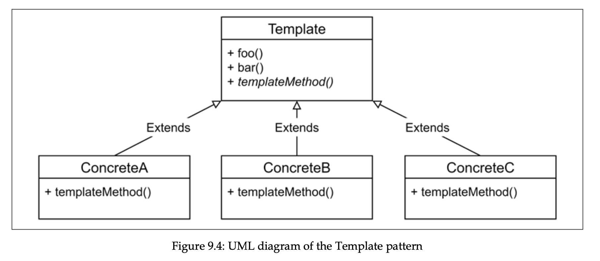

# Behavioral design patterns

- [Strategy](#strategy)
- [State](#state)
- [Template](#template)
- [Iterator](#iterator)
  - [Iterable protocol](#iterable-protocol)
  - [Generators](#generators)
  - [Async iterators](#async-iterators)
  - [Async generators](#async-generators)
  - [Async iterators and Node.JS streams](#async-iterators-and-nodejs-streams)
  - [In the wild](#in-the-wild)
- [Middleware](#middleware)
- [Command](#command)
- [Exercises](#exercises-for-behavioral-design-patterns)

In last chapter we learnt about patterns that help us in building complex data structures. Now we will see how to combine these complex components, defining extensible, modular and reusable structures. One member of this family is Observer pattern we learnt in chapter 3.

## Strategy

Strategy pattern enables object, called context, to support variations in its logic by extracting the variable parts into separate, interchangeable objects, called strategies. The context itself implements common logic of algorithms, while strategy implements mutable parts, allowing context to adapt its behavior depending on different factors. All of strategies implement same interface expected by the context.


Simple analogy is a car. We have a car, and its tires are changed based on the weather conditions. We don’t want to change entire car to have different tires, or have one car with all tires inside for just in case.

Real example is Order object, which has pay method. We can have many payment methods, and we fill the method with if else conditions. We can delegate the logic of payment to a strategy objects that implement this logic, each strategy for each payment method. This makes context (Order object) to manage only to manage rest of stuff.

- Another example

  Let’s say we want to have a Config object, that stores config in serialized way, and deserializes when retrieved. Config can be in various formats.

  ```jsx
  // strategies/json.js

  export const jsonStrategy = {
    serialize: JSON.stringify,
    deserialize: JSON.parse,
  };

  // strategies/(other config formats)

  // config.js

  export class Config {
    constructor(formatStrategy) {
      this.data = {};
      this.formatStrategy = formatStrategy;
    }

    get() {
      return this.formatStrategy.deserialize(this.data);
    }

    set(data) {
      this.data = this.formatStrategy.serialize(data);
    }
  }

  // index.js

  const config = new Config(jsonStrategy);
  config.set({ hello: "hi" });
  console.log(config.get());
  ```

  Implementation may differ, but the concept is the same. We could also create separate family for serializers and deserializers.

> Difference between adapter pattern is that, in adapter pattern, adapter doesn’t add any behavior to the adaptee, it just makes available under other interface. In strategy pattern, however, context and strategies implement different parts of the logic, and both are essential to build final algorithm when combined.

In the wild this pattern is used in [passport package](http://nodejsdp.link/passportjs), which provides different authentication schemes. All these schemes are implemented as strategies. Note that [there are 539 strategies](https://www.passportjs.org/packages/). 539 CARL!!!

## State

State pattern is strategy pattern, but in this case strategy is not “hardcoded” in the lifespan of an object. It (strategy, or state in this case) changes dynamically, based on state it’s in.


Simple example is Reservation class. It may be in 3 states: unconfirmed - user can confirm, delete, but not cancel. Confirmed - user can cancel only, and date-approaching - user can do nothing. This is perfect case for state pattern. Changing state to another simply requires activation of another different strategy. This state can be controlled by context object, but its better to let state object itself control it.


- Example program

  Following program is safe version of tcp, which changes its state based on the connection status to the server. We use json-over-tcp-2 to easily transmit json over tcp.

  ```jsx
  // index.js

  import { OfflineState } from "./offlineState.js";
  import { OnlineState } from "./onlineState.js";
  export class FailsafeSocket {
    constructor(options) {
      this.options = options;
      this.queue = [];
      this.currentState = null;
      this.socket = null;
      this.states = {
        offline: new OfflineState(this),
        online: new OnlineState(this),
      };
      this.changeState("offline");
    }
    changeState(state) {
      console.log(`Activating state: ${state}`);
      this.currentState = this.states[state];
      this.currentState.activate();
    }
    send(data) {
      this.currentState.send(data);
    }
  }
  ```

  ```jsx
  // onlineState.js
  export class OnlineState {
    constructor(failsafeSocket) {
      this.failsafeSocket = failsafeSocket;
      this.hasDisconnected = false;
    }
    send(data) {
      this.failsafeSocket.queue.push(data);
      this._safeWrite(data);
    }
    _safeWrite(data) {
      this.failsafeSocket.socket.write(data, (err) => {
        if (!this.hasDisconnected && !err) {
          this.failsafeSocket.queue.shift();
        }
      });
    }
    activate() {
      this.hasDisconnected = false;
      for (const data of this.failsafeSocket.queue) {
        this._safeWrite(data);
      }
      this.failsafeSocket.socket.once("error", () => {
        this.hasDisconnected = true;
        this.failsafeSocket.changeState("offline");
      });
    }
  }
  ```

  ```jsx
  import jsonOverTcp from "json-over-tcp-2";
  export class OfflineState {
    constructor(failsafeSocket) {
      this.failsafeSocket = failsafeSocket;
    }
    send(data) {
      this.failsafeSocket.queue.push(data);
    }
    activate() {
      const retry = () => {
        setTimeout(() => this.activate(), 1000);
      };
      console.log("Trying to connect...");
      this.failsafeSocket.socket = jsonOverTcp.connect(
        this.failsafeSocket.options,
        () => {
          console.log("Connection established");
          this.failsafeSocket.socket.removeListener("error", retry);
          this.failsafeSocket.changeState("online");
        }
      );
      this.failsafeSocket.socket.once("error", retry);
    }
  }
  ```

  Then we activate both server and client codes. Server just listens and logs data received from the client, while client establishes safe socket and writes to it.

  ```jsx
  // server.js

  import jsonOverTcp from "json-over-tcp-2";

  const server = jsonOverTcp.createServer({ port: 5000 });
  server.on("connection", (socket) => {
    socket.on("data", (data) => {
      console.log("Client data", data);
    });
  });

  server.listen(5000, () => console.log("Server started"));
  ```

  ```jsx
  // client.js

  import { FailsafeSocket } from "./index.js";

  const failsafeSocket = new FailsafeSocket({ port: 5000 });

  setInterval(() => {
    failsafeSocket.send(process.memoryUsage());
  }, 1000);
  ```

## Template

Template pattern is like Strategy pattern. It implements skeleton (common parts), while letting other parts to be defined by the class using template, which fill the gaps for template methods (missing parts). The only difference is strategy of consumer is determined when it’s defined, it’s not dynamic like in Strategy pattern, and strategies are not baked in one component.

It’s more of type OOP rather those we considered earlier, because it relies on inheritance.



In JavaScript we don’t have any way to define abstract classes (we do in TypeScript), so only way is to throw runtime Error if method is not redefined.

- Example

  ```jsx
  import { promises as fsPromises } from "fs";
  import objectPath from "object-path";

  export class ConfigTemplate {
    async load(file) {
      console.log(`Deserializing from ${file}`);
      this.data = this._deserialize(await fsPromises.readFile(file, "utf-8"));
    }
    async save(file) {
      console.log(`Serializing to ${file}`);
      await fsPromises.writeFile(file, this._serialize(this.data));
    }
    get(path) {
      return objectPath.get(this.data, path);
    }
    set(path, value) {
      return objectPath.set(this.data, path, value);
    }

    // template methods, need to be redefined.
    _serialize() {
      throw new Error("_serialize() must be implemented");
    }
    _deserialize() {
      throw new Error("_deserialize() must be implemented");
    }
  }

  export class JsonConfig extends ConfigTemplate {
    _deserialize(data) {
      return JSON.parse(data);
    }
    _serialize(data) {
      return JSON.stringify(data, null, "  ");
    }
  }

  const jsonConfig = new JsonConfig();
  ```

In practice this pattern is widely used. For example, when coding with streams, we had to override \_read or \_write methods of abstract Readable or Writable classes. This fit into template pattern.

## Iterator

Iterator pattern is common so that programming langs implement built-in iterators, including javascript. Built-in iterators provide interface to iterate over containers, such as arrays. But iterator pattern provides interface to iterate over any type of a container, and thus hiding details about algorithms used inside. In JavaScript, iterators also work greatly with event emitters and streams. So accurate definition is iterator provide interface to iterate over elements retrieved in a sequence.

In JS, Iterator pattern is implemented through protocols, so shape of interaction between implementer and consumer of the Iterator will agreed in advance. In JS, iterator is protocol that defines interface that produces sequence of values, which basically implement a next() method. Each time this method is called, it returns two properties - `done` (optional, can be undefined) is set to true if iteration is finished, and there is nothing more to iterate, and `value` that includes the retrieved value. If `done` is true, `value` can be set to other arbitrary values, such as iteration total time and others (additional properties will be ignored by built-in APIs consuming iterator).

In fact there are infinite iterators, such as returning next random number, or next number of Fibonacci series, so `done` property can be omitted here.

Some iterators can be stateful, or stateless, depending on situation. In following example we keep state in a closure.

Also iterators can specify two methods, `return([value])` and `throw(error)` . First signals iterator that consumer has stopped iteration before its completion, while second allows consumer to say that error condition occurred. These are also included in TS typings.

- Example

  ```jsx
  const A_CHAR_CODE = 65;
  const Z_CHAR_CODE = 90;

  function createAlphabetIterator() {
    let cursor = A_CHAR_CODE;

    return {
      next() {
        if (cursor > Z_CHAR_CODE) {
          return { done: true };
        }

        const value = String.fromCharCode(cursor);
        cursor++;
        return { value };
      },
    };
  }

  // usage

  const iterator = createAlphabetIterator();

  let iterationResult = iterator.next();
  while (!iterationResult.done) {
    console.log(iterationResult.value);
    iterationResult = iterator.next();
  }
  ```

## Iterable protocol

Iterable protocol defines a standard way for an object to return an iterator. Such objects are called iterables, usually it’s container of elements, but it can be an object representing set of elements. We can implement iterable by implementing `@@iterator` method, or in other words, a method that is accessible through `Symbol.iterator`.

> `@@name` means well-known symbol according to ES spec, more [here](https://262.ecma-international.org/6.0/#sec-well-known-symbols).

Such `@@iterator` method should return an iterator object, which can be used to iterate over the elements in iterable. Reminder: iterator object coming from `@@iterator` method should have `next()` function specified, as said in protocol.

```jsx
class MyIterable {
  [Symbol.iterator]() {
    return {
      next() {
        // iteration code
      },
    };
  }
}

function myIterable() {
  return {
    [Symbol.iterator]() {
      return {
        next() {
          // iteration code
        },
      };
    },
  };
}
```

Now the cool part, the point of such interfaces is that iterables is native JavaScript interface to iterate over the elements, native APIs are accessible for us. We can use for example `for of` loop to iterate over the elements in iterator, or spread operator, or destructuring. Here are accessible APIs:

1. `Map([iterable])`
2. `WeakMap([iterable])`
3. `Set([iterable])`
4. `WeakSet([iterable])`
5. `Promise.all([iterable])`
6. `Promise.race([iterable])`
7. `Array.from([iterable])`
8. `stream.Readable.from(iterable, [options])`

There are many JS APIs that implement `@@iterable` method, including Array, Map, Set, String and Buffer. Yes, that is mind-blowing, at least for me.

- Example

  ```jsx
  const A_CHAR_CODE = 65;
  const Z_CHAR_CODE = 90;

  function createAlphabetIterator() {
    let cursor = A_CHAR_CODE;

    return {
      [Symbol.iterator]: () => {
        return {
          next() {
            if (cursor > Z_CHAR_CODE) {
              return { done: true };
            }

            const value = String.fromCharCode(cursor);
            cursor++;
            return { value };
          },
        };
      },
    };
  }

  for (const element of createAlphabetIterator()) {
    console.log(element);
  }
  ```

- Example

  ```jsx
  function createCountIterator(limit) {
    let count = 0;

    return {
      [Symbol.iterator]() {
        return {
          next() {
            if (count >= limit) {
              return { done: true };
            }

            count++;
            return { value: count };
          },
        };
      },
    };
  }

  const countIterator = createCountIterator(10);
  console.log(...countIterator);
  ```

## Generators

Generators (or semicoroutines) were introduced in ES2015 spec, and are closely related to iterators. They are generalization of standard functions, in which they can have different entry points, rather one as in functions, which is invocation of the function. Generators can be suspended and resumed later. Generator object returned by generator function is indeed both an iterator and iterable.

To define it we use syntax `function* name() {}`. Invocation of it will return generator object (both iterable and iterator), and doesn’t execute its body immediately. Invoking `next()` on generator object will start or resume execution of the body until `yield` instruction is invoked, in which case `{ done: false, value: yield value }` is returned. When function body explicitly or implicitly returns, it returns `{ done: true, value: return value }`.

```jsx
function* myGenerator() {
  yield "1";
  yield "2";
  yield "3";
  return "end";
}

const generator = myGenerator();
console.log(generator.next()); // { value: '1', done: false }
console.log(generator.next()); // { value: '2', done: false }
console.log(generator.next()); // { value: '3', done: false }
console.log(generator.next()); // { value: 'end', done: true }
```

Since generator is also iterable, we can iterator over it with `for ... of` loop. But note that return value is not logged, because it’s not yielded, but instead returned, which says that iteration is complete with “end” value.

```jsx
const generator = myGenerator();
for (const element of generator) {
  console.log(element);
}
```

We can also control the generator iterator (we couldn’t in iterators) by passing arguments. Such argument is passed as the return value of the `yield` instruction. When we invoke `generator.next()` for the first time, it stops in the first `yield`, and when invoked second time with argument, generator starts from where it stopped, but this time assigns argument to the variable. In the result, in second time invocation, we get “Hello world”.

```jsx
function* myGenerator() {
  const what = yield null;
  yield `Hello ${what}`;
}

const generator = myGenerator();
generator.next();
console.log(generator.next("World"));
```

There are two extra methods in generator object: `throw()` and `return()`. First throws passed exception as it was thrown in the place of last `yield`, and returns the iterator with `done` and `value` properties. Second forces generator to terminate and return with object like `{ done: true, value: returnArgument }`, where `returnArgument` is value passed to the method.

```jsx
function* myGenerator() {
  try {
    const what = yield null;
    yield `Hello ${what}`;
  } catch (error) {
    // if yield, done is false
    // if return, done is true
    yield `Error: ${error.message}`;
  }
}

const generatorWithError = myGenerator();
generatorWithError.next();
const errorResponse = generatorWithError.throw(new Error("some error"));
console.log(errorResponse); // { value: 'Error: some error', done: true }

const generatorWithReturn = myGenerator();
generatorWithReturn.next();
const res = generatorWithReturn.return("return value");
// return always returns done: true
console.log(res); //{ value: 'return value', done: true }
```

`yield` instruction also accepts iterable, in which case it loop over element of iterable and yield each element one by one. Syntax is `yield* iterable`.

```jsx
function* myGenerator() {
  yield* [1, 2, 3];
}

const generator = myGenerator();
console.log(generator.next()); // { value: 1, done: false }
console.log(generator.next()); // { value: 2, done: false }
console.log(generator.next()); // { value: 3, done: false }
console.log(generator.next()); // { value: undefined, done: true }
```

Because generators are also iterables (object we obtain from the generator function implements `Symbol.iterator` method), we can refactor createAlphabet Iterator function to the following:

```jsx
const A_CHAR_CODE = 65;
const Z_CHAR_CODE = 90;

function* createAlphabetIterator() {
  let cursor = A_CHAR_CODE;

  while (cursor <= Z_CHAR_CODE) {
    const value = String.fromCharCode(cursor);
    cursor++;
    yield value;
  }
}

const iterator = createAlphabetIterator();

for (const element of iterator) {
  console.log(element);
}
```

Because generators are also iterators, they can be used to implement `@@iterator` method of an iterable, so createAlphabetIterator can also be written following. Note that `@@iterator` is now a generator.

```jsx
const A_CHAR_CODE = 65;
const Z_CHAR_CODE = 90;

function createAlphabetIterator() {
  return {
    *[Symbol.iterator]() {
      // we can keep cursor here instead of using closure
      // because in generators state of body is preserved
      let cursor = A_CHAR_CODE;

      while (cursor <= Z_CHAR_CODE) {
        const value = String.fromCharCode(cursor);
        cursor++;
        yield value;
      }
    },
  };
}

const iterator = createAlphabetIterator();

for (const element of iterator) {
  console.log(element);
}
```

## Async iterators

So far so cool. But imagine a situation when we need to iterate over the list of sql queries, it would be great to return a promise, or even better use `async await`. There is where async iterators come in. They are iterators returning a promise, so this means we can use async function to define `next()` method of the iterator. Async iterables should implement an `@@asyncIterator` method, or in other words, method accessible with `Symbol.asyncIterator` key, which synchronously returns an async iterator (object with async `next()` method).

We can use `for await ... of` syntax to iterate over async iterables, and it’s just syntax sugar over following. In the following we are invoking `@@asyncIterator` method of iterable to get async iterator, and go over the loop ourselves. Note that `for await ... of` loop requires iterable itself, not iterator. Also note that `for await ... of` syntax can also be used with regular iterables.

```jsx
const asyncIterator = iterable[Symbol.asyncIterator]();
let iterationResult = await asyncIterator.next();
while (!iterationResult.done) {
  console.log(iterationResult.value);
  iterationResult = await asyncIterator.next();
}
```

Here is the simple example:

```jsx
const wait = (ms) => {
  return new Promise((resolve) => {
    resolve();
  }, ms);
};

function createCountIterable(count) {
  return {
    [Symbol.asyncIterator]() {
      let cursor = 1;
      return {
        async next() {
          if (cursor > count) {
            cursor++;
            return { done: true };
          }

          await wait(1);
          return { value: cursor++, done: false };
        },
      };
    },
  };
}

const countIterable = createCountIterable(5);
for await (const count of countIterable) {
  console.log(count);
}
```

> The `for await ... of` and `for ... of` loops will call the `return()` method if it’s prematurely interrupted with a break, a return, or an exception. This can be used to perform cleanup, that would usually be performed when the task competes.

## Async generators

As well as async iterators, generators can also be async. To define it, we prepend `async` keyword to generator function:

```jsx
async function* foo() {}
```

The return value of their `next()` method is Promise that resolves to `{ done: boolean, value: value }`. Async generators can also be used with `for await ... of` loop.

- Example

  ```jsx
  const wait = (ms) => {
    return new Promise((resolve) => {
      resolve();
    }, ms);
  };

  async function* createCountIterable(maxCount) {
    let count = 0;

    while (maxCount > count) {
      await wait(1);
      count++;
      yield count;
    }
  }

  for await (const element of createCountIterable(5)) {
    console.log(element);
  }
  ```

## Async iterators and Node.JS streams

Streams are also closely related to async iterators. Node.JS streams are indeed async iterators construct, as they can be used to process the data of async resource piece by piece. `stream.Readable` implements `@@asyncIterator` method, so we can iterate over the data pulled.

- Example

  Here split transform stream emits a new chunk when it sees a newline character.

  ```jsx
  import split from "split2";

  async function main() {
    const stream = process.stdin.pipe(split());
    for await (const line of stream) {
      console.log(`You wrote: ${line}`);
    }
  }

  main();
  ```

These paradigms are similar, and can interoperate seamlessly. For example, `stream.Readable.from(iterable, [options])` takes an iterable (can be both async and sync) as an argument, and returns a readable stream that wraps provided iterable, adapting its interface to a readable stream.

We can also iterate EventEmitter itself. With `events.on(emitter, eventName)` we can get async iterable, whose iterator will return all the events matching specified eventName.

- Example

  ```jsx
  import { on, EventEmitter } from "events";

  const emitter = new EventEmitter();

  async function processEvents() {
    for await (const [data] of on(emitter, "data")) {
      console.log(data);
    }
  }

  processEvents();

  emitter.emit("data", "ok1");
  emitter.emit("data", "ok2");
  emitter.emit("data", "ok3");
  ```

## In the wild

In the wild async iterators are used in popular libraries like `@databases/pg`, `@databases/mysql`, `@databases/sqlite`, and `zeromq`. In fact it’s being widely adopted in Node.JS ecosystem.

## Middleware

Middleware, in generic term, means software layer which acts as a glue between low-level services and applications, literally software in the middle.

In the context of Express.JS, middleware has following signature:

```jsx
function (req, res, next) {};
```

These parameters allow us to parse the body of the request, compress/decompress requests and responses, produce access logs, manage sessions and many others. Middleware allows developers to focus only on business logic with ready requests/response forms.

In general term middleware means a set of processing units, handlers, filters, in a form of functions, which are connected in a pipeline for preprocessing and postprocessing any data. Middleware units can be easily connected and disconnected, allowing flexibility.


Middleware manager organizes and executes middleware functions. Middleware can be added with `use()` keyword (traditionally), usually to the end. When new data comes, next middleware accepts as input the result of prev middleware. Any middleware can choose to stop further processing, and invoke special function or propagate and error, which triggers another set of middleware to run.

## Command

Command is an object that encapsulates all information needed to perform an action at a later time. Instead of directly making an action, we create an object with intention to perform that action. Then another component is responsible to materialize it and perform that action. It consists of 4 components, these components can vary depending on how we want to implement them:

1. Command - an object with all information needed to invoke a method or function.
2. Client - creates command and passes it to invoker.
3. Invoker - responsible for executing the command on the target.
4. Target (receiver) - subject of invocation. Can be lone function or method of object.


Some benefits of command are:

1. Can be executed at a later time.
2. Can be serialized and sent over network to distribute jobs across multiple machines for example.
3. Can be cancelled if not yet executed, and also can be reverted back to state when it’s not executed.
4. Can be grouped together and executed at once.

Command pattern should be used only when necessary, because it adds a lot of overhead. An example is omitted for brevity.

## Exercises for behavioral design patterns

- Logging with strategy

  Implement a logging component having at least the following methods: `debug()`, `info()`, `warn()`, and `error()`. The logging component should also accept a strategy that defines where the log messages are sent. For example, we might have a ConsoleStrategy to send the messages to the console, or a FileStrategy to save the log messages to a file.

  ```jsx
  import fs from "fs";

  class Logger {
    strategy = null;

    constructor(strategy) {
      this.strategy = strategy;
    }

    debug(message) {
      this.strategy.log(`DEBUG: ${message}`);
    }

    info(message) {
      this.strategy.log(`INFO: ${message}`);
    }

    warn(message) {
      this.strategy.log(`WARN: ${message}`);
    }

    error(message) {
      this.strategy.log(`ERROR: ${message}`);
    }
  }

  const fileStrategy = {
    log(message) {
      fs.appendFileSync("./example.txt", `${message}\n`);
    },
  };

  const consoleStrategy = {
    log: console.log,
  };

  const consoleLogger = new Logger(consoleStrategy);
  const fileLogger = new Logger(fileStrategy);

  consoleLogger.warn("Warning");
  fileLogger.debug("Testing");
  ```

- Logging with template

  Implement the same logging component we defined in the previous exercise, but this time using the Template pattern. We would then obtain a ConsoleLogger class to log to the console or FileLogger class to log to a file. Appreciate the differences between the Template and the Strategy approaches.

  ```jsx
  class Logger {
    debug() {
      throw new Error("debug must be implemented");
    }

    info() {
      throw new Error("info must be implemented");
    }

    warn() {
      throw new Error("warn must be implemented");
    }

    error() {
      throw new Error("error must be implemented");
    }
  }

  class ConsoleLogger extends Logger {
    debug(message) {
      console.debug(message);
    }

    info(message) {
      console.info(message);
    }

    warn(message) {
      console.warn(message);
    }

    error(message) {
      console.error(message);
    }
  }

  const consoleLogger = new ConsoleLogger();
  consoleLogger.debug("Debugging");
  ```

- Warehouse item

  Imagine we are working on a warehouse management program. Our next task is to create a class to model a warehouse item and help track it. Such a WarehouseItem class has a constructor, which accepts an id and the initial state of the item (which can be one of arriving, stored, or delivered). It has three public methods:
  • store(locationId) moves the item into the stored state and records the locationId where it's stored.
  • deliver(address) changes the state of the item to delivered, sets the delivery address, and clears the locationId.
  • describe() returns a string representation of the current state of the item (for example, "Item 5821 is on its way to the warehouse," or "Item 3647 is stored in location 1ZH3," or "Item 3452 was delivered to John Smith, 1st Avenue, New York."
  The arriving state can be set only when the object is created as it cannot be transitioned to from the other states. An item can't move back to the arriving state once it's stored or delivered, it cannot be moved back to stored once it's delivered, and it cannot be delivered if it's not stored first. Use the State pattern to implement the WarehouseItem class.

  ```jsx
  class ArrivingState {
    warehouseItem = null;

    constructor(warehouseItem) {
      this.warehouseItem = warehouseItem;
    }

    store(locationId) {
      this.warehouseItem.locationId = locationId;
      this.warehouseItem.changeState("stored");
    }

    deliver() {
      throw new Error("Cannot deliver from arriving state");
    }

    describe() {
      return `Item ${this.warehouseItem.id} is on its way to warehouse`;
    }
  }
  ```

  ```jsx
  class StoredState {
    warehouseItem = null;

    constructor(warehouseItem) {
      this.warehouseItem = warehouseItem;
    }

    store() {
      throw new Error("WarehouseItem is already stored");
    }

    deliver(address) {
      this.warehouseItem.address = address;
      this.warehouseItem.changeState("delivered");
      this.warehouseItem.locationId = null;
    }

    describe() {
      return `Item ${this.warehouseItem.id} is stored in location ${this.warehouseItem.locationId}`;
    }
  }
  ```

  ```jsx
  class DeliveredState {
    warehouseItem = null;

    constructor(warehouseItem) {
      this.warehouseItem = warehouseItem;
    }

    store() {
      throw new Error("Cannot store in delivered state");
    }

    deliver() {
      throw new Error("Already delivered");
    }

    describe() {
      return `Item ${this.warehouseItem.id} was delivered to ${this.warehouseItem.address}`;
    }
  }
  ```

  ```jsx
  class WarehouseItem {
    id = null;
    activeState = null;
    locationId = null;
    address = null;
    states = {
      arriving: new ArrivingState(this),
      stored: new StoredState(this),
      delivered: new DeliveredState(this),
    };

    constructor(id, initialState) {
      this.id = id;
      this.changeState(initialState);
    }

    changeState(state) {
      this.activeState = this.states[state];
    }

    store(locationId) {
      return this.activeState.store(locationId);
    }

    deliver(address) {
      return this.activeState.deliver(address);
    }

    describe() {
      return this.activeState.describe();
    }
  }
  ```

  ```jsx
  // usage
  const warehouseItem = new WarehouseItem("1", "stored");
  warehouseItem.store("Avenue street");
  console.log(warehouseItem.describe());
  ```

- Logging with middleware

  Rewrite the logging component you implemented for exercises 9.1 and 9.2, but this time use the Middleware pattern to postprocess each log message allowing different middlewares to customize how to handle the messages and how to output them. We could, for example, add a serialize() middleware to convert the log messages to a string representation ready to be sent over the wire or saved somewhere. Then, we could add a saveToFile() middleware that saves each message to a file. This exercise should highlight the flexibility and universality of the Middleware pattern.

  ```jsx
  class Logger {
    strategy = null;
    middlewares = [];

    constructor(strategy) {
      this.strategy = strategy;
    }

    postprocess(message) {
      return this.middlewares.reduceRight((acc, curr) => {
        const returnValue = curr(acc);
        if (!returnValue) throw new Error("Middleware must return value");
        return returnValue;
      }, message);
    }

    use(middleware) {
      this.middlewares.unshift(middleware);
    }

    debug(message) {
      this.strategy.log(`DEBUG: ${message}`);
      this.postprocess(message);
    }

    info(message) {
      this.strategy.log(`INFO: ${message}`);
      this.postprocess(message);
    }

    warn(message) {
      this.strategy.log(`WARN: ${message}`);
      this.postprocess(message);
    }

    error(message) {
      this.strategy.log(`ERROR: ${message}`);
      this.postprocess(message);
    }
  }

  const consoleStrategy = {
    log: console.log,
  };

  const serialize = (message) => {
    return {
      message,
      timestamp: new Date(),
    };
  };

  const log = (serializedMessage) => {
    console.dir(serializedMessage, { depth: Infinity });
    return serializedMessage;
  };

  const consoleLogger = new Logger(consoleStrategy);
  consoleLogger.use(serialize);
  consoleLogger.use(log);

  consoleLogger.info("ok");
  ```

- Queues with iterators

  Implement an AsyncQueue class similar to one of the TaskQueue classes we defined in Chapter 5, Asynchronous Control Flow Patterns with Promises and Async/Await, but with a slightly different behavior and interface. Such an AsyncQueue class will have a method called enqueue() to append new items to the queue and then expose an `@@asyncIterable` method, which should provide the ability to process the elements of the queue asynchronously, one at a time (so, with a concurrency of 1). The async iterator returned from AsyncQueue should terminate only after the done() method of AsyncQueue is invoked and only after all items in the queue are consumed. Consider that the `@@asyncIterable` method could be invoked in more than one place, thus returning an additional async iterator, which would allow you to increase the concurrency with which the queue is consumed.

  ```jsx
  class AsyncQueue {
    queue = [];
    isDone = false;

    enqueue(element) {
      this.queue.push(element);
    }

    done() {
      this.isDone = true;
    }

    async *[Symbol.asyncIterator]() {
      if (this.isDone && this.queue.length === 0) {
        return;
      }

      yield this.queue.shift();
    }
  }

  const queue = new AsyncQueue();
  queue.enqueue(1);
  queue.enqueue(2);
  queue.enqueue(3);
  queue.enqueue(4);

  for await (const element of queue) {
    console.log(element);
  }

  for await (const element of queue) {
    console.log(element);
  }

  for await (const element of queue) {
    console.log(element);
  }

  for await (const element of queue) {
    console.log(element);
  }

  queue.done();
  ```
