# System Design Interview Volume 1

My notes and takeaways from the System Design Interview book (Volume 1) by Alex Xu.

## Chapter 1. Scale from zero to million users

Building complex systems starts from small step. Here is simple request flow. Usually JSON is response format. Web server makes DB calls.

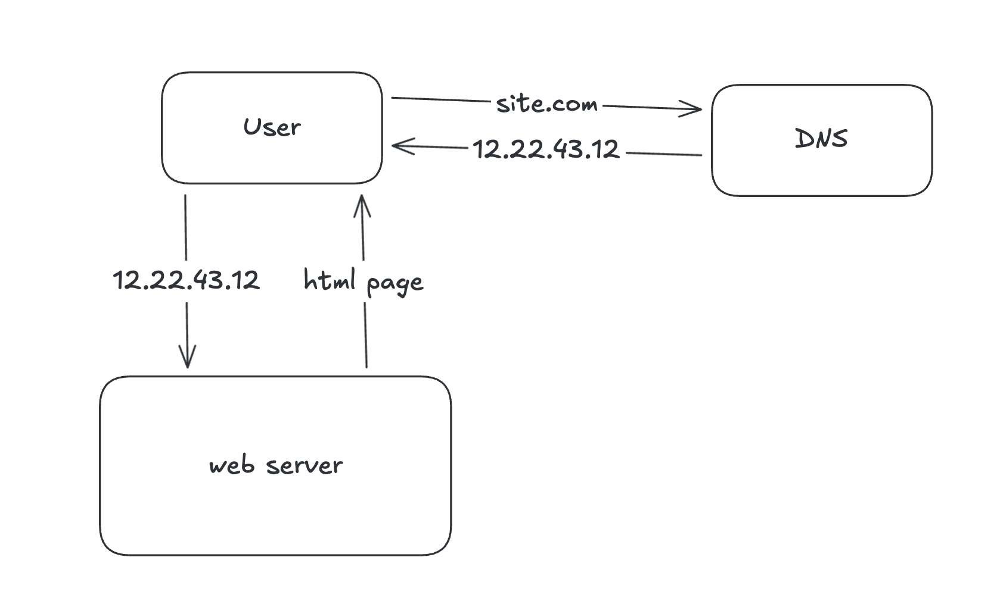

As users grow, this setup is not suitable, and we need to separate the DB as another server. This allows them to be scaled independently.

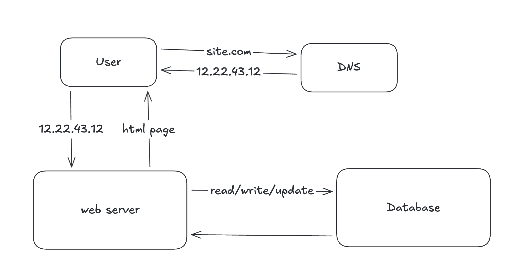

There are relational databases (Postgresql, MySQL), and non-relational (Amazon DynamoDB, Cassandra). Relational databases have tables and rows, and tables can be joined. Non-relational databases don't have this. Usually relational DBs perform good, but for some cases it might be better to use non-relational databases, for example: you have unstructured data, you have massive amount of data, you need super-low latency, or you only need serialization/deserialization of the data.

Vertical scaling refers to adding more power (CPU, RAM) to the server, while horizontal scaling refers to adding more servers to your pool of resources. Vertical scaling has limits, as one server cannot be added infinite number of resources, and if the server goes down, the application goes completely down too. For large applications, it's preferable to use horizontal scaling.

With one server setup, if load is high, users generally experience slow response times, so we need more servers. To balance the load between them, load balancer is used.

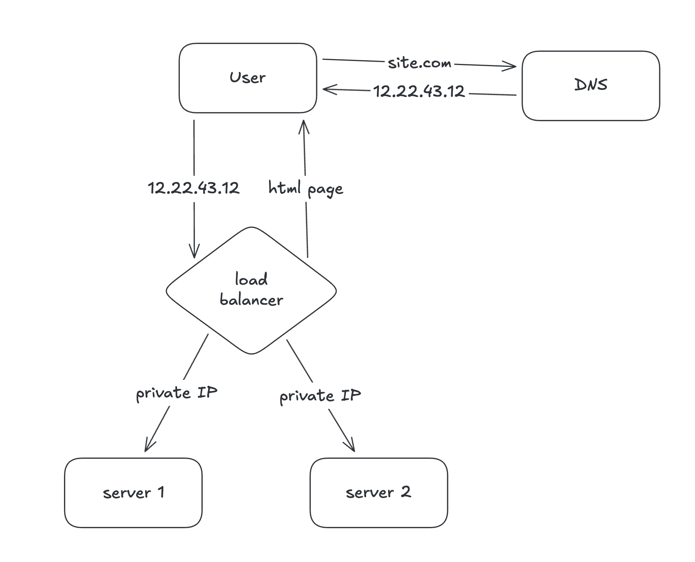

In this case, the IP user receives from DNS is load balancer's public IP address. The web servers are not exposed to the internet, and load balancer accesses them through private IP addresses in private network. No there is no failover if server goes offline, and if load is high, you only need to add new servers if necessary, and load balancer does the work.

Now web tier is good, but what about data tier? Single database can cause failover and redundancy. The way to go is database replication.

Database replication is having relationship of master node and slave nodes. Master node is used for modifications, while slave nodes are used for reading. Because usually the number of reads is much bigger, slave nodes are usually more than master nodes. This setup provides better performance - as many operations can be handled in parallel, reliability - if one database is destroyed by natural disaster, the copies are preserved in other nodes, high availability - if one node gets offline, another nodes provides availability.

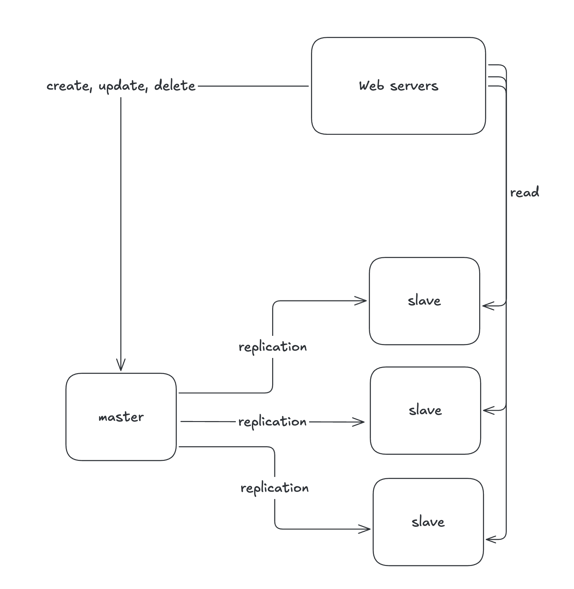

If only one slave database is available and it goes offline, all read operations are temporarily executed on master database. As issue is found, new slave database is created, and it replaces the old one. If multiple slave databases are available, read operations are executed on other healthy slave databases.
If master database goes offline, slave database is promoted to master, and all operations are temporarily executed on new master. New slave database is created immediately for replications. Promoting slave to master can be complicated, because the slave might not have up-to-date data as master does, so some data recovery scripts are needed. There are also [other techniques](https://en.wikipedia.org/wiki/Multi-master_replication) for replication.

It's time to improve response times. We can add cache tier for this. It allows frequent requests or expensive operations to be saved in memory to serve them when requested again. This greatly affects app's performance, because right now each request triggers DB call, and making DB calls repeatedly greatly affects performance.

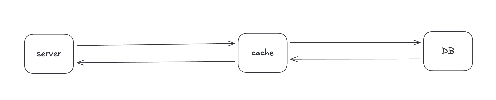

If data exists in cache, take it, otherwise make DB call, save result in cache, and serve this result. This is called read-through cache. [Other caching strategies](https://codeahoy.com/2017/08/11/caching-strategies-and-how-to-choose-the-right-one/) exists too.

Some considerations for using cache:

1. Use it for accessing frequently requested data and modified infrequently. Cache is stored in volatile memory, if server is down, the cache is lost.
2. Expiration policy. After the cache expires, it is removed from cache. Policy should not be too short so data store is not accessed frequently, and not too long in order to avoid stale data.
3. Consistency between data store and cache. When scaling across multiple regions, it might be challenging to keep them in sync. Facebook has great article about [scaling memcache](https://www.usenix.org/system/files/conference/nsdi13/nsdi13-final170_update.pdf).
4. Single cache server might lead to single point of failure, where cache tier is not accessible at all. To mitigate this, multiple cache servers across different datacenters are used. Also cache overprovisioning is used, where more memory is allocated for cache than it would regularly need (it serves as buffer as memory usage increases).
5. Once cache is full, eviction policy is applied, meaning some item from cache is evicted. It can be LRU (least recently used, most popular), LFU (least frequently used), or FIFO (first in first out).

CDN (Content Delivery Network) is a network of geographically dispersed servers that are used to serve static content, like images, videos, html/css/js files, etc. Closest server to user is chosen to serve the content. Users located closer to the location of CDN server have better response times.

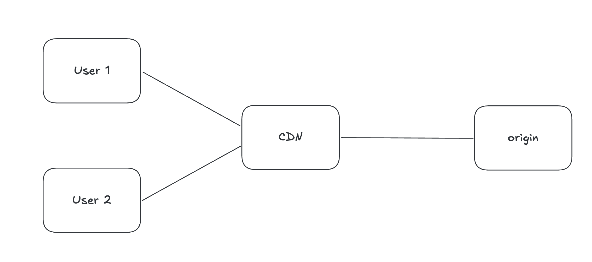

Users access the files through URL depending on CDN provider. If files exist in CDN, they are served to users. If not, they are fetched from origin (S3 or web server), cached in CDN, and served to the users. Origin might include optional TTL HTTP header, and it's used to invalidate the cache in CDN if provided. Considerations:

1. CDN is provided by third-party, and you are charged for every in and out. Don't cache infrequently accessed items in CDN.
2. Set good cache expiry, not too short, not too long.
3. If CDN is temporarily unavailable, users should be able to access these files from origin.
4. It's possible to invalidate the files from CDN via APIs, or by adding a param to query string, such as version number `v=2`.

So here is our system after these modifications:

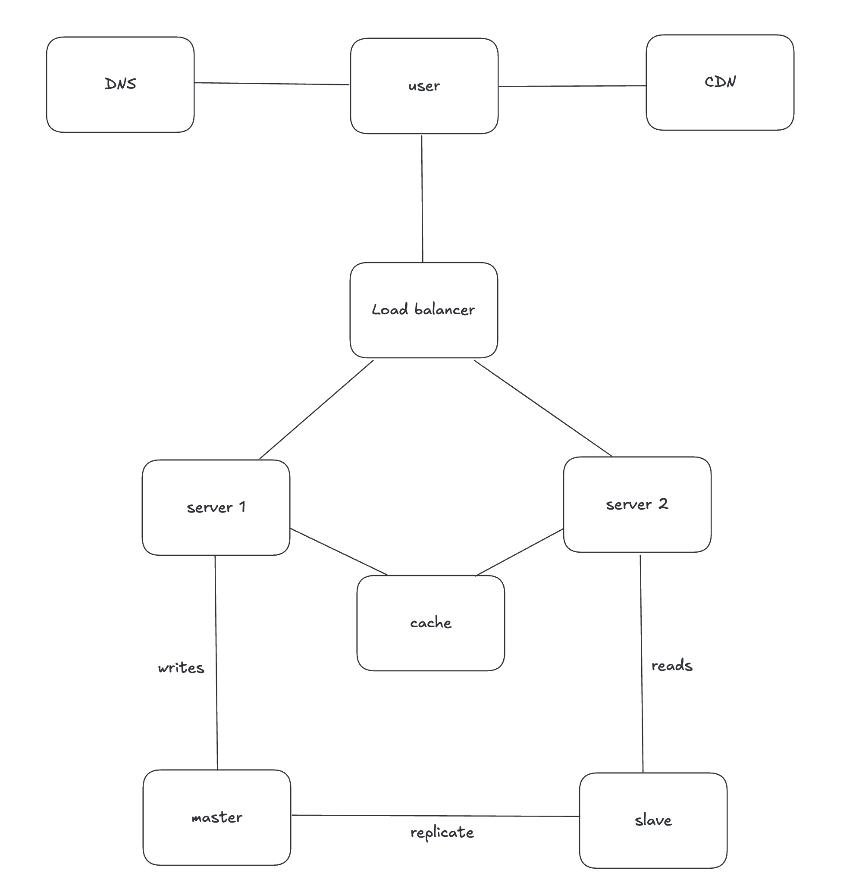

Applications can have state stored in web tier, for example user sessions. In this case, if there are two servers, and session is stored on server A, if user connects to server B he is unauthenticated. It's possible to solve this problem with sticky load balancing, but it becomes more complex to scale horizontally. The solution is to use some shared store for the sessions, and servers communicate with this store for sessions. The store can be NoSQL DB, Redis/Memcached, or relational DB.

Application where the state is stored in web tier is called stateful, and where the state is stored separately or there is no stored state, it's stateless.

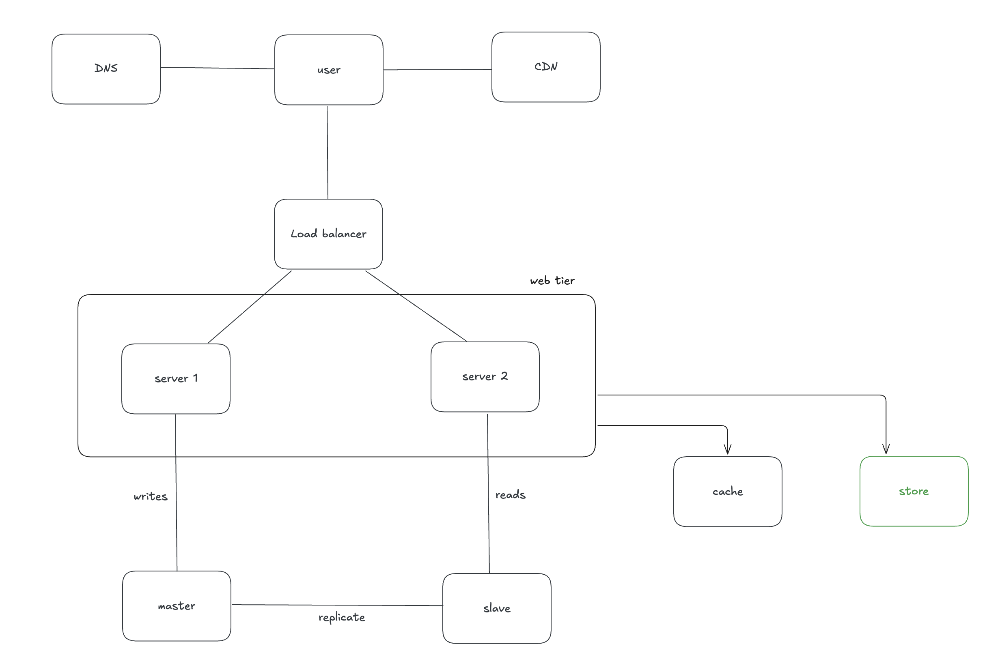

Users number grows, and to provide better availability and UX, it's better to distribute the load across different data centers. Also in case of outage in one data center, traffic can be routed to different data center. Challenges:

1. Routing traffic to different datacenter is difficult.
2. If there are local databases in datacenter, it will not be available in another datacenter, so synchronization problems should be resolved. [Article](https://netflixtechblog.com/active-active-for-multi-regional-resiliency-c47719f6685b) by netflix tech blog.
3. Testing and automating tools for deployment are needed for different datacenters.

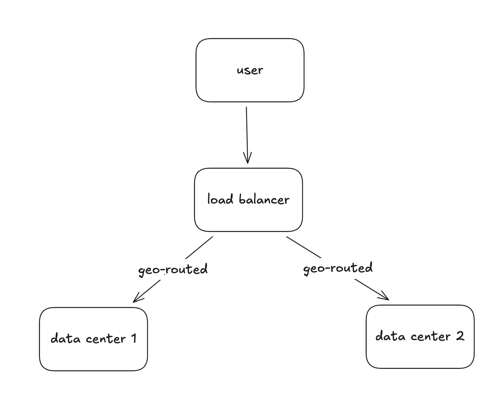

Other improvements are:

1. Using message queue. Message queue is component stored in memory that supports asynchronous communication. Publishers publish some messages to this queue, and subscribers consume these messages. So decoupling is happening between publisher and subscriber.
2. Logging, metrics, automation.

As data becomes more, our database becomes overloaded. It's time to scale data tier. There are 2 types of database scaling:

Vertical scaling - adding more RAM and CPU. Database server can be massive, even up to 24TB of RAM. Stackoverflow had only 1 master database with 10M unique visitors every day. However there are hardware limits, and the cost becomes much higher on big scaling, and there is single point of failure.

Horizontal scaling - also known as sharding, is separating large database into smaller more easily manageable databases, and data inside each shard is unique. Hash function is used which shard to go with, and it calculates it based on sharding key (partition key). For example if user_id is sharding key, and if hash function is user_id % 4, if result is 1, go to first database, if 2, go to second, ... Sharding key can consist of multiple columns of database, and it's important to choose right one to evenly distribute the load.
However, sharding has some complexities:

1. Re-sharding data might be needed if hashing function distributes load more to one DB than to another (shard exhaustion), or when single shard cannot hold data due to rapid growth.
2. Celebrity problem, where one shard might be overloaded with read operations (for example) if many celebrities are in one shard.
3. Join operations cannot happen on different shards, workaround would be duplicating data from different shard.

## Chapter 4. Design rate limiter

Rate limiter in the context of networking is limiting the traffic by some origin. In context of HTTP requests, it's about limiting the number of requests sent by client.

Rate limiter has following pros: resistance against DoS/DDoS attacks, reducing costs (such as allocating less server resources or focusing on more impactful APIs), and preventing overloading of servers.

Rate limiter can be implemented in both client side and server side, but the client side is not reliable as we don't have control over the code once it reaches the client, so malicious actors might misbehave.

Here is how it's done in server side:

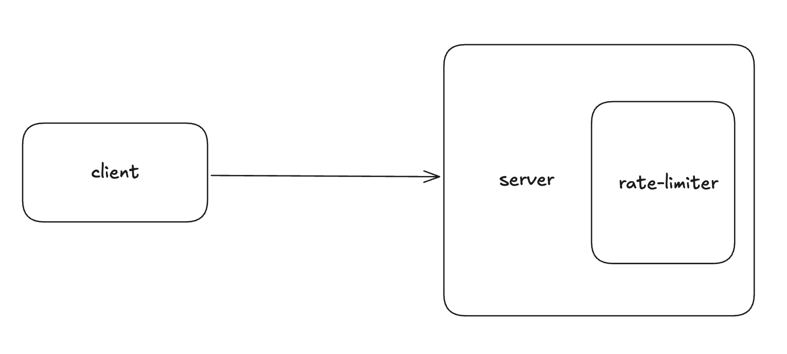

Or it can be done as a middleware, so the requests are throttled before reaching the server.

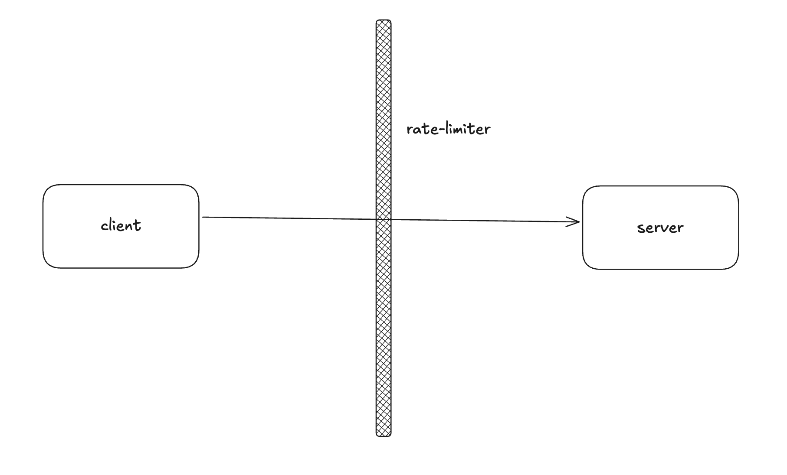

In cloud services architecture rate limiting is usually done by component called API Gateway. It's gateway that does rate limiting, authentication, IP allowlist/blacklist, serving static content, etc. Whether or not to make a rate-limiter in API gateway depends on circumstances (for example whether or not you already have microservices architecture with gateway). Making rate-limiter takes time, so sometimes it makes sense to use commercial rate limiters.

### Token bucket algorithm

First algorithm to implement rate limiting is called Token Bucket algorithm. Bucket has number of tokens. Bucket is refilled with tokens every second/minute. Each request costs 1 token. When request is made, and if there is available tokens in the bucket, request proceeds, otherwise it's blocked.

How many buckets to make? It depends. For example if you want some user to like some post max 5 times/sec, and post 10 posts/sec, you can make 2 buckets for each action.

Pros of this algo is it's easy to implement, memory efficient, and traffic burst are handled properly. The con is that there are 2 params to specify: max tokens (bucket size), and refilling period (refilling rate). Configuring them properly might be hard to achieve.

### Leaked bucket algorithm

It's same as token bucket algo, but this time FIFO is used. Bucket is a queue. When a request is made, and if bucket has space, request is added to the queue. Otherwise it's dropped. The requests are processed at constant rate (for example 5 requests per second).

Takes 2 params: queue size and outflow rate (requests number to be processed each second).

Pros: memory efficient given fixed size of queue, and good for use cases where stable outflaw is needed.
Cons: burst of requests makes so old requests are queued, while new requests are discarded. Requires 2 params to be specified, which again might make it difficult to configure properly.

### Fixed window counter algorithm

Timeline is split into time intervals (units), which might be 1 second, 1 minute, and so on. Each interval has a threshold of how many maximum requests are allowed. If request number goes beyond this threshold, requests are blocked. Request number is reset on next time interval.

Pros: memory efficient, easy to understand, and resetting quota per unit time might fit some use cases.
Cons: requests between the edges of two time intervals might cause more requests than specified in threshold. For example, if time unit is 1 minute, requests number might be 20 between 03:30:30 and 04:31:30.
