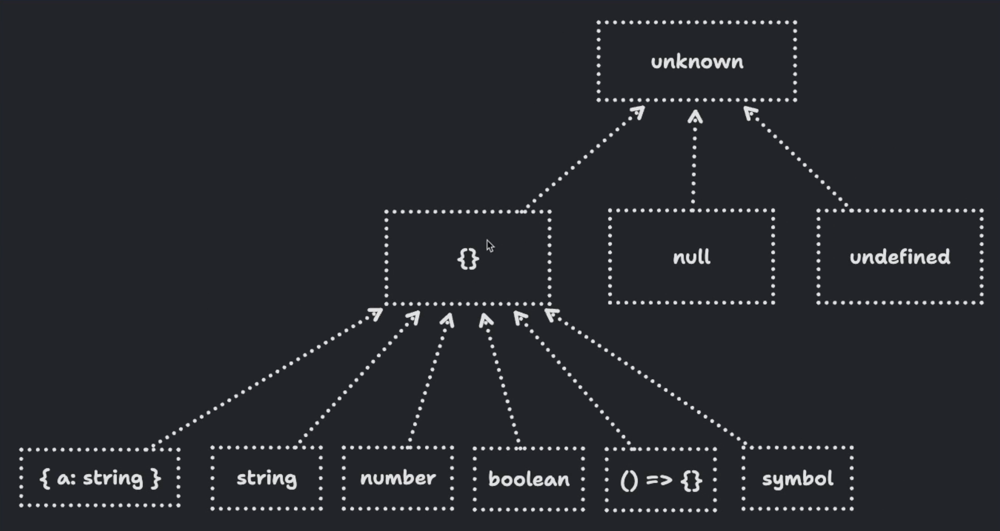

# Typescript type transformations


My notes and takeaways from the TypeScript type transformations workshop by Matt Pocock. See the [workshop](https://www.totaltypescript.com/workshops/type-transformations) for more details.

## Table of contents

- [extract members of discrimination unions](#extract-members-of-discrimination-unions)
- [excluding members of discrimination unions](#excluding-members-of-discrimination-unions)
- [union types in js](#union-types-in-js)
- [indexed access with arrays](#indexed-access-with-arrays)
- [combining unions in template literal types](#combining-unions-in-template-literal-types)
- [constraint generic except null or undefined](#constraint-generic-except-null-or-undefined)
- [infer with generic arguments](#infer-with-generic-arguments)
- [gotcha with distributivity in conditional types](#gotcha-with-distributivity-in-conditional-types)
- [map over discriminated union](#map-over-discriminated-union)
- [challenges](#challenges)

## extract members of discrimination unions

- Task
  Extract the the member of discrimination union, so the test cases pass.

  ```tsx
  import type { Equal, Expect } from "@total-typescript/helpers";

  export type Event =
    | {
        type: "click";
        event: MouseEvent;
      }
    | {
        type: "focus";
        event: FocusEvent;
      }
    | {
        type: "keydown";
        event: KeyboardEvent;
      };

  type ClickEvent = unknown;

  type tests = Expect<Equal<ClickEvent, { type: "click"; event: MouseEvent }>>;
  ```

- Solution

  ```tsx
  type ClickEvent = Extract<Event, { type: "click" }>;
  ```

## excluding members of discrimination unions

- Task
  Exclude member of discrimination union so the test cases pass.

  ```tsx
  import type { Equal, Expect } from "@total-typescript/helpers";

  export type Event =
    | {
        type: "click";
        event: MouseEvent;
      }
    | {
        type: "focus";
        event: FocusEvent;
      }
    | {
        type: "keydown";
        event: KeyboardEvent;
      };

  type NonKeyDownEvents = unknown;
  ```

- Solution

  ```tsx
  import type { Equal, Expect } from "@total-typescript/helpers";

  export type Event =
    | {
        type: "click";
        event: MouseEvent;
      }
    | {
        type: "focus";
        event: FocusEvent;
      }
    | {
        type: "keydown";
        event: KeyboardEvent;
      };

  type NonKeyDownEvents = Exclude<Event, { type: "keydown" }>;

  type test = Expect<
    Equal<
      NonKeyDownEvents,
      | {
          type: "click";
          event: MouseEvent;
        }
      | {
          type: "focus";
          event: FocusEvent;
        }
    >
  >;
  ```

## union types in js

From the perspective of TypeScript, we don't know which value the union is, we can just pretend that it's both. And if it is both, it means that everything that you do with the value needs to be evaluated for all possible code paths that you are defining. That’s like multiverses you define, and you handle the cases for its branches. These branches can have more branches until you end up with a very complex set of different possibilities.

## indexed access with arrays

We can index access the values of an array, where put the numbers as keys.

- Example

  ```tsx
  const array = ["apple", "banana"] as const;

  type AppleOrBanana = (typeof array)[0 | 1]; // apple | banana
  // or
  type AppleOrBanana = (typeof array)[number]; // apple | banana
  ```

## combining unions in template literal types

If we combine strings in template literal types, we can get union of all combinations of these strings.

- Example

  ```tsx
  type BreadType = "rye" | "brown" | "white";
  type Filling = "cheese" | "ham" | "salami";

  type Sandwich = `${BreadType} with ${Filling}`;
  // "rye with cheese" | "rye with ham" | "rye with salami" |
  // "brown with cheese" | "brown with ham" | "brown with salami" |
  // "white with cheese" | "white with ham" | "white with salami"
  ```

## constraint generic except null or undefined

In typescript, `{}` represents all values except null or undefined. In fact, the `unknown` is union of `{}, null, undefined`. In typescript, everything is subtype of `{}` except null or undefined. See the image below.



```tsx
// so to constraint generic to all values except null or undefined, we do:
type Generic<T extends {}> = T;
```

## infer with generic arguments

- Task

  Write a type for the `GetPoint` type so that the test cases pass. This type should get the type of the `getPoint` method of the generic passed in.

  ```tsx
  import type { Equal, Expect } from "@total-typescript/helpers";

  interface MyComplexInterface<Event, Context, Name, Point> {
    getEvent: () => Event;
    getContext: () => Context;
    getName: () => Name;
    getPoint: () => Point;
  }

  type Example = MyComplexInterface<
    "click",
    "window",
    "my-event",
    { x: 12; y: 14 }
  >;

  type GetPoint = unknown;

  type test = Expect<Equal<GetPoint<Example>, { x: 12; y: 14 }>>;
  ```

- Solution

  ```tsx
  import type { Equal, Expect } from "@total-typescript/helpers";

  interface MyComplexInterface<Event, Context, Name, Point> {
    getEvent: () => Event;
    getContext: () => Context;
    getName: () => Name;
    getPoint: () => Point;
  }

  type Example = MyComplexInterface<
    "click",
    "window",
    "my-event",
    { x: 12; y: 14 }
  >;

  // here, we could just do the following:
  // type GetPoint<T> = T extends { getPoint: () => infer R } ? R : never;
  // but another pretty cool solution would be:
  type GetPoint<T> = T extends MyComplexInterface<any, any, any, infer TPoint>
    ? TPoint
    : never;
  // this is better, because it doesn't interact with details of the interface.

  type test = Expect<Equal<GetPoint<Example>, { x: 12; y: 14 }>>;
  ```

## gotcha with distributivity in conditional types

When we use generic, the union inside the generic is going to be distributed across (In other words, the generic will become each individual member of the union), meaning conditional type with `extends` will iterate over each one in the union. If we don’t use generic, typescript will compare entire union to another entire union, which is probably not expected.

```tsx
type Fruit = "apple" | "banana" | "orange";
type GetAppleOrBanana<T> = T extends "apple" | "banana" ? T : never;

type Test1 = GetAppleOrBanana<Fruit>; // "apple" | "banana"

// meanwhile

type Test2 = Fruit extends "apple" | "banana" ? Fruit : never; // never
// suppose we extends "apple" only, we get true in condition, and we get
// the whole Fruit, not "apple" only
```

Because we can use generic, this makes another solution possible, with `infer`, because basically we are creating generic here also.

```tsx
type AppleOrBanana = Fruit extends infer T
  ? T extends "apple" | "banana"
    ? T
    : never
  : never;
```

## map over discriminated union

- Task

  Write the type of `RoutesObject` type, which iterates over the `Route` discriminated union type and takes the `route` discriminator as a key, and the `search` entry as a value.

  ```tsx
  import type { Equal, Expect } from "@total-typescript/helpers";

  type Route =
    | {
        route: "/";
        search: {
          page: string;
          perPage: string;
        };
      }
    | { route: "/about"; search: {} }
    | { route: "/admin"; search: {} }
    | { route: "/admin/users"; search: {} };

  type RoutesObject = unknown;

  type tests = [
    Expect<
      Equal<
        RoutesObject,
        {
          "/": {
            page: string;
            perPage: string;
          };
          "/about": {};
          "/admin": {};
          "/admin/users": {};
        }
      >
    >
  ];
  ```

- Solution

  ```tsx
  import type { Equal, Expect } from "@total-typescript/helpers";

  type Route =
    | {
        route: "/";
        search: {
          page: string;
          perPage: string;
        };
      }
    | { route: "/about"; search: {} }
    | { route: "/admin"; search: {} }
    | { route: "/admin/users"; search: {} };

  // you could say that RoutesObject can be

  // type RoutesObject = {
  //   [K in Route["route"]]: Route extends { route: K } ? Route["search"] : never;
  // };

  // but remember that union is not distributed, and `extends` operation will not iterate over each member of union.
  // To iterate over each one, we need to create generic.

  // type RoutesObject = {
  //   [K in Route["route"]]: Route extends infer R
  //     ? R extends { route: K; search: infer S }
  //       ? S
  //       : never
  //     : never;
  // };

  // or more elegant solution, iterating over the the members of union, and putting `route` as a ke of that member.

  type RoutesObject = {
    [R in Route as R["route"]]: R["search"];
  };

  // another possible solution

  // type RoutesObject = {
  //   [K in Route["route"]]: Extract<Route, { route: K }>["search"];
  // };

  type tests = [
    Expect<
      Equal<
        RoutesObject,
        {
          "/": {
            page: string;
            perPage: string;
          };
          "/about": {};
          "/admin": {};
          "/admin/users": {};
        }
      >
    >
  ];
  ```

## Challenges

- Challenge 1

  - Task

    How do we create a type helper that represents a union of all possible combinations of `Attributes`?

    ```tsx
    import type { Expect, Equal } from "@total-typescript/helpers";

    interface Attributes {
      id: string;
      email: string;
      username: string;
    }

    type MutuallyExclusive<T> = unknown;
    type ExclusiveAttributes = MutuallyExclusive<Attributes>;

    type test = Expect<
      Equal<
        ExclusiveAttributes,
        | {
            id: string;
          }
        | {
            email: string;
          }
        | {
            username: string;
          }
      >
    >;
    ```

  - Solution
    The solution is pretty simple, with pattern of making values as the intermediatery values we want, and indexing though all the keys. **Pretty cool pattern!**

    ```tsx
    type MutuallyExclusive<T> = {
      [K in keyof T]: Record<K, T[K]>;
    }[keyof T];
    ```

- Challenge 2

  - Task

    Create a type that maps over each member of discriminated union and returns object type with discriminator as a key, and `search` as a value. If `search` doesn’t exist, put `null`.

    ```tsx
    import type { Equal, Expect } from "@total-typescript/helpers";

    type Route =
      | {
          route: "/";
          search: {
            page: string;
            perPage: string;
          };
        }
      | { route: "/about" }
      | { route: "/admin" }
      | { route: "/admin/users" };

    type RoutesObject = unknown;

    type test = Expect<
      Equal<
        RoutesObject,
        {
          "/": {
            page: string;
            perPage: string;
          };
          "/about": never;
          "/admin": never;
          "/admin/users": never;
        }
      >
    >;
    ```

  - Solution
    We can use pattern pattern of declaring generic as a member of union, use its route as a key, and use the generic itself in the value field.

    ```tsx
    type RoutesObject = {
      [R in Route as R["route"]]: R extends {
        route: R["route"];
        search: infer S;
      }
        ? S
        : never;
    };
    ```
