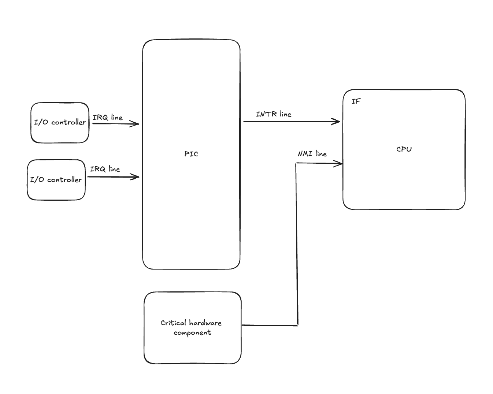
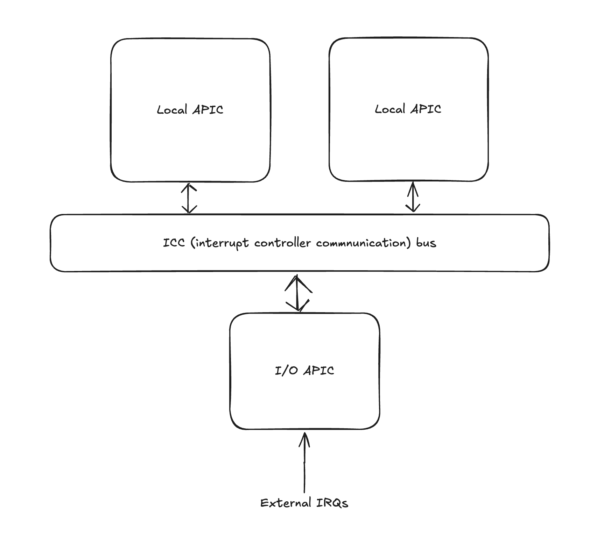
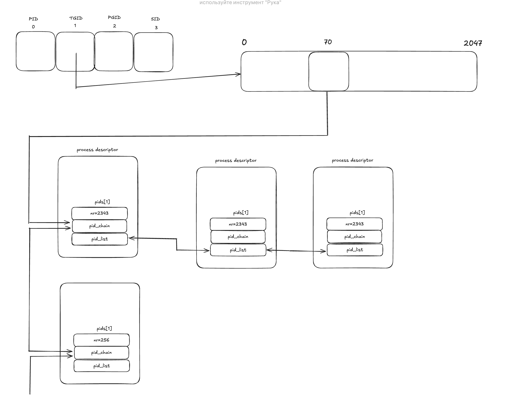

# Understanding Linux Kernel


My notes and takeaways from Understanding Linux Kernel book by Daniel P. Bovet and Marco Cesati. The notes don't deep dive into the details of the book but rather focus on the key concepts and ideas.

## Table of Contents

- [Introduction](#introduction)
- [Basic OS concepts](#basic-os-concepts)
- [Overview of filesystem](#overview-of-filesystem)
  - [Hard and soft links](#hard-and-soft-links)
- [Overview of Unix kernels](#an-overview-of-unix-kernels)
- [Interrupts](#interrupts)
- [Exceptions](#exceptions)
- [APIC](#apic)
- [Nested execution of exception and interrupt handlers](#nested-execution-of-exception-and-interrupt-handlers)
- [Initializing IDT](#initializing-idt)
- [Exception handling](#exception-handling)
- [Interrupt handling](#interrupt-handling)
- [Softirqs and Tasklets](#softirqs-and-tasklets)
- [Work queues](#work-queues)
- [Returning from exceptions and interrupts](#returning-from-exceptions-and-interrupts)
- [Processes](#processes)
  - [Process descriptor](#process-descriptor)
  - [Process state](#process-state)
  - [List head](#list_head)
  - [Run list](#run_list)
  - [prio](#prio)
  - [array](#array)
  - [hash tables](#hash-tables)
  - [pids](#pids)
  - [process organization](#processes-organization)
  - [resource limits](#resource-limits)
  - [process switch](#process-switch)
  - [creating process](#creating-process)
  - [destroying process](#destroying-process)
- [Process communication](#process-communication)

  - [pipe](#pipe)
  - [fifo](#fifo)
  - [system v ipc](#system-v-ipc)
  - [ipc semaphores](#ipc-semaphores)
  - [ipc messages](#ipc-messages)
  - [ipc shared memory](#ipc-shared-memory)

- [FAQ](#faq)

## Introduction

Linux is a member of large family of Unix-like operating systems. Became popular in 1990s, initially developed by Linus Torvalds in 1991 as OS for IBM-compatible personal computers. Over the years Linux is being developed by many developers, and Linux is now available for many archs, for example AMD64, Intel’s Itanium and others.

Linux kernel is true Unix Kernel, but not full Unix OS, because it doesn’t include Unix applications, such as file system utils, system admin commands, compilers, text editors and others. But they can be freely downloaded.

Source code for Linux kernel is contained in more than 14.000 C and Assembly files, having over 6 millions lines of code and taking over 230 MB of disk space.

Linux kernel has similarities on architecture compared to other Unix-like kernels, because they share fundamental design ideas and features.

Linux kernel is compliant with IEEE POSIX standard, making it possible for other Unix programs to be compiled and executed on Linux with little or no efforts.

Unix-like kernels similarities:

1. Monolithic kernel, exceptions is Apple Mac OS X, which follow microkernel approach.
2. Compiled and statically linked kernel. Ability to dynamically load and unload device drivers (modules). Solaris and few others have this feature.
3. Kernel threading. Organized as a set of kernel threads, where kernel operates, and context switches between kernel threads are less expensive rather than in processes, because they operate in common address space.
4. Multithreaded application support, where application has many lightweight processes (LWP), which can operate on common address space and so on. Linux handles them via `clone()` `syscall`.
5. Preemptive kernel. This means that even if a task is running, the kernel can switch to a more urgent task if needed.
6. Multiprocessor support - the system can use more than one CPU or core to perform tasks simultaneously. Linux makes optimal use of SMP. **Symmetric multiprocessing (SMP)** means that all CPUs or cores share the same memory and can run tasks equally, making the system more efficient and balanced.
7. Filesystem. In Linux, filesystems come in many flavors, and we can switch between them, and its easier than than in other kernels.
8. Streams I/O, subsystem used for writing device drivers, network protocols and others. Linux has no analog for it.

Linux is cost-free, has all components customizable, meaning we can choose which features not to use. Runs on low-end, inexpensive hardware. Efficient and powerful, because it utilizes all hardware components at max level. Have low failure rate and system **maintenance**. It’s possible to fit kernel image with few system programs in 1.44 MB floppy disk (only linux is known to do this). Highly compatible with other OSs. Linux lets you mount filesystems to other OSs’ filesystems, linux can operate with network layers like ethernet, fiber, bluetooth and others. With corresponding libs, it can execute some apps written for other OSs on 80x86 platform. And finally, Linux is well supported.

## Basic OS concepts

Each computer includes a basic set of programs called the _operating system._ And the most important program among them is kernel. It’s loaded into RAM when system boots and contain many critical procedures needed for system to operate. The operating system fulfills two main objectives:

1. Interact with the hardware components to service all low-level programmable elements included in the hardware.
2. Provide execution environment for the user programs.

Unix-like OSs hide the hardware details from the user, but those can be received by requesting it from the kernel, which operates with hardware device. Hardware has 2 execution modes for CPU, and Unix calls these as User mode (non-privileged) and Kernel mode (privileged).

**Multiuser systems -** computer that can execute several apps belonging to two users concurrently and independently. Such computer includes several features: auth mechanism for verifying user identity, a protection mechanism against buggy or malicious user programs that could block other apps or spy on activity of other users, an accounting mechanism to limit the amount of resource units assigned to each user. For such tasks OS uses privileged CPU mode, and doesn’t use protections if the requesting user is privileged.

**_Process -_** an instance of program execution. It has set of memory cells with which process can operate. Systems that allow concurrent processings are called **_multiprocessing._** Processes are called **_preemptable_** (OS can stop - preempt) when OS activates scheduler periodically based on how long the process holds the CPU.

**_Scheduler -_** component that chooses which process should progress. In multiuser computers scheduler is invoked periodically.

**_process/kernel model -_** each process thinks it’s only process on the machine and has exclusive access to OS services. When doing `syscall`, the process executes code in kernel mode and then returns back to user mode.

**_kernel architecture._** Unix kernels are monolithic, meaning entire operating system with core services run in single process and in single address space in kernel mode. In comparison, microkernel OSs have their services separate memory management and such services in one process running in kernel mode, and other services like device drivers or file systems into another running in user mode. This approach improves modularity and fault isolation, but can lead to performance overhead due to frequent communication between kernel and user space.
Microkernel approach use RAM better, because it loads only the essentials parts (modules) of what’s needed into the RAM, whereas monolithic approach keeps the RAM unnecessary big.

To achieve what microkernels offer, Linux introduced concept of modules, which are files that can be linked and unlinked at runtime. Kernel modules are loadable pieces of code (like device drivers or file systems) that can be dynamically added or removed at runtime, allowing the kernel to load only necessary components

## Overview of filesystem

In Unix, the file is a container structured as a sequence of bytes. It can be binary file, or simple file (both are referred as regular file). Maximum characters for name is 255. The filesystem is organized as an inversed tree data structure, where the topmost node is root node.

### Hard and soft links

The filename included in a directory is called a hard link, or just a link. The same filename can have several links, but all of them point to a single file. All hard links have their own `INode`, with all metadata such as user permissions (but not filename) inside. We can create hard links with command `ln p1 p2`. But hard links have some disadvantages: it’s impossible to create hard links for directories, and we can only create hard links among files included in the same filesystem (this might be trivial because in Unix several filesystems might be included, without the user knowing it). To solve this, soft links were introduced.

Soft link is a short file that contain an arbitrary pathname of another file. Pathname may refer to any file, even to nonexistent one. To create soft link, we use `ln -s p1 p2`. When it’s executed, directory path of `p1` is taken, put into the contents of the `p2` with its name. Soft links have their `INode`, with metadata about the link itself.

**INode** is a data structure that contains all information for filesystem to handle a file, which includes (according to POSIX): file type, number of hard links associated with this file, file length in bytes, device id, INode number as id of file in filesystem, UID of file owner, user group ID, file change, last access and other timestamps, and access rights (owner, group, others).

File handling. Process in User Mode cannot directly interact with hardware devices (memory in this case), so we need `syscalls` to interact with it (which operate in kernel mode). For example, `open` syscall is used to open a file. It returns a file descriptor (unique ID of open resouce that’s managed by OS to track and manage opened files), and creates file object, that contains set of flags, how file is opened, file poiner (current position in file where read/write happens) and etc. The contents of file can be accessed sequentially or randomly.

Files are deleted when the links count in the `INode` reaches 0.

In short, soft links are references, while hard links are alternative access points to the same data.

## An overview of Unix kernels

Unix kernel provides environment for processes to execute, and it does that by providing corresponding interfaces, which are used by applications, and therefore applications don’t use hardware directly.

The kernel itself is not a process, but process manager. Besides user processes, Unix systems include privileged processes, called **kernel threads.** They run in kernel address space, do not interact with users, usually created during startup and terminated when shutting down.

When kernel stops execution of a process, it saves the info about it in **process descriptor,** including program counter (PC), stack pointer (SP), and other registers. It can then continue executing this process with info in process descriptor.

**Reentrant kernels** means several processes may be executing in kernel mode at the same time. Ways to provide reentrance are to use reentrant functions (which modify only local variables, not global), or using locking mechanisms to ensure that only one process can execute a non-reentrant function at a time.

**kernel control path** is sequence of instructions kernel executes to handle syscall, exception, or interrupt. When running, they can be interleaved by CPU, when CPU detects an exception, a hardware interrupt occurs (which may happen at any time), or when syscall request (for ex getting data from memory) that cannot be handled immediately, another process is created with process scheduler, and the first kernel control path is left unfinished.

Each process runs in its own address space with private stack, data, and code areas, and this process running in kernel mode uses kernel set of these. Sometimes the memory (not data) may be shared among processes, requested by other processes, or done by kernel.

Synchronization problems occur when two or more processes try to access the same data structure at the same time. Solutions are:

1. Interrupt disabling, not good solution, because it freezes all hardware interrupts.
2. Disable kernel preempting before entering critical region and enabling after leaving it, meaning another process cannot be switched to while some piece of code is executing. Good for uniprocessors, but not for multiprocessors, because disabling happens locally in one processor, not the whole system.
3. Semaphore. Each data structure has a semaphore, containing of integer variable (open or closed), a list of waiting processes, and atomic methods `down` and `up`. This is good solution, but sometimes it may fail, because of the pushing to the list of awaited processes and suspending it. While these operations happen, other kernel control path may already released the semaphore.
4. Spin locks. Same as semaphores, but without awaiting processes list. Instead all processes continuously iterate and try to access resource inside the loop. It is bad approach for uniprocessors, because there is one CPU

**signals** are a way to notify the processes about system events. Processes can signal, or ignore. If ignored, default handlers for that signal is invoked, which might be terminate process, suspend it, ignore it, and others.

There are 2 types of system events: asynchronous notifications - invoked by user (for example SIGINT), and synchronous notifications - triggered by kernel (for example SIGSEGV, which means invalid memory address access).

Process becomes **zombie** if it finishes running and its parent doesn’t acknowledge it, and if parent is terminated without acknowledging it, it becomes child process of init process, which acknowledges all its children.

A **process group** is collection of processes with a leader (has same pid as process, which created a group), which allows shell to manage them as a single unit (job).

A **login session** is high level group of processes, which is created when user logs in (with ssh for example). Many groups can be children of this group that are started from the same terminal. When user logs out, all children processes terminate.

## Interrupts

Interrupt is signal to divert the processor to code outside normal flow. The difference between interrupt and context switch is that interrupt doesn’t operate in separate process, it’s kernel control path that runs in expense of the same process that was running when kernel was interrupted. The interrupt handler is lighter than process.

All interrupt requests (IRQs) issued from I/O device controllers give rise to maskable interrupts. In comparison, all non maskable interrupts are issued by critical events as hardware component failures and always recognized by CPU.

There are 2 types of interrupts:

1. **Synchronous** - \***_synchronized with execution of instruction, caused by execution of instruction that cannot be properly handled. For example, divide by 0. Such interrupts are internally generated and called _**exceptions.\*\*\*
2. **Asynchronous** - not synchronized with execution of instructions, and can occur at any time. Triggered by external devices, such as I/O hardware. Such interrupts are called regular **interrupts.**

Each interrupt is associated with number ranging from 0 to 255. It’s called **vector.**

Every I/O controller is connected to the **PIC** (programmable interrupt controller). It’s middleware between controllers and CPU to manage the priority of interrupts, so the one with most priority reaches the CPU. PIC (specifically Intel 8259) supports up to eight I/O devices. To extend it, we can connect the output of one PIC to the next PIC _as input._ This is called **cascading**.

Each IRQ line can be disabled, and when enabled again, _stored_ signals are sent to the CPU.

PIC job cycle is as following:

1. Monitor IRQ (interrupt request) lines for raised signals. If one or more signals are raised, select one with lower pin number.
2. If a raised signal occurs in IRQ line, converts the signal into a corresponding vector, then stores this vector in interrupt controller i/o port, so CPU can read it via data bus. Send a raised signal to processor INTR pin (issue an interrupt). Then it waits until CPU acknowledges the interrupt signal by writing into one of PIC I/O ports.
3. When acknowledgement occurs, it clears the INTR line and goes back to step 1.

When CPU accepts interrupt, it acknowledges the PIC to get interrupt vector. When it receives it, it looks up the **IDT** for corresponding handler.

**IDT** - interrupt descriptor table, located in IDT register (meaning starting address is located in IDT register), firstly initialized by BIOS routines when computer still operates in Real Mode, but then reinitialized again and moved to the RAM. It consists of interrupt vector and address of its corresponding handler.

**INTR** - a line that is connected to CPU. It receives maskable interrupt, meaning it can be ignored by CPU. After every instruction, CPU checks for **IF** (interrupt flag), if it’s set to 1, it checks for the pending interrupt requests, if there is one, it executes its handler in kernel mode.

**NMI** - a line that is connected to CPU, which is used for interrupts that cannot be ignored by CPU. For example, if temperature of CPU is more that threshold, CPU is interrupted with this line to lower its temperature. Other examples include hardware failures and memory errors.



This approach of connecting single output of PIC to the INTR line is used for uniprocessor systems. The approach for multiprocessor systems is different.

## Exceptions

The 80x86 microprocessors issue ~20 exceptions, and kernel must provide handler for each. Such exceptions include divide by zero (fault), debug (trap or fault), overflow (trap), bound check (fault) and others. Exceptions are classified into two:

1. **Processor-detected exceptions** - raised when CPU detects anomalous condition while executing instruction. This is classified into 3 groups: **fault, trap, abort**.
2. **Programmed exceptions** - occur at the request of programmer. For example `bound` instruction also rise such exception when condition (in this case address is outside the bound) is not true. Such exceptions are also called software interrupts, and is used for `syscall` or to notify debugger about specific event.

**Faults -** exception, which can be corrected, and once corrected (when exception handler terminates), the instruction can be resumed (re-executed).

**Traps -** same as fault, but doesn’t require re-execution. Used for debugging purposes.

**Aborts -** raises when a serious and not coverable error is occurred such as hardware failures. The process terminates when exception handler is executed.

## APIC

For multiprocessor systems, I/O APIC (advanced PIC) is used. To support previous versions, motherboard includes both PIC and APIC. Moreover, each core includes local APIC. All local I/O APICs are connected to external APICs.

The main I/O APIC (not inside any core) consists of a set with 24 IRQ lines, a 24 entry **Interrupt Redirection Table (IRT),** each entry can be programmed to indicate interrupt vector priority, destination processor. This is used to redirect the IRQ to one or more local APIC units visa APIC bus.

Distribution of signals can happen in two ways:

1. **Static distribution -** The IRQ signal is delivered to the local APICs as listed in the corresponding entry of the Interrupt Redirection Table. The interrupt can be sent to a specific CPU, a subset of CPUs, or all CPUs simultaneously (broadcast mode).
2. **Dynamic distribution -** The IRQ signal is delivered to the local APIC of the processor running the process with the lowest priority. Each local APIC has **programmable task priority register (TPR),** it’s used to calculate priority of process that is currently running. This register is modified with each process switch. If two or more local APIC have same priority, **arbitration** (each CPU has arbitration priority register from 0 - 15) is used.

One CPU can also send an interrupt to another CPU, this is called **interprocess interrupts**.



## Nested execution of exception and interrupt handlers

Kernel allows us to nest execution of exception and interrupt handlers, meaning while executing handler of one interrupt, if second interrupt is occurred, control goes to the second handler. When second handler finishes executing, control goes back to first handler.

All the data needed to resume the nested kernel control path is stored in the kernel mode stack, which is tightly bound to current process.

The price to pay is that handler must never block, meaning no process switch can take place when interrupt handler is running.

In kernel mode, only _Page fault_ exception may arise. In this case kernel creates another process to handle this error and make process switch. Interrupt handlers never perform operations that causes page fault, which would cause process switch.

On multiprocessor systems, several kernel control paths may execute concurrently. Moreover, a kernel control path associated with exception may start executing on one CPU, and due to process switch, move to another CPU.

## Initializing IDT

Interrupt descriptor table is loaded to `idtr` register and all entries are initialized by BIOS routines when booting the system. Once Linux takes over, it’s re-initialized and moved to RAM, because Linux doesn’t use any BIOS routines.

An entry in this table consists of **vector** (id of interrupt), **selector** and **offset.** By combining selector and offset, CPU constructs address of handler to execute.

IDT contains entries for hardware interrupts, software interrupts (system calls), and processor exceptions. The signal handlers for processes are stored in that process space.

IDT entry takes 8 bytes. Each entry in IDT is gate, and there are 3 types of gate:

1. **interrupt gate** - for hardware interrupts, sets IF to 1, no other interrupts are allowed. Used for events like keyboard input. Points to handler.
2. **task gate** - for hardware task switches and for `double fault` exception. Doesn’t set IF to 1, other interrupts are allowed. Points to **TSS** (Task state segment), which initiates task switch.
3. **trap gate** - for software interrupts and exceptions (`syscall`, divide by 0 exception). Doesn’t set IF to 1, other interrupts are allowed. Points to handler address.

## Exception handling

When exception issued by CPU occurs, it sends a signal to the current process.

But sometimes kernel may use these exceptions to manage hardware resources more efficiently. For example `page fault` exception is used to defer loading necessary memory frames to the process until last moment.

Exception handlers have a standard form with 3 steps:

1. Save contents of most registers in Kernel Mode stack (coded in assembly).
2. Handle exception of high-level C functions.
3. Exit from handler with `ret_from_exception` function.

Each exception handler starts with the same assembly code that does common tasks such that pushing the address of corresponding C function onto the stack, and prepares environment to handle the error.

The process which triggered the exception gets a signal right after termination of exception handler.

## Interrupt handling

Interrupt handlers are stored inside IDT. In comparison to exception handling, in which the action to be taken is deferred until current process executes the handler in IDT, interrupt handling is different. In interrupt handling, the signal to process it’s related may arrive long after being sent. And it’s not sent to current process. The behavior differs based on class of interrupt:

**I/O interrupts.** I/O device requires an attention, and corresponding handler must query the device to determine how to handle it. Handler should be flexible to service several i/o interrupts at the same time, for example running i/o disk operations in handler is not good.

I/O interrupts _actions,_ which are executed inside interrupt handler, are classified into three:

1. **critical action** (for example acknowledging or interrupting PIC, should be performed asap, and executed immediately with maskable interrupts disabled).
2. **noncritical action** (for example updating data structures used only by processor, executed immediately with interrupts enabled).
3. **noncritical deferrable action** (for ex copying buffer content into address space of process, may be deferred with no affect to kernel processing, and interested process will just wait for it).

I/O interrupt handlers perform same basic actions, which basically are saving IRQ value and register’s values in Kernel Mode stack, sending acknowledgment to PIC, executing the interrupt service routines (ISRs, which are actual functions IDT entries point to) associated with all devices that share the IRQ, and terminating by jumping to `ret_from_intr` address.

**Timer interrupts.** Either local APIC or external timer issued an interrupt that certain fixed-time interval has elapsed. These interrupts are mostly handled as I/O interrupts.

**Interprocessor interrupts.** CPU issued an interrupt to another CPU in multiprocessor system. An interprocessor interrupt (IPI) is delivered as a direct message through the bus that connects all local APICs and CPUs. In multiprocessor systems, Linux uses 3 types of ICI:

1. **CALL_FUNCTION_VECTOR -** sent to all CPUs except the sender, forcing them to execute function passed by a sender.
2. **RESCHEDULE_VECTOR -** when the CPU receives this interrupt, it just notes that a reschedule (task switch) might be needed, and the real rescheduling happens as the CPU prepares to resume normal execution.
3. **INVALIDATE_TLB_VECTOR** - sent to all CPUs except the sender, forces them to invalidate their TLBs

## Softirqs and Tasklets

Usually interrupts handlers should be fast and the interrupt requests should be serviced in small amount of time. There might be some tasks in handlers that are long-running. In Linux, such tasks can be deferred with **deferrable functions** using softirqs and tasklets.

**Softirqs** are statically allocated (defined at compile time). They can run concurrently (even if they are same type) on several CPUs, and because of this they are reentrant functions (use mechanisms such as spin locks).

Softirqs are stored in **softirq_vec** array, each element is of **softirq_action** type (which includes action - pointer to softirq function, and data - pointer to data structure needed by softirq function). There is also a data structure that tracks pending softirqs - **per-CPU 32 bit mask,** that is stored in **\_\_softirq_pending** field of the **irq_cpustat_t** (there is one such structure per CPU in the system).

**Tasklets** are built on top of softirqs, but can be allocated and initialized at runtime. Also same type tasklets do not run on several cores, only in one core, so they do not worry about resource locks. However, if tasklets types differ, they can run on several CPUs.

Tasklets and high-priority tasklets are stored in `tasklet_vec` and `tasklet_hi_vec` arrays respectively. Each of them include `NR_CPUS` elements of type `tasklet_head` , and each element consists of pointer to a list of _tasklet descriptors_. Tasklet descriptor consists of next (Pointer to next descriptor in the list), state (status of the tasklet), count (lock counter), func (pointer to tasklet function), and data (unsigned long int, used by tasklet function).

## **Work Queues**

Work queues allow kernel functions to be activated and executed later by special kernel threads called **worker threads**, much like deferrable functions. Difference is that work queues execute in context of process ⇒ it can execute blocking procedures, whereas deferrable functions execute in context of interrupt ⇒ it can’t execute blocking procedures.

Data structure of work queue is descriptor called **workqueue_struct,** which contains number of CPUs in the system, NR_CPUS. Each element is descriptor of type **cpu_workqueue_struct** with spin lock, wait queues, head of list of pending functions and others. List is in form of doubly linked list, with timer, data, address of pending function and others.

There is one predefined work queue in the system, called **events,** which can freely used by kernel developer. The execution of pending functions in predefined work queue is serialized to CPUs, so functions shouldn’t block for long, otherwise it might affect other users.

## Returning from exceptions and interrupts

It’s obvious that after returning from exceptions and interrupts, program that was previously freezed, will continue execution. But several cases that should be considered.

1. _Number of kernel control paths being concurrently executed -_ If there is just one, the CPU must switch back to User Mode.
2. _Pending process switch requests -_ if \*\*there is any request, the kernel must perform process scheduling; otherwise, control is returned to the current process.
3. _Pending signals -_ If a signal is sent to the current process, it must be handled.
4. _Single-step mode -_ If a debugger is tracing the execution of the current process, single-step mode must be restored before switching back to User Mode.

## Processes

Process is an instance of program in execution. It’s a collection of data structures that describe how far process has progressed. For kernel it’s entity to which resources are allocated. Process has a single parent, and when it’s created, it may use shared (with parent) pages that contain program code, but the data (stack, heap) is separate, it’s copied from parent.

Process has execution flows, called threads. Threads share the data and code with other threads in the same process. In early days Linux treated threads as a single process, meaning if one thread was blocked, all other threads were blocked too. After that Linux introduced **lightweight processes,** which represents an independent execution flow like a thread, but it’s structured like a process (it has its own PID, and can be scheduled independently by kernel). The fact that lightweight process shares data and code with other lightweight processes makes it lightweight, and easy to context switch from.

When context switching (doesn’t matter if it’s process or thread), the state (PC, stack pointer, general purpose registers) are stored in TSS.

**TSS** (Task state segment) is a data structure to facilitate context switching by holding task-specific information that the CPU needs to switch contexts. TSS is stored in memory, and it exists one per process (in older systems). TSS is accessed through GDT table (global descriptor table, contains descriptors that define segments of memory). TSS descriptor in GDT contains TSS base address, size, and its permissions.

### Process descriptor

Each process has description, containing in which state process is, its priority, address space assigned to it, and others. All of these are stored inside process descriptor - a `task_struct` type structure, whose fields contain all this information.

### Process state

A field in process descriptor that describes the state of process. It consists of an array of flags, each flag represents a state. In current version of Linux, only 1 flag is set, others are cleared. The flags are:

1. _TASK_RUNNING -_ the process is being executed on a CPU or waiting to be executed.
2. _TASK_INTERRUPTIBLE_ - the process is suspended (sleeping), until some condition becomes true. Examples of condition are raising hardware interrupt, releasing a system resource process is waiting for, or delivering a signal.
3. _TASK_UNINTERRUPTIBLE -_ like TASK_INTERRUPTIBLE, but delivering signal doesn’t change its state. It waits for specific event without being interrupted, like waiting for response from device driver for probing the device.
4. _TASK_STOPPED -_ process execution is stopped by a debugger. Process can be monitored by debugger with `ptrace` syscall, each signal may put the process in this state.
5. _EXIT_ZOMBIE -_ can be stored in both state field and exit_state field. Process is terminated, but process has not yet issued an acknowledgement.
6. _EXIT_DEAD -_ can be stored in both state field and exit_state field. Process is being removed from a system because its parent has issued acknowledgement.

State of process can be set like:

```c
p->state = TASK_RUNNING;

// kernel also uses set_task_state (for specified process) and set_current_state
// (for current process) macros to set a state. These macros also ensure that
// state assignments are done without interrupts.
```

### list_head

A field in process descriptor that points to previous and next `task_struct` elements. The process descriptors are organized as `list_head`, which is essentially a circular doubly linked list. The head of this process list is `init_task` descriptor, which is process 0.

`SET_LINKS` and `REMOVE_LINKS` macros are used to insert and delete descriptors from the process list. There is also `for_each_process` macro to scan the list.

### run_list

A filed in process descriptor of type `list_head`.

All runnable processes (processes in _TASK_RUNNING_ state) are put in the same list, called **runqueue**. Earlier versions of Linux used to iterate through this list in order to select “best” runnable process. Linux 2.6 implements it differently.

In Linux 2.6, the processes are grouped by its priority ranging from 0 to 139 (140 lists in total). `run_list` field links the process descriptor based on its priority to the corresponding list. This way scheduler selects the best process to run in a constant time. On multiprocessor systems, each CPU has its own runqueue.

The runqueue is implemented as `prio_array_t` data structure:

| **type**               | **field** | **description**                                                                                                                                                    |
| ---------------------- | --------- | ------------------------------------------------------------------------------------------------------------------------------------------------------------------ |
| int                    | nr_active | number of process descriptors linked into the lists.                                                                                                               |
| unsigned long[5]       | bitmap    | a priority bitmap. Each flag is set if corresponding priority list is not empty. For example if first 3 lists have descriptors, we have: [1, 1, 1, 0, 0, 0, …, 0]. |
| struct list_head [140] | queue     | The array of 140 heads of the priority lists.                                                                                                                      |

### prio

A field in process descriptor that stores dynamic priority of the process.

### array

A field in process descriptor that points to the corresponding `list_head` inside the runqueue’s `prio_array_t` data structure.

### relationship between processes

All processes have relationship. A process that creates another process is marked as parent process. Processes 0 and 1 (init) are created by the kernel. Process 1 is ancestor of all the processes. Following fields in process descriptor are used to represent relationships:

| **field**        | **description**                                                                                                          |
| ---------------- | ------------------------------------------------------------------------------------------------------------------------ |
| real_parent      | points to process descriptor that created the process, or 1 if such process doesn’t exist.                               |
| parent           | points to current parent of P. Usually same as real_parent, but may differ when another process issues ptrace() syscall. |
| children         | head of list containing all children created by P.                                                                       |
| sibling          | Pointers to next and prev elements in the list of sibling processes, those that have same parent as P.                   |
| group_leader     | process descriptor pointer of group leader of P.                                                                         |
| signal → pgrp    | PID of group leader of P                                                                                                 |
| tgid             | PID of the thread group leader of P.                                                                                     |
| signal → session | PID of login session leader of P                                                                                         |
| ptrace_children  | The head of list containing all children of P being traced by debugger                                                   |
| ptrace_list      | The pointers to next and prev elements in real parent’s list of traced processes. Used when P is being traced.           |

### hash tables

Scanning the process list to find process descriptor with specific PID is not efficient. Because of this, four hash tables were introduced. Why four? Because process descriptor includes different kinds of PIDs, and those hash tables refer to corresponding PID. The tables are dynamically allocated during initialization phase, and its size depends on RAM, if RAM is 512MB, the size is 2 page frames (8KB, 2,048 entries). Each value in the hash table is the head of doubly linked list, used for handling colliding, when two or more process descriptors resolve to the same entry.

| **hash table type** | **field** | **description**                    |
| ------------------- | --------- | ---------------------------------- |
| PIDTYPE_PID         | pid       | PID of the process                 |
| PIDTYPE_TGID        | tgid      | PID of thread group leader process |
| PIDTYPE_PGID        | pgrp      | PID of the group leader process    |
| PIDTYPE_SID         | session   | PID of the session leader process  |

### pids

Kernel may need process descriptors that are in the same group as P. For this, pids field exists in the process descriptor. It is an array of `pid` structure with fields:

| **type**          | **name**  | **description**                                                    |
| ----------------- | --------- | ------------------------------------------------------------------ |
| int               | nr        | the PID number                                                     |
| struct hlist_node | pid_chain | The links to the next and previous elements in the hash chain list |
| struct list_head  | pid_list  | the head of the per-PID list                                       |

So essentially the addresses for hash tables are stored in `pid_hash` data structure, which is an array. Array items are accesses through hash table type (like PIDTYPE_PID), and it points to the hash table address. The value of hash table is the doubly linked list that stores the process descriptors that mapped to the same index. To find related process descriptors kernel takes the pids array and takes the corresponding index (for ex PIDTYPE_TGID) and take pid_list property. `pids[PIDTYPE_TGID]→pid_list`.

In the image below, nr is the group pid.



### processes organization

The runqueue groups all _TASK_RUNNING_ state processes, but it doesn’t group processes with states _TASK_STOPPED, EXIT_ZOMBIE, EXIT_DEAD_, meaning they are not grouped into specific lists, because there is no need to. _TASK_INTERRUPTIBLE_ and _TASK_UNINTERRUPTIBLE_ are divided into many sublists, called **wait queues**.

Wait queues are implemented as doubly linked lists, where each element is pointer to process descriptor. Element also includes pointers that link the element to list of processes waiting for same event, flags, and func fields. Func is pointer to function that handles the waking up process, by default it points to _default_wake_function_, which simply marks waiting task as runnable. Access to wait queue is synchronized with spin locks.

There are 2 kinds of procceses in wait queue: **exclusive** - denoted by value 1 in the flags field, selectively woken up by kernel when event occurs, and **nonexclusive** - \*\*\*\*denoted by value 0, always waken up by kernel when event occurs.

When resource becomes available, and when there is a lists of proccesses waiting for the same event, not all procceses at once are awaken. This can lead to CPU cycles waste and other problems. Nonexclusive proccesses in wait queue are awaken at the same time, it doesn’t lead to problems.

It’s uncommon to have exclusive and unexclusive processes inside one wait queue.

### resource limits

Each process has its limits in order not to overwhelm the CPU, disk space and so on. They are stored in `process->signal->rlim` field in process descriptor. It’s an array of elements of type **rlimit,** one for each resource limit. This includes current, and the limit with **rlim_cur** and **rlim_max** fields respectively.
The fields inside the table below are used as an index to the array of rlim, like `process->signal->rlim[RLIMIT_AS].rlim_cur`.
It’s possible to resize the limit with getrlimit and setrlimit (this one is done by superuser) syscalls.

| **field name** | **description**                                                                                                                |
| -------------- | ------------------------------------------------------------------------------------------------------------------------------ |
| RLIMIT_AS      | max size of process address space in bytes. Checked when enlarging process address space with malloc for example               |
| RLIMIT_CPU     | max CPU time for the process in seconds. Kills the process if it doesn’t terminate after corresponding signal about exceeding. |
| and many more… |                                                                                                                                |

### process switch

Process switch is process of suspending execution of one process and resuming execution of another process, performed by the **schedule()** kernel function, used by the scheduler.

Each process has its own address space, but all of them share the same CPU registers. The set of data that need to be loaded to CPU registers before process resumes its execution is called **hardware context.** Some of it is saved in process descriptor, while some in Kernel Mode Stack. So, process switch is activity of saving hardware context of prev process and replacing it with next process hardware context, which happens in kernel mode.

**TSS** is a memory area that keeps the info about CPU’s current state. It’s created one per CPU. TSS is stored in Global Descriptor Table (GDT, which is essentially a table that defines memory areas). Linux doesn’t fully use TSS, but it defines it. It is used for:

1. CPU switches from user mode to kernel mode, it uses TSS to find Kernel Mode Stack.
2. Check permissions for I/O ports. Bitmap is stored in TSS for corresponding ports with permissions.

Linux can’t save hardware context on TSS, because it has TSS per CPU, not per process. Instead it uses `thread` field in process descriptor. Some general-purpose registers like eax, ebx, etc are saved in Kernel Mode Stack though.

**fpu, mmx, xmm registers.** These registers are used for arithmetics. fpu and mmx share same set of registers that overlap, and xss includes set of registers used for SIMD (single instruction, multiple data) floating point operations. When process switching, they are saved in `thread.i387` field of process descriptor. Note that the kernel saves them only if process actually used them, triggered by “device not available” exception.

### creating process

In older Unix systems all the address space from the parent had to be copied to child process, which is inefficient. Moreover most programs used `execve` that vipes out all the address space that was copied. Modern Unix systems include other techniques:

1. Copy on write. Copy the address space for the one whenever child or parent tries to write to the address space.
2. Lightweight processes share most data structures, like User Mode address space, paging tables, open file tables, signal dispositions.
3. The `vfork` syscall creates a process that shares an address space with parent. Parent execution is delayed until child exits or executes the program.

Lightweight process is created with `clone` syscall. The `fork` syscall is implemented by Linux as a `clone` function with some specified arguments, and uses copy on write method. The `vfork` is also implemented as `clone` function with some params specified.

There is a `do_fork` syscall called inside those described above. It creates a new process by copying parent’s process’s data (like file descriptors) and depending of flags given, it makes the copy of address space of parent to child, or make them share same memory address space. Then it attaches this process to scheduler and returns PID of this process.

There is `copy_process` function used inside `do_fork` syscall that does most of the job of `do_fork`. It allocates memory for new `task_struct`. It clones parent’s CPU registers, open file descriptors, and process memory if corresponding flag is specified. Assigns a PID for the process, and attaches process it to the scheduler. It also perform some security checks in parent `rlim` fields. Terminates by returning child’s process descriptor pointer.

In simple words, clone function has some other function invokations inside with some params specified.

### destroying process

When process ends up its execution, its resources should be released so it doesn’t take unnecessary space. C compiler always puts `exit()` syscall at the end of the program.

In Linux there are 2 syscalls to terminate user mode application: `exit_group()` , which terminates the whole multithreaded application, invoked by `exit()` syscall, and `_exit()` , which terminates a single process regardless of other processes in the thread group.

In Unix, process descriptor is not removed from the memory right after the termination of process. It’s done so when parent process issues `wait` like syscall, which checks if process has terminated. That’s why **EXIT_ZOMBIE** process state is introduced.

## Process communication

There are 5 ways for process communication in Linux:

1. Pipes and FIFOs (named pipes). Good for producer/consumer interactions, where one fills the pipe, and other reads it.
2. Semaphores. A set of primitive semaphore counters to synchronize resource access.
3. Messages. Allow processes to exchange data by reading and writing to predefined message queues. Linux offers two types of it: System V IPC messages and POSIX messages.
4. Shared memory region. Allow processes to exchange data via shared block of memory. Good for apps where a huge amount data is shared.
5. Sockets. Allow process on different computers to exchange data through network, can be on the same host computer.

### Pipe

Pipe is one way data flow, where one process writes data into the buffer, and second process reads it from buffer. Process can create pipe with `pipe` syscall, which returns two file descriptors. First descriptor is used to read data, and second is to write. These descriptors can be passed to child processes through `fork`. POSIX defines _half-duplex pipes,_ meaning one should close before another uses it. But Linux adopts another approach. Each pipe’s file descriptors are still one-way, but it’s not necessary to close one before using another.

When command `ls | more` is executed, following actions are done:

1. `pipe()` syscall is invoked, and returns file descriptors 3 (read channel) and 4 (write channel).
2. Two `fork()` syscalls are invoked.
3. `close()` syscall is invoked twice to release file descriptors 3 and 4.

First child does the following:

1. Invokes `dup2(4,1)` syscall to copy descriptor 1 to descriptor 4. Now output descriptor refers to pipe’s write channel.
2. Invokes `close()` two times to release file descriptors 3 and 4.
3. Executes `execve()` syscall to execute `ls` command, and then output is written to file descriptor 1 (standart output), which is pipe.

Second child does the following:

1. Invokes `dup2(3,0)` to copy file descriptor 3 to file descriptor 0. Now file descriptor 0 (standart input) refers to pipe’s read channel.
2. Invokes `close()` syscall twice to release file descriptors 3 and 4.
3. Executes `execve` to execute `more` command. By default program reads from standart input, which is pipe’s read channel.

Note that `write` and `read` syscalls for pipes are VFS (Virtual File System) syscalls. Because of this, for each pipe kernel creates INode and two file objects (for reading and writing). In order to read/write, process needs its file descriptors. Besides that each pipe has its pipe buffer, which, for modern Linux systems, is 16 page frames size.

Processes write and fill the buffer, while readers read and empty the buffer, meaning the read data is removed from the buffer. Buffers are organized as VFS objects, so users don’t see them, because they are not mounted in FS.

Inside INode there is a pointer to `pipe_node_info` structure, which has counters of readers and writers. Forking doesn’t increment the counters (so it never becomes more than 1), but it increases the usage of counters of all file objects still used by parent process ⇒ pipe is not released when parent dies, it’s still open for children.

If readers and writers counters of pipe both becomes 0, `release` method inside each buffer is called, releasing the page frames. This check happens whenever `close()` syscall associated with pipe is invoked. If it is not 0, it wakes up processes in pipe’s wait queue to notify about the change.

Read and write syscalls might block current process in two cases:

1. Pipe buffer is empty, read syscall cannot read, waiting for data to be written.
2. Pipe buffer is full, write syscall cannot write, waiting for data to be read.

### FIFO

One downside of pipes is that existing pipes cannot be opened unless the process is ancestor of process, which created pipe. FIFO (first data written is also first that is read) is a pipe that has data inside kernel buffer, and has disk INode, and therefore FIFO can be accessed by any process.

FIFO has the same methods as pipe, almost same structure as pipe, but there are some differences:

1. FIFO INode appear on system directory tree, rather than in VFS.
2. FIFO is bidirectional communication channel.

FIFO is created with `mkfifo` command, and opened, closed and manipulated with same commands as pipe, but the behavior differs.

### System V IPC

IPC is abbreviation for Inter Process Communication, which is used for synchronizing processes with semaphores, send/receive messages to other processes, share memory area with other processes. System V (early version of Unix OS) IPC can be found in Linux.

IPC data structures are created dynamically when process requests IPC resource (semaphore, message queue, or shared memory area), and it’s persistent (removed when explicitly commanded to, or when shutting down the system). Each IPC resource has 32-bit IPC key (like pathname to file in FS, explicitly set by programmer), and 32-bit IPC ID (like file descriptor for open file, set by kernel). For communication between each other, processes refer to IPC ID of resource.

IPC resource is created with `semget()` for semaphore, `msgget()` for message queue, and `shmget()` for shared memory area. IPC key is passed as an argument, and, depending on the flag, if resource doesn’t exist, it is created, or fail, if it exists. IPC key is usually passed as **IPC_PRIVATE** key, making kernel responsible for creating a key. Ensures other processes doesn’t create IPC resource with same key.

IPC resources can be controlled (get info, change owner, release resource) with `semctl()`, `msgctl()` and `shmctl()`

Once created, semaphore can be acquired or released with `semop()` function. For message queue, `msgsnd()` is used to send, and `msgrcv()` is for receiving messages. Process can attach or detach shared memory area to its address space with `shmat()` and `shmdt()` functions respectively.

In reality IPC functions are wrapper functions, which use `ipc()` function inside with corresponding flags and arguments, and so `ipc()` function is also called “multiplexer” syscall.

### IPC semaphores

Each IPC semaphore is a set of one or more semaphore values, meaning one IPC semaphore can protect multiple independant data structures. Semaphores inside IPC semaphore are called _primitive semaphores._ Maximum number of IPC semaphores is 128 by default, and each can contain 250 primitive semaphores by default.

System V IPC semaphore provides fail-safe mechanism for situations where process dies without undoing operation, therefore making other processes waiting for the same resource wait infinitely. For System V IPC semaphores, if process dies, all its IPC semaphores can revert to state in which process hasn’t issued a semaphore. Process should mark operations as undoable , for example with _SEM_UNDO_ flag for `semop` operation. Kernel keeps track of state to make undo operation.

Each IPC semaphore has `sem_base` field, which is an array of structures representing state of each primitive semaphore. Structure contains of `semval`, value of semaphore’s counter, and `sempid` , PID of last process that accessed the semaphore.

Kernel also keeps track of all pending requests to identify procceses waiting for the one or more primitive semaphores in the array. it’s implemented as doubly linked list of `sem_queue` data structure.

### IPC messages

Another way to communicate with another process is with IPC messages. It’s a queue containing messages, which stay until another process read it (kernel destroys the message). Message consists of fixed-size header, and variable-length text. Message can be labelled with integer value, also called as _message type_.

To send a message `msgsnd()` is used, with arguments of destination IPC ideantifier, size of the message text, and address to User Mode buffer that contains the message type (integer) immediately followed by the message text.

To retrieve message `msgrcv()` is used, with arguments of IPC identifier, pointer to buffer where message type and text should be copied to, the size of buffer, and **_t_** value specifying what message should be retrieved. If **_t_** is positive, first queue item with matched message type is retrieved. But if it’s negative, function returns first message with message type less or equal of absolute value of **_t._**

By default, limit number of IPC message queues is 16, the size limit of each message is 8,192 bytes (header takes 24 bytes), and limit for the queue size is 16,384 bytes. However, system admin can change the limits.

IPC message queue is represented as `msg_queue` \*\*structure, which contains `q_messages` field, which is the head of doubly linked circular list containing all the messages in the queue. Message is broken into one or more dynamically allocated pages.

Sending message to message queue can be blocking if the queue is full, or it can be blocking when receiving message from queue which is empty. For such cases there are special fields in `msg_queue`. `q_senders` and `q_receivers` fields are head of lists waiting for queue to have space to enqueue the message and read the message respectively.

### IPC shared memory

Common data structures can be accessed by one or more processes by placing them in IPC shared memory region. Each process that wants to access it need to place to its address space a new memory region, which maps the page frames associated with shared memory region, which is handled by kernel with technique called “demand paging”.

`shmget()` is used to get id/create (if it doesn’t exist) ipc shared memory. `shmat()` is used to attach IPC shared memory region to calling process address space. `shmdt()` is used to detach IPC shared memory region from process address space.

By default, limit for the number of IPC shared memory regions is 4096, the size of each segment is 32MB, and total size of all segments is 8GB.

Data structure associated with it is `shmid_kernel`, which contains `shm_file` - which stores address of file object. Files are not mounted in FS, instead they exist in VFS.

Demand paging works so that if process tries to get data from shared memory region, page fault exception is raised, and kernel allocated the missing page. So the pages are not allocated immediately when shared memory is attached, it’s not allocated until process tries to use it.

## FAQ

- Is Linux kernel a process?
  The Linux kernel is the underlying software that manages processes and system resources but is not a process itself. It provides the functionality required for creating and managing processes and facilitates communication between hardware and user applications. It can be thought as a collection of processes (kernel threads) that handle tasks such as managing i/o, handling interrupts and background tasks.
- What’s difference between OS and kernel
  Kernel is like orchestrator, which manages hardware resources like memory, processes, CPU, I/O devices, device drivers and others. OS without kernel would be just a set of programs and tools
- What’s IEEE POSIX
  It’s standard developed by IEEE to make Unix-like software portable (compatible between each other). It includes standards such as process management, error handling, thread management and others. Note that binary form of programs might not be compatible, because of possible different architectures.
- What’s difference between microkernels and monolithic kernels.
  Difference between two approaches is that in microkernels most services run in user mode and in user space, whereas in Linux approach modules are loaded into the kernel, where they are run in kernel mode and in kernel space. Note that there is no perfomance difference.
  Also fault in module can crash the entire system in the case of monolithic appoach, whereas in microkernels approach it can’t.
  The advantages microkernel approach has is **Fault Isolation,**
- How is a soft link different from a hard link?
  A soft link, or symbolic link, is a separate file that contains the path to another file or directory. Unlike hard links, soft links can link to directories, files across different filesystems, or even non-existent files. They use their own INode to store metadata about the link itself, not the target file.
- What is an INode?
  An INode is a data structure that contains metadata about a file, including file type, size, permissions, owner information, timestamps, and pointers to the file’s data blocks on disk. It uniquely identifies a file within the filesystem.
- What is a kernel thread?
  A kernel thread is a privileged process running in kernel space. Unlike user processes, kernel threads do not interact directly with users and typically handle low-level tasks required for system operation. They are usually created during system startup and terminate when the system shuts down.
- What is a reentrant kernel?
  A reentrant kernel allows multiple processes to execute in kernel mode simultaneously. This is achieved using reentrant functions (which only modify local variables) or locking mechanisms to ensure only one process executes non-reentrant code at a time.
