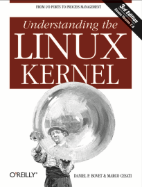

# Understanding Linux Kernel

My notes and takeaways from Understanding Linux Kernel book by Daniel P. Bovet and Marco Cesati. The notes don't deep dive into the details of the book but rather focus on the key concepts and ideas.

## Table of Contents

- [Introduction](#introduction)
- [Basic OS concepts](#basic-os-concepts)
- [Overview of filesystem](#overview-of-filesystem)
  - [Hard and soft links](#hard-and-soft-links)
- [Overview of Unix kernels](#an-overview-of-unix-kernels)

## Introduction

Linux is a member of large family of Unix-like operating systems. Became popular in 1990s, initially developed by Linus Torvalds in 1991 as OS for IBM-compatible personal computers. Over the years Linux is being developed by many developers, and Linux is now available for many archs, for example AMD64, Intel’s Itanium and others.

Linux kernel is true Unix Kernel, but not full Unix OS, because it doesn’t include Unix applications, such as file system utils, system admin commands, compilers, text editors and others. But they can be freely downloaded.

Source code for Linux kernel is contained in more than 14.000 C and Assembly files, having over 6 millions lines of code and taking over 230 MB of disk space.

Linux kernel has similarities on architecture compared to other Unix-like kernels, because they share fundamental design ideas and features.

Linux kernel is compliant with IEEE POSIX standard, making it possible for other Unix programs to be compiled and executed on Linux with little or no efforts.

Unix-like kernels similarities:

1. Monolithic kernel, exceptions is Apple Mac OS X, which follow microkernel approach.
2. Compiled and statically linked kernel. Ability to dynamically load and unload device drivers (modules). Solaris and few others have this feature.
3. Kernel threading. Organized as a set of kernel threads, where kernel operates, and context switches between kernel threads are less expensive rather than in processes, because they operate in common address space.
4. Multithreaded application support, where application has many lightweight processes (LWP), which can operate on common address space and so on. Linux handles them via `clone()` `syscall`.
5. Preemptive kernel. This means that even if a task is running, the kernel can switch to a more urgent task if needed.
6. Multiprocessor support - the system can use more than one CPU or core to perform tasks simultaneously. Linux makes optimal use of SMP. **Symmetric multiprocessing (SMP)** means that all CPUs or cores share the same memory and can run tasks equally, making the system more efficient and balanced.
7. Filesystem. In Linux, filesystems come in many flavors, and we can switch between them, and its easier than than in other kernels.
8. Streams I/O, subsystem used for writing device drivers, network protocols and others. Linux has no analog for it.

Linux is cost-free, has all components customizable, meaning we can choose which features not to use. Runs on low-end, inexpensive hardware. Efficient and powerful, because it utilizes all hardware components at max level. Have low failure rate and system **maintenance**. It’s possible to fit kernel image with few system programs in 1.44 MB floppy disk (only linux is known to do this). Highly compatible with other OSs. Linux lets you mount filesystems to other OSs’ filesystems, linux can operate with network layers like ethernet, fiber, bluetooth and others. With corresponding libs, it can execute some apps written for other OSs on 80x86 platform. And finally, Linux is well supported.

## Basic OS concepts

Each computer includes a basic set of programs called the _operating system._ And the most important program among them is kernel. It’s loaded into RAM when system boots and contain many critical procedures needed for system to operate. The operating system fulfills two main objectives:

1. Interact with the hardware components to service all low-level programmable elements included in the hardware.
2. Provide execution environment for the user programs.

Unix-like OSs hide the hardware details from the user, but those can be received by requesting it from the kernel, which operates with hardware device. Hardware has 2 execution modes for CPU, and Unix calls these as User mode (non-privileged) and Kernel mode (privileged).

**Multiuser systems -** computer that can execute several apps belonging to two users concurrently and independently. Such computer includes several features: auth mechanism for verifying user identity, a protection mechanism against buggy or malicious user programs that could block other apps or spy on activity of other users, an accounting mechanism to limit the amount of resource units assigned to each user. For such tasks OS uses privileged CPU mode, and doesn’t use protections if the requesting user is privileged.

**_Process -_** an instance of program execution. It has set of memory cells with which process can operate. Systems that allow concurrent processings are called **_multiprocessing._** Processes are called **_preemptable_** (OS can stop - preempt) when OS activates scheduler periodically based on how long the process holds the CPU.

**_Scheduler -_** component that chooses which process should progress. In multiuser computers scheduler is invoked periodically.

**_process/kernel model -_** each process thinks it’s only process on the machine and has exclusive access to OS services. When doing `syscall`, the process executes code in kernel mode and then returns back to user mode.

**_kernel architecture._** Unix kernels are monolithic, meaning entire operating system with core services run in single process and in single address space in kernel mode. In comparison, microkernel OSs have their services separate memory management and such services in one process running in kernel mode, and other services like device drivers or file systems into another running in user mode. This approach improves modularity and fault isolation, but can lead to performance overhead due to frequent communication between kernel and user space.
Microkernel approach use RAM better, because it loads only the essentials parts (modules) of what’s needed into the RAM, whereas monolithic approach keeps the RAM unnecessary big.

To achieve what microkernels offer, Linux introduced concept of modules, which are files that can be linked and unlinked at runtime. Kernel modules are loadable pieces of code (like device drivers or file systems) that can be dynamically added or removed at runtime, allowing the kernel to load only necessary components

## Overview of filesystem

In Unix, the file is a container structured as a sequence of bytes. It can be binary file, or simple file (both are referred as regular file). Maximum characters for name is 255. The filesystem is organized as an inversed tree data structure, where the topmost node is root node.

### Hard and soft links

The filename included in a directory is called a hard link, or just a link. The same filename can have several links, but all of them point to a single file. All hard links have their own `INode`, with all metadata such as user permissions (but not filename) inside. We can create hard links with command `ln p1 p2`. But hard links have some disadvantages: it’s impossible to create hard links for directories, and we can only create hard links among files included in the same filesystem (this might be trivial because in Unix several filesystems might be included, without the user knowing it). To solve this, soft links were introduced.

Soft link is a short file that contain an arbitrary pathname of another file. Pathname may refer to any file, even to nonexistent one. To create soft link, we use `ln -s p1 p2`. When it’s executed, directory path of `p1` is taken, put into the contents of the `p2` with its name. Soft links have their `INode`, with metadata about the link itself.

**INode** is a data structure that contains all information for filesystem to handle a file, which includes (according to POSIX): file type, number of hard links associated with this file, file length in bytes, device id, INode number as id of file in filesystem, UID of file owner, user group ID, file change, last access and other timestamps, and access rights (owner, group, others).

File handling. Process in User Mode cannot directly interact with hardware devices (memory in this case), so we need `syscalls` to interact with it (which operate in kernel mode). For example, `open` syscall is used to open a file. It returns a file descriptor (unique ID of open resouce that’s managed by OS to track and manage opened files), and creates file object, that contains set of flags, how file is opened, file poiner (current position in file where read/write happens) and etc. The contents of file can be accessed sequentially or randomly.

Files are deleted when the links count in the `INode` reaches 0.

In short, soft links are references, while hard links are alternative access points to the same data.

## An overview of Unix kernels

Unix kernel provides environment for processes to execute, and it does that by providing corresponding interfaces, which are used by applications, and therefore applications don’t use hardware directly.

The kernel itself is not a process, but process manager. Besides user processes, Unix systems include privileged processes, called **kernel threads.** They run in kernel address space, do not interact with users, usually created during startup and terminated when shutting down.

When kernel stops execution of a process, it saves the info about it in **process descriptor,** including program counter (PC), stack pointer (SP), and other registers. It can then continue executing this process with info in process descriptor.

**Reentrant kernels** means several processes may be executing in kernel mode at the same time. Ways to provide reentrance are to use reentrant functions (which modify only local variables, not global), or using locking mechanisms to ensure that only one process can execute a non-reentrant function at a time.

**kernel control path** is sequence of instructions kernel executes to handle syscall, exception, or interrupt. When running, they can be interleaved by CPU, when CPU detects an exception, a hardware interrupt occurs (which may happen at any time), or when syscall request (for ex getting data from memory) that cannot be handled immediately, another process is created with process scheduler, and the first kernel control path is left unfinished.
